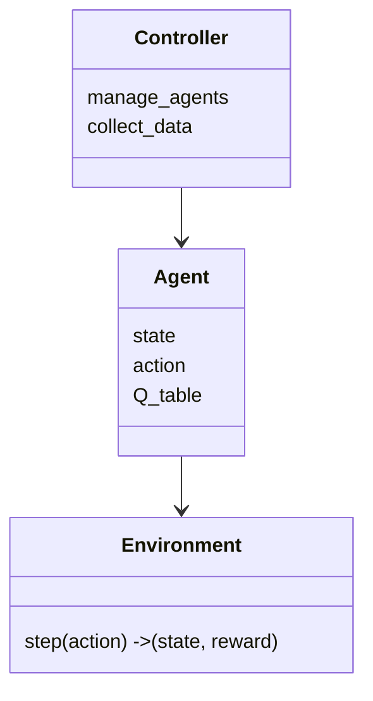

                 

<think>
好，我需要写一篇关于《多智能体强化学习在优化价值投资的择时策略中的应用》的技术博客。首先，我得了解什么是多智能体强化学习，它和传统强化学习有什么不同。然后，我需要研究价值投资和择时策略的基本概念，分析传统方法的局限性。

接下来，我要思考多智能体强化学习如何应用于择时策略。可能需要将市场中的不同因素分解成多个智能体，每个智能体负责监控和分析一个特定的市场指标。这些智能体之间如何协作和通信，才能做出最优的投资决策？

在算法部分，我需要详细讲解多智能体强化学习的算法，比如Q-learning、多智能体协作算法。用mermaid画出算法的流程图，帮助读者理解。同时，提供Python代码实现，并解释代码的逻辑和功能。

系统架构设计部分，我需要设计一个包含多个模块的系统，比如数据采集、智能体协作、决策引擎等。用mermaid绘制系统架构图和交互序列图，展示各个模块之间的关系和协作流程。

项目实战部分，我需要选择一个具体的案例，比如使用股票数据进行实验。指导读者如何安装环境，编写代码，并解释代码的作用。通过案例分析，展示多智能体强化学习在实际中的应用效果。

最后，总结最佳实践，给出一些注意事项和未来的研究方向。确保文章结构清晰，内容详实，语言专业但易懂。
</think>

# 多智能体强化学习在优化价值投资的择时策略中的应用

## 关键词：多智能体强化学习，价值投资，择时策略，金融市场，人工智能

## 摘要：  
本文探讨了多智能体强化学习在优化价值投资中的择时策略的应用。首先，介绍了多智能体强化学习的基本概念和价值投资的原理。然后，分析了传统择时策略的局限性，并提出多智能体强化学习在金融投资中的优势。通过详细阐述多智能体强化学习的算法原理、系统架构设计以及项目实战，展示了如何利用多智能体强化学习来优化投资决策。最后，总结了在实际应用中的最佳实践和未来研究方向。

---

# 第一部分: 多智能体强化学习与价值投资概述

## 第1章: 多智能体强化学习的背景与应用

### 1.1 多智能体强化学习的背景  
#### 1.1.1 人工智能与强化学习的发展  
人工智能（AI）技术的进步推动了强化学习（Reinforcement Learning, RL）在各个领域的广泛应用。强化学习通过智能体与环境的交互，学习最优策略，已在游戏、机器人控制等领域取得显著成果。  

#### 1.1.2 多智能体系统的核心概念  
多智能体系统（Multi-Agent System, MAS）由多个智能体组成，每个智能体能够独立决策并协作完成任务。与单智能体相比，多智能体系统在处理复杂任务时表现出更高的灵活性和效率。  

#### 1.1.3 强化学习在金融投资中的潜力  
金融市场的复杂性和不确定性使得传统方法难以应对。强化学习，尤其是多智能体强化学习，能够通过分布式决策和协作优化投资策略，为金融投资提供新的解决方案。  

### 1.2 价值投资与择时策略的背景  
#### 1.2.1 价值投资的基本原理  
价值投资是一种长期投资策略，强调以低于内在价值的价格买入优质资产。其核心在于识别被市场低估的投资标的。  

#### 1.2.2 拆解择时策略的复杂性  
择时策略旨在通过预测市场走势，选择最佳买卖时机。然而，市场的波动性和不可预测性使得传统的择时方法效果有限。  

#### 1.2.3 传统择时策略的局限性  
传统择时策略依赖于统计分析和历史数据，难以应对市场环境的快速变化。此外，单一策略往往无法兼顾风险与收益的平衡。  

### 1.3 多智能体强化学习在金融中的应用前景  
#### 1.3.1 金融市场的复杂性与多智能体的优势  
金融市场涉及多方参与者和复杂关系，多智能体系统能够模拟这些关系，提供更全面的市场分析。  

#### 1.3.2 智能体协作在投资决策中的作用  
多个智能体可以分别关注不同的市场指标，通过协作生成更优的决策。这种协作机制能够提高决策的准确性和鲁棒性。  

#### 1.3.3 未来趋势与挑战  
随着技术的发展，多智能体强化学习在金融中的应用将更加广泛，但算法的复杂性和计算资源需求也带来了新的挑战。  

---

## 第2章: 多智能体强化学习的核心概念与联系  

### 2.1 多智能体强化学习的定义  
多智能体强化学习是强化学习的一种扩展形式，涉及多个智能体在共享环境中的协作与竞争。  

#### 2.1.1 多智能体系统的基本结构  
多智能体系统由智能体、环境和通信机制组成。智能体通过与环境交互，学习最优策略。  

#### 2.1.2 强化学习的核心机制  
强化学习通过智能体与环境的交互，利用奖励机制优化策略。智能体通过试错学习，逐步逼近最优解。  

#### 2.1.3 多智能体与单智能体的区别  
多智能体系统强调协作与分布式决策，而单智能体系统注重个体优化。  

### 2.2 多智能体强化学习的特点  
#### 2.2.1 分布式决策与协作  
多智能体系统通过分布式决策实现任务的分解与协作。  

#### 2.2.2 动态环境适应性  
智能体能够实时感知环境变化，快速调整策略。  

#### 2.2.3 智能体之间的通信与协调  
智能体之间通过通信机制共享信息，提高决策的准确性。  

### 2.3 多智能体强化学习与传统强化学习的对比  

#### 2.3.1 从单智能体到多智能体的演进  
单智能体强化学习适用于简单任务，而多智能体强化学习适用于复杂任务。  

#### 2.3.2 传统强化学习的局限性  
传统强化学习难以处理多任务协作和分布式决策问题。  

#### 2.3.3 多智能体强化学习的优势  
多智能体强化学习通过协作优化整体性能，适用于复杂的金融场景。  

---

## 第3章: 多智能体强化学习的算法原理  

### 3.1 多智能体强化学习的算法  
#### 3.1.1 Q-learning算法  
Q-learning是一种经典的强化学习算法，通过更新Q值表学习策略。  

#### 3.1.2 多智能体协作算法  
多智能体协作算法通过智能体之间的协作实现全局优化。  

### 3.2 算法原理的数学模型  
#### 3.2.1 Q值更新公式  
$$ Q(s, a) = Q(s, a) + \alpha (r + \gamma \max Q(s', a') - Q(s, a)) $$  

#### 3.2.2 多智能体协作的数学模型  
通过分布式优化方法，多个智能体协同更新策略。  

### 3.3 算法实现的代码示例  

```python
import numpy as np

class Agent:
    def __init__(self, state_space, action_space):
        self.state_space = state_space
        self.action_space = action_space
        self.Q = np.zeros((state_space, action_space))
    
    def act(self, state):
        return np.argmax(self.Q[state])
    
    def update(self, state, action, reward, next_state):
        self.Q[state, action] += 0.1 * (reward + 0.9 * np.max(self.Q[next_state]) - self.Q[state, action])

# 初始化智能体
agent = Agent(state_space=5, action_space=3)

# 与环境交互
state = 2
action = agent.act(state)
next_state, reward = environment.step(action)
agent.update(state, action, reward, next_state)
```

---

## 第4章: 多智能体强化学习在价值投资中的应用  

### 4.1 价值投资中的问题场景  
#### 4.1.1 市场数据的获取与分析  
通过多智能体分别监控不同的市场指标。  

#### 4.1.2 智能体协作与决策  
智能体协作生成综合的买卖信号。  

### 4.2 系统架构设计  

#### 4.2.1 领域模型类图  


#### 4.2.2 系统架构图  


---

## 第5章: 项目实战  

### 5.1 环境安装与配置  
安装Python和相关库（如numpy、pandas、scikit-learn）。  

### 5.2 核心代码实现  

```python
def main():
    import pandas as pd
    import numpy as np
    
    # 数据加载与预处理
    data = pd.read_csv('stock_data.csv')
    data['return'] = data['close'].pct_change()
    
    # 智能体初始化
    agents = [Agent() for _ in range(5)]
    
    # 训练过程
    for epo

