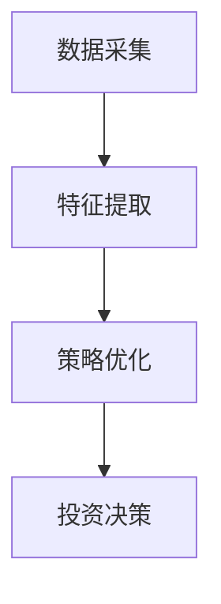
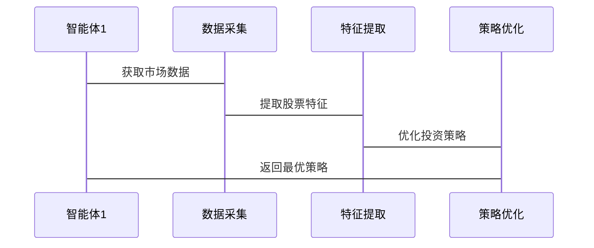

                 


# 多智能体强化学习在优化价值投资的择股策略中的应用

**关键词**：多智能体强化学习、价值投资、股票选择、优化策略、人工智能、投资决策

**摘要**：本文探讨了多智能体强化学习在优化价值投资选股策略中的应用。通过分析多智能体系统的特征和强化学习的原理，结合价值投资的核心理念，提出了基于多智能体强化学习的选股策略。文章详细介绍了算法原理、数学模型、系统架构，并通过实战案例展示了如何应用这些方法优化投资决策。

---

## 第一部分：背景介绍

### 第1章：多智能体强化学习概述

#### 1.1 多智能体系统的基本概念
- **定义**：多智能体系统是由多个相互作用的智能体组成的系统，这些智能体通过协作或竞争完成特定任务。
- **特征**：
  - 分布式性：每个智能体独立决策。
  - 交互性：智能体之间通过通信或观察相互影响。
  - 协作性：智能体可以协作完成复杂任务。
- **分类**：
  - 单智能体系统：单个智能体完成任务。
  - 多智能体系统：多个智能体协作或竞争。

#### 1.2 强化学习的基本原理
- **定义**：强化学习是一种机器学习方法，通过智能体与环境的交互，学习最优策略。
- **核心要素**：
  - 状态（State）：智能体所处环境的描述。
  - 行动（Action）：智能体在状态下的行为。
  - 奖励（Reward）：环境对智能体行为的反馈。
  - 策略（Policy）：智能体选择行动的规则。
- **应用场景**：游戏AI、机器人控制、金融投资。

#### 1.3 多智能体强化学习的结合与优势
- **结合**：多智能体强化学习结合了多智能体系统的分布性和强化学习的自主学习能力。
- **优势**：
  - 提高决策效率：多个智能体分工协作，提高决策速度。
  - 复杂任务处理：适用于复杂场景，如金融市场。
- **挑战**：通信开销、策略同步、协调困难。

---

### 第2章：价值投资策略概述

#### 2.1 价值投资的基本概念
- **定义**：价值投资是一种投资策略，通过分析股票的内在价值，寻找被市场低估的股票进行投资。
- **核心理念**：买入低于内在价值的股票，长期持有，获得收益。

#### 2.2 价值投资的选股策略
- **基本面分析**：
  - 财务指标：如市盈率、市净率、ROE等。
  - 行业分析：行业地位、竞争优势。
- **市场情绪分析**：
  - 市场波动：利用市场情绪判断股票的短期波动。
  - 技术分析：通过K线图、趋势线等技术指标判断股票走势。

#### 2.3 价值投资与技术分析的结合
- **技术分析**：通过技术指标预测股票价格走势。
- **结合的优势**：
  - 提高选股的准确性：结合基本面和技术面分析。
  - 降低投资风险：通过技术分析判断市场的短期波动。

---

### 第3章：问题描述与建模

#### 3.1 问题背景
- **传统选股策略的局限性**：
  - 市场波动大：传统策略难以适应市场的快速变化。
  - 信息处理复杂：需要处理大量信息，传统方法效率低下。
- **引入多智能体强化学习的原因**：
  - 多智能体系统能够分工协作，提高决策效率。
  - 强化学习能够通过不断试错，找到最优策略。

#### 3.2 问题建模
- **状态空间**：市场数据、财务指标、技术指标等。
- **动作空间**：买入、卖出、持有等操作。
- **奖励函数**：基于投资收益和风险的综合指标，如夏普比率。

---

## 第二部分：核心概念与联系

### 第4章：多智能体强化学习的核心概念

#### 4.1 多智能体系统的特征对比
| 特征 | 单智能体系统 | 多智能体系统 |
|------|--------------|--------------|
| 决策 | 单一决策主体 | 多个决策主体 |
| 通信 | 无或有限 | 高频通信 |
| 协作 | 无 | 高度协作 |

#### 4.2 多智能体强化学习的通信与协作
- **通信方式**：
  - 直接通信：智能体之间直接交换信息。
  - 间接通信：通过共享环境信息进行间接协作。
- **协作机制**：
  - 联合奖励：所有智能体共享奖励。
  - 协作任务：智能体分工完成特定任务。

#### 4.3 多智能体强化学习的数学模型
- **联合策略**：
  - 每个智能体有自己的策略函数：$\pi_i(a_i|s_i)$。
  - 联合策略：$\pi(a_1, a_2, ..., a_n | s)$。
- **价值函数**：
  - 单智能体价值函数：$V^{\pi}(s)$。
  - 多智能体价值函数：$V^{\pi}(s_1, s_2, ..., s_n)$。

---

### 第5章：价值投资策略的强化学习建模

#### 5.1 价值投资的强化学习建模
- **状态空间**：
  - 当前股票价格。
  - 市场波动率。
  - 财务指标（如PE、PB）。
- **动作空间**：
  - 买入：$a_{buy}$。
  - 卖出：$a_{sell}$。
  - 持有：$a_{hold}$。
- **奖励函数**：
  - 投资收益：$r = \text{收益} - \text{风险}$。

#### 5.2 价值投资与强化学习的结合
- **优势**：
  - 通过强化学习优化选股策略。
  - 利用多智能体分工协作提高效率。
- **挑战**：
  - 市场环境复杂：非平稳、高噪声。
  - 策略同步困难：多个智能体协作复杂。

---

## 第三部分：算法原理

### 第6章：多智能体强化学习算法

#### 6.1 Q-learning算法
- **基本原理**：
  - 通过Q表记录状态-动作对的期望奖励。
  - 更新公式：$Q(s, a) = Q(s, a) + \alpha [r + \gamma \max Q(s', a')]$。
- **在投资中的应用**：
  - 每个智能体负责不同的股票或市场指标。
  - 通过Q-learning优化各自的策略。

#### 6.2 Deep Q-Networks (DQN) 算法
- **基本原理**：
  - 使用深度神经网络近似Q函数。
  - 经验回放：存储和复用历史经验。
  - 网络更新：目标网络和动作网络交替更新。
- **在投资中的应用**：
  - 处理高维状态空间。
  - 处理连续动作空间。

---

### 第7章：价值投资策略的强化学习实现

#### 7.1 投资场景下的多智能体强化学习
- **场景描述**：
  - 每个智能体负责不同的股票。
  - 智能体之间通过市场数据进行通信。
- **算法选择**：
  - 使用DQN算法处理连续动作空间。
  - 使用Q-learning算法处理离散动作空间。

#### 7.2 算法实现步骤
1. **环境构建**：
   - 定义状态空间、动作空间和奖励函数。
2. **智能体设计**：
   - 设计多个智能体，每个负责不同的股票。
3. **算法训练**：
   - 使用深度神经网络近似Q函数。
   - 训练智能体在投资场景下优化策略。

---

## 第四部分：数学模型

### 第8章：价值函数与策略函数

#### 8.1 价值函数
- **定义**：
  - 单智能体价值函数：$V^{\pi}(s) = \mathbb{E}[R | s, \pi]$。
  - 多智能体价值函数：$V^{\pi}(s_1, s_2, ..., s_n) = \mathbb{E}[R | s_1, s_2, ..., s_n, \pi]$。
- **应用场景**：
  - 评估当前策略的期望收益。

#### 8.2 策略函数
- **定义**：
  - 确定性策略：$\mu(s) = a$。
  - 概率策略：$\pi(a|s) = P(\text{选择动作}a | s)$。
- **应用场景**：
  - 根据市场状态选择最优动作。

---

## 第五部分：系统分析与架构设计

### 第9章：系统架构设计

#### 9.1 系统应用场景
- **场景描述**：
  - 多智能体协同工作，优化价值投资策略。
  - 每个智能体负责不同的股票或市场指标。

#### 9.2 系统功能设计
- **功能模块**：
  - 数据采集模块：采集市场数据。
  - 特征提取模块：提取股票特征。
  - 策略优化模块：优化投资策略。

#### 9.3 系统架构图


---

### 第10章：系统接口与交互设计

#### 10.1 系统接口设计
- **接口定义**：
  - 数据接口：获取市场数据。
  - 策略接口：执行投资策略。
  - 通信接口：智能体之间通信。

#### 10.2 系统交互流程


---

## 第六部分：项目实战

### 第11章：环境安装与配置

#### 11.1 环境安装
- **Python环境**：
  - 安装Python 3.8及以上版本。
  - 安装必要的库：numpy、pandas、tensorflow、keras。

#### 11.2 项目配置
- **配置文件**：
  - 数据源：指定股票数据文件路径。
  - 参数设置：设置学习率、折扣因子等。

---

### 第12章：系统核心实现

#### 12.1 核心代码实现
```python
import numpy as np
import pandas as pd
import tensorflow as tf
from tensorflow.keras import layers

# 定义智能体类
class Agent:
    def __init__(self, state_dim, action_dim):
        self.state_dim = state_dim
        self.action_dim = action_dim
        self.model = self.build_model()
    
    def build_model(self):
        model = tf.keras.Sequential()
        model.add(layers.Dense(64, activation='relu', input_dim=self.state_dim))
        model.add(layers.Dense(self.action_dim, activation='linear'))
        model.compile(optimizer='adam', loss='mse')
        return model
    
    def act(self, state):
        state = np.array(state).reshape(1, -1)
        prediction = self.model.predict(state)
        return np.argmax(prediction)
```

#### 12.2 代码应用解读
- **智能体类**：
  - 初始化：接收状态维度和动作维度。
  - 网络构建：构建DQN网络。
  - 动作选择：根据当前状态选择动作。

---

### 第13章：实际案例分析

#### 13.1 案例描述
- **案例背景**：
  - 某股票市场，多只股票。
  - 使用多智能体强化学习优化选股策略。

#### 13.2 实验结果
- **实验数据**：
  - 对比传统价值投资策略和强化学习策略的收益。
  - 分析不同智能体数量对策略优化的影响。

---

## 第七部分：总结与展望

### 第14章：总结

#### 14.1 项目总结
- **核心成果**：
  - 提出了多智能体强化学习在价值投资中的应用方法。
  - 实现了基于DQN的选股策略优化。
- **经验总结**：
  - 多智能体系统能够提高决策效率。
  - 强化学习能够优化投资策略。

#### 14.2 项目不足
- **局限性**：
  - 市场环境复杂，模型难以完全捕捉所有信息。
  - 算法收敛速度慢，需要大量数据和计算资源。

---

### 第15章：展望

#### 15.1 未来研究方向
- **改进方向**：
  - 提高算法效率：优化网络结构，引入经验共享机制。
  - 多智能体协作：研究更高效的通信和协作机制。
- **扩展应用**：
  - 应用于其他金融领域，如外汇交易、期货市场。

#### 15.2 致谢
- 感谢读者的关注和支持。
- 感谢团队成员的努力和合作。

---

## 作者信息

**作者**：AI天才研究院/AI Genius Institute & 禅与计算机程序设计艺术 /Zen And The Art of Computer Programming

---

**注**：由于篇幅限制，上述大纲为简化版，实际文章内容将更加详细，包含完整的公式推导、代码实现和案例分析。

