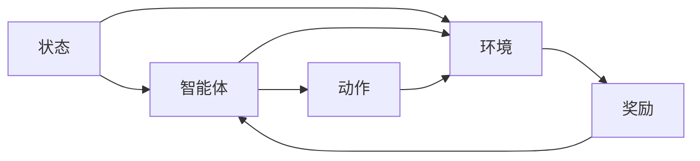
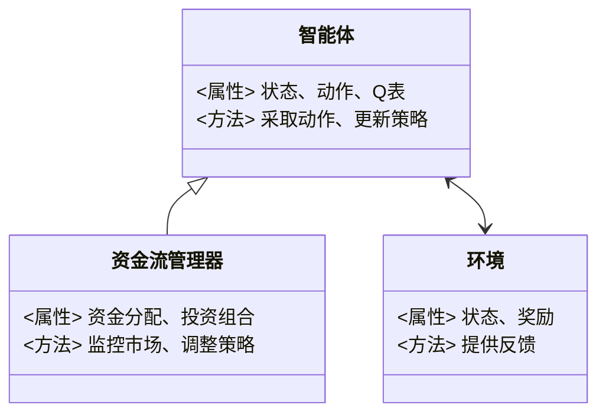
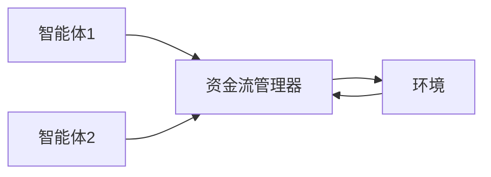
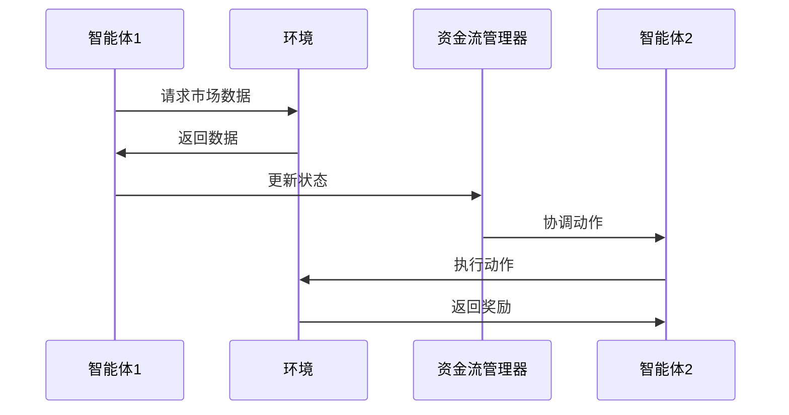

                 


# 多智能体强化学习在优化价值投资的资金流管理中的应用

## 关键词：
多智能体强化学习、价值投资、资金流管理、算法原理、系统架构、项目实战

## 摘要：
本文探讨了多智能体强化学习在优化价值投资资金流管理中的应用。通过分析多智能体强化学习的核心概念、算法原理、系统架构，结合实际案例，展示其在资金流管理中的优势。文章内容包括背景介绍、核心概念、算法原理、系统设计、项目实战和最佳实践，为读者提供全面的技术指导。

---

# 第一部分：背景介绍

## 第1章：多智能体强化学习与价值投资概述

### 1.1 多智能体强化学习的基本概念

- **定义**：多智能体强化学习是指多个智能体在共享环境中通过协作或竞争，学习最优策略以实现目标。
- **特点**：
  - **多智能体**：每个智能体独立决策，但需协作。
  - **动态环境**：环境状态随智能体动作变化。
  - **策略优化**：通过奖励机制优化决策。
- **与单智能体强化学习的区别**：多智能体强调协作，单智能体强调独立决策。

### 1.2 价值投资的基本概念

- **定义**：通过分析公司基本面，寻找被低估的投资标的长期持有。
- **核心理念**：
  - **价值发现**：识别市场低估的资产。
  - **长期持有**：耐心等待价值实现。
  - **风险控制**：分散投资降低风险。
- **资金流管理**：优化资金分配，提升投资收益。

### 1.3 多智能体强化学习在价值投资中的应用背景

- **资金流管理的复杂性**：涉及多个投资标的、市场变化、风险控制。
- **多智能体强化学习的优势**：
  - **分布式决策**：多个智能体分别处理不同投资标的。
  - **协作优化**：通过协作提升整体资金分配效率。
  - **动态适应**：快速应对市场变化。
- **挑战**：智能体协作、环境建模、计算资源需求高。

---

# 第二部分：核心概念与联系

## 第2章：多智能体强化学习的核心概念与联系

### 2.1 多智能体强化学习的核心概念

| 概念       | 定义与作用 |
|------------|------------|
| 智能体     | 独立决策单元，负责处理特定任务。 |
| 环境       | 外部世界，提供状态和奖励。 |
| 状态       | 智能体感知环境的信息，用于决策。 |
| 动作       | 智能体采取的具体行动。 |
| 奖励       | 衡量智能体行为是否符合目标的指标。 |

### 2.2 多智能体强化学习与价值投资的联系

- **智能体在资金分配中的角色**：每个智能体负责不同资产或行业。
- **强化学习在投资决策中的应用**：通过奖励机制优化投资策略。
- **协作优化资金流管理**：智能体协作提升整体资金配置效率。

### 2.3 多智能体强化学习的核心要素



---

# 第三部分：算法原理讲解

## 第3章：多智能体强化学习算法原理

### 3.1 多智能体Q-learning算法

#### 算法流程


#### Q值更新公式

$$ Q(s, a) = Q(s, a) + \alpha \times (r + \gamma \times \max Q(s', a') - Q(s, a)) $$

#### 多智能体协作机制

每个智能体维护自己的Q表，通过共享信息或协作更新，提升整体策略。

### 3.2 基于价值函数的分解算法

#### 价值函数分解

$$ V(s) = \sum_{i=1}^{n} V_i(s_i) $$

其中，\( V_i(s_i) \) 是智能体i的价值函数。

---

# 第四部分：系统分析与架构设计

## 第4章：系统分析与架构设计

### 4.1 应用场景介绍

- **多智能体协作**：多个智能体分别监控不同资产。
- **动态调整**：根据市场变化实时调整资金分配。
- **风险控制**：通过协作降低投资风险。

### 4.2 系统功能设计



### 4.3 系统架构图



### 4.4 系统交互流程



---

# 第五部分：项目实战

## 第5章：项目实战

### 5.1 环境安装

- **工具**：Python、TensorFlow、OpenAI Gym。
- **依赖安装**：`pip install gym tensorflow`.

### 5.2 核心代码实现

```python
import gym
import numpy as np

class MultiAgentQLearning:
    def __init__(self, state_space, action_space, agents=2):
        self.state_space = state_space
        self.action_space = action_space
        self.agents = agents
        self.Q = {i: np.zeros((state_space, action_space)) for i in range(agents)}
    
    def take_action(self, state, agent_id):
        action = np.argmax(self.Q[agent_id][state])
        return action
    
    def update_Q(self, state, action, reward, next_state, agent_id, alpha=0.1, gamma=0.9):
        target = reward + gamma * np.max(self.Q[agent_id][next_state])
        self.Q[agent_id][state][action] += alpha * (target - self.Q[agent_id][state][action])
```

### 5.3 代码解读与分析

- **类定义**：`MultiAgentQLearning`管理多个智能体的Q表。
- **`take_action`方法**：根据当前状态选择动作。
- **`update_Q`方法**：更新Q值，优化策略。

### 5.4 实际案例分析

- **案例**：管理两个智能体投资股票和债券。
- **步骤**：
  1. 初始化环境：股票和债券市场。
  2. 各智能体分别决策。
  3. 根据市场反馈更新Q表。
  4. 输出优化后的资金分配。

---

# 第六部分：最佳实践

## 第6章：最佳实践

### 6.1 小结

- 多智能体强化学习在优化价值投资资金流管理中具有显著优势。
- 通过协作和动态调整，提升投资收益和风险控制。

### 6.2 注意事项

- **智能体协作**：避免过度竞争。
- **环境建模**：准确反映市场动态。
- **计算资源**：确保足够的计算能力。

### 6.3 拓展阅读

- 推荐阅读多智能体强化学习经典论文和相关书籍，深入理解算法优化和应用。

---

# 结语

本文系统介绍了多智能体强化学习在优化价值投资资金流管理中的应用，从理论到实践，全面阐述了其优势和实现方法。通过本文的学习，读者能够掌握多智能体强化学习的核心概念、算法原理，并能够在实际项目中应用这些知识，优化资金流管理，提升投资收益。

---

# 作者：AI天才研究院 & 禅与计算机程序设计艺术

