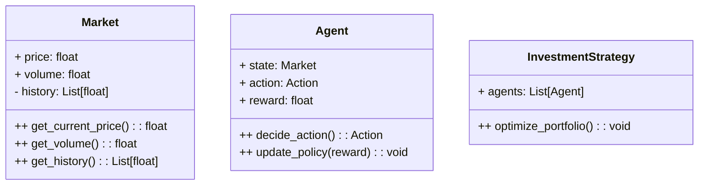

                 


# 多智能体强化学习在优化再投资策略中的应用

> 关键词：多智能体强化学习、投资策略优化、算法实现、风险控制、系统架构、投资组合管理

> 摘要：本文深入探讨了多智能体强化学习在优化再投资策略中的应用。首先，我们介绍了多智能体系统的概念及其在投资优化中的优势。接着，详细分析了强化学习的核心原理及其在多智能体环境中的扩展。然后，我们结合实际投资场景，提出了基于多智能体强化学习的投资优化框架，并通过具体案例展示了其在投资组合管理和风险控制中的应用。最后，我们总结了本文的主要成果，并展望了未来的研究方向。

---

## 第1章：多智能体强化学习概述

### 1.1 多智能体系统的定义与特点

#### 1.1.1 多智能体系统的定义
多智能体系统（Multi-Agent System, MAS）是由多个智能体（Agent）组成的分布式系统，这些智能体能够通过协作完成复杂的任务。与单智能体系统相比，多智能体系统具有更强的适应性和协作能力。

#### 1.1.2 多智能体系统的特征
- **分布式性**：智能体独立决策，通过通信协作完成任务。
- **协作性**：智能体之间通过信息共享和协作实现目标。
- **动态性**：环境和智能体的状态可能随时间变化。
- **自主性**：智能体能够自主感知环境并做出决策。

#### 1.1.3 多智能体系统的应用场景
- **投资组合优化**：多个智能体分别负责不同的资产类别，协作优化投资组合。
- **风险管理**：智能体实时监控市场变化，及时调整投资策略。
- **动态市场分析**：智能体协作分析市场趋势，提供投资建议。

---

### 1.2 强化学习的基本原理

#### 1.2.1 强化学习的定义
强化学习（Reinforcement Learning, RL）是一种机器学习范式，通过智能体与环境的交互，智能体通过试错学习策略，以最大化累积奖励。

#### 1.2.2 强化学习的核心要素
- **状态（State）**：环境的当前情况。
- **动作（Action）**：智能体的决策。
- **奖励（Reward）**：智能体行为的反馈。
- **策略（Policy）**：智能体选择动作的概率分布。
- **价值函数（Value Function）**：评估状态或动作的价值。

#### 1.2.3 强化学习的算法框架
- **Q-learning**：基于值函数的强化学习算法。
- **Deep Q-Network（DQN）**：结合深度学习的强化学习算法。
- **Actor-Critic（AC）**：基于策略和价值函数的强化学习算法。

---

### 1.3 多智能体强化学习的挑战与优势

#### 1.3.1 多智能体强化学习的挑战
- **智能体协作**：如何协调多个智能体的决策。
- **通信与信息共享**：智能体之间的信息传递和同步。
- **复杂环境**：多智能体系统面临复杂的动态环境。

#### 1.3.2 多智能体强化学习的优势
- **分布式决策**：多个智能体独立决策，提高系统的容错性和适应性。
- **风险控制**：通过智能体的协作，降低投资组合的整体风险。
- **高效优化**：多个智能体同时优化不同部分，提升整体效率。

---

## 第2章：多智能体强化学习的核心概念

### 2.1 多智能体系统的组成

#### 2.1.1 智能体的定义与角色
- **智能体**：能够感知环境并采取行动的实体。
- **角色**：根据任务分配不同的角色，例如资产分配者、风险管理者。

#### 2.1.2 智能体之间的交互关系
- **协作**：智能体之间共享信息，协同完成任务。
- **竞争**：智能体之间可能存在竞争关系，例如在资源分配中。

#### 2.1.3 环境与智能体的接口
- **输入**：智能体从环境中接收状态信息。
- **输出**：智能体向环境发送动作。

---

### 2.2 强化学习中的决策过程

#### 2.2.1 状态、动作与奖励的定义
- **状态（State）**：当前市场状况、资产价格等。
- **动作（Action）**：买入、卖出、持有等。
- **奖励（Reward）**：投资收益或损失。

#### 2.2.2 策略与价值函数的区分
- **策略（Policy）**：决定下一步动作的概率分布。
- **价值函数（Value Function）**：评估当前状态的价值。

#### 2.2.3 探索与利用的平衡
- **探索**：尝试新的动作，发现潜在的高价值状态。
- **利用**：根据已知的策略选择当前最优的动作。

---

### 2.3 多智能体强化学习的数学模型

#### 2.3.1 多智能体系统的数学表示
- **智能体集合**：$A = \{A_1, A_2, ..., A_n\}$
- **状态空间**：$S = \{s_1, s_2, ..., s_m\}$
- **动作空间**：$A_i = \{a_{i1}, a_{i2}, ..., a_{ik}\}$

#### 2.3.2 状态空间与动作空间的建模
- **状态表示**：使用向量或特征表示当前市场状态。
- **动作表示**：定义智能体可执行的操作。

#### 2.3.3 奖励函数的设计原则
- **目标明确**：奖励函数应明确引导智能体向目标方向优化。
- **可区分性**：不同的动作应获得不同的奖励。
- **动态性**：奖励函数应根据环境变化调整。

---

## 第3章：多智能体强化学习的算法原理

### 3.1 基础强化学习算法

#### 3.1.1 Q-learning算法
Q-learning是一种经典的强化学习算法，适用于离散状态和动作空间。

$$ Q(s, a) = Q(s, a) + \alpha (r + \gamma \max Q(s', a') - Q(s, a)) $$

#### 3.1.2 DQN算法
DQN（Deep Q-Network）结合了深度学习和强化学习，适用于高维状态空间。

- **网络结构**：输入层、隐藏层、输出层。
- **经验回放**：存储历史经验，随机采样训练。

#### 3.1.3 A3C算法
A3C（Asynchronous Advantage Actor-Critic）是一种基于策略梯度的强化学习算法，适用于分布式环境。

- **Actor**：负责选择动作。
- **Critic**：评估当前状态的价值。

---

### 3.2 多智能体强化学习的扩展

#### 3.2.1 MA-DQN算法
MA-DQN是针对多智能体环境的强化学习算法，每个智能体维护独立的Q值表。

- **优势**：简单易实现。
- **劣势**：难以处理智能体之间的协作问题。

#### 3.2.2 QMIX算法
QMIX通过混合多个智能体的Q值，将多智能体问题转化为单智能体问题。

- **核心思想**：将多个智能体的Q值混合，得到全局最优策略。

#### 3.2.3 VDN算法
VDN（Value Decomposition Networks）通过分解价值函数，实现多智能体协作。

- **优势**：能够处理大规模多智能体问题。

---

### 3.3 算法的数学推导

#### 3.3.1 Q-learning的数学公式
$$ Q(s, a) = Q(s, a) + \alpha (r + \gamma \max Q(s', a') - Q(s, a)) $$

#### 3.3.2 DQN的网络结构
- 输入：当前状态$s$。
- 输出：动作价值$Q(s, a)$。

#### 3.3.3 QMIX的混合策略
$$ Q_{\text{mix}}(s, a) = \sum_{i=1}^n \lambda_i Q_i(s, a_i) $$

---

## 第4章：多智能体强化学习在投资策略中的应用

### 4.1 投资策略优化的背景

#### 4.1.1 投资策略优化的目标
- 最大化投资收益。
- 最小化投资风险。

#### 4.1.2 传统投资策略的局限性
- 无法应对复杂的市场变化。
- 难以实时调整投资组合。

#### 4.1.3 强化学习在投资中的优势
- 能够实时适应市场变化。
- 可以处理高维复杂的投资环境。

---

### 4.2 多智能体在投资组合优化中的作用

#### 4.2.1 投资组合优化的定义
- 根据市场情况调整资产配置，以达到最优收益。

#### 4.2.2 多智能体在资产分配中的应用
- 每个智能体负责不同的资产类别。

#### 4.2.3 多智能体在风险控制中的作用
- 实时监控市场风险，调整投资策略。

---

### 4.3 基于多智能体强化学习的投资策略框架

#### 4.3.1 投资环境的建模
- 定义市场状态、资产价格等。

#### 4.3.2 多智能体的协作机制
- 智能体之间共享信息，协同决策。

#### 4.3.3 投资决策的实时调整
- 根据市场反馈动态调整投资策略。

---

## 第5章：系统分析与架构设计

### 5.1 投资优化系统的功能需求

#### 5.1.1 系统目标
- 实现基于多智能体强化学习的投资优化。

#### 5.1.2 功能模块
- 数据采集模块：收集市场数据。
- 智能体协作模块：实现智能体之间的协作。
- 决策优化模块：优化投资策略。

---

### 5.2 系统功能设计

#### 5.2.1 领域模型Mermaid类图


#### 5.2.2 系统架构Mermaid架构图


---

## 第6章：项目实战

### 6.1 环境安装

#### 6.1.1 安装Python
- 使用Anaconda安装Python 3.8或更高版本。

#### 6.1.2 安装依赖库
- `numpy`, `pandas`, `tensorflow`, `keras`

---

### 6.2 系统核心实现源代码

#### 6.2.1 多智能体协作代码
```python
class Agent:
    def __init__(self, state_space, action_space):
        self.state_space = state_space
        self.action_space = action_space
        self.Q = defaultdict(float)
    
    def decide_action(self, state):
        # 探索与利用策略
        if random.random() < 0.1:
            return random.choice(list(self.action_space))
        max_Q = max(self.Q[state, action] for action in self.action_space)
        actions_with_max_Q = [action for action in self.action_space if self.Q[state, action] == max_Q]
        return random.choice(actions_with_max_Q)
    
    def update_policy(self, state, action, reward):
        next_state = get_next_state(state, action)
        target = reward + gamma * max(self.Q[next_state, a] for a in self.action_space)
        self.Q[state, action] = target
```

---

### 6.3 代码应用解读与分析

#### 6.3.1 代码功能
- 每个智能体维护一个Q值表。
- 根据当前状态和动作更新Q值。

#### 6.3.2 代码优化
- 使用深度学习模型替代Q值表，提高计算效率。

---

## 第7章：总结与展望

### 7.1 总结
本文详细探讨了多智能体强化学习在优化再投资策略中的应用，提出了基于多智能体强化学习的投资优化框架，并通过具体案例展示了其在投资组合管理和风险控制中的应用。

### 7.2 展望
未来的研究可以进一步探索多智能体强化学习在更复杂投资场景中的应用，如多资产类别投资、动态市场环境下的实时决策等。同时，如何提高多智能体系统的协作效率和优化性能也是值得深入研究的方向。

---

## 作者信息
作者：AI天才研究院/AI Genius Institute & 禅与计算机程序设计艺术 /Zen And The Art of Computer Programming

---

希望这篇技术博客文章能够为您提供有价值的信息和启发！如果需要进一步的修改或补充，请随时告知！

