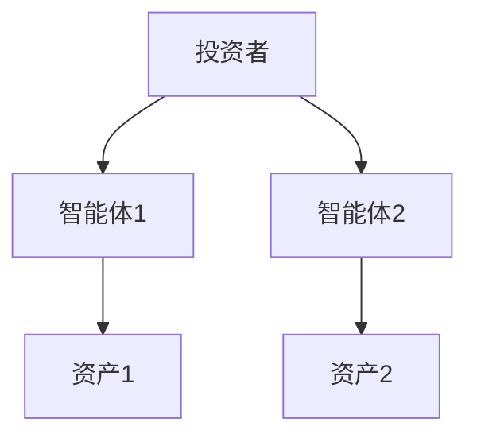
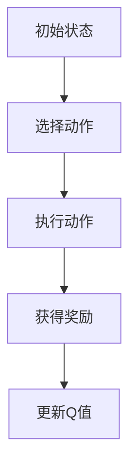
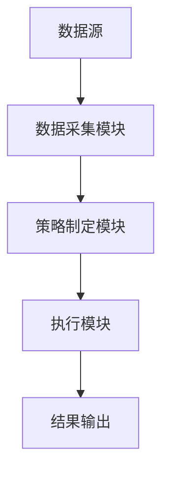
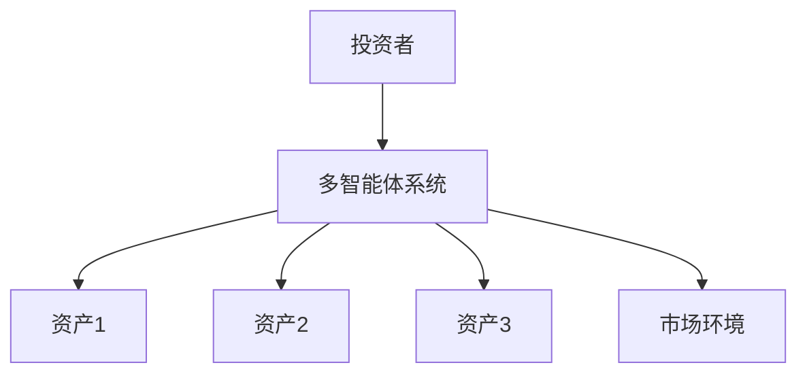

                 

<think>
嗯，用户希望我根据《多智能体强化学习在优化投资组合再平衡中的应用》这本书，设计一个详细的目录大纲。首先，我需要理解这本书的主题，它主要涉及多智能体强化学习在投资组合优化中的应用。这意味着我需要涵盖多智能体系统、强化学习原理，以及如何将这些技术应用到金融投资中。

接下来，我应该考虑目录的结构。通常，书籍会分为几个部分，每个部分包含几章，每章下有小节。我需要确保内容全面，涵盖背景介绍、核心概念、算法原理、系统设计、项目实战以及最佳实践等部分。

首先，背景介绍部分应该包括多智能体强化学习的基本概念，以及投资组合优化的背景。这部分需要让读者了解为什么需要多智能体强化学习，以及它在投资中的重要性。

然后，核心概念部分需要详细讲解多智能体系统和强化学习的原理，包括它们的组成部分和相互关系。这部分可能需要使用表格和图表来帮助理解，比如对比多智能体和单智能体的特点，或者用Mermaid图展示实体关系。

接下来是算法原理，这部分需要详细讲解多智能体强化学习的算法，比如Q-learning和Actor-Critic方法。我需要用Mermaid流程图来展示算法步骤，并提供Python代码示例，让读者能够理解如何实现这些算法。

然后是系统分析与架构设计，这部分需要介绍投资组合再平衡的场景，设计系统的功能模块，比如数据采集、策略制定、执行等。同时，用Mermaid图展示系统的架构和交互流程，帮助读者理解系统的整体结构。

项目实战部分需要提供一个具体的案例，比如使用Python实现一个多智能体强化学习模型，并应用到实际的投资组合优化中。这部分需要详细说明环境的安装、代码实现、案例分析以及结果解读。

最后，最佳实践部分需要总结经验，给出一些小贴士，比如算法调参的注意事项，以及未来的研究方向。这部分可以帮助读者在实际应用中避免常见的问题，并激发进一步的研究兴趣。

在编写目录时，我需要确保每个部分都有足够的细节，同时保持结构清晰，逻辑连贯。每个章节下的小节要具体，涵盖理论、方法、案例等多个方面，确保读者能够全面掌握主题内容。

另外，我还需要注意格式要求，使用markdown的三级目录结构，确保内容简洁，没有多余的信息。同时，数学公式要用latex格式，独立段落用$$括起来，段落内用$括起来，这样在文档中显示清晰。

总的来说，我需要系统地将多智能体强化学习与投资组合优化结合起来，设计一个结构合理、内容全面的目录大纲，帮助作者全面覆盖主题内容，满足读者的学习需求。
</think>

# 多智能体强化学习在优化投资组合再平衡中的应用

> 关键词：多智能体强化学习，投资组合优化，再平衡，强化学习，金融投资

> 摘要：本文探讨了多智能体强化学习在优化投资组合再平衡中的应用。通过分析多智能体系统的特性、强化学习的原理以及它们在投资组合优化中的结合，展示了如何利用多智能体强化学习技术实现投资组合的动态优化。文章详细阐述了多智能体强化学习的算法原理、系统设计、项目实现及最佳实践，为金融投资领域的优化问题提供了新的解决方案。

---

# 第一部分: 多智能体强化学习与投资组合优化背景

## 第1章: 多智能体强化学习概述

### 1.1 多智能体强化学习的基本概念

#### 1.1.1 多智能体系统的定义与特点
- 多智能体系统（Multi-Agent System, MAS）是由多个智能体组成的复杂系统，每个智能体都有自己的目标和行为。
- 多智能体系统的特征：
  - 分布式性：智能体独立决策，但通过协作完成全局目标。
  - 交互性：智能体之间通过通信和协作解决问题。
  - 社会性：智能体之间的交互形成类似社会的行为模式。
  - 动态性：系统环境和智能体状态动态变化。

#### 1.1.2 强化学习的基本原理
- 强化学习（Reinforcement Learning, RL）：智能体通过与环境交互，学习策略以最大化累积奖励。
- 基本要素：
  - 状态（State）：环境的当前情况。
  - 动作（Action）：智能体采取的行为。
  - 奖励（Reward）：智能体行为的反馈。
  - 策略（Policy）：决定动作的规则。
  - 价值函数（Value Function）：评估状态或动作的价值。

#### 1.1.3 多智能体强化学习的核心优势
- 多智能体系统能够处理复杂任务，通过协作提高整体性能。
- 强化学习具备动态适应性，适合金融市场等不确定环境。
- 多智能体强化学习结合了两者的优点，能够解决复杂的优化问题。

### 1.2 投资组合优化的背景与挑战

#### 1.2.1 投资组合优化的基本概念
- 投资组合优化：通过优化资产配置，实现收益与风险的平衡。
- 传统方法：基于均值-方差模型（Markowitz优化）。
- 再平衡：根据市场变化调整资产配置，保持最优状态。

#### 1.2.2 再平衡的定义与重要性
- 再平衡：定期调整投资组合以维持目标配置。
- 再平衡的必要性：
  - 应对市场波动。
  - 适应投资者风险偏好变化。
  - 降低投资组合的波动性。

#### 1.2.3 传统投资组合优化方法的局限性
- 假设过于简化：忽略市场动态和交易成本。
- 单一优化目标：难以兼顾收益与风险。
- 计算复杂性：大规模数据处理困难。

## 第2章: 多智能体强化学习在投资组合优化中的应用背景

### 2.1 投资组合再平衡的数学模型

#### 2.1.1 投资组合优化的目标函数
- 最优化目标：
  - 最大化收益。
  - 最小化风险。
  - 平衡收益与风险。

#### 2.1.2 风险-收益平衡的数学表达
- 常用指标：
  - 夏普比率（Sharpe Ratio）。
  - 风险调整后收益（Risk-Adjusted Return）。

#### 2.1.3 再平衡的条件与触发机制
- 再平衡触发条件：
  - 资产比例偏离目标。
  - 市场波动超出阈值。
  - 投资者风险偏好变化。

### 2.2 多智能体系统在金融领域的优势

#### 2.2.1 多智能体系统在投资决策中的优势
- 分散决策：多个智能体分别负责不同的资产类别。
- 协作优化：通过协作提高整体投资组合的收益。
- 动态适应：快速响应市场变化。

#### 2.2.2 多智能体与强化学习的结合优势
- 强化学习具备动态适应性，适合金融市场不确定性。
- 多智能体系统能够处理复杂任务，适合投资组合优化。
- 结合两者优点，实现投资组合的动态优化。

#### 2.2.3 金融市场的复杂性与多智能体的适应性
- 金融市场特点：
  - 不确定性高。
  - 动态变化快。
  - 多因素影响。
- 多智能体系统的优势：
  - 分布式决策能力强。
  - 能够处理多因素影响。
  - 适应动态变化能力强。

---

# 第二部分: 多智能体强化学习的核心概念与联系

## 第3章: 多智能体强化学习的核心概念

### 3.1 多智能体系统的组成与关系

#### 3.1.1 实体关系图（ER图）


#### 3.1.2 系统中的角色与职责
- 投资者：设定目标和风险偏好。
- 智能体：负责优化特定资产类别。
- 资产：被优化的对象。

#### 3.1.3 实体间的交互关系
- 智能体之间通过通信协作。
- 智能体与环境（市场）交互。
- 投资者与智能体交互。

### 3.2 强化学习算法的核心原理

#### 3.2.1 状态、动作、奖励的定义
- 状态（S）：当前市场状况。
- 动作（A）：智能体采取的交易行为。
- 奖励（R）：投资收益。

#### 3.2.2 Q-learning算法的原理
- Q-learning算法：
  - 状态-动作值函数（Q(S,A)）。
  - 更新规则：
    $$ Q(S,A) = Q(S,A) + \alpha (R + \gamma \max Q(S',A') - Q(S,A)) $$
  - 其中，$\alpha$是学习率，$\gamma$是折扣因子。

#### 3.2.3 多智能体协作机制的数学模型
- 多智能体协作模型：
  - 每个智能体维护自己的Q值表。
  - 通过通信共享信息。
  - 协作目标：最大化整体收益。

## 第4章: 多智能体与强化学习的联系与对比

### 4.1 多智能体与单智能体的对比分析

#### 4.1.1 智能体数量对系统性能的影响
- 单智能体：
  - 适合简单任务。
  - 难以处理复杂任务。
- 多智能体：
  - 分布式决策能力强。
  - 适合复杂任务。

#### 4.1.2 任务分配的差异
- 单智能体：单一决策中心。
- 多智能体：任务分配给多个智能体。

#### 4.1.3 通信与协作机制的对比
- 单智能体：无通信需求。
- 多智能体：需要通信和协作。

### 4.2 强化学习与传统优化方法的对比

#### 4.2.1 算法目标的差异
- 强化学习：最大化累积奖励。
- 传统优化：最小化目标函数。

#### 4.2.2 求解方法的对比
- 强化学习：基于策略优化。
- 传统优化：基于数学优化。

#### 4.2.3 适应性与实时性的对比
- 强化学习：适应性强，适合动态环境。
- 传统优化：适应性较弱，适合静态环境。

---

# 第三部分: 多智能体强化学习算法原理

## 第5章: 多智能体强化学习算法原理

### 5.1 Q-learning算法的实现

#### 5.1.1 Q-learning算法的流程图


#### 5.1.2 Q-learning算法的Python实现
```python
import numpy as np

class QLearning:
    def __init__(self, state_size, action_size, alpha=0.1, gamma=0.9):
        self.state_size = state_size
        self.action_size = action_size
        self.Q = np.zeros((state_size, action_size))
        self.alpha = alpha
        self.gamma = gamma

    def choose_action(self, state, epsilon=0.1):
        if np.random.random() < epsilon:
            return np.random.randint(self.action_size)
        return np.argmax(self.Q[state, :])

    def update_Q(self, state, action, reward, next_state):
        self.Q[state, action] = self.Q[state, action] + self.alpha * (reward + self.gamma * np.max(self.Q[next_state, :]) - self.Q[state, action])
```

### 5.2 多智能体强化学习算法的实现

#### 5.2.1 多智能体协作机制的实现
- 每个智能体维护自己的Q值表。
- 智能体之间通过通信共享信息。

#### 5.2.2 多智能体协作机制的Python实现
```python
import numpy as np
import random

class MultiAgentQLearning:
    def __init__(self, num_agents, state_size, action_size, alpha=0.1, gamma=0.9):
        self.num_agents = num_agents
        self.state_size = state_size
        self.action_size = action_size
        self.agents = [QLearning(state_size, action_size, alpha, gamma) for _ in range(num_agents)]

    def choose_actions(self, states):
        actions = []
        for i in range(self.num_agents):
            actions.append(self.agents[i].choose_action(states[i]))
        return actions

    def update_Qs(self, states, actions, rewards, next_states):
        for i in range(self.num_agents):
            self.agents[i].update_Q(states[i], actions[i], rewards[i], next_states[i])
```

### 5.3 算法原理的数学模型

#### 5.3.1 Q-learning算法的数学模型
- Q-learning算法的目标是最大化累积奖励：
  $$ Q(S,A) = Q(S,A) + \alpha (R + \gamma \max Q(S',A') - Q(S,A)) $$

#### 5.3.2 多智能体协作机制的数学模型
- 多智能体协作机制通过共享信息，实现全局优化：
  $$ \text{Global Reward} = \sum_{i=1}^{N} R_i $$

---

# 第四部分: 系统分析与架构设计

## 第6章: 投资组合再平衡的系统分析

### 6.1 问题场景介绍

#### 6.1.1 投资组合再平衡的场景描述
- 投资组合需要定期调整以适应市场变化。
- 再平衡的目标是保持投资组合的最优配置。

### 6.2 系统功能设计

#### 6.2.1 系统功能模块
- 数据采集模块：获取市场数据。
- 策略制定模块：生成再平衡策略。
- 执行模块：执行再平衡操作。

### 6.3 系统架构设计

#### 6.3.1 系统架构图


## 第7章: 多智能体强化学习系统的架构设计

### 7.1 系统架构图

#### 7.1.1 系统架构图


### 7.2 系统交互流程图

#### 7.2.1 系统交互流程


---

# 第五部分: 项目实战

## 第8章: 多智能体强化学习在投资组合再平衡中的应用

### 8.1 环境安装与配置

#### 8.1.1 安装依赖
- Python环境：Python 3.8+
- 库依赖：numpy, matplotlib, gym

### 8.2 核心代码实现

#### 8.2.1 数据采集模块
```python
import pandas as pd
import numpy as np

def get_market_data(tickers, start_date, end_date):
    data = pd.DataFrame()
    for ticker in tickers:
        data[ticker] = pd.read_csv(f'data/{ticker}.csv')[['Close']]
    data = data.pct_change().dropna()
    return data
```

#### 8.2.2 多智能体强化学习模型实现
```python
class MultiAgentReinforcementLearning:
    def __init__(self, num_agents, state_size, action_size, alpha=0.1, gamma=0.9):
        self.num_agents = num_agents
        self.state_size = state_size
        self.action_size = action_size
        self.agents = [QLearning(state_size, action_size, alpha, gamma) for _ in range(num_agents)]

    def choose_actions(self, states):
        actions = []
        for i in range(self.num_agents):
            actions.append(self.agents[i].choose_action(states[i]))
        return actions

    def update_Qs(self, states, actions, rewards, next_states):
        for i in range(self.num_agents):
            self.agents[i].update_Q(states[i], actions[i], rewards[i], next_states[i])
```

### 8.3 项目小结

#### 8.3.1 项目实现的关键点
- 多智能体系统的实现。
- 强化学习算法的实现。
- 投资组合再平衡的实现。

---

# 第六部分: 最佳实践与小结

## 第9章: 最佳实践与小结

### 9.1 最佳实践

#### 9.1.1 算法调参技巧
- 学习率（$\alpha$）的选择。
- 折扣因子（$\gamma$）的选择。
- 探索与利用的平衡。

### 9.1.2 系统设计的注意事项
- 系统的可扩展性。
- 系统的实时性。
- 系统的鲁棒性。

### 9.1.3 未来研究方向
- 更复杂的多智能体协作机制。
- 更高效的强化学习算法。
- 更广泛的应用场景。

---

# 作者：AI天才研究院/AI Genius Institute & 禅与计算机程序设计艺术 /Zen And The Art of Computer Programming

