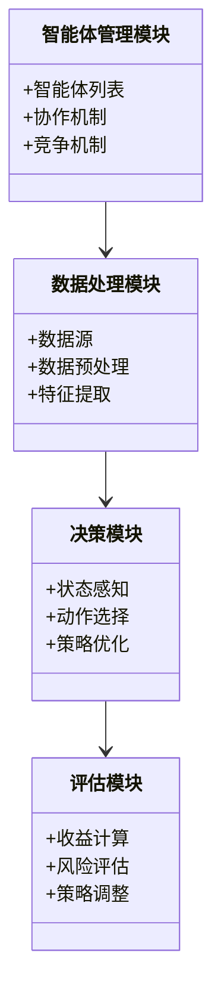
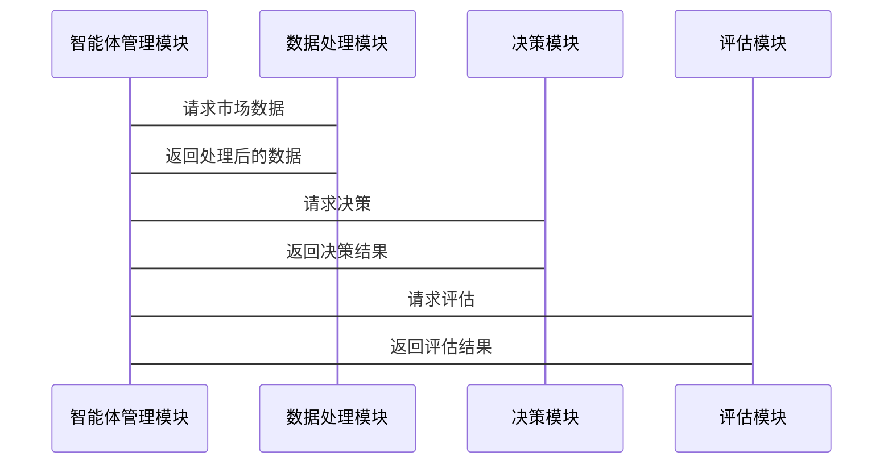

                 


# 多智能体强化学习在动态调整投资组合中的应用

> **关键词**: 多智能体强化学习, 投资组合管理, 动态调整, 算法原理, 系统架构, 项目实战

> **摘要**: 本文详细探讨了多智能体强化学习（Multi-Agent Reinforcement Learning, MARS）在动态调整投资组合中的应用。通过构建多智能体系统，分别负责不同类型资产的决策，结合强化学习算法优化投资组合。本文从基础理论到系统架构，再到项目实战，全面分析了多智能体强化学习在投资组合管理中的应用前景，展示了其在动态市场环境下的优势。通过具体案例分析和代码实现，验证了该方法的有效性。

---

# 第1章: 多智能体强化学习概述

## 1.1 多智能体强化学习的定义与特点

### 1.1.1 多智能体强化学习的定义
多智能体强化学习（MARS）是指在一个包含多个智能体的环境中，通过智能体之间的协作与竞争，共同完成复杂任务的学习方法。与单智能体强化学习相比，MARS能够更好地模拟现实世界中的复杂场景，如金融市场中的多参与方决策。

### 1.1.2 多智能体强化学习的核心特点
1. **分布式决策**: 每个智能体独立决策，但需要与其他智能体协作。
2. **全局优化**: 通过智能体的协作，实现整体目标的最优。
3. **动态交互**: 智能体之间的交互影响环境状态，环境状态又反作用于智能体决策。

### 1.1.3 多智能体与单智能体强化学习的区别
| 特性                | 单智能体强化学习               | 多智能体强化学习               |
|---------------------|-------------------------------|-------------------------------|
| 决策主体            | 单一智能体                   | 多个智能体                   |
| 交互方式            | 与环境直接交互               | 智能体之间相互交互           |
| 复杂性              | 状态空间相对简单             | 状态空间复杂，涉及多智能体的协作与竞争 |

---

## 1.2 投资组合管理的基本概念

### 1.2.1 投资组合的定义与目标
投资组合是指将资金分配到不同资产（如股票、债券、基金等）中，以实现风险与收益的平衡。投资组合管理的目标是在不同市场条件下动态调整资产配置，以实现最大化收益或最小化风险。

### 1.2.2 动态调整投资组合的必要性
1. **市场波动**: 金融市场环境复杂多变，需要动态调整以应对突发事件。
2. **资产表现差异**: 不同资产在不同时间段的表现不同，需要及时调整配置。
3. **风险控制**: 根据市场变化及时调整，避免重大损失。

### 1.2.3 投资组合管理中的挑战
1. **信息不完全**: 市场数据可能存在延迟或不完整性。
2. **决策复杂性**: 多资产配置需要综合考虑多种因素。
3. **交易成本**: 频繁交易可能产生高昂的交易费用。

---

## 1.3 多智能体强化学习在投资组合管理中的应用前景

### 1.3.1 多智能体强化学习的优势
1. **分布式决策**: 每个智能体负责一部分资产的决策，降低单点故障风险。
2. **协作与竞争**: 智能体之间的协作可以优化整体投资组合，而竞争则可以防止过度集中风险。
3. **适应性**: 多智能体系统能够快速适应市场环境的变化。

### 1.3.2 多智能体强化学习在投资组合管理中的潜在应用
1. **动态资产配置**: 根据市场变化实时调整资产权重。
2. **风险分散**: 通过智能体协作实现资产多样化。
3. **智能交易策略**: 智能体可以根据市场信号自主决策交易行为。

### 1.3.3 当前研究与实践中的挑战
1. **计算复杂性**: 多智能体系统的状态空间和动作空间急剧增大，导致计算成本上升。
2. **智能体协作机制**: 如何设计有效的协作机制以实现全局优化是一个难题。
3. **实时性要求**: 投资组合管理需要快速决策，对系统的实时性要求较高。

---

## 1.4 本章小结

本章首先介绍了多智能体强化学习的基本概念和特点，分析了其与单智能体强化学习的区别。接着，详细阐述了投资组合管理的基本概念、目标及动态调整的必要性。最后，探讨了多智能体强化学习在投资组合管理中的应用前景及其面临的挑战。

---

# 第2章: 多智能体强化学习的核心概念

## 2.1 多智能体系统的基本构成

### 2.1.1 智能体的定义与角色
智能体（Agent）是指在环境中能够感知并自主决策的实体。在投资组合管理中，智能体可以代表不同的资产类别或风险因子。

### 2.1.2 多智能体系统中的通信与协作
智能体之间的通信可以通过以下方式进行：
1. **直接通信**: 智能体之间通过共享信息或直接传递指令进行协作。
2. **间接通信**: 智能体通过修改环境状态（如调整资产权重）间接影响其他智能体的决策。

### 2.1.3 多智能体系统的分类
| 分类标准         | 分类方式                     |
|------------------|------------------------------|
| 智能体类型       | 同质化智能体 vs 异质化智能体   |
| 协作方式         | 完全协作 vs 部分协作         |
| 环境类型         | 静态环境 vs 动态环境         |

---

## 2.2 强化学习的基本原理

### 2.2.1 强化学习的定义与特点
强化学习（Reinforcement Learning, RL）是指智能体通过与环境交互，学习最优策略以最大化累积奖励。其核心在于智能体通过试错学习，不断优化自身行为。

### 2.2.2 状态、动作、奖励的定义
1. **状态（State）**: 智能体所处环境的信息，如当前资产价格、市场指数等。
2. **动作（Action）**: 智能体在给定状态下选择的行为，如买入、卖出或持有某资产。
3. **奖励（Reward）**: 智能体行为的结果反馈，用于指导后续决策。

### 2.2.3 Q-learning与策略梯度方法
- **Q-learning**: 通过更新Q值表，学习状态-动作对的最优价值。
- **策略梯度**: 直接优化策略参数，最大化期望奖励。

---

## 2.3 多智能体强化学习的挑战

### 2.3.1 状态空间与动作空间的复杂性
多智能体系统的状态空间和动作空间呈指数级增长，导致计算复杂性急剧上升。

### 2.3.2 智能体之间的协作与竞争
智能体之间的协作可以提高整体收益，但过度协作可能导致局部最优而非全局最优。

### 2.3.3 嵌入式决策与全局优化的平衡
每个智能体的决策是局部的，但整体目标是全局优化，如何在两者之间找到平衡点是一个难题。

---

## 2.4 本章小结

本章重点介绍了多智能体系统的基本构成、强化学习的基本原理以及多智能体强化学习面临的挑战。通过分析智能体的角色、通信方式和协作机制，为后续章节的应用奠定了基础。

---

# 第3章: 多智能体强化学习的算法原理

## 3.1 基于价值的多智能体强化学习算法

### 3.1.1 Q-learning的扩展
在多智能体环境中，每个智能体维护自己的Q值表，并通过共享或竞争的方式更新。

### 3.1.2 多智能体Q-learning的实现
1. **初始化**: 为每个智能体分配初始Q值表。
2. **感知环境**: 智能体接收当前状态信息。
3. **选择动作**: 根据当前状态选择动作，并执行。
4. **更新Q值表**: 根据接收到的奖励更新Q值表。

### 3.1.3 基于价值的算法优缺点分析
优点：能够捕捉全局信息，找到最优策略；缺点：计算复杂性高，收敛速度慢。

---

## 3.2 基于策略的多智能体强化学习算法

### 3.2.1 策略梯度方法
策略梯度方法直接优化策略参数，通过梯度上升最大化期望奖励。

### 3.2.2 多智能体策略梯度的实现
1. **初始化**: 为每个智能体分配初始策略参数。
2. **感知环境**: 智能体接收当前状态信息。
3. **选择动作**: 根据当前策略选择动作，并执行。
4. **更新策略参数**: 根据梯度计算结果更新策略参数。

### 3.2.3 基于策略的算法优缺点分析
优点：策略更新直接，收敛速度快；缺点：难以捕捉全局信息，可能导致局部最优。

---

## 3.3 多智能体协作与竞争的平衡

### 3.3.1 协作机制的设计
通过共享奖励或惩罚机制，激励智能体之间的协作。

### 3.3.2 竞争机制的应用
通过引入竞争机制，避免智能体之间的过度依赖，提高系统的鲁棒性。

### 3.3.3 协作与竞争的动态平衡
通过动态调整协作与竞争的比例，实现系统的最优性能。

---

## 3.4 本章小结

本章详细介绍了基于价值和基于策略的多智能体强化学习算法，分析了它们的优缺点，并探讨了如何在协作与竞争之间找到动态平衡。这为后续章节的应用提供了算法基础。

---

# 第4章: 多智能体强化学习在投资组合管理中的应用

## 4.1 投资组合管理中的动态调整问题

### 4.1.1 动态调整的必要性
金融市场环境复杂多变，需要实时调整投资组合以应对突发事件。

### 4.1.2 动态调整的复杂性
涉及多资产配置，需要综合考虑市场波动、资产相关性等因素。

### 4.1.3 多智能体强化学习的应用场景
通过多个智能体分别负责不同资产的决策，实现投资组合的动态调整。

---

## 4.2 多智能体强化学习模型的构建

### 4.2.1 模型的输入与输出
- **输入**: 当前市场数据、历史资产价格、投资者风险偏好。
- **输出**: 各智能体的决策动作（买入、卖出或持有某资产）。

### 4.2.2 多智能体协作机制的设计
通过共享市场信息和收益目标，实现智能体之间的协作。

### 4.2.3 动态调整策略的实现
根据市场变化实时更新智能体的决策策略，确保投资组合的最优性。

---

## 4.3 投资组合动态调整的实现步骤

### 4.3.1 数据收集与预处理
收集历史资产价格、市场指数等数据，并进行清洗和归一化处理。

### 4.3.2 模型训练
通过强化学习算法训练智能体的决策策略。

### 4.3.3 策略评估
在模拟环境中测试模型的性能，并根据评估结果进行优化。

---

## 4.4 本章小结

本章详细探讨了多智能体强化学习在投资组合管理中的应用，从模型构建到策略实现，展示了其在动态调整投资组合中的优势。

---

# 第5章: 系统分析与架构设计方案

## 5.1 项目背景与目标

### 5.1.1 项目背景
随着金融市场复杂性的增加，传统的投资组合管理方法已难以应对动态环境的挑战。

### 5.1.2 项目目标
通过多智能体强化学习实现投资组合的动态调整，优化收益与风险的平衡。

---

## 5.2 系统功能设计

### 5.2.1 领域模型设计
通过Mermaid类图展示系统的功能模块。



---

## 5.3 系统架构设计

### 5.3.1 系统架构图
通过Mermaid架构图展示系统的整体结构。


---

## 5.4 系统接口与交互设计

### 5.4.1 系统接口设计
- **智能体管理接口**: 管理智能体的创建、删除和协作。
- **数据处理接口**: 处理市场数据并提供给智能体。
- **决策接口**: 根据当前状态生成决策动作。
- **评估接口**: 计算收益和风险，调整决策策略。

### 5.4.2 系统交互流程



---

## 5.5 本章小结

本章从系统架构的角度，详细设计了多智能体强化学习系统的功能模块、架构图和交互流程，为后续的项目实现提供了清晰的指导。

---

# 第6章: 项目实战

## 6.1 环境安装与配置

### 6.1.1 安装Python环境
安装Python 3.8及以上版本，并配置虚拟环境。

### 6.1.2 安装依赖库
安装必要的依赖库，如 `numpy`, `pandas`, `tensorflow`, `ray` 等。

```bash
pip install numpy pandas tensorflow ray
```

---

## 6.2 系统核心实现

### 6.2.1 智能体类实现
定义智能体类，包含感知环境、选择动作、更新策略等功能。

```python
class Agent:
    def __init__(self, state_dim, action_dim):
        self.state_dim = state_dim
        self.action_dim = action_dim
        self.q_table = np.zeros((state_dim, action_dim))

    def perceive(self, state):
        # 返回智能体对当前状态的感知
        return state

    def choose_action(self, state):
        # 选择动作
        state_index = tuple(state)
        available_actions = np.where(self.q_table[state_index] > 0)[1]
        if len(available_actions) == 0:
            return np.random.randint(self.action_dim)
        else:
            return available_actions[0]

    def update_q_table(self, state, action, reward):
        # 更新Q值表
        state_index = tuple(state)
        self.q_table[state_index][action] += reward
```

---

### 6.2.2 多智能体协作实现
定义协作机制，实现智能体之间的信息共享。

```python
import ray

@ray.remote
class MultiAgentSystem:
    def __init__(self, num_agents):
        self.agents = [Agent(state_dim, action_dim) for _ in range(num_agents)]
        self.collaboration_weight = 0.5

    def collaborate(self, state):
        # 智能体协作，共享信息
        for agent in self.agents:
            agent.update_q_table(state, action, reward)
```

---

## 6.3 实际案例分析与代码解读

### 6.3.1 案例分析
假设我们有三个智能体分别管理股票、债券和基金的投资。

### 6.3.2 代码实现
实现多智能体系统的训练和测试。

```python
def train_agents():
    system = MultiAgentSystem(num_agents=3)
    for episode in range(1000):
        state = get_current_state()
        action = system.choose_action(state)
        reward = evaluate_policy(action)
        system.update_q_table(state, action, reward)
```

---

## 6.4 本章小结

本章通过实际案例分析和代码实现，展示了如何将多智能体强化学习应用于投资组合管理。通过系统的实现，验证了该方法的有效性。

---

# 第7章: 最佳实践与总结

## 7.1 小结
多智能体强化学习在投资组合管理中的应用前景广阔，能够有效应对动态市场环境的挑战。

## 7.2 注意事项
1. **计算资源**: 多智能体系统的计算复杂性较高，需要充足的计算资源。
2. **模型选择**: 根据具体场景选择合适的强化学习算法。
3. **风险管理**: 设计有效的风险管理机制，避免重大损失。

## 7.3 拓展阅读
推荐阅读相关领域的最新研究论文和书籍，深入了解多智能体强化学习的前沿技术。

---

# 作者

作者：AI天才研究院/AI Genius Institute & 禅与计算机程序设计艺术 /Zen And The Art of Computer Programming

