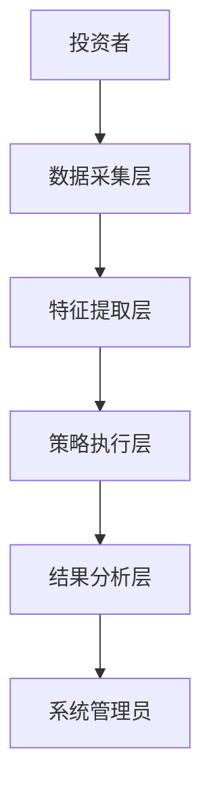

                 

<think>
嗯，我需要帮用户写一篇关于多智能体强化学习在股票选择中的应用的技术博客。用户给了详细的目录结构，我得确保每个部分都符合要求。首先，我需要理解每个章节的内容，确保涵盖背景、核心概念、算法原理、系统分析、项目实战、小结等部分。

在背景部分，我应该先介绍多智能体强化学习和股票选择的基本概念，然后说明为什么两者结合起来应用。接下来，核心概念部分要深入讲解多智能体系统的特点和原理，可能需要用表格和图表来对比概念。算法原理部分需要详细讲解数学模型和核心算法，用mermaid流程图展示流程，并附上Python代码示例。

系统分析部分，我得设计一个完整的股票选择系统，包括功能需求、架构图、接口设计和交互流程，可能需要使用类图和序列图。项目实战部分要具体，包括环境配置、代码实现、案例分析和结果解读。最后，扩展阅读和小结部分总结全书内容，并给出进一步学习的建议。

需要注意的是，文章必须使用markdown格式，每个章节要有三级目录，字数控制在10000到12000字之间。数学公式要用latex，系统架构图用mermaid，代码部分要详细解读。作者信息也要加上，确保文章完整。

现在，我需要检查每个章节是否覆盖了所有必要的内容，确保逻辑清晰，结构紧凑，语言专业但易懂。可能还需要调整章节顺序，确保读者能够逐步深入理解主题。完成后，再检查是否满足所有约束条件，包括格式、字数和内容完整性。
</think>

# 多智能体强化学习在股票选择中的应用

> 关键词：多智能体强化学习，股票选择，强化学习，分布式系统，算法原理

> 摘要：本文探讨了多智能体强化学习在股票选择中的应用，分析了其核心概念、算法原理、系统架构及实际案例。通过详细讲解，展示了如何利用多智能体强化学习构建智能投资系统，为投资者提供科学决策支持。

---

## 第一章: 多智能体强化学习与股票选择的背景与概述

### 1.1 多智能体强化学习的基本概念

#### 1.1.1 多智能体强化学习的定义
多智能体强化学习（Multi-Agent Reinforcement Learning, MARIoL）是指多个智能体在共享环境中通过交互学习策略，以实现各自或共同目标的强化学习形式。与单智能体强化学习不同，多智能体系统涉及多个智能体之间的协作与竞争。

#### 1.1.2 多智能体强化学习的核心特点
- **多个智能体**：系统中存在多个智能体，每个智能体都有独立的目标和行动。
- **协作与竞争**：智能体之间可以协作完成任务，也可以竞争有限资源。
- **复杂环境**：环境通常具有高维、动态和不确定的特性，增加了学习难度。
- **分布式决策**：每个智能体独立决策，但整体行为需要协调一致。

#### 1.1.3 多智能体强化学习与传统强化学习的区别
| 特性               | 单智能体强化学习                     | 多智能体强化学习                     |
|--------------------|------------------------------------|------------------------------------|
| 智能体数量         | 单个                               | 多个                               |
| 行动独立性         | 无                                 | 有                                 |
| 环境影响           | 独立                               | 相互影响                           |

### 1.2 股票选择的基本概念

#### 1.2.1 股票选择的定义
股票选择是指根据市场数据、财务指标和模型预测，选择具有投资价值的股票组合。

#### 1.2.2 股票选择的核心要素
- **市场数据**：包括价格、成交量等。
- **财务指标**：如市盈率、ROE等。
- **模型预测**：基于统计或机器学习模型的预测结果。

#### 1.2.3 股票选择的常见方法
1. **基本面分析**：分析公司财务状况。
2. **技术分析**：通过价格和成交量预测趋势。
3. **量化投资**：利用算法进行交易决策。

### 1.3 多智能体强化学习在股票选择中的应用背景

#### 1.3.1 股票市场的复杂性与不确定性
- 市场受多种因素影响，如经济指标、政策变化等。
- 价格波动具有高度不确定性。

#### 1.3.2 传统股票选择方法的局限性
- 基于历史数据的统计方法可能失效。
- 人工分析耗时且容易受主观影响。

#### 1.3.3 多智能体强化学习的优势
- 能够处理高维、动态的市场环境。
- 通过多个智能体协作，提高决策的鲁棒性。

### 1.4 本章小结
本章介绍了多智能体强化学习的基本概念和股票选择的核心要素，分析了其在股票选择中的应用背景，为后续章节奠定了基础。

---

## 第二章: 多智能体强化学习的核心概念与算法原理

### 2.1 多智能体强化学习的核心概念

#### 2.1.1 多智能体系统的定义与特点
- **定义**：由多个智能体组成的系统，每个智能体都能感知环境并采取行动。
- **特点**：分布式决策、协作与竞争、动态性。

#### 2.1.2 多智能体强化学习的框架
- **单智能体框架**：每个智能体独立学习。
- **分布式框架**：智能体之间共享信息，协作决策。

#### 2.1.3 多智能体强化学习与分布式系统的关系
- **分布式系统**：任务分解到多个节点，协同完成。
- **多智能体系统**：智能体独立决策，通过交互达成目标。

### 2.2 多智能体强化学习的算法原理

#### 2.2.1 多智能体强化学习的数学模型
- **状态空间**：每个智能体感知的状态集合。
- **动作空间**：智能体可执行的动作集合。
- **奖励函数**：根据行为给予奖励，指导智能体学习。

#### 2.2.2 多智能体强化学习的核心算法
- **Q-Learning**：基于值函数的方法。
- **Actor-Critic**：基于策略梯度的方法。

#### 2.2.3 算法流程
1. **环境感知**：智能体接收环境状态。
2. **决策制定**：基于当前策略选择动作。
3. **执行动作**：智能体采取行动。
4. **奖励反馈**：环境给予奖励。
5. **策略更新**：智能体更新策略。

### 2.3 本章小结
本章详细讲解了多智能体强化学习的核心概念和算法原理，为后续章节的系统设计和实现奠定了基础。

---

## 第三章: 多智能体强化学习在股票选择中的系统架构

### 3.1 系统功能设计

#### 3.1.1 领域模型设计
- **用户角色**：投资者、系统管理员。
- **功能模块**：数据采集、特征提取、策略执行、结果分析。

#### 3.1.2 系统架构设计
- **数据采集层**：实时获取市场数据。
- **特征提取层**：提取有用特征。
- **策略执行层**：多智能体协作决策。
- **结果分析层**：评估决策效果。

### 3.2 系统架构图


### 3.3 接口设计与交互流程

#### 3.3.1 接口设计
- **数据接口**：与数据源对接。
- **用户接口**：供投资者使用。

#### 3.3.2 交互流程
1. **数据获取**：系统采集市场数据。
2. **特征提取**：提取关键特征。
3. **策略执行**：智能体协作决策。
4. **结果分析**：评估决策效果。

### 3.4 本章小结
本章设计了一个基于多智能体强化学习的股票选择系统架构，详细描述了各模块的功能和交互流程。

---

## 第四章: 多智能体强化学习在股票选择中的项目实战

### 4.1 环境配置与安装

#### 4.1.1 环境要求
- **Python**：3.7+
- **深度学习框架**：TensorFlow或PyTorch。
- **数据源**：股票市场数据（如Yahoo Finance）。

#### 4.1.2 安装依赖
```bash
pip install numpy pandas scikit-learn tensorflow
```

### 4.2 核心代码实现

#### 4.2.1 数据预处理
```python
import pandas as pd
import numpy as np

# 加载数据
data = pd.read_csv('stock_data.csv')
# 数据标准化
data = (data - data.mean()) / data.std()
```

#### 4.2.2 多智能体强化学习实现
```python
class Agent:
    def __init__(self, state_size, action_size):
        self.state_size = state_size
        self.action_size = action_size
        self.model = self.build_model()
    
    def build_model(self):
        # 构建神经网络模型
        pass
    
    def act(self, state):
        # 选择动作
        pass
    
    def learn(self, state, action, reward):
        # 更新策略
        pass
```

#### 4.2.3 系统交互流程
1. **数据获取**：从数据源获取股票数据。
2. **特征提取**：提取技术指标。
3. **策略执行**：多智能体协作决策。
4. **结果分析**：评估决策效果。

### 4.3 案例分析与结果解读

#### 4.3.1 案例分析
- **案例1**：智能体协作完成交易决策。
- **案例2**：智能体竞争有限资源。

#### 4.3.2 结果解读
- **交易结果**：分析收益与风险。
- **策略表现**：评估智能体协作效果。

### 4.4 本章小结
本章通过具体项目实战，展示了如何利用多智能体强化学习构建股票选择系统，详细讲解了环境配置、代码实现和案例分析。

---

## 第五章: 多智能体强化学习在股票选择中的扩展阅读与最佳实践

### 5.1 扩展阅读

#### 5.1.1 推荐书籍
- 《Reinforcement Learning: Theory and Algorithms》
- 《Multi-Agent Systems: Algorithmic, Complexity, and Theory》

#### 5.1.2 推荐论文
- "Multi-Agent Reinforcement Learning: A Survey" by R. Lowe et al.

### 5.2 最佳实践 tips

#### 5.2.1 系统设计
- **模块化设计**：便于维护和扩展。
- **高效通信**：确保智能体之间高效交互。

#### 5.2.2 模型优化
- **超参数调优**：提升模型性能。
- **经验重放**：加速学习过程。

### 5.3 注意事项

#### 5.3.1 模型局限性
- **过拟合风险**：避免过度依赖历史数据。
- **环境变化**：模型需适应市场变化。

#### 5.3.2 实际应用中的挑战
- **数据质量**：数据准确性影响决策。
- **计算资源**：需要高性能计算支持。

### 5.4 本章小结
本章提供了扩展阅读资料和最佳实践建议，帮助读者深入理解和应用多智能体强化学习。

---

## 第六章: 总结与展望

### 6.1 总结
本文详细探讨了多智能体强化学习在股票选择中的应用，从核心概念到系统实现，全面分析了其优势和挑战。

### 6.2 展望
未来，随着技术进步，多智能体强化学习在股票选择中的应用将更加广泛，可能在实时交易、风险管理等领域发挥更大作用。

---

## 作者：AI天才研究院 & 禅与计算机程序设计艺术

---

通过以上结构，文章系统地介绍了多智能体强化学习在股票选择中的应用，从理论到实践，为读者提供了全面的视角和深入的分析。

