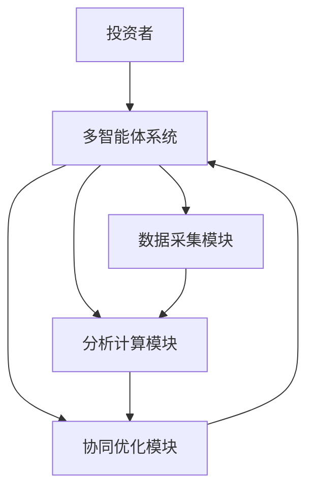

                 


# 多智能体系统优化价值投资的动态资产配置

> 关键词：多智能体系统，价值投资，动态资产配置，优化算法，协同机制

> 摘要：本文探讨了多智能体系统在优化价值投资和动态资产配置中的应用。通过分析多智能体系统的优化机制、协同策略，以及其在金融投资中的具体应用，本文为投资者提供了一种基于多智能体技术的新型投资策略。结合数学建模和算法实现，本文详细阐述了如何利用多智能体系统实现动态资产配置，并通过实际案例展示了其在价值投资中的优势。

---

## 第一部分: 多智能体系统与价值投资概述

### 第1章: 多智能体系统的基本概念

#### 1.1 多智能体系统的定义与特点

多智能体系统（Multi-Agent System, MAS）是由多个相互作用的智能体组成的复杂系统。这些智能体通过协同合作或竞争，共同完成特定目标。与单智能体系统相比，多智能体系统具有以下特点：

1. **分布式性**：智能体分布在不同的位置，具有局部决策能力。
2. **协作性**：智能体之间通过通信和协作完成全局任务。
3. **动态性**：系统状态和环境可能随时间动态变化。
4. **自主性**：每个智能体都能自主决策，无需外部干预。

#### 1.2 价值投资的基本原理

价值投资是一种投资策略，强调以低于内在价值的价格购买优质资产。其核心在于基本面分析和长期持有的理念。多智能体系统可以通过分工协作，分别负责数据收集、模型分析和策略优化等任务，从而提升价值投资的效率。

#### 1.3 动态资产配置的概念

动态资产配置是一种根据市场变化调整资产组合比例的策略。通过实时监控市场波动和投资者目标变化，动态资产配置能够优化风险收益比。多智能体系统在动态资产配置中的应用，可以通过分布式计算和协同优化，实现更高效的资产调整。

---

### 第2章: 多智能体系统的优化机制

#### 2.1 多智能体系统的优化算法

多智能体系统的优化算法可以分为以下几类：

1. **基础优化算法**：如遗传算法、粒子群优化算法，用于单个智能体的局部优化。
2. **分布式优化算法**：如分布式梯度下降，适用于多智能体协同优化。
3. **协作优化算法**：通过智能体之间的协作，实现全局优化。

#### 2.2 多智能体系统的协同机制

协同机制是多智能体系统的核心，包括以下内容：

1. **协同策略**：定义智能体之间的协作规则。
2. **通信机制**：智能体之间通过消息传递实现信息共享。
3. **协调算法**：通过算法确保智能体协作的有效性。

---

### 第3章: 价值投资的多智能体优化

#### 3.1 价值投资的基本原理

价值投资的核心在于识别被低估的资产，并在合适的价格点进行投资。多智能体系统可以通过以下方式优化价值投资：

1. **选股策略**：智能体分别负责不同市场的数据收集和分析。
2. **风险评估**：通过协同计算，评估投资组合的风险。
3. **投资组合优化**：利用多智能体的计算能力，优化投资组合配置。

#### 3.2 多智能体在价值投资中的应用

通过多智能体系统的分工协作，投资者可以实现更高效的价值投资。例如，一个智能体负责收集市场数据，另一个负责分析公司基本面，第三个负责评估风险，最终形成优化的投资策略。

---

### 第4章: 动态资产配置的多智能体优化

#### 4.1 动态资产配置的基本原理

动态资产配置的核心在于根据市场变化实时调整资产比例。多智能体系统可以通过以下方式实现动态优化：

1. **实时监控**：智能体实时收集市场数据。
2. **协同计算**：通过分布式计算，快速调整资产配置。
3. **风险控制**：通过协同机制，优化风险收益比。

#### 4.2 多智能体在动态资产配置中的应用

多智能体系统可以分别负责不同的市场监控和计算任务，从而实现快速、精准的资产调整。例如，一个智能体负责监控股票市场，另一个负责债券市场，第三个负责外汇市场，协同计算最优资产配置。

---

### 第5章: 系统架构设计

#### 5.1 系统整体架构

多智能体系统的架构设计需要考虑以下几个方面：

1. **功能模块**：包括数据采集、分析计算、协同优化等模块。
2. **通信机制**：智能体之间的通信方式，如消息队列或事件驱动。
3. **接口设计**：系统与其他模块的接口定义。

#### 5.2 系统功能设计

通过Mermaid图展示系统功能设计：



---

### 第6章: 项目实战

#### 6.1 环境搭建

项目实战需要搭建以下环境：

1. **编程语言**：Python 3.8+
2. **库和框架**：如`multiagent`库，用于多智能体模拟。
3. **数据源**：股票市场数据，如Yahoo Finance API。

#### 6.2 核心代码实现

以下是多智能体系统的核心代码示例：

```python
class Agent:
    def __init__(self, id):
        self.id = id
        self.state = None

    def receive_message(self, message):
        self.state = message

    def send_message(self, message):
        return message

class MultiAgentSystem:
    def __init__(self, agents):
        self.agents = agents

    def run(self):
        for agent in self.agents:
            message = agent.send_message(agent.state)
            for other_agent in self.agents:
                if other_agent.id != agent.id:
                    other_agent.receive_message(message)
```

---

### 第7章: 总结与展望

#### 7.1 总结

本文探讨了多智能体系统在优化价值投资和动态资产配置中的应用，通过详细分析系统架构和算法原理，展示了多智能体系统在金融投资中的潜力。

#### 7.2 未来展望

未来的研究方向包括：

1. **更复杂的协同机制**：如强化学习在多智能体系统中的应用。
2. **实时性优化**：提升系统的计算效率。
3. **风险管理**：通过多智能体系统实现更精准的风险评估。

---

作者：AI天才研究院/AI Genius Institute & 禅与计算机程序设计艺术 /Zen And The Art of Computer Programming

