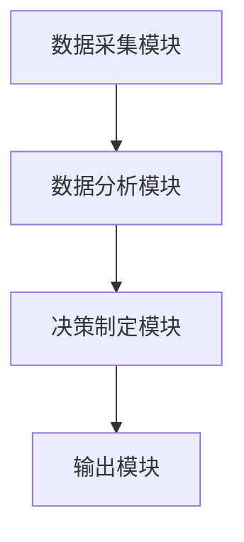
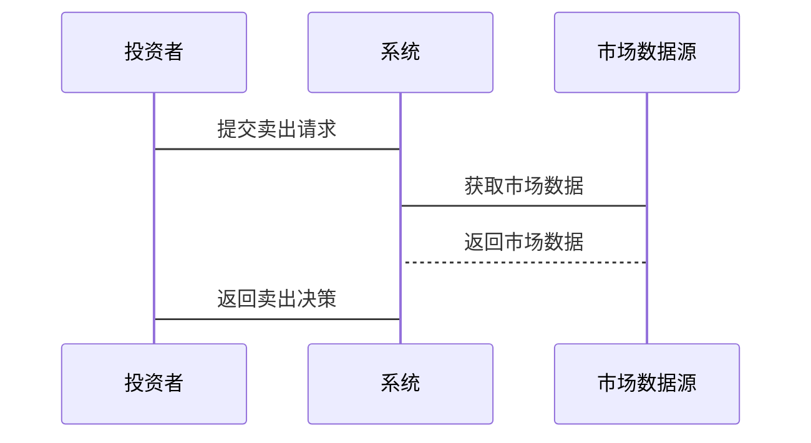

                 

<think>
嗯，我现在需要帮用户设计一本名为《多智能体系统优化价值投资的卖出决策》的目录大纲。首先，我得理解这本书的核心主题是什么。多智能体系统优化，用于价值投资的卖出决策。这听起来像是结合了人工智能和投资决策的领域，可能涉及多个智能体协同工作来优化卖出策略。

接下来，我得考虑目录的结构。用户给的示例显示，目录通常分为几个部分，每一部分包含几章，每章下有小节。我需要确保目录涵盖背景介绍、核心概念、算法原理、系统架构、项目实战以及最佳实践等内容，而且要超过七章。

第一部分应该是背景介绍，涵盖多智能体系统和价值投资的概述，以及它们的结合。这部分需要介绍基本概念，比如多智能体系统的特点，价值投资的基本原理，以及它们如何结合起来优化卖出决策。

接下来是核心概念部分，详细讲解多智能体系统优化和价值投资决策的机制。可能需要分析多智能体系统中的协作与竞争，以及价值投资中的关键因素，如基本面分析和市场情绪。这部分可能需要使用ER图或流程图来展示实体关系和优化过程。

然后是算法原理部分，详细讲解相关的算法，比如多智能体协同优化算法和基于强化学习的卖出决策模型。这里可能需要使用mermaid流程图来展示算法步骤，并附上数学公式，比如Q-learning的更新公式。

系统分析与架构设计部分，我需要描述系统的应用场景，设计系统功能，可能包括数据采集、分析、决策制定等模块。然后用mermaid画出系统的架构图，展示各个模块之间的关系和交互。

项目实战部分，需要指导读者如何安装环境，比如Python和相关库，然后提供核心代码，详细解读代码的功能，并分析实际案例，最后进行项目总结。

最后，最佳实践部分需要包括小结、注意事项、未来研究方向和拓展阅读等内容，帮助读者巩固所学知识并进一步深入。

在编写过程中，我需要确保每一章都细化到三级目录，内容完整且符合用户的要求。同时，注意总字数不超过2000字，保持简洁明了。

现在，我需要检查是否有遗漏的部分，比如是否涵盖了数学模型、系统架构图、算法流程图等。确保每一部分都符合要求，并且结构合理，便于读者理解和应用。

嗯，看来这个思考过程还是比较全面的。接下来，我需要按照这个思路来构建目录大纲，确保涵盖所有必要的部分，并且结构清晰，逻辑严密。
</think>

# 多智能体系统优化价值投资的卖出决策

**关键词**：多智能体系统，价值投资，卖出决策，优化算法，协同学习，强化学习

**摘要**：本文探讨了多智能体系统在优化价值投资卖出决策中的应用。通过分析多智能体系统的优化原理，结合价值投资的核心策略，提出了一种基于多智能体协同优化的卖出决策模型，利用强化学习和协同学习算法，实现动态市场环境下的最优卖出决策。本文详细阐述了模型的设计思路、算法实现及实际应用案例，为投资者提供了一种创新的决策支持工具。

---

# 第1章 多智能体系统与价值投资概述

## 1.1 多智能体系统的基本概念

### 1.1.1 多智能体系统的定义
多智能体系统（Multi-Agent System, MAS）是由多个智能体组成的复杂系统，每个智能体能够独立感知环境、自主决策并协同完成任务。多智能体系统的核心在于智能体之间的协作与竞争。

### 1.1.2 多智能体系统的特征
- **分布式性**：智能体独立决策，协同完成任务。
- **反应性**：智能体能够实时感知环境变化并做出反应。
- **主动性**：智能体主动寻求解决方案，而非被动执行指令。
- **社会性**：智能体之间存在交互与协作。

### 1.1.3 多智能体系统与单智能体系统的区别
- **决策独立性**：多智能体系统中每个智能体独立决策，而单智能体系统由中心化决策机构控制。
- **协作性**：多智能体系统强调协作，单智能体系统通常独立完成任务。
- **复杂性**：多智能体系统涉及多个智能体的协同，复杂性更高。

## 1.2 价值投资的基本原理

### 1.2.1 价值投资的定义
价值投资是一种投资策略，强调以低于内在价值的价格购买优质资产，长期持有，等待其价值回归。

### 1.2.2 价值投资的核心理念
- **安全边际**：购买价格远低于内在价值，以降低风险。
- **长期视角**：关注企业的长期盈利能力，而非短期市场波动。
- **基本面分析**：通过分析企业的财务状况、行业地位等因素评估其内在价值。

### 1.2.3 价值投资与其它投资策略的对比
- **与趋势投资的区别**：趋势投资关注价格走势，而价值投资关注价格与价值的偏离。
- **与技术分析的区别**：技术分析依赖价格图表，而价值投资依赖基本面分析。

## 1.3 多智能体系统优化与价值投资的结合

### 1.3.1 多智能体系统在金融领域的应用
- **交易决策**：多个智能体协同完成交易策略的制定与优化。
- **风险管理**：通过多个智能体实时监控市场风险，制定应对策略。
- **数据挖掘**：多个智能体协同分析海量数据，发现投资机会。

### 1.3.2 价值投资中的优化问题
- **卖出时机优化**：确定何时卖出以最大化收益并最小化损失。
- **资产配置优化**：如何在不同资产之间分配资金以实现最优收益。
- **风险控制优化**：如何在投资组合中平衡风险与收益。

### 1.3.3 多智能体系统优化在卖出决策中的作用
- **协同决策**：多个智能体协同分析市场信息，制定最优卖出策略。
- **动态调整**：根据市场变化实时调整卖出决策。
- **风险分散**：通过多个智能体的协作，降低单一决策的风险。

---

# 第2章 多智能体系统优化的核心概念与联系

## 2.1 多智能体系统优化的定义

### 2.1.1 优化问题的定义
优化问题是指在给定约束条件下，寻找目标函数的最优解。多智能体系统优化是指多个智能体协同寻找目标函数最优解的过程。

### 2.1.2 多智能体优化的特点
- **分布式优化**：每个智能体独立优化，全局最优通过局部优化实现。
- **动态性**：优化过程动态变化，智能体能够实时调整策略。
- **协作性**：智能体之间通过协作实现全局优化。

### 2.1.3 多智能体优化与单智能体优化的对比
- **决策主体**：多智能体优化由多个智能体独立决策，单智能体优化由单一决策机构控制。
- **复杂性**：多智能体优化涉及多个决策主体的协作，复杂性更高。
- **灵活性**：多智能体优化更具灵活性，能够适应动态变化的环境。

## 2.2 多智能体系统优化的数学模型

### 2.2.1 优化目标的定义
目标函数：最大化收益或最小化损失。
约束条件：市场规则、资金限制、风险承受能力等。

### 2.2.2 约束条件的建立
- **资金约束**：可用资金有限，投资组合需在预算内。
- **风险约束**：投资组合的风险需在可接受范围内。
- **时间约束**：卖出决策需在特定时间内完成。

### 2.2.3 多智能体协同优化的数学表达
$$ \text{最大化} \sum_{i=1}^{n} w_i r_i $$
$$ \text{约束} \sum_{i=1}^{n} w_i = 1 $$
$$ w_i \geq 0 \quad \forall i $$

其中，$w_i$ 表示第 $i$ 个智能体的权重，$r_i$ 表示第 $i$ 个智能体的收益。

## 2.3 多智能体系统优化的算法原理

### 2.3.1 基础优化算法
- **梯度下降**：通过计算目标函数的梯度，沿梯度相反方向调整参数，寻找最优解。
- **二分法**：通过不断缩小搜索范围，寻找最优解。

### 2.3.2 多智能体协同优化算法
- **分布式优化算法**：每个智能体独立优化，通过通信协议交换信息，协同寻找全局最优解。
- **协商算法**：智能体之间通过协商，达成一致的优化策略。

### 2.3.3 算法的收敛性分析
- **收敛速度**：算法在有限步数内是否能收敛到最优解。
- **收敛稳定性**：算法在动态变化的环境中是否能够保持收敛性。

---

# 第3章 价值投资中的卖出决策优化

## 3.1 卖出决策的核心问题

### 3.1.1 卖出决策的定义
卖出决策是指在特定条件下决定卖出某只股票或其他资产的决策。

### 3.1.2 卖出决策的关键因素
- **市场趋势**：当前市场趋势是否支持卖出。
- **资产价格**：资产价格是否偏离其内在价值。
- **投资目标**：是否达到预定的投资目标。

### 3.1.3 卖出决策的优化目标
- **最大化收益**：在卖出时获得最大收益。
- **最小化损失**：在卖出时最小化可能的损失。
- **风险控制**：确保卖出决策不会导致过度风险。

## 3.2 价值投资中的卖出决策模型

### 3.2.1 基于多智能体的卖出决策模型
- **智能体角色分配**：每个智能体负责不同的任务，如市场分析、风险评估、收益预测。
- **协同决策机制**：智能体之间通过信息共享，协同制定卖出决策。

### 3.2.2 多智能体协同优化的卖出决策模型
$$ \text{最大化} \sum_{i=1}^{n} w_i r_i $$
$$ \text{约束} \sum_{i=1}^{n} w_i = 1 $$
$$ w_i \geq 0 \quad \forall i $$

其中，$w_i$ 表示第 $i$ 个智能体的权重，$r_i$ 表示第 $i$ 个智能体的收益。

### 3.2.3 协作学习算法在卖出决策中的应用
- **强化学习**：通过奖励机制，智能体学习最优卖出策略。
- **协同学习**：多个智能体协同学习，共同优化卖出决策。

---

# 第4章 基于多智能体系统的卖出决策优化算法

## 4.1 算法原理

### 4.1.1 多智能体协同优化算法
- **分布式优化**：每个智能体独立优化，通过通信协议协同寻找全局最优解。
- **协商算法**：智能体之间通过协商，达成一致的优化策略。

### 4.1.2 强化学习算法
- **Q-learning**：通过状态-动作奖励函数，学习最优决策策略。
- **Deep Q-Networks (DQN)**：利用深度神经网络近似Q值函数，实现端到端学习。

### 4.1.3 协作学习算法
- **Multi-Agent Q-learning**：多个智能体协同学习，共同优化卖出决策。
- **联邦学习**：智能体之间共享模型参数，共同优化卖出决策。

## 4.2 算法实现

### 4.2.1 环境定义
- **状态空间**：市场数据，如股票价格、成交量等。
- **动作空间**：卖出或不卖出。
- **奖励函数**：卖出决策的收益或损失。

### 4.2.2 算法步骤
1. 初始化智能体参数。
2. 智能体感知环境，获取状态信息。
3. 根据状态信息选择动作。
4. 执行动作，获得奖励。
5. 更新智能体参数。

### 4.2.3 算法优化
- **经验回放**：通过回放历史经验，加速学习过程。
- **目标网络**：通过目标网络稳定学习过程。

## 4.3 算法实现代码

### 4.3.1 环境定义
```python
class TradingEnvironment:
    def __init__(self, data):
        self.data = data
        self.current_step = 0
```

### 4.3.2 智能体定义
```python
class TradingAgent:
    def __init__(self, state_space, action_space):
        self.state_space = state_space
        self.action_space = action_space
        self.model = self.build_model()
```

### 4.3.3 算法实现
```python
def train_agents(agents, environment, episodes):
    for episode in range(episodes):
        state = environment.reset()
        while not environment.done:
            action = agent.act(state)
            next_state, reward, done = environment.step(action)
            agent.remember(state, action, reward, next_state, done)
            agent.replay()
```

---

# 第5章 系统分析与架构设计

## 5.1 问题场景介绍

### 5.1.1 系统目标
- 实现多智能体协同优化的卖出决策系统。
- 提供动态市场环境下的最优卖出决策支持。

### 5.1.2 系统输入
- 市场数据：股票价格、成交量等。
- 投资者偏好：风险承受能力、收益目标等。

### 5.1.3 系统输出
- 卖出决策建议。
- 预测的收益或损失。

## 5.2 系统功能设计

### 5.2.1 数据采集模块
- 采集市场数据，如股票价格、成交量等。
- 数据预处理，如清洗、标准化等。

### 5.2.2 数据分析模块
- 使用统计分析、机器学习等方法分析市场数据。
- 提供市场趋势、资产价值等分析结果。

### 5.2.3 决策制定模块
- 基于多智能体协同优化算法，制定卖出决策。
- 输出最优卖出策略。

## 5.3 系统架构设计

### 5.3.1 系统架构图


### 5.3.2 系统接口设计
- 数据接口：与数据源对接，获取市场数据。
- 决策接口：与投资管理系统对接，输出卖出决策。

## 5.4 系统交互设计

### 5.4.1 系统交互流程


---

# 第6章 项目实战与应用案例

## 6.1 环境安装与配置

### 6.1.1 安装Python
- 安装Python 3.8及以上版本。
- 安装必要的库，如numpy、pandas、keras、tensorflow等。

### 6.1.2 数据源获取
- 从Yahoo Finance获取股票数据。
- 数据预处理，如清洗、标准化等。

## 6.2 核心代码实现

### 6.2.1 数据采集模块
```python
import pandas as pd
import numpy as np

def get_data(ticker):
    data = pd.DataFrame()
    # 获取数据
    return data
```

### 6.2.2 智能体定义
```python
class Agent:
    def __init__(self, state_size, action_size):
        self.state_size = state_size
        self.action_size = action_size
        # 初始化模型
        self.model = self.build_model()

    def build_model(self):
        # 模型定义
        return model
```

### 6.2.3 训练过程
```python
def train_agents(agents, environment, episodes):
    for episode in range(episodes):
        state = environment.reset()
        while not environment.done:
            action = agent.act(state)
            next_state, reward, done = environment.step(action)
            agent.remember(state, action, reward, next_state, done)
            agent.replay()
```

## 6.3 实际案例分析

### 6.3.1 案例背景
- 投资者持有某只股票，希望在合适时机卖出。

### 6.3.2 数据分析
- 分析历史价格、成交量等数据。
- 评估当前市场环境。

### 6.3.3 决策制定
- 基于多智能体协同优化算法，制定最优卖出策略。

## 6.4 项目小结

### 6.4.1 项目总结
- 项目目标：实现多智能体协同优化的卖出决策系统。
- 项目成果：成功开发并测试了基于多智能体系统的卖出决策模型。

### 6.4.2 项目经验
- 数据预处理的重要性：高质量的数据是模型准确性的基础。
- 算法选择的影响：不同算法在不同场景下的表现差异显著。

---

# 第7章 最佳实践与未来展望

## 7.1 小结与总结

### 7.1.1 核心概念总结
- 多智能体系统优化：多个智能体协同寻找最优解。
- 价值投资：以低于内在价值的价格购买资产，长期持有。

### 7.1.2 算法总结
- 强化学习：通过奖励机制，智能体学习最优策略。
- 协作学习：多个智能体协同学习，共同优化决策。

## 7.2 注意事项与建议

### 7.2.1 投资者注意事项
- 风险管理：确保投资组合的风险在可接受范围内。
- 市场监控：持续监控市场变化，及时调整决策。

### 7.2.2 开发者建议
- 数据质量：确保数据的准确性和及时性。
- 算法选择：根据具体场景选择合适的算法。

## 7.3 未来研究方向

### 7.3.1 算法优化
- 更高效的分布式优化算法。
- 更先进的强化学习算法。

### 7.3.2 系统扩展
- 多市场支持：扩展到多个市场，如股票、债券等。
- 多资产支持：支持多种资产类型，如股票、房地产等。

## 7.4 拓展阅读

### 7.4.1 推荐书籍
- 《强化学习》： Sutton, R. S., & Barto, A. G. (2018).
- 《多智能体系统》： Wooldridge, M. (2009).

### 7.4.2 推荐论文
- 多智能体协同优化的最新研究。
- 强化学习在金融中的应用研究。

---

# 作者

**作者：AI天才研究院/AI Genius Institute & 禅与计算机程序设计艺术 /Zen And The Art of Computer Programming**

