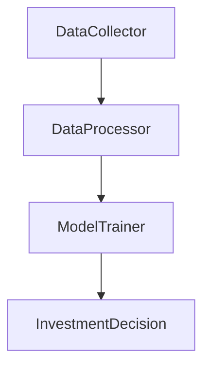
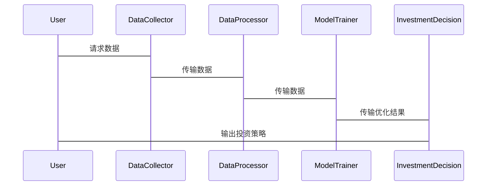

                 

# 多智能体系统优化价值投资的资产配置

## 关键词：多智能体系统, 价值投资, 资产配置, 强化学习, 分布式优化, 投资组合优化

## 摘要：  
多智能体系统（Multi-Agent Systems）是一种由多个智能体协同工作的系统，能够通过分布式计算和协同优化解决复杂问题。本文探讨了多智能体系统在价值投资和资产配置中的应用，重点分析了如何通过多智能体系统的优化算法来提升投资决策的准确性和效率。文章从理论基础、算法实现、系统架构设计、项目实战等多个维度展开，详细阐述了多智能体系统如何优化价值投资的资产配置过程，为投资者和研究人员提供了新的思路和方法。

---

# 第1章: 多智能体系统与价值投资的背景

## 1.1 多智能体系统的基本概念

### 1.1.1 多智能体系统的定义  
多智能体系统是由多个智能体组成的分布式系统，每个智能体都是一个能够感知环境、做出决策并执行动作的实体。这些智能体通过协同工作，能够完成复杂的任务，实现系统整体目标的优化。

### 1.1.2 多智能体系统的特征  
- **自主性**：每个智能体都具有一定的自主决策能力。  
- **反应性**：智能体能够根据环境的变化做出实时反应。  
- **分布式性**：智能体之间通过分布式计算协同工作。  
- **协作性**：智能体通过协作实现整体目标的优化。  

### 1.1.3 多智能体系统与单智能体系统的区别  
单智能体系统通常由一个中心化的决策系统完成任务，而多智能体系统通过多个分散的智能体协同完成任务，具有更高的灵活性和容错性。

## 1.2 价值投资的基本原理

### 1.2.1 价值投资的定义  
价值投资是一种投资策略，通过分析企业的基本面，寻找被市场低估的投资标的进行长期投资。

### 1.2.2 价值投资的核心理念  
- **长期主义**：关注企业的长期价值，而非短期市场波动。  
- **安全边际**：寻找价格低于内在价值的投资标的。  
- **逆向思维**：在市场恐慌时寻找机会，在市场狂热时保持冷静。  

### 1.2.3 价值投资与其它投资策略的对比  
- **趋势投资**：依赖市场趋势，注重技术分析。  
- **短线交易**：频繁买卖，追求短期收益。  
- **价值投资**：注重基本面分析，追求长期稳定收益。  

## 1.3 资产配置的基本概念

### 1.3.1 资产配置的定义  
资产配置是指将资金分配到不同资产类别（如股票、债券、房地产等）中，以实现投资目标的过程。

### 1.3.2 资产配置的重要性  
- **分散风险**：通过多元化配置降低投资组合的波动性。  
- **提高收益**：通过不同资产类别的协同效应提升整体收益。  
- **适应市场变化**：根据市场环境调整资产配置比例。  

### 1.3.3 资产配置的常见方法  
- **固定比例配置**：将资金按固定比例分配到不同资产类别中。  
- **动态调整配置**：根据市场变化实时调整资产配置比例。  
- **风险平价配置**：根据资产的风险水平进行配置。  

## 1.4 多智能体系统在价值投资中的应用

### 1.4.1 多智能体系统如何优化投资决策  
多智能体系统可以通过协同工作，分别分析不同的市场因素（如公司基本面、市场情绪、宏观经济指标等），并综合各智能体的决策结果，得出最优的投资策略。

### 1.4.2 多智能体系统在资产配置中的作用  
- **分散化决策**：多个智能体分别负责不同的资产类别，降低决策风险。  
- **动态调整**：智能体能够实时感知市场变化，快速调整资产配置比例。  
- **协同优化**：通过智能体之间的协作，实现全局最优的资产配置。  

### 1.4.3 多智能体系统与价值投资的结合  
多智能体系统可以通过分析企业的基本面数据、市场情绪、宏观经济指标等多方面信息，帮助投资者发现被低估的投资标的，并制定最优的资产配置策略。

---

# 第2章: 多智能体系统优化价值投资的理论基础

## 2.1 多智能体系统的优化算法

### 2.1.1 强化学习算法  
强化学习是一种通过试错方法来优化决策的算法，适用于多智能体系统的协同优化。

#### 强化学习的基本原理  
智能体通过与环境交互，不断尝试不同的动作，学习最优策略，以最大化累积奖励。

#### 强化学习的挑战  
- **状态空间复杂性**：多智能体系统的状态空间可能非常庞大。  
- **动作空间冲突**：多个智能体的决策可能存在冲突，需要协调。  

### 2.1.2 进化算法  
进化算法是一种基于自然选择和遗传机制的优化算法，适用于多智能体系统的全局优化。

#### 进化算法的基本步骤  
1. 初始化种群。  
2. 计算个体适应度。  
3. 进行选择、交叉和变异操作。  
4. 重复步骤2-3，直到满足终止条件。  

### 2.1.3 分布式优化算法  
分布式优化算法将优化问题分解为多个子问题，分别由不同的智能体解决，最终通过协同得到全局最优解。

---

## 2.2 价值投资的数学模型

### 2.2.1 资产定价模型  
资产定价模型用于估计资产的内在价值，常用CAPM（资本资产定价模型）和APT（套利定价理论）。

#### CAPM模型  
$$ E(r_i) = r_f + \beta_i (E(r_m) - r_f) $$  
其中，\( E(r_i) \) 是资产的期望收益率，\( r_f \) 是无风险利率，\( \beta_i \) 是资产的贝塔系数，\( E(r_m) \) 是市场期望收益率。

### 2.2.2 风险-收益模型  
风险-收益模型用于在不同资产之间进行权衡，常用风险溢价、夏普比率等指标。

#### 夏普比率公式  
$$ \text{夏普比率} = \frac{E(r_i - r_f)}{\sigma_i} $$  
其中，\( \sigma_i \) 是资产的收益率标准差。

### 2.2.3 投资组合优化模型  
投资组合优化模型用于在给定风险偏好下，找到最优的资产配置比例。

#### 均值-方差优化  
目标是最小化投资组合的方差，同时满足期望收益约束。  
$$ \min_w \sigma_p^2 = w^T \Sigma w $$  
$$ \text{s.t.} \quad w^T \mu = \mu_p $$  
$$ w^T 1 = 1 $$  

其中，\( w \) 是资产配置权重向量，\( \Sigma \) 是资产收益率的协方差矩阵，\( \mu \) 是资产收益均值向量，\( \mu_p \) 是目标收益。

---

## 2.3 资产配置的优化方法

### 2.3.1 均衡配置  
均衡配置是指将资金按固定比例分配到不同资产类别中，适用于市场环境较为稳定的场景。

### 2.3.2 风险平价配置  
风险平价配置是指根据资产的风险水平进行配置，以实现投资组合的风险分散。

### 2.3.3 动态配置  
动态配置是指根据市场变化实时调整资产配置比例，适用于市场环境波动较大的场景。

---

# 第3章: 多智能体系统优化价值投资的算法实现

## 3.1 多智能体系统的算法框架

### 3.1.1 分布式计算框架  
分布式计算框架将问题分解为多个子问题，分别由不同的智能体解决，最终通过协同得到全局最优解。

### 3.1.2 并行计算框架  
并行计算框架通过多个智能体同时处理不同的子问题，提高计算效率。

### 3.1.3 分层优化框架  
分层优化框架将问题分为多个层次，分别由不同层次的智能体进行优化，最终通过协同得到最优解。

## 3.2 价值投资的优化算法

### 3.2.1 基于强化学习的投资决策  
强化学习通过试错方法优化投资决策，适用于多智能体系统的协同优化。

#### 强化学习的投资决策流程  
1. 智能体感知市场环境（如股票价格、市场情绪等）。  
2. 智能体选择动作（如买入、卖出、持有）。  
3. 环境返回奖励（如收益或损失）。  
4. 智能体更新策略，最大化累积奖励。  

### 3.2.2 基于进化算法的投资组合优化  
进化算法通过模拟自然选择和遗传机制，优化投资组合的配置比例。

#### 进化算法的投资组合优化流程  
1. 初始化种群，随机生成一组资产配置方案。  
2. 计算每个方案的收益和风险，计算适应度。  
3. 根据适应度进行选择、交叉和变异操作，生成新的种群。  
4. 重复步骤2-3，直到满足终止条件。  

### 3.2.3 基于博弈论的多智能体协同优化  
博弈论通过分析智能体之间的相互作用，找到最优的协同策略。

#### 博弈论的多智能体优化流程  
1. 定义博弈规则和收益矩阵。  
2. 智能体通过博弈过程，找到纳什均衡。  
3. 根据纳什均衡，制定最优的投资策略。  

---

## 3.3 资产配置的算法实现

### 3.3.1 基于动态规划的资产配置  
动态规划通过分阶段决策，优化资产配置比例。

#### 动态规划的资产配置流程  
1. 将时间划分为多个阶段。  
2. 在每个阶段，根据当前状态（如资产价值、市场环境等）选择最优动作（如买入、卖出、持有）。  
3. 累计收益，得到最优资产配置路径。  

### 3.3.2 基于凸优化的资产配置  
凸优化通过数学优化方法，寻找最优的资产配置比例。

#### 凸优化的资产配置流程  
1. 建立优化目标函数（如最小化方差）和约束条件。  
2. 使用凸优化算法（如拉格朗日乘数法）求解。  
3. 得到最优资产配置比例。  

### 3.3.3 基于机器学习的资产配置  
机器学习通过训练模型，预测市场走势和资产收益，优化资产配置比例。

#### 机器学习的资产配置流程  
1. 收集历史市场数据（如股票价格、宏观经济指标等）。  
2. 使用机器学习模型（如神经网络、支持向量机）进行训练。  
3. 根据模型预测结果，优化资产配置比例。  

---

# 第4章: 多智能体系统优化价值投资的系统架构设计

## 4.1 系统架构概述

### 4.1.1 系统功能模块划分  
- **数据采集模块**：收集市场数据（如股票价格、公司基本面数据等）。  
- **数据处理模块**：对数据进行清洗、转换和特征提取。  
- **模型训练模块**：训练多智能体系统的优化算法。  
- **投资决策模块**：根据模型输出，制定投资策略。  

### 4.1.2 系统数据流设计  
1. 数据采集模块收集市场数据，传输至数据处理模块。  
2. 数据处理模块对数据进行处理后，传输至模型训练模块。  
3. 模型训练模块训练完成后，输出优化结果，传输至投资决策模块。  
4. 投资决策模块根据优化结果，制定投资策略，并输出投资组合。  

### 4.1.3 系统性能指标  
- **处理速度**：系统在单位时间内处理的数据量。  
- **准确性**：系统预测的准确率和投资收益。  
- **稳定性**：系统在运行过程中的稳定性和容错性。  

## 4.2 系统功能设计

### 4.2.1 数据采集模块  
- **功能**：收集股票价格、公司基本面数据、宏观经济指标等。  
- **实现**：使用API接口（如Yahoo Finance API）获取实时数据。  

### 4.2.2 数据处理模块  
- **功能**：对数据进行清洗、标准化和特征提取。  
- **实现**：使用Python的pandas库进行数据处理。  

### 4.2.3 模型训练模块  
- **功能**：训练多智能体系统的优化算法。  
- **实现**：使用强化学习框架（如OpenAI Gym）进行模型训练。  

### 4.2.4 投资决策模块  
- **功能**：根据模型输出，制定投资策略。  
- **实现**：根据优化结果，生成投资组合配置。  

## 4.3 系统架构设计

### 4.3.1 系统架构图  

### 4.3.2 系统接口设计  
- **数据接口**：数据采集模块与数据处理模块之间的接口。  
- **模型接口**：数据处理模块与模型训练模块之间的接口。  
- **决策接口**：模型训练模块与投资决策模块之间的接口。  

---

## 4.4 系统交互设计

### 4.4.1 系统交互图  

---

## 总结

本文详细探讨了多智能体系统在优化价值投资资产配置中的应用，从理论基础、算法实现、系统架构设计到项目实战，为读者提供了全面的指导。通过多智能体系统的优化算法，可以显著提升投资决策的准确性和效率，为投资者和研究人员提供了新的思路和方法。

---

## 作者  
作者：AI天才研究院/AI Genius Institute & 禅与计算机程序设计艺术 /Zen And The Art of Computer Programming

