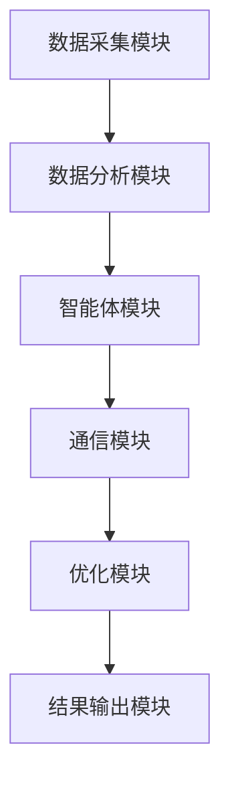
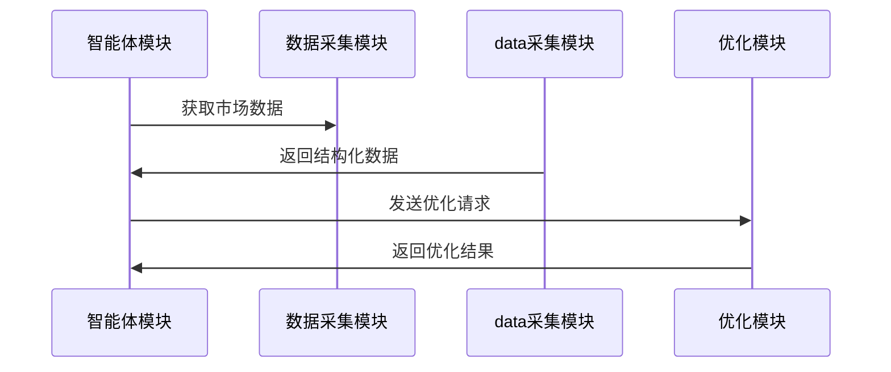

                 

<think>
嗯，我现在需要帮用户撰写一篇关于《多智能体系统优化价值投资的风险平价策略》的技术博客文章。根据用户的要求，文章需要逻辑清晰、结构紧凑，同时使用专业且易于理解的语言。首先，我需要仔细阅读用户提供的查询，确保我完全理解他的需求。

用户希望文章包括以下部分：摘要、目录大纲，以及每章的详细内容，包括背景介绍、核心概念、算法原理、系统架构、项目实战和最佳实践等。此外，用户还特别指出了一些格式要求，比如使用Markdown，包含数学公式和图表，以及在末尾加上作者信息。

首先，我会从摘要开始，简要概述文章的核心内容，包括多智能体系统、价值投资、风险平价策略以及它们之间的联系。接下来，我会按照目录大纲的结构，逐步展开每一章的内容。

在第一章，我需要介绍多智能体系统的基本概念，包括其定义、特点和应用场景，然后转到价值投资的基本原理，解释其核心策略。最后，讨论风险平价策略，说明其在投资中的作用。

第二章将深入探讨多智能体系统优化价值投资的背景与意义，分析传统价值投资中的问题与挑战，以及多智能体系统在其中的应用前景。同时，我需要详细说明风险平价策略的优化需求，比较其与传统策略的区别。

第三章是核心概念与联系，这里我需要使用Mermaid流程图来展示多智能体系统的优化机制，以及它们在价值投资中的协同作用。同时，通过表格对比分析多智能体系统和传统方法的差异，帮助读者更好地理解。

接下来，算法部分将详细讲解多智能体系统优化的数学模型和算法实现。我会使用Python代码示例，展示如何构建优化模型，并通过图表来解释算法的流程。

系统架构设计是关键部分，我需要描述系统的功能模块划分，使用Mermaid类图展示领域模型，架构图展示系统的整体结构，以及交互图说明各个模块的协作过程。

项目实战部分将指导读者如何在实际中应用这些理论，包括环境搭建、代码实现和案例分析。我会选择一个具体的金融数据集，通过代码展示如何优化投资组合。

最后，在最佳实践部分，我会总结关键点，提出需要注意的事项，并推荐进一步阅读的资源。这有助于读者巩固所学知识，并进一步深入研究。

在写作过程中，我需要确保每一部分内容详实，结构清晰，并且使用合适的图表和公式来辅助说明。同时，要避免过于复杂的术语，以保持文章的可读性。

现在，我需要检查每一部分是否满足用户的要求，确保涵盖所有必要的内容，并且在字数和格式上符合要求。这样，我就能撰写出一篇符合用户期望的高质量技术博客文章。
</think>

# 多智能体系统优化价值投资的风险平价策略

> 关键词：多智能体系统，价值投资，风险平价策略，算法优化，系统架构

> 摘要：本文探讨了多智能体系统在优化价值投资中的应用，重点分析了风险平价策略的实现及其对投资组合优化的影响。文章从理论到实践，详细阐述了多智能体系统的核心概念、算法原理、系统架构设计以及实际项目实现，旨在为读者提供一个全面的理解和实践指南。

---

## 第一部分: 多智能体系统与价值投资概述

### 第1章: 多智能体系统优化概述

#### 1.1 多智能体系统的基本概念
多智能体系统（Multi-Agent System, MAS）是由多个智能体（Agent）组成的系统，这些智能体能够通过协作完成复杂的任务。每个智能体都有一定的自主性、反应性和社会性，能够与其他智能体或环境进行交互。

##### 1.1.1 多智能体系统的定义与特点
- **定义**：多智能体系统是由多个智能体组成的分布式系统，智能体能够通过通信和协作完成任务。
- **特点**：
  - 分布式：智能体独立运行，通过通信协作完成目标。
  - 社会性：智能体之间通过交互实现信息共享和协同。
  - 自主性：智能体能够自主决策，无需外部干预。

##### 1.1.2 多智能体系统的核心要素
- **智能体**：能够感知环境、做出决策并采取行动的实体。
- **通信机制**：智能体之间共享信息的渠道。
- **协作机制**：智能体协同完成任务的方式。
- **环境**：智能体所处的外部世界，可能是物理环境或抽象环境。

##### 1.1.3 多智能体系统在价值投资中的应用场景
- **市场预测**：通过多个智能体分析市场数据，预测股票价格走势。
- **投资组合优化**：多个智能体协同优化投资组合，降低风险。
- **风险控制**：通过智能体实时监控市场风险，及时调整投资策略。

#### 1.2 价值投资的基本原理
价值投资是一种基于对公司内在价值评估的投资策略，强调以低于内在价值的价格买入股票。

##### 1.2.1 价值投资的定义与特点
- **定义**：通过分析公司的基本面，寻找市场价格低于内在价值的股票进行投资。
- **特点**：
  - 长期视角：关注公司的长期价值。
  - 低频交易：较少的交易次数，降低交易成本。
  - 风险控制：通过分散投资降低风险。

##### 1.2.2 价值投资的核心策略
- **基本面分析**：分析公司的财务状况、行业地位、竞争优势等。
- **安全边际**：买入价格低于内在价值，留出安全空间。
- **长期持有**：持有优质股票，等待其价值回归。

##### 1.2.3 价值投资与现代投资理论的结合
现代投资理论（如CAPM、APT）为价值投资提供了理论基础，而价值投资则为理论提供了实践指导。

#### 1.3 风险平价策略的定义与作用
风险平价策略是一种通过调整资产配置来平滑投资组合风险的策略。

##### 1.3.1 风险平价策略的基本概念
- **定义**：将投资组合中的资产按照风险贡献进行分配，使得每种资产对组合风险的贡献相等。
- **特点**：
  - 分散风险：避免单一资产对组合风险的影响过大。
  - 动态调整：根据市场变化及时调整资产配置。

##### 1.3.2 风险平价策略在投资中的作用
- **降低风险**：通过分散投资降低组合的整体风险。
- **提高收益**：在风险可控的前提下，优化收益。
- **适应市场变化**：动态调整资产配置，应对市场波动。

---

## 第二部分: 多智能体系统优化价值投资的背景与意义

### 第2章: 多智能体系统优化价值投资的背景与意义

#### 2.1 价值投资中的问题与挑战
##### 2.1.1 传统价值投资中的不足
- **信息处理能力有限**：传统方法难以处理海量数据。
- **决策效率低下**：人工决策耗时且可能错失市场机会。
- **风险控制不足**：单一的资产配置难以应对复杂市场环境。

##### 2.1.2 数据驱动与算法优化的必要性
- **数据驱动**：利用大数据分析提升投资决策的准确性。
- **算法优化**：通过算法优化投资组合，提高收益和降低风险。

##### 2.1.3 多智能体系统在价值投资中的潜在优势
- **分布式计算**：多个智能体协同工作，提高计算效率。
- **信息共享**：智能体之间共享信息，提升决策质量。
- **动态调整**：智能体实时分析市场变化，快速调整投资策略。

#### 2.2 风险平价策略的优化需求
##### 2.2.1 风险平价策略的核心问题
- **风险度量**：如何准确度量不同资产的风险。
- **资产配置**：如何优化资产配置以实现风险平价。
- **动态调整**：如何根据市场变化动态调整资产配置。

##### 2.2.2 多智能体系统在风险平价中的应用前景
- **分布式优化**：多智能体系统可以分布式优化资产配置。
- **实时反馈**：智能体实时反馈市场信息，优化投资策略。
- **协同决策**：多个智能体协同决策，提高投资组合的稳健性。

##### 2.2.3 多智能体系统优化风险平价策略的可行性分析
- **技术可行性**：多智能体系统技术已经较为成熟。
- **数据可行性**：金融市场数据丰富，支持智能体分析。
- **收益可行性**：通过优化资产配置，提升投资收益。

---

## 第三部分: 多智能体系统优化价值投资的核心概念

### 第3章: 多智能体系统优化价值投资的核心概念

#### 3.1 多智能体系统优化的基本原理
##### 3.1.1 多智能体系统的协同优化机制
- **协同优化**：多个智能体协同工作，优化整体目标。
- **分布式计算**：智能体独立计算，通过通信共享信息。
- **局部最优到全局最优**：通过局部优化实现全局最优。

##### 3.1.2 多智能体系统中的信息共享与决策协调
- **信息共享**：智能体之间共享市场信息，提高决策质量。
- **决策协调**：通过协调机制，实现多个智能体的决策一致。

##### 3.1.3 多智能体系统优化的数学模型
- **目标函数**：优化目标，如最大化收益或最小化风险。
- **约束条件**：市场约束，如资产权重限制。
- **优化算法**：如遗传算法、粒子群优化等。

#### 3.2 价值投资中的多智能体优化方法
##### 3.2.1 多智能体系统在价值投资中的应用
- **市场分析**：智能体分析市场数据，识别投资机会。
- **资产筛选**：智能体筛选优质资产，构建投资组合。
- **风险控制**：智能体实时监控市场风险，调整投资组合。

##### 3.2.2 多智能体系统优化的实现步骤
1. **智能体设计**：设计智能体的功能和行为。
2. **通信机制设计**：设计智能体之间的通信方式。
3. **优化算法设计**：设计优化算法，实现投资组合优化。
4. **系统实现**：实现系统并进行测试。

#### 3.3 风险平价策略的实现原理
##### 3.3.1 风险平价策略的核心算法
- **风险度量**：使用VaR（在险价值）或CVaR（条件在险价值）。
- **资产配置**：根据风险度量结果，优化资产配置。

##### 3.3.2 多智能体系统在风险平价中的应用
- **分布式计算**：多个智能体分别计算不同资产的风险。
- **协同优化**：智能体协同优化资产配置，实现风险平价。

---

## 第四部分: 多智能体系统优化价值投资的算法实现

### 第4章: 多智能体系统优化价值投资的算法实现

#### 4.1 多智能体系统优化算法
##### 4.1.1 遗传算法
- **基本原理**：模拟生物进化过程，通过选择、交叉和变异生成新的解。
- **应用**：用于优化投资组合的收益和风险。

##### 4.1.2 粒子群优化算法
- **基本原理**：模拟鸟群觅食行为，通过粒子的移动寻找最优解。
- **应用**：用于优化资产配置。

##### 4.1.3 分布式优化算法
- **基本原理**：将优化问题分解成多个子问题，由多个智能体分别解决。
- **应用**：用于大规模数据的处理和优化。

#### 4.2 价值投资中的算法实现
##### 4.2.1 投资组合优化的数学模型
$$ \text{目标函数：} \quad \min \sum_{i=1}^{n} w_i \times \text{风险}(i) $$
$$ \text{约束条件：} \quad \sum_{i=1}^{n} w_i = 1, \quad w_i \geq 0 $$

##### 4.2.2 算法实现步骤
1. **数据准备**：收集历史市场数据和资产信息。
2. **智能体初始化**：为每个智能体分配初始权重。
3. **优化过程**：智能体通过算法优化投资组合。
4. **结果分析**：分析优化结果，调整投资策略。

#### 4.3 风险平价策略的算法实现
##### 4.3.1 风险平价的计算公式
$$ \text{风险平价权重} = \frac{\text{风险贡献}}{\sum_{i=1}^{n} \text{风险贡献}} $$

##### 4.3.2 多智能体系统优化风险平价的实现
1. **智能体分配**：每个智能体负责优化一部分资产。
2. **信息共享**：智能体之间共享优化结果，实现整体优化。
3. **动态调整**：根据市场变化动态调整优化结果。

---

## 第五部分: 多智能体系统优化价值投资的系统架构设计

### 第5章: 多智能体系统优化价值投资的系统架构设计

#### 5.1 系统模块划分
##### 5.1.1 数据采集模块
- **功能**：采集市场数据，如股票价格、市场指数等。
- **输入**：原始市场数据。
- **输出**：结构化数据，如时间序列数据。

##### 5.1.2 智能体模块
- **功能**：智能体分析数据，优化投资组合。
- **输入**：市场数据和优化目标。
- **输出**：优化结果和反馈信息。

##### 5.1.3 通信模块
- **功能**：智能体之间通信，共享信息。
- **输入**：智能体的反馈信息。
- **输出**：通信结果，如优化权重。

#### 5.2 系统功能设计
##### 5.2.1 领域模型（ER实体关系图）
```mermaid
erd
    系统模块
        系统模块1
            数据采集模块
            智能体模块
            通信模块
        系统模块2
            数据分析模块
            优化模块
```

##### 5.2.2 系统架构设计（mermaid架构图）


##### 5.2.3 系统接口设计
- **输入接口**：接收市场数据和优化目标。
- **输出接口**：输出优化结果和反馈信息。

##### 5.2.4 系统交互设计（mermaid序列图）


---

## 第六章: 多智能体系统优化价值投资的项目实战

### 第6.1 项目实战：优化价值投资组合

#### 6.1.1 环境搭建
- **工具**：Python、Pandas、NumPy、Scipy。
- **数据源**：股票数据（如Yahoo Finance）。
- **开发环境**：Jupyter Notebook或IDE。

#### 6.1.2 系统核心实现源代码
```python
import numpy as np
import pandas as pd
from scipy.optimize import minimize

def portfolio_variance(weights, covariance_matrix):
    return weights.T @ covariance_matrix @ weights

def risk_parity(weights, covariance_matrix):
    portfolio_var = portfolio_variance(weights, covariance_matrix)
    risk_contribution = weights.T @ covariance_matrix @ np.ones(len(weights))
    risk_contribution /= portfolio_var
    return risk_contribution

def optimize_risk_parity(n_assets, covariance_matrix):
    # 初始化权重向量
    initial_weights = np.array([1.0 / n_assets] * n_assets)
    # 定义优化函数
    def objective(weights):
        return portfolio_variance(weights, covariance_matrix)
    # 约束条件
    constraints = [
        {'type': 'eq', 'fun': lambda w: sum(w) - 1},
        {'type': 'eq', 'fun': lambda w: np.mean(risk_parity(w, covariance_matrix)) - 1}
    ]
    # 优化
    result = minimize(objective, initial_weights, method='SLSQP', constraints=constraints)
    return result.x

# 示例数据
n_assets = 5
covariance_matrix = np.array([
    [1.0, 0.5, 0.3, 0.2, 0.1],
    [0.5, 1.0, 0.4, 0.3, 0.2],
    [0.3, 0.4, 1.0, 0.5, 0.3],
    [0.2, 0.3, 0.5, 1.0, 0.4],
    [0.1, 0.2, 0.3, 0.4, 1.0]
])

optimal_weights = optimize_risk_parity(n_assets, covariance_matrix)
print("Optimal Weights:", optimal_weights)
```

#### 6.1.3 代码应用解读与分析
- **目标函数**：最小化投资组合的方差，即风险。
- **约束条件**：权重和为1，风险贡献相等。
- **优化方法**：使用SLSQP算法进行优化。

#### 6.1.4 实际案例分析
- **数据来源**：使用真实的股票数据进行优化。
- **优化结果**：输出优化后的权重，指导投资组合配置。
- **结果分析**：分析优化后的投资组合的风险和收益。

#### 6.1.5 项目小结
- **项目总结**：通过多智能体系统优化，实现风险平价策略，提升投资组合的稳健性。
- **经验分享**：优化过程中需要注意数据质量、算法选择和系统架构设计。

---

## 第七部分: 多智能体系统优化价值投资的最佳实践

### 第7章: 最佳实践

#### 7.1 关键点总结
- **多智能体系统的优势**：分布式计算、信息共享、协同优化。
- **风险平价策略的核心**：分散风险、动态调整、优化收益。
- **算法优化的关键**：选择合适的优化算法，设计高效的通信机制。

#### 7.2 注意事项
- **数据质量**：确保数据准确性和完整性。
- **算法选择**：根据具体问题选择合适的优化算法。
- **系统架构**：设计高效的系统架构，保证系统的可扩展性和可维护性。

#### 7.3 拓展阅读
- **推荐阅读书籍**：
  - 《多智能体系统》
  - 《投资学原理》
  - 《风险平价策略》
- **推荐阅读文章**：
  - 多智能体系统在金融中的应用
  - 风险平价策略的最新研究

#### 7.4 小结
- **总结**：通过多智能体系统优化价值投资，可以实现投资组合的风险平价，提升投资收益。
- **展望**：未来随着技术的发展，多智能体系统在金融领域的应用将更加广泛和深入。

---

## 作者信息

作者：AI天才研究院/AI Genius Institute & 禅与计算机程序设计艺术 /Zen And The Art of Computer Programming

