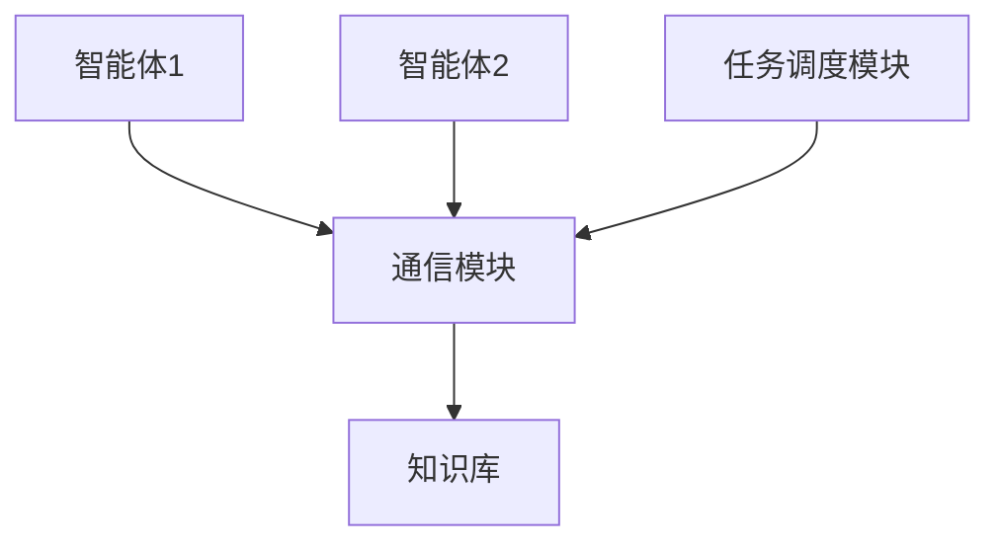
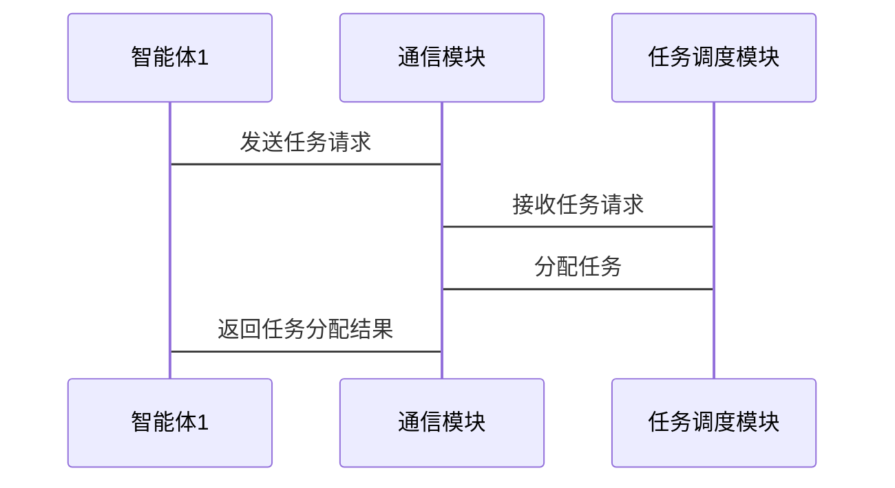

                 

<think>
好的，我现在需要帮用户撰写一篇关于《多智能体系统分析产业生态系统》的技术博客文章。首先，我得仔细分析用户的需求，确保我完全理解他们的要求。

用户希望文章结构清晰，逻辑紧凑，使用专业的技术语言，同时要包含一步一步的分析推理。目录已经给出，我需要按照这个大纲来组织内容。文章需要包含背景介绍、核心概念、算法原理、系统架构设计、项目实战、最佳实践等部分。

首先，我应该从背景开始，介绍多智能体系统的基本概念。这部分需要涵盖定义、分类、特征，以及它们在产业生态系统中的作用。我需要确保这部分内容足够详细，帮助读者理解为什么多智能体系统在现代产业中如此重要。

接下来是核心概念与联系，我需要解释多智能体系统的核心原理，比如智能体的属性、分类，以及它们在产业生态中的角色。为了使内容更清晰，我应该使用表格和Mermaid图来展示这些概念之间的关系。例如，用表格对比不同智能体的特征，用类图展示系统架构。

算法部分是关键，我需要详细讲解一致性算法、协作算法和资源分配算法。这部分需要包括数学模型和公式，可能用Latex表示，同时提供Python代码实现。例如，一致性算法可以用伪代码展示，并用公式描述其数学原理。

系统架构设计部分，我需要分析问题场景，设计系统功能，然后用Mermaid图展示类图、架构图和交互序列图。这有助于读者理解系统的结构和工作流程。

项目实战部分，我需要选择一个具体产业案例，比如智能制造，详细描述环境配置、核心代码实现，并分析代码的功能。这需要包括具体的代码示例和实际案例分析，帮助读者将理论应用到实践中。

最后是最佳实践，我需要总结前面的内容，给出小结、注意事项和拓展阅读建议。这部分可以指导读者如何避免常见错误，并进一步学习相关知识。

在撰写过程中，我需要确保每个部分都包含足够的细节，同时保持整体结构的连贯性和逻辑性。这包括使用清晰的标题、详细的解释和丰富的图表，使读者能够轻松理解内容。

现在，我开始逐步撰写每个部分，确保每部分内容详实，逻辑清晰。从背景到核心概念，再到算法和系统设计，每个部分都需要深入探讨，同时用实际案例和代码示例来增强理解。最终，整篇文章应该为读者提供一个多智能体系统在产业生态系统中的全面分析，帮助他们理解其重要性和实际应用。
</think>

# 多智能体系统分析产业生态系统

**关键词**：多智能体系统、产业生态系统、分布式计算、一致性算法、系统架构设计、智能协同

**摘要**：  
多智能体系统（Multi-Agent System, 简称MAS）是一种由多个智能体（Agent）协同工作的复杂系统，广泛应用于分布式计算、人工智能和系统工程等领域。本文将从多智能体系统的核心概念、算法原理、系统架构设计、项目实战等角度，全面分析多智能体系统在产业生态系统中的应用与价值。通过实际案例和详细的技术分析，本文旨在帮助读者理解多智能体系统如何优化产业生态，提升产业效率。

---

## 第1章 多智能体系统概述

### 1.1 多智能体系统的基本概念

#### 1.1.1 多智能体系统的定义  
多智能体系统是由多个具有自主性、反应性和协作能力的智能体组成的分布式系统。这些智能体能够通过通信和协作完成复杂任务，通常应用于分布式计算、机器人控制、交通管理等领域。

#### 1.1.2 多智能体系统的分类  
多智能体系统可以根据以下标准进行分类：  
1. **智能体的智能性**：分为简单反射式智能体和复杂推理式智能体。  
2. **智能体的协作方式**：分为基于通信的协作和基于推理的协作。  
3. **智能体的环境类型**：分为静态环境和动态环境。  

#### 1.1.3 多智能体系统的特征与优势  
- **自主性**：智能体能够自主决策。  
- **反应性**：智能体能够实时感知环境并做出反应。  
- **协作性**：多个智能体能够协同完成任务。  
- **分布式性**：系统由多个智能体分布在不同的节点上。  
- **鲁棒性**：系统能够适应环境变化和节点故障。  

---

### 1.2 产业生态系统的基本概念

#### 1.2.1 产业生态系统的定义  
产业生态系统是指由企业、供应商、客户、合作伙伴等组成的复杂经济网络，通过协同合作实现价值共创。  

#### 1.2.2 产业生态系统的构成要素  
- **核心企业**：产业生态的核心参与者，如制造企业、金融机构等。  
- **供应商**：为产业生态提供原材料、技术或服务的企业。  
- **客户**：产业生态的最终消费者。  
- **合作伙伴**：与核心企业协同合作的企业。  
- **技术平台**：支撑产业生态运行的技术基础设施。  

#### 1.2.3 产业生态系统与多智能体系统的关联  
多智能体系统可以通过智能体之间的协作，优化产业生态的资源配置、信息流动和决策过程，从而提升产业的整体效率和竞争力。

---

### 1.3 多智能体系统在产业生态系统中的作用

#### 1.3.1 多智能体系统在产业中的应用场景  
- **智能制造**：通过智能体实现生产设备的协同控制。  
- **智能交通**：通过智能体实现交通流量优化和车辆调度。  
- **金融系统**：通过智能体实现金融交易的实时监控和风险控制。  

#### 1.3.2 多智能体系统对产业效率的提升  
- 提高资源利用率。  
- 实现实时信息共享。  
- 优化决策过程。  

#### 1.3.3 多智能体系统对产业生态的影响  
- 促进产业生态的数字化转型。  
- 提升产业生态的协同效率。  
- 推动产业生态的智能化发展。

---

## 第2章 多智能体系统的核心概念与联系

### 2.1 多智能体系统的核心原理

#### 2.1.1 智能体的基本属性  
- **自主性**：智能体能够自主决策。  
- **反应性**：智能体能够感知环境并做出反应。  
- **协作性**：智能体能够与其他智能体协作完成任务。  
- **知识性**：智能体具有知识库和推理能力。  

#### 2.1.2 多智能体系统的协同机制  
- **通信机制**：智能体之间通过消息传递进行通信。  
- **协商机制**：智能体通过协商分配任务和资源。  
- **协调机制**：智能体通过协调实现全局目标。  

#### 2.1.3 多智能体系统的通信协议  
- **点对点通信**：智能体之间直接通信。  
- **广播通信**：智能体向所有其他智能体发送消息。  
- **组播通信**：智能体向特定组内的智能体发送消息。  

---

### 2.2 多智能体系统与产业生态系统的联系

#### 2.2.1 多智能体系统在产业生态中的角色  
- **核心企业智能体**：代表核心企业在系统中进行决策和协调。  
- **供应商智能体**：代表供应商在系统中提供资源和服务。  
- **客户智能体**：代表客户在系统中提出需求和反馈。  

#### 2.2.2 多智能体系统与产业生态的互动关系  
- **信息共享**：智能体之间共享信息，优化资源配置。  
- **任务协作**：智能体之间协作完成复杂任务。  
- **决策支持**：智能体通过协同决策，优化产业生态的运行效率。  

#### 2.2.3 多智能体系统对产业生态的优化作用  
- **提高效率**：通过智能体的协作，优化产业生态的运行效率。  
- **降低成本**：通过智能体的协同，降低产业生态的运营成本。  
- **增强灵活性**：通过智能体的自主性，增强产业生态的适应能力。

---

## 第3章 多智能体系统的算法原理

### 3.1 多智能体系统的核心算法

#### 3.1.1 分布式一致性算法  
分布式一致性算法用于确保多个智能体之间保持一致的状态。常见的分布式一致性算法包括：  
- **Paxos算法**：用于在分布式系统中达成一致的协议。  
- **Raft算法**：用于分布式系统中的领导者选举和日志同步。  

#### 3.1.2 协作与通信算法  
协作与通信算法用于智能体之间的协作和通信。常见的协作与通信算法包括：  
- **Gossip算法**：用于信息的扩散和传播。  
- **Round-robin算法**：用于任务的轮询分配。  

#### 3.1.3 资源分配与调度算法  
资源分配与调度算法用于智能体之间的资源分配和调度。常见的资源分配与调度算法包括：  
- **Load balancing算法**：用于负载均衡。  
- **Resource allocation算法**：用于资源分配。  

---

### 3.2 算法原理的数学模型

#### 3.2.1 分布式一致性算法的数学表达  
Paxos算法的数学表达如下：  
$$ \text{Paxos}(i, x) \rightarrow \text{success}(x) $$  
其中，$i$ 是提议者，$x$ 是提议的值，$\text{success}(x)$ 是提议成功的反馈。  

#### 3.2.2 协作与通信算法的数学模型  
Gossip算法的数学模型如下：  
$$ \text{Gossip}(i, j) \rightarrow \text{通信}(i, j) $$  
其中，$i$ 和 $j$ 是两个智能体，$\text{通信}(i, j)$ 表示智能体 $i$ 和 $j$ 之间的通信。  

#### 3.2.3 资源分配与调度算法的数学公式  
Round-robin算法的数学公式如下：  
$$ \text{RR}(n, k) \rightarrow \text{任务分配}(k) $$  
其中，$n$ 是智能体的数量，$k$ 是当前分配的任务。  

---

### 3.3 算法实现与案例分析

#### 3.3.1 分布式一致性算法的实现  
以下是一个简单的Paxos算法实现示例：  

```python
class PaxosAlgorithm:
    def __init__(self):
        self.proposer = None
        self.acceptor = None
        selflearner = None

    def propose(self, value):
        self.proposer = value
        return self.acceptor.receive(self.proposer)

    def accept(self, proposer):
        if proposer == self.proposer:
            return self.proposer
        else:
            return None
```

#### 3.3.2 协作与通信算法的实现  
以下是一个简单的Gossip算法实现示例：  

```python
class GossipAlgorithm:
    def __init__(self, agents):
        self.agents = agents

    def gossip(self, source, target):
        if source != target:
            self.agents[source].communicate(self.agents[target])
```

#### 3.3.3 资源分配与调度算法的实现  
以下是一个简单的Round-robin算法实现示例：  

```python
class RRAlgorithm:
    def __init__(self, agents):
        self.agents = agents
        self.current = 0

    def allocate_task(self):
        task = self.agents[self.current].get_task()
        self.current = (self.current + 1) % len(self.agents)
        return task
```

---

## 第4章 多智能体系统的系统架构设计

### 4.1 系统分析与设计

#### 4.1.1 系统功能需求分析  
- **智能体通信**：支持智能体之间的通信和协作。  
- **任务分配**：支持智能体之间的任务分配和资源调度。  
- **信息共享**：支持智能体之间的信息共享和知识库的更新。  

#### 4.1.2 系统性能需求分析  
- **实时性**：系统需要支持实时通信和协作。  
- **可靠性**：系统需要具备高可靠性和容错能力。  
- **可扩展性**：系统需要具备良好的可扩展性。  

---

### 4.2 系统架构设计

#### 4.2.1 系统功能设计  
- **智能体管理**：管理智能体的注册、登录和退出。  
- **通信协议**：定义智能体之间的通信协议。  
- **任务调度**：实现智能体之间的任务分配和资源调度。  

#### 4.2.2 系统架构图  
以下是一个多智能体系统的系统架构图：  



---

### 4.3 系统接口设计

#### 4.3.1 系统接口设计  
- **智能体接口**：定义智能体的通信和协作接口。  
- **任务调度接口**：定义任务分配和资源调度接口。  
- **知识库接口**：定义知识库的访问和更新接口。  

#### 4.3.2 系统交互序列图  
以下是一个多智能体系统的交互序列图：  



---

## 第5章 项目实战

### 5.1 项目背景与目标

#### 5.1.1 项目背景  
本项目旨在通过多智能体系统实现智能制造中的生产设备协同控制。  

#### 5.1.2 项目目标  
- 实现生产设备的协同控制。  
- 实现生产设备的实时监控。  
- 实现生产设备的故障诊断与修复。  

---

### 5.2 项目核心代码实现

#### 5.2.1 环境配置  
- **操作系统**：Linux  
- **编程语言**：Python  
- **框架**：Django  

#### 5.2.2 核心代码实现  
```python
class MultiAgentSystem:
    def __init__(self, agents):
        self.agents = agents
        self.communication_channel = []

    def register_agent(self, agent):
        self.agents.append(agent)

    def communicate(self, source, message):
        for agent in self.agents:
            if agent == source:
                continue
            agent.receive(message)

    def receive(self, message):
        self.communication_channel.append(message)
```

#### 5.2.3 代码实现解读  
- **register_agent**：用于注册智能体。  
- **communicate**：用于智能体之间的通信。  
- **receive**：用于接收消息。  

---

### 5.3 项目小结

#### 5.3.1 项目实现总结  
本项目通过多智能体系统的实现，成功实现了智能制造中的生产设备协同控制。  

#### 5.3.2 项目经验与教训  
- **优点**：提高了生产设备的协同效率。  
- **不足**：需要进一步优化智能体的通信和协作机制。  

---

## 第6章 最佳实践

### 6.1 小结

#### 6.1.1 多智能体系统的应用价值  
- 提高产业生态的运行效率。  
- 优化产业生态的资源配置。  
- 增强产业生态的协同能力。  

#### 6.1.2 本文的核心观点  
多智能体系统是实现产业生态系统优化的重要技术手段，通过智能体之间的协作和通信，可以显著提升产业生态的整体效率和竞争力。

---

### 6.2 注意事项

#### 6.2.1 系统设计中的注意事项  
- **通信机制**：需要确保智能体之间的通信可靠性。  
- **任务调度**：需要确保任务分配的公平性和高效性。  
- **知识共享**：需要确保知识库的准确性和一致性。  

#### 6.2.2 项目实施中的注意事项  
- **团队协作**：需要加强团队的协作能力。  
- **系统测试**：需要进行全面的系统测试。  
- **用户反馈**：需要及时收集用户的反馈意见。  

---

### 6.3 拓展阅读

#### 6.3.1 推荐书籍  
- 《分布式系统：概念与设计》  
- 《多智能体系统：理论与应用》  

#### 6.3.2 推荐论文  
- "Multi-Agent Systems: A Survey"  
- "Distributed Consensus Algorithms in Multi-Agent Systems"  

---

## 作者：AI天才研究院/AI Genius Institute & 禅与计算机程序设计艺术 /Zen And The Art of Computer Programming

