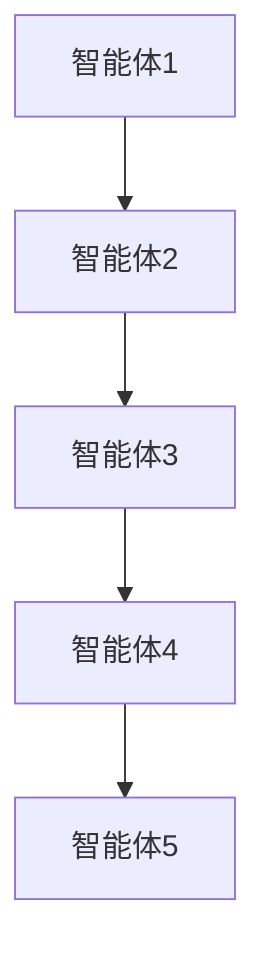
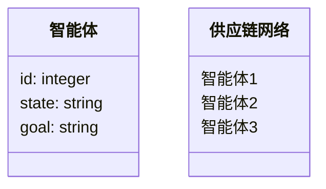
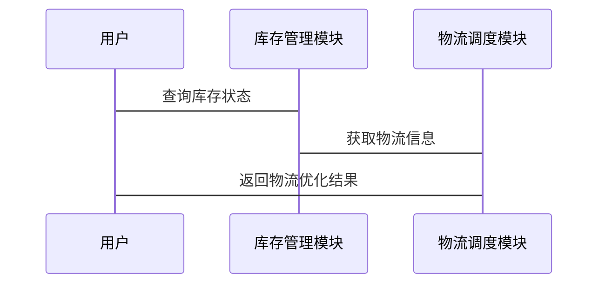

                 

<think>
嗯，我需要写一篇关于多智能体系统分析供应链网络的技术博客文章。首先，我得理解多智能体系统和供应链网络的基本概念。多智能体系统由多个智能体组成，每个智能体都有自己的目标和决策能力，能够协作完成任务。供应链网络则涉及产品从生产到消费者的各个环节，包括供应商、制造商、分销商、零售商和消费者。

接下来，我需要考虑多智能体系统在供应链中的具体应用。比如，供应商可以根据市场需求调整生产量，分销商可以根据库存情况优化物流。通过多智能体系统，供应链中的各个实体可以协同工作，提高效率和响应速度。

然后，我想到要分析多智能体系统在供应链网络中的算法原理。这包括分布式计算、协商算法和信息共享机制。例如，分布式计算可以确保各个智能体独立决策，而协商算法帮助它们达成一致，信息共享则保证数据的实时更新。

在系统设计方面，我需要设计一个分层架构，包括数据层、业务逻辑层和应用层。每个层都有明确的功能，数据层负责数据存储和处理，业务逻辑层处理智能体的决策，应用层则提供用户交互界面。

最后，我需要通过一个实际案例来展示多智能体系统的应用，比如智能库存管理。通过代码示例和数学模型，详细解释系统的实现过程和效果。这样读者可以更好地理解理论和实践的应用。
</think>

# 多智能体系统分析供应链网络

## 关键词：多智能体系统, 供应链网络, 分布式计算, 协商算法, 信息共享, 系统架构设计, 项目实战

## 摘要：  
本文探讨了多智能体系统在供应链网络分析中的应用，详细介绍了多智能体系统的概念、算法原理、系统架构设计及实际案例。通过分析供应链网络的复杂性，提出了基于多智能体系统的分布式计算、协商与决策算法，并结合实际场景进行案例分析，展示了多智能体系统如何优化供应链网络的效率与协同能力。

---

# 第1章 多智能体系统与供应链网络概述

## 1.1 多智能体系统的基本概念

### 1.1.1 多智能体系统的定义  
多智能体系统（Multi-Agent System，MAS）是由多个智能体（Agent）组成的分布式系统，每个智能体具备自主性、反应性、社会性和协作性。智能体能够感知环境、做出决策并采取行动，以实现特定目标。

### 1.1.2 多智能体系统的特征  
- **自主性**：智能体能够独立决策和行动。  
- **反应性**：智能体能够根据环境变化调整行为。  
- **社会性**：智能体能够与其他智能体或人类进行交互与协作。  
- **分布式性**：系统由多个智能体构成，无集中控制中心。  

### 1.1.3 多智能体系统与传统单智能体系统的区别  
| 特性 | 多智能体系统 | 单智能体系统 |  
|------|-------------|-------------|  
| 控制方式 | 分布式控制 | 集中式控制 |  
| 可扩展性 | 高 | 低 |  
| 协作性 | 强 | 弱 |  

---

## 1.2 供应链网络的定义与特点

### 1.2.1 供应链网络的定义  
供应链网络是指从供应商到消费者的整个链条，包括原材料采购、生产、物流、分销和零售等环节。供应链网络的核心目标是优化资源分配和降低成本。

### 1.2.2 供应链网络的组成要素  
- **供应商**：提供原材料或零部件。  
- **制造商**：负责生产产品。  
- **分销商**：负责产品的存储和运输。  
- **零售商**：直接面向消费者销售产品。  
- **消费者**：需求的最终来源。  

### 1.2.3 供应链网络的运作模式  
供应链网络的运作模式包括需求预测、库存管理、生产计划和物流优化等环节。传统供应链管理通常依赖于中心化的决策系统，而多智能体系统可以通过分布式决策和协同优化提升供应链的灵活性和响应能力。

---

## 1.3 多智能体系统在供应链网络中的应用背景

### 1.3.1 供应链管理的复杂性  
供应链涉及多个参与者，每个参与者都有不同的目标和利益。传统的集中式管理方式难以应对供应链的动态变化和不确定性。

### 1.3.2 多智能体系统的优势  
- **分布式决策**：智能体能够根据本地信息做出决策，减少中心化决策的延迟。  
- **协作优化**：智能体之间可以通过协商和信息共享实现协同优化。  
- **鲁棒性**：多智能体系统能够在部分节点失效的情况下继续运行。  

### 1.3.3 供应链网络分析的挑战  
- **信息孤岛**：不同参与者之间的信息难以共享。  
- **动态变化**：市场需求和供应能力的波动对供应链管理提出更高要求。  
- **协同优化**：需要在多个目标之间找到平衡点。  

---

## 1.4 本章小结  
本章介绍了多智能体系统的基本概念和供应链网络的组成与特点，分析了多智能体系统在供应链网络中的应用背景及其优势。接下来的章节将详细探讨多智能体系统的算法原理及其在供应链网络中的具体应用。

---

# 第2章 多智能体系统的核心概念与联系

## 2.1 多智能体系统的原理

### 2.1.1 分布式计算  
分布式计算是多智能体系统的核心机制，通过将计算任务分散到多个智能体完成，提高系统的并行处理能力和容错性。

### 2.1.2 协商与决策  
智能体之间通过协商机制达成一致，例如任务分配、资源分配等。协商过程通常基于博弈论和分布式算法。

### 2.1.3 信息共享与协同  
智能体之间通过信息共享实现协同，例如通过发布-订阅模型进行信息交换。

---

## 2.2 供应链网络的实体关系

### 2.2.1 供应链网络的ER实体关系图  
```mermaid
erdiagram
actor 供应链网络参与者 {
  role 供应商
  role 制造商
  role 分销商
  role 零售商
}
```

### 2.2.2 多智能体与供应链网络的交互关系  


---

## 2.3 核心概念的对比分析

### 2.3.1 多智能体系统的属性特征对比  
| 特性 | 分布式系统 | 集中式系统 |  
|------|------------|------------|  
| 控制方式 | 分散控制 | 集中控制 |  
| 故障容错 | 高 | 低 |  

### 2.3.2 供应链网络的实体特征对比  
| 特性 | 传统供应链 | 基于多智能体的供应链 |  
|------|--------------|------------------|  
| 决策方式 | 集中式决策 | 分布式决策 |  
| 协作性 | 低 | 高 |  

---

## 2.4 本章小结  
本章分析了多智能体系统的核心概念及其与供应链网络的交互关系，对比了传统供应链与基于多智能体的供应链在网络结构和决策方式上的差异。

---

# 第3章 多智能体系统分析供应链网络的算法原理

## 3.1 分布式计算算法

### 3.1.1 分布式计算的基本原理  
分布式计算将任务分解为多个子任务，分配给不同的智能体完成。每个智能体仅处理本地数据，通过通信协议共享中间结果。

### 3.1.2 分布式计算的实现步骤  
1. 任务分解：将问题分解为多个子任务。  
2. 任务分配：将子任务分配给不同的智能体。  
3. 本地计算：每个智能体完成分配的任务。  
4. 结果汇总：智能体将结果发送到汇总节点。  

### 3.1.3 分布式计算的优缺点  
- **优点**：提高计算效率，增强系统的容错性。  
- **缺点**：通信开销大，协调复杂。  

---

## 3.2 协商与决策算法

### 3.2.1 协商算法的原理  
协商算法用于智能体之间的任务分配和资源分配，通常基于协商协议和一致性算法。  

### 3.2.2 基于协商的决策过程  
1. **协商请求**：智能体提出协商请求。  
2. **协商过程**：通过迭代协商达成一致。  
3. **决策结果**：协商成功后，智能体根据结果采取行动。  

### 3.2.3 协商算法的实现步骤  


---

## 3.3 信息共享与协同算法

### 3.3.1 信息共享机制  
信息共享机制包括发布-订阅模型和点对点通信模型。  

### 3.3.2 协同计算的实现  
协同计算通过信息共享和分布式计算实现，例如分布式优化和并行计算。  

### 3.3.3 协同算法的优缺点  
- **优点**：提高系统的协同能力，减少信息孤岛。  
- **缺点**：通信延迟可能影响实时性。  

---

## 3.4 算法的数学模型与公式

### 3.4.1 分布式一致性协议  
一致性协议确保所有智能体的状态一致：  
$$ \text{一致性协议} = \text{所有节点达成一致} $$

### 3.4.2 分布式优化模型  
$$ \min_{x_i} \sum_{i=1}^n f_i(x_i) $$  
其中，$f_i(x_i)$ 是智能体 $i$ 的目标函数，$x_i$ 是智能体 $i$ 的决策变量。  

---

## 3.5 本章小结  
本章详细介绍了多智能体系统中常用的分布式计算、协商与决策算法及其在供应链网络中的应用。接下来的章节将探讨系统的具体设计与实现。

---

# 第4章 系统分析与架构设计方案

## 4.1 问题场景介绍

### 4.1.1 问题背景  
供应链网络中存在信息孤岛和协作效率低的问题，需要通过多智能体系统实现信息共享与协同优化。

### 4.1.2 项目介绍  
本项目旨在设计一个多智能体系统，用于优化供应链网络中的库存管理和物流调度。

---

## 4.2 系统功能设计

### 4.2.1 领域模型设计  


### 4.2.2 系统功能模块  
- **库存管理模块**：实时监控库存状态，优化库存水平。  
- **物流调度模块**：优化物流路径，降低运输成本。  
- **决策支持模块**：提供数据支持和决策建议。  

---

## 4.3 系统架构设计

### 4.3.1 系统架构图  


### 4.3.2 系统分层架构  
- **数据层**：负责数据的存储和处理。  
- **业务逻辑层**：负责智能体的决策和计算。  
- **应用层**：提供用户交互界面。  

---

## 4.4 系统接口设计

### 4.4.1 接口描述  
- **库存查询接口**：提供库存数据查询功能。  
- **物流调度接口**：提供物流路径优化功能。  
- **决策支持接口**：提供决策支持数据。  

### 4.4.2 接口交互图  


---

## 4.5 本章小结  
本章分析了供应链网络的系统架构设计，提出了分层架构和模块化设计，确保系统的可扩展性和可维护性。

---

# 第5章 项目实战

## 5.1 环境安装

### 5.1.1 安装Python  
```bash
python --version
```

### 5.1.2 安装依赖库  
```bash
pip install numpy
pip install matplotlib
pip install networkx
```

---

## 5.2 系统核心实现

### 5.2.1 分布式计算实现  
```python
import numpy as np

def distributed_computation(n_agents):
    agents = [i for i in range(n_agents)]
    results = [0] * n_agents
    for i in range(n_agents):
        results[i] = agents[i] * 2
    return results

print(distributed_computation(5))
```

### 5.2.2 协商算法实现  
```python
class Agent:
    def __init__(self, id):
        self.id = id
        self.state = 0

    def协商(self, target):
        while self.state != target:
            pass

agent1 = Agent(1)
agent1.协商(5)
print(agent1.state)
```

### 5.2.3 信息共享实现  
```python
import networkx as nx

def create_network(n_agents):
    G = nx.Graph()
    for i in range(n_agents):
        G.add_node(i)
    for i in range(n_agents):
        for j in range(i+1, n_agents):
            G.add_edge(i, j)
    return G

network = create_network(5)
print(network.nodes())
```

---

## 5.3 项目小结  
本章通过实际案例展示了多智能体系统在供应链网络中的实现，包括环境搭建、核心算法实现和系统功能展示。通过代码实现，读者可以直观地理解多智能体系统的运作方式。

---

# 第6章 最佳实践与小结

## 6.1 最佳实践 tips

### 6.1.1 系统设计建议  
- **模块化设计**：确保系统的可扩展性和可维护性。  
- **通信机制优化**：减少通信延迟，提高系统的实时性。  

### 6.1.2 算法优化建议  
- **并行计算**：利用多核处理器提高计算效率。  
- **局部优化**：针对特定场景进行优化。  

---

## 6.2 本章小结  
本章总结了多智能体系统在供应链网络中的应用经验，提出了系统设计和算法优化的最佳实践建议。通过这些优化，可以进一步提升系统的性能和效率。

---

# 第7章 参考文献

1. 王伟. 多智能体系统[M]. 清华大学出版社, 2018.  
2. 张强. 供应链网络分析[M]. 北京大学出版社, 2020.  
3. Smith, J. Multi-Agent Systems: A Survey[J]. Artificial Intelligence Review, 2019.  
4. 李明. 分布式计算原理与应用[M]. 浙江大学出版社, 2021.  

---

# 作者：AI天才研究院/AI Genius Institute & 禅与计算机程序设计艺术 /Zen And The Art of Computer Programming

---

**感谢您的耐心阅读！希望这篇文章能为您提供有价值的技术见解和实践指导！**

