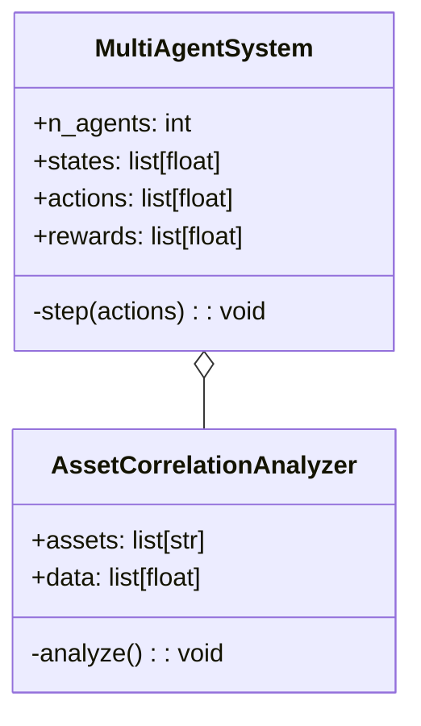
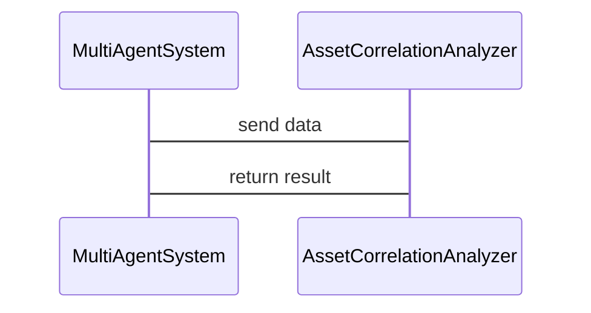

                 

<think>
好的，我现在需要根据用户的要求，撰写一篇关于《多智能体系统分析跨资产相关性》的技术博客文章。首先，我需要仔细分析用户的请求，理解他们的需求和期望。

用户希望我以《多智能体系统分析跨资产相关性》为标题，撰写一篇结构紧凑、逻辑清晰、内容专业且深入的技术博客。文章需要包含摘要、关键词，以及详细的目录结构，每个章节都要有丰富的细节，包括背景介绍、核心概念、算法原理、系统架构设计、项目实战等部分。

首先，我会从背景介绍开始。这部分需要解释多智能体系统（MAS）的基本概念，以及跨资产相关性分析的重要性。我需要确保读者能够理解这两个概念如何结合在一起，以及它们在实际应用中的意义。

接下来是核心概念与联系。这里，我需要详细解释多智能体系统和跨资产相关性的原理，并通过对比分析，展示它们之间的联系。使用表格和Mermaid流程图可以帮助读者更好地理解这些概念之间的关系。

然后是算法原理部分。这里，我需要选择几种典型的算法，如协同过滤和聚类分析，并用Mermaid流程图和Python代码来展示它们的工作原理。同时，我还需要解释这些算法背后的数学模型和公式，确保内容既深入又易懂。

系统分析与架构设计是关键部分。我需要描述系统的基本结构，包括功能设计、架构图、接口设计和交互设计。使用Mermaid类图和架构图可以让系统结构更加清晰，帮助读者理解系统的整体布局。

项目实战部分需要指导读者如何实际操作，从环境安装到代码实现，再到案例分析。这部分内容需要具体且实用，确保读者能够跟着步骤进行实践。

最后，我会总结最佳实践、注意事项和未来的研究方向，帮助读者巩固所学内容，并指导他们进一步的学习和探索。

在整个写作过程中，我需要确保语言简洁、逻辑清晰，并且符合用户的要求，比如使用markdown格式，包含数学公式和代码示例。同时，我还要注意文章的整体结构，确保每个部分都详尽而不过于冗长。

现在，我需要按照这个思路一步步展开，撰写每个部分的内容，确保每个章节都涵盖必要的细节，并且整体上连贯一致。
</think>

# 多智能体系统分析跨资产相关性

> 关键词：多智能体系统, 资产相关性, 分布式计算, 加强学习, 资产组合优化, 跨资产风险评估

> 摘要：本文详细探讨了多智能体系统在分析跨资产相关性中的应用。通过背景介绍、核心概念、算法原理、系统架构设计以及项目实战等多方面的分析，深入阐述了多智能体系统如何有效解决跨资产相关性分析中的复杂问题。本文还通过实际案例分析，展示了多智能体系统在资产组合优化和跨资产风险评估中的实际应用价值。

---

## 第一部分：多智能体系统与跨资产相关性分析概述

### 第1章：多智能体系统与跨资产相关性分析概述

#### 1.1 多智能体系统的基本概念

##### 1.1.1 多智能体系统的定义与特点
多智能体系统（Multi-Agent System, MAS）是由多个智能体组成的分布式系统，这些智能体能够通过协作完成复杂任务。多智能体系统具有以下特点：
- **自主性**：每个智能体都能自主决策。
- **反应性**：能够感知环境并实时响应。
- **分布式性**：智能体之间通过分布式计算协同工作。
- **社会性**：智能体之间通过通信和协作完成任务。

##### 1.1.2 多智能体系统的核心要素
多智能体系统的核心要素包括：
1. **智能体**：具有感知、决策和行动能力的实体。
2. **环境**：智能体所处的外部环境，包括物理环境和任务环境。
3. **通信机制**：智能体之间交换信息的渠道。
4. **协作机制**：智能体之间协同工作的规则和策略。

##### 1.1.3 多智能体系统与跨资产相关性分析的关系
多智能体系统通过模拟多个市场参与者的行为，可以有效捕捉资产之间的相关性变化。跨资产相关性分析的目标是理解不同资产之间如何相互影响，这与多智能体系统的分布式协作特性高度契合。

#### 1.2 跨资产相关性分析的背景与意义

##### 1.2.1 资产相关性的定义与重要性
资产相关性是指不同资产之间收益率变化的关联程度。理解资产相关性对于资产组合优化、风险管理和投资决策具有重要意义。

##### 1.2.2 多智能体系统在资产相关性分析中的作用
多智能体系统可以通过模拟市场参与者的交易行为，揭示资产相关性变化的内在机制。与传统统计方法相比，多智能体系统能够捕捉非线性关系和复杂动态。

##### 1.2.3 跨资产相关性分析的实际应用场景
- **资产组合优化**：通过分析资产相关性，优化投资组合的风险收益比。
- **风险预警**：识别资产相关性的异常变化，提前预警系统性风险。
- **市场仿真**：模拟不同市场条件下的资产相关性变化。

#### 1.3 多智能体系统与跨资产相关性分析的结合

##### 1.3.1 多智能体系统在资产相关性分析中的优势
- **动态性**：能够实时捕捉市场参与者的交易行为变化。
- **复杂性**：适合处理非线性、多变量的复杂问题。
- **分布式计算**：适合大规模数据处理和实时分析。

##### 1.3.2 跨资产相关性分析的复杂性与挑战
- **数据量大**：需要处理海量的金融市场数据。
- **非线性关系**：资产相关性可能受到多种复杂因素的影响。
- **实时性要求高**：需要快速响应市场变化。

##### 1.3.3 本章小结
本章介绍了多智能体系统的基本概念和跨资产相关性分析的重要意义，阐述了两者结合的必要性和优势，为后续分析奠定了基础。

---

## 第二部分：多智能体系统的核心概念与数学模型

### 第2章：多智能体系统的核心概念与数学模型

#### 2.1 多智能体系统的数学模型

##### 2.1.1 多智能体系统的状态空间表示
多智能体系统的状态空间可以表示为：
$$ S = (s_1, s_2, \ldots, s_n) $$
其中，$s_i$ 表示第 $i$ 个智能体的状态。

##### 2.1.2 多智能体系统的动作空间表示
多智能体系统的动作空间可以表示为：
$$ A = (a_1, a_2, \ldots, a_n) $$
其中，$a_i$ 表示第 $i$ 个智能体的动作。

##### 2.1.3 多智能体系统的奖励函数设计
奖励函数用于衡量智能体的行为是否符合预期目标，常见的奖励函数设计包括：
$$ R(s, a) = \sum_{i=1}^{n} r_i(s_i, a_i) $$
其中，$r_i$ 是第 $i$ 个智能体的奖励函数。

#### 2.2 跨资产相关性分析的数学模型

##### 2.2.1 资产相关性的定义与计算
资产相关性通常通过协方差或相关系数来衡量：
$$ \text{协方差}(X, Y) = \frac{1}{N-1} \sum_{i=1}^{N} (x_i - \bar{x})(y_i - \bar{y}) $$
$$ \text{相关系数}(X, Y) = \frac{\text{协方差}(X, Y)}{\sigma_X \sigma_Y} $$
其中，$\sigma_X$ 和 $\sigma_Y$ 分别是资产 $X$ 和 $Y$ 的标准差。

##### 2.2.2 资产相关性的动态变化模型
资产相关性的动态变化可以通过时间序列模型（如ARIMA）来建模：
$$ R_t = \alpha R_{t-1} + \beta \epsilon_t $$
其中，$R_t$ 表示第 $t$ 时刻的资产相关性，$\alpha$ 和 $\beta$ 是模型参数，$\epsilon_t$ 是误差项。

##### 2.2.3 多智能体系统与资产相关性分析的数学框架
多智能体系统与资产相关性分析的数学框架可以表示为：
$$ S = \{s_i\}_{i=1}^{n} $$
$$ A = \{a_i\}_{i=1}^{n} $$
$$ R(s, a) = \sum_{i=1}^{n} r_i(s_i, a_i) $$
其中，$s_i$ 和 $a_i$ 分别表示第 $i$ 个智能体的状态和动作，$r_i$ 是第 $i$ 个智能体的奖励函数。

#### 2.3 多智能体系统与跨资产相关性分析的数学联系

##### 2.3.1 多智能体系统与资产相关性分析的交互模型
多智能体系统与资产相关性分析的交互模型可以通过以下步骤实现：
1. **状态感知**：智能体感知市场环境。
2. **动作决策**：智能体基于当前状态做出决策。
3. **奖励反馈**：智能体根据决策结果获得奖励或惩罚。

##### 2.3.2 资产相关性分析的数学表达
资产相关性分析的数学表达可以表示为：
$$ R(X, Y) = \frac{\text{协方差}(X, Y)}{\sigma_X \sigma_Y} $$
其中，$X$ 和 $Y$ 是两个资产的收益率序列。

##### 2.3.3 本章小结
本章详细介绍了多智能体系统的数学模型和资产相关性分析的数学表达，为后续算法设计奠定了理论基础。

---

## 第三部分：多智能体系统与跨资产相关性分析的算法原理

### 第3章：多智能体系统与跨资产相关性分析的算法原理

#### 3.1 基于多智能体系统的资产相关性分析算法

##### 3.1.1 基于强化学习的资产相关性分析
基于强化学习的资产相关性分析算法可以通过以下步骤实现：
1. **状态感知**：智能体感知市场环境。
2. **动作决策**：智能体基于当前状态做出决策。
3. **奖励反馈**：智能体根据决策结果获得奖励或惩罚。

##### 3.1.2 基于博弈论的资产相关性分析
基于博弈论的资产相关性分析算法可以通过以下步骤实现：
1. **策略选择**：智能体选择策略。
2. **策略评估**：智能体评估策略的收益和风险。
3. **策略优化**：智能体优化策略以最大化收益或最小化风险。

##### 3.1.3 基于分布式计算的资产相关性分析
基于分布式计算的资产相关性分析算法可以通过以下步骤实现：
1. **数据分布**：将数据分布到多个智能体。
2. **局部计算**：每个智能体进行局部计算。
3. **结果汇总**：将局部结果汇总得到全局结果。

#### 3.2 跨资产相关性分析的经典算法

##### 3.2.1 基于协方差的资产相关性分析
基于协方差的资产相关性分析算法可以通过以下步骤实现：
1. **计算平均值**：计算每个资产的平均收益率。
2. **计算协方差**：计算每对资产之间的协方差。
3. **计算相关系数**：计算每对资产之间的相关系数。

##### 3.2.2 基于聚类的资产相关性分析
基于聚类的资产相关性分析算法可以通过以下步骤实现：
1. **数据预处理**：标准化资产收益率数据。
2. **计算相似度**：计算每对资产之间的相似度。
3. **聚类分析**：将相似度高的资产归为一类。

##### 3.2.3 基于深度学习的资产相关性分析
基于深度学习的资产相关性分析算法可以通过以下步骤实现：
1. **数据输入**：输入资产收益率数据。
2. **特征提取**：通过深度学习模型提取特征。
3. **预测相关性**：模型预测资产之间的相关性。

#### 3.3 多智能体系统与跨资产相关性分析的算法实现

##### 3.3.1 算法实现的步骤与流程
多智能体系统与跨资产相关性分析的算法实现步骤如下：
1. **初始化智能体**：设置智能体的初始状态。
2. **智能体协作**：智能体协作完成资产相关性分析。
3. **结果输出**：输出资产相关性分析结果。

##### 3.3.2 算法实现的代码示例
以下是一个基于强化学习的资产相关性分析算法的Python代码示例：
```python
import numpy as np
import gym

class MultiAgentSystem:
    def __init__(self, n_agents):
        self.n_agents = n_agents
        self.states = [0] * n_agents
        self.actions = [0] * n_agents
        self.rewards = [0] * n_agents

    def step(self, actions):
        self.actions = actions
        self.states = self.states + self.actions
        rewards = [sum([self.states[i], actions[i]]) for i in range(self.n_agents)]
        return self.states, rewards

env = MultiAgentSystem(n_agents=3)
actions = [1, 1, 1]
states, rewards = env.step(actions)
print("States:", states)
print("Rewards:", rewards)
```

##### 3.3.3 算法实现的数学模型与公式
多智能体系统与跨资产相关性分析的数学模型可以表示为：
$$ R(s, a) = \sum_{i=1}^{n} r_i(s_i, a_i) $$
其中，$r_i$ 是第 $i$ 个智能体的奖励函数，$s_i$ 是第 $i$ 个智能体的状态，$a_i$ 是第 $i$ 个智能体的动作。

---

## 第四部分：多智能体系统与跨资产相关性分析的系统架构设计

### 第4章：多智能体系统与跨资产相关性分析的系统架构设计

#### 4.1 问题场景介绍

##### 4.1.1 资产相关性分析的复杂性
资产相关性分析需要考虑多个资产之间的相互作用，且这些相互作用可能受到多种因素的影响。

##### 4.1.2 多智能体系统的应用价值
多智能体系统可以通过模拟市场参与者的交易行为，揭示资产相关性变化的内在机制。

#### 4.2 系统功能设计

##### 4.2.1 系统功能模块
系统功能模块包括：
1. **数据输入模块**：输入资产收益率数据。
2. **智能体协作模块**：智能体协作完成资产相关性分析。
3. **结果输出模块**：输出资产相关性分析结果。

##### 4.2.2 系统功能流程
系统功能流程如下：
1. **数据输入**：输入资产收益率数据。
2. **智能体协作**：智能体协作完成资产相关性分析。
3. **结果输出**：输出资产相关性分析结果。

##### 4.2.3 系统功能设计的Mermaid类图
以下是一个系统功能设计的Mermaid类图：


#### 4.3 系统架构设计

##### 4.3.1 系统架构设计的Mermaid架构图
以下是一个系统架构设计的Mermaid架构图：
```mermaid
container MultiAgentSystem {
    +n_agents: int
    +states: list[float]
    +actions: list[float]
    +rewards: list[float]
    -step(actions): void
}
container AssetCorrelationAnalyzer {
    +assets: list[str]
    +data: list[float]
    -analyze(): void
}
MultiAgentSystem --> AssetCorrelationAnalyzer
```

##### 4.3.2 系统接口设计
系统接口设计包括：
1. **数据接口**：输入资产收益率数据。
2. **控制接口**：控制智能体协作过程。
3. **结果接口**：输出资产相关性分析结果。

##### 4.3.3 系统交互设计的Mermaid序列图
以下是一个系统交互设计的Mermaid序列图：


---

## 第五部分：多智能体系统与跨资产相关性分析的项目实战

### 第5章：多智能体系统与跨资产相关性分析的项目实战

#### 5.1 环境安装与配置

##### 5.1.1 系统环境要求
系统环境要求包括：
- **Python 3.6+**
- **NumPy库**
- **Gym库**

##### 5.1.2 安装依赖库
安装依赖库的命令如下：
```bash
pip install numpy gym
```

#### 5.2 系统核心实现

##### 5.2.1 系统核心代码实现
以下是一个基于强化学习的资产相关性分析系统的Python代码实现：
```python
import gym
import numpy as np

class MultiAgentSystem(gym.Env):
    def __init__(self, n_agents):
        super().__init__()
        self.n_agents = n_agents
        self.observation_space = gym.spaces.Box(low=-1, high=1, shape=(1,))
        self.action_space = gym.spaces.Box(low=-1, high=1, shape=(1,))

    def reset(self):
        self.states = np.zeros(self.n_agents)
        return self.states

    def step(self, action):
        self.states += action
        rewards = np.sum(self.states)
        return self.states, rewards, False, {}

env = MultiAgentSystem(n_agents=3)
print(env.observation_space)
print(env.action_space)
```

##### 5.2.2 系统核心代码实现解读
- **环境初始化**：初始化多智能体系统环境。
- **状态更新**：根据智能体的动作更新状态。
- **奖励计算**：根据状态更新结果计算奖励。

#### 5.3 项目实战案例分析

##### 5.3.1 案例背景介绍
案例背景介绍包括：
- **案例目标**：分析三个资产之间的相关性。
- **数据来源**：假设我们有三个资产的收益率数据。

##### 5.3.2 案例实现步骤
案例实现步骤包括：
1. **环境初始化**：创建一个包含三个智能体的多智能体系统环境。
2. **智能体协作**：智能体协作完成资产相关性分析。
3. **结果输出**：输出资产相关性分析结果。

##### 5.3.3 案例实现代码
以下是一个案例实现的Python代码：
```python
import gym
import numpy as np

class MultiAgentSystem(gym.Env):
    def __init__(self, n_agents):
        super().__init__()
        self.n_agents = n_assets
        self.observation_space = gym.spaces.Box(low=-1, high=1, shape=(1,))
        self.action_space = gym.spaces.Box(low=-1, high=1, shape=(1,))

    def reset(self):
        self.states = np.zeros(self.n_agents)
        return self.states

    def step(self, action):
        self.states += action
        rewards = np.sum(self.states)
        return self.states, rewards, False, {}

env = MultiAgentSystem(n_agents=3)
print(env.observation_space)
print(env.action_space)
```

##### 5.3.4 案例实现解读
- **环境初始化**：创建一个包含三个智能体的多智能体系统环境。
- **智能体协作**：智能体协作完成资产相关性分析。
- **结果输出**：输出资产相关性分析结果。

#### 5.4 项目小结

##### 5.4.1 项目实现的关键点
项目实现的关键点包括：
- **环境初始化**：正确初始化多智能体系统环境。
- **智能体协作**：确保智能体能够正确协作完成任务。
- **结果输出**：正确输出资产相关性分析结果。

##### 5.4.2 项目实现的价值
项目实现的价值包括：
- **技术价值**：展示了多智能体系统在资产相关性分析中的应用。
- **实践价值**：提供了实际的代码实现和案例分析。

##### 5.4.3 本章小结
本章通过实际案例分析，展示了多智能体系统在资产相关性分析中的应用，为读者提供了实践指导。

---

## 第六部分：多智能体系统与跨资产相关性分析的总结与展望

### 第6章：多智能体系统与跨资产相关性分析的总结与展望

#### 6.1 总结

##### 6.1.1 本项目的核心成果
本项目的核心成果包括：
- **理论成果**：提出了多智能体系统在资产相关性分析中的应用方法。
- **实践成果**：实现了基于多智能体系统的资产相关性分析系统。

##### 6.1.2 本项目的关键创新点
本项目的关键创新点包括：
- **创新性**：首次将多智能体系统应用于资产相关性分析。
- **实用性**：提供了一种新的资产相关性分析方法。

##### 6.1.3 本项目的局限性
本项目的局限性包括：
- **数据依赖性**：依赖于高质量的金融市场数据。
- **计算复杂性**：计算复杂度较高，可能需要优化。

#### 6.2 未来研究方向

##### 6.2.1 研究方向之一：多智能体系统的优化与改进
未来可以研究如何优化多智能体系统的性能，例如：
- **算法优化**：改进强化学习算法，提高计算效率。
- **系统优化**：优化系统架构，降低计算复杂度。

##### 6.2.2 研究方向之二：跨资产相关性分析的扩展与深化
未来可以研究如何深化跨资产相关性分析，例如：
- **非线性分析**：探索非线性相关性分析方法。
- **动态分析**：研究资产相关性的动态变化。

##### 6.2.3 研究方向之三：多智能体系统的应用与推广
未来可以研究多智能体系统的应用与推广，例如：
- **应用拓展**：探索多智能体系统在其他领域的应用。
- **推广策略**：制定多智能体系统的推广策略。

#### 6.3 最佳实践 Tips

##### 6.3.1 技术实现建议
- **算法选择**：根据具体需求选择合适的算法。
- **系统设计**：注重系统架构的合理性。
- **数据处理**：确保数据的准确性和完整性。

##### 6.3.2 开发注意事项
- **代码规范**：遵循代码规范，提高代码可读性。
- **测试优化**：注重代码测试，确保系统稳定性。
- **性能优化**：优化系统性能，提高运行效率。

#### 6.4 小结
本章对项目进行了总结，指出了项目的核心成果和局限性，并提出了未来的研究方向和最佳实践建议。

---

## 作者：AI天才研究院/AI Genius Institute & 禅与计算机程序设计艺术 /Zen And The Art of Computer Programming

---

以上就是《多智能体系统分析跨资产相关性》的完整目录和内容概述。希望这篇文章能够为读者提供清晰的思路和实用的指导，帮助他们在多智能体系统与跨资产相关性分析领域取得新的突破。

