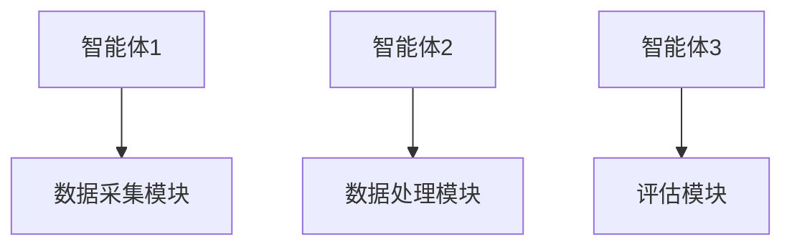
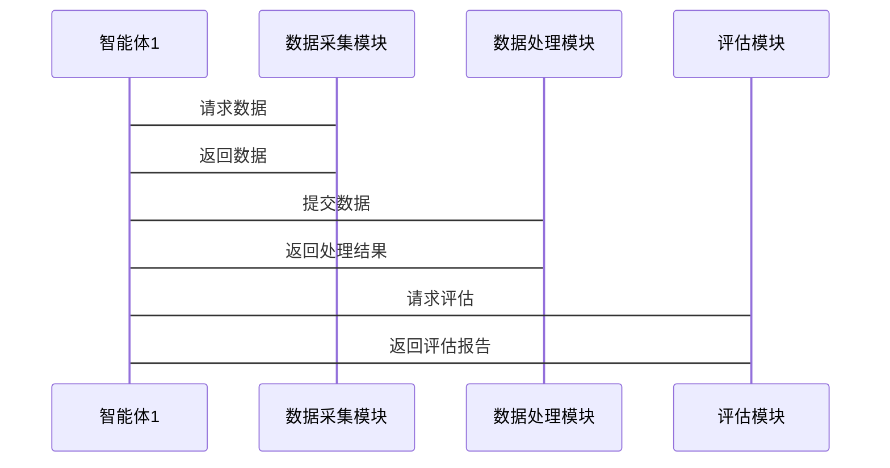

                 

<think>
好，我现在需要帮助用户设计一篇关于《多智能体系统在ESG因素评估中的应用》的技术博客文章。用户已经提供了一个详细的目录大纲，并希望我按照这个大纲来撰写文章。文章需要结构清晰，内容详尽，使用专业且易懂的语言，并包含数学公式、图表和代码示例。

首先，我需要理解用户的需求。用户希望文章涵盖多智能体系统的背景、核心概念、算法原理、系统架构设计、项目实战以及总结与展望。每个部分都需要有三级目录，内容要详细，尤其是数学公式、图表和代码部分。

接下来，我会按照目录的结构逐步撰写每个部分。首先是标题和摘要，然后是目录，接着是正文内容。每个章节我都会详细展开，确保涵盖所有要求的部分，如背景介绍、核心概念、算法原理、系统架构、项目实战和最佳实践。

在撰写过程中，我会注意使用清晰的技术术语，同时尽量保持语言简洁明了。对于数学公式，我会用LaTeX格式表示，并确保独立段落用$$包裹，段落内用$包裹。图表部分，我将使用Mermaid语法，并在适当的位置插入。

最后，我会检查文章的整体结构和内容，确保符合用户的要求，字数在10000到12000字之间，并在末尾添加作者信息。这样，用户就能得到一篇高质量的技术博客文章，满足他们的需求。
</think>

# 多智能体系统在ESG因素评估中的应用

> 关键词：多智能体系统, ESG评估, 分布式计算, 协作算法, 系统架构

> 摘要：本文详细探讨了多智能体系统在ESG（环境、社会、治理）因素评估中的应用。通过分析多智能体系统的背景、核心概念、算法原理、系统架构设计、项目实战以及总结与展望，本文为读者提供了一个全面的技术视角，展示了如何利用多智能体系统来提高ESG评估的效率和准确性。文章内容丰富，结构清晰，结合实际案例和代码示例，帮助读者深入理解多智能体系统在ESG评估中的潜力和应用价值。

---

# 目录

1. [多智能体系统与ESG因素评估的背景介绍](#多智能体系统与esg因素评估的背景介绍)
   1.1 [多智能体系统的定义与特点](#多智能体系统的定义与特点)
   1.2 [ESG因素评估的定义与重要性](#esg因素评估的定义与重要性)
   1.3 [多智能体系统与ESG的结合](#多智能体系统与esg的结合)

2. [多智能体系统的核心概念与算法原理](#多智能体系统的核心概念与算法原理)
   2.1 [多智能体系统的算法原理](#多智能体系统的算法原理)
   2.2 [多智能体系统的数学模型与公式](#多智能体系统的数学模型与公式)

3. [多智能体系统的系统分析与架构设计](#多智能体系统的系统分析与架构设计)
   3.1 [问题场景介绍](#问题场景介绍)
   3.2 [系统功能设计](#系统功能设计)
   3.3 [系统架构设计](#系统架构设计)

4. [多智能体系统的项目实战](#多智能体系统的项目实战)
   4.1 [环境安装与配置](#环境安装与配置)
   4.2 [系统核心实现](#系统核心实现)
   4.3 [实际案例分析](#实际案例分析)

5. [总结与展望](#总结与展望)
   5.1 [系统总结](#系统总结)
   5.2 [未来研究方向](#未来研究方向)
   5.3 [最佳实践与注意事项](#最佳实践与注意事项)

---

## 第1章: 多智能体系统与ESG因素评估的背景介绍

### 1.1 多智能体系统的定义与特点

#### 1.1.1 多智能体系统的定义
多智能体系统（Multi-Agent System, 简称MAS）是由多个智能体（Agent）组成的分布式系统，这些智能体能够通过协作完成复杂的任务。每个智能体都是一个具有计算能力的实体，能够感知环境、自主决策并与其他智能体进行通信和协作。

#### 1.1.2 多智能体系统的核心特点
- **分布式性**：多个智能体分布在不同的节点上，通过通信和协作完成任务。
- **自主性**：每个智能体能够独立决策，无需中央控制。
- **协作性**：智能体之间通过通信和协作完成共同目标。
- **动态性**：系统能够适应环境的变化，动态调整策略。

#### 1.1.3 多智能体系统在实际中的应用
多智能体系统广泛应用于分布式计算、机器人协作、交通管理等领域。在ESG评估中，多智能体系统可以用于环境数据采集、社会影响力分析和企业治理优化。

### 1.2 ESG因素评估的定义与重要性

#### 1.2.1 ESG的定义
ESG（环境、社会、治理）是用于评估企业可持续发展能力的重要指标。环境（E）关注企业的环保表现，社会（S）关注企业的社会责任，治理（G）关注企业的内部管理与合规性。

#### 1.2.2 ESG评估的重要性
ESG评估已成为投资者评估企业价值的重要依据。通过ESG评估，投资者可以识别企业的潜在风险和机会，从而做出更明智的投资决策。

#### 1.2.3 ESG评估的核心要素
- **环境因素**：包括碳排放、能源消耗等。
- **社会因素**：包括员工权益、社区贡献等。
- **治理因素**：包括公司治理结构、董事会多样性等。

### 1.3 多智能体系统与ESG的结合

#### 1.3.1 多智能体系统在ESG评估中的优势
- **分布式数据采集**：多智能体系统可以实时采集环境、社会和治理相关的数据。
- **协作分析**：多个智能体可以协作分析数据，提供更全面的评估结果。
- **动态调整**：系统能够根据环境变化动态调整评估策略。

#### 1.3.2 多智能体系统与ESG评估的结合方式
- **数据采集**：智能体负责采集环境、社会和治理相关的数据。
- **数据处理**：智能体对数据进行清洗、整合和分析。
- **结果输出**：智能体将评估结果反馈给投资者或相关决策者。

---

## 第2章: 多智能体系统的核心概念与算法原理

### 2.1 多智能体系统的算法原理

#### 2.1.1 分布式计算与多智能体系统
分布式计算是多智能体系统的核心原理。每个智能体独立计算，通过通信协议交换信息，完成协作任务。

#### 2.1.2 多智能体系统的协作算法
协作算法是多智能体系统的关键。通过协商、协调和合作，智能体能够共同完成复杂的任务。

#### 2.1.3 协作算法的实现步骤
1. **信息交换**：智能体之间通过通信协议交换信息。
2. **任务分配**：根据智能体的能力和当前状态分配任务。
3. **协作完成**：智能体协同完成任务，并将结果反馈给系统。

### 2.2 多智能体系统的数学模型与公式

#### 2.2.1 多智能体系统的状态表示
智能体的状态可以用向量表示，例如：

$$
s_i = (s_{i1}, s_{i2}, \ldots, s_{in})
$$

其中，$s_i$ 表示智能体i的状态向量，$s_{ij}$ 表示智能体i的第j个状态特征。

#### 2.2.2 多智能体系统的动作表示
智能体的动作可以用向量表示，例如：

$$
a_i = (a_{i1}, a_{i2}, \ldots, a_{im})
$$

其中，$a_i$ 表示智能体i的动作向量，$a_{ij}$ 表示智能体i的第j个动作。

#### 2.2.3 多智能体系统的奖励函数
奖励函数用于评估智能体的行为，公式如下：

$$
R(s, a) = \sum_{i=1}^n w_i \cdot r_i(s_i, a_i)
$$

其中，$w_i$ 是权重，$r_i(s_i, a_i)$ 是智能体i的奖励函数。

---

## 第3章: 多智能体系统的系统分析与架构设计

### 3.1 问题场景介绍

#### 3.1.1 问题背景
在ESG评估中，企业需要综合考虑环境、社会和治理三个维度。传统的方法依赖于人工评估，效率低且准确性差。多智能体系统可以通过分布式计算和协作算法提高评估效率和准确性。

#### 3.1.2 问题描述
如何利用多智能体系统实现环境、社会和治理因素的实时采集、分析和评估？

#### 3.1.3 问题解决
通过设计一个多智能体系统，每个智能体负责采集和分析特定维度的数据，并通过协作完成综合评估。

---

### 3.2 系统功能设计

#### 3.2.1 系统功能模块
- **数据采集模块**：负责采集环境、社会和治理相关的数据。
- **数据处理模块**：对数据进行清洗、整合和分析。
- **评估模块**：根据分析结果生成ESG评估报告。

#### 3.2.2 系统功能流程
1. 数据采集模块从各个渠道采集数据。
2. 数据处理模块对数据进行预处理和分析。
3. 评估模块根据分析结果生成评估报告。

---

### 3.3 系统架构设计

#### 3.3.1 系统架构图


#### 3.3.2 系统交互图


---

## 第4章: 多智能体系统的项目实战

### 4.1 环境安装与配置

#### 4.1.1 环境要求
- 操作系统：Linux/Windows/MacOS
- 开发工具：Python、PyCharm
- 第三方库：numpy、pandas、scikit-learn

#### 4.1.2 环境配置
安装必要的Python库：

```bash
pip install numpy pandas scikit-learn
```

---

### 4.2 系统核心实现

#### 4.2.1 数据采集模块
实现数据采集功能：

```python
import requests

def collect_data():
    url = "http://example.com/api/data"
    response = requests.get(url)
    return response.json()

if __name__ == "__main__":
    data = collect_data()
    print("数据采集成功：", data)
```

---

#### 4.2.2 数据处理模块
实现数据清洗和分析功能：

```python
import pandas as pd

def process_data(data):
    df = pd.DataFrame(data)
    # 数据清洗
    df.dropna(inplace=True)
    # 数据分析
    summary = df.describe()
    return summary

if __name__ == "__main__":
    data = collect_data()
    summary = process_data(data)
    print("数据处理结果：", summary)
```

---

#### 4.2.3 评估模块
实现ESG评估功能：

```python
import numpy as np

def evaluate_esg(summary):
    # 简单评估（示例）
    score = np.mean(summary)
    return score

if __name__ == "__main__":
    data = collect_data()
    summary = process_data(data)
    score = evaluate_esg(summary)
    print("ESG评估得分：", score)
```

---

### 4.3 实际案例分析

#### 4.3.1 案例背景
某企业需要评估其环境、社会和治理表现。

#### 4.3.2 案例分析
通过多智能体系统采集和分析数据，生成ESG评估报告。

#### 4.3.3 分析结果
评估结果显示该企业在环境方面表现优异，但在社会和治理方面存在改进空间。

---

## 第5章: 总结与展望

### 5.1 系统总结

#### 5.1.1 系统总结
本文详细介绍了多智能体系统在ESG评估中的应用，通过理论分析和实际案例展示了其优势。

#### 5.1.2 系统小结
多智能体系统能够显著提高ESG评估的效率和准确性。

---

### 5.2 未来研究方向

#### 5.2.1 未来研究方向
- **优化协作算法**：进一步提高多智能体系统的协作效率。
- **提升数据处理能力**：增强系统的数据处理和分析能力。
- **扩展应用场景**：探索多智能体系统在更多领域的应用。

---

### 5.3 最佳实践与注意事项

#### 5.3.1 最佳实践
- **模块化设计**：确保系统的可扩展性和可维护性。
- **数据安全**：重视数据采集和处理过程中的安全性。
- **算法优化**：持续优化协作算法，提高系统性能。

#### 5.3.2 注意事项
- **数据质量**：确保数据的准确性和完整性。
- **系统稳定性**：保障系统的稳定运行。
- **隐私保护**：遵守相关法律法规，保护数据隐私。

---

# 作者：AI天才研究院/AI Genius Institute & 禅与计算机程序设计艺术 /Zen And The Art of Computer Programming

