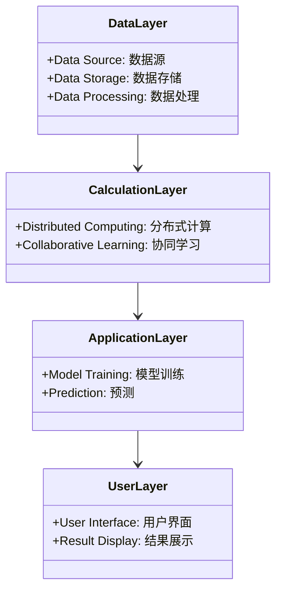

                 


# 多智能体系统在产业升级趋势预测中的应用：把握结构性机会

> 关键词：多智能体系统，产业升级，趋势预测，协同学习，分布式计算

> 摘要：多智能体系统（Multi-Agent System, MAS）作为一种新兴的分布式计算范式，正在成为产业升级趋势预测中的重要工具。本文将从产业升级趋势预测的背景出发，详细阐述多智能体系统的概念、核心原理、算法实现、系统架构及实际应用案例。通过分析多智能体系统的协同学习机制、分布式计算能力以及其在复杂场景下的适应性，揭示其在产业升级趋势预测中的独特优势和应用价值。本文还将结合具体项目实战，展示如何利用多智能体系统捕捉结构性机会，为企业制定精准的产业升级策略提供理论支持和实践指导。

---

## 第一部分：产业升级趋势预测的背景与问题分析

### 第1章：产业升级趋势预测的背景与挑战

#### 1.1 产业升级趋势的背景分析
产业升级是企业在全球化竞争中保持竞争力的关键。随着经济全球化和数字化转型的加速，企业需要不断优化其业务模式、生产流程和技术创新能力。然而，产业升级的趋势预测面临着以下挑战：
- 数据量大且复杂：产业升级涉及的因素众多，包括市场、技术、政策、消费者行为等，数据来源分散且异构。
- 动态变化快：产业升级趋势受多种外部因素影响，如政策变化、技术革新、市场需求波动等，具有高度动态性。
- 预测精度要求高：产业升级涉及巨额投资和长期规划，预测结果的准确性直接影响企业的战略决策。

#### 1.2 多智能体系统的概念与特点
多智能体系统（Multi-Agent System, MAS）是由多个智能体组成的分布式系统，每个智能体具备一定的自主性、反应性和协同能力。与传统的集中式系统相比，MAS具有以下特点：
- 分布式计算：智能体之间通过分布式计算完成任务，避免了单点故障。
- 协作性：智能体能够通过通信和协调机制共同完成复杂任务。
- 自主性：每个智能体具备一定的决策能力和问题解决能力，能够独立完成部分任务。
- 动态适应性：智能体能够根据环境变化动态调整行为策略。

---

### 第2章：产业升级趋势预测中的问题与需求

#### 2.1 产业升级趋势预测的核心问题
产业升级趋势预测的核心问题包括：
- 如何从海量数据中提取有价值的信息。
- 如何构建动态预测模型，捕捉产业升级中的结构性机会。
- 如何实现多智能体之间的协同学习与知识共享。

#### 2.2 多智能体系统在产业升级趋势预测中的优势
多智能体系统在产业升级趋势预测中的优势主要体现在以下几个方面：
- **分布式计算能力**：MAS能够处理大规模、异构的数据源，通过分布式计算提高预测效率。
- **协同学习能力**：多个智能体可以通过协同学习机制共享知识和经验，提升预测模型的准确性。
- **动态适应性**：MAS能够实时感知环境变化，动态调整预测模型和策略。

---

## 第二部分：多智能体系统的算法原理与实现

### 第3章：多智能体系统的算法原理

#### 3.1 分布式计算与协同学习
**分布式计算**是MAS的核心机制之一，其基本流程如下：
1. **任务分解**：将复杂任务分解为多个子任务，分配给不同的智能体。
2. **数据通信**：智能体之间通过通信协议交换数据和信息。
3. **协同学习**：多个智能体通过分布式优化算法（如分布式梯度下降）共同训练模型。

**协同学习机制**的核心在于智能体之间的知识共享。通过协同学习，智能体能够将局部知识转化为全局知识，从而提高预测模型的泛化能力。

#### 3.2 博弈论模型与多智能体系统的结合
博弈论模型为多智能体系统的决策机制提供了理论基础。在产业升级趋势预测中，智能体之间的博弈关系可以通过以下步骤建模：
1. **定义博弈空间**：明确智能体的决策空间、动作空间和收益函数。
2. **构建博弈模型**：通过博弈论模型描述智能体之间的互动关系。
3. **求解纳什均衡**：找到最优策略组合，确保智能体之间的协作与竞争达到均衡状态。

---

### 第4章：多智能体系统的数学模型与实现

#### 4.1 产业升级趋势预测的数学模型
产业升级趋势预测的数学模型通常包括以下几个部分：
- **状态空间**：表示产业升级过程中的各种状态，如经济指标、政策变化、市场需求等。
- **动作空间**：表示智能体可以采取的行动，如调整生产计划、优化资源配置等。
- **转移概率**：描述状态转移的可能性。

通过马尔可夫决策过程（MDP）模型，可以将产业升级趋势预测问题转化为智能体在状态空间中的决策问题。具体数学公式如下：

$$
\pi(a|s) = \arg\max_{a} \sum_{s'} P(s' | s, a) Q(s, a)
$$

其中，$\pi(a|s)$表示在状态$s$下选择动作$a$的概率，$P(s' | s, a)$表示从状态$s$通过动作$a$转移到状态$s'$的概率，$Q(s, a)$表示动作$a$在状态$s$下的价值函数。

---

#### 4.2 分布式优化算法的实现
多智能体系统中的分布式优化算法可以通过以下步骤实现：
1. **初始化**：为每个智能体分配初始参数。
2. **通信**：智能体之间通过通信协议交换参数和数据。
3. **优化**：每个智能体根据接收的数据更新本地模型，通过分布式优化算法（如分布式梯度下降）完成全局优化。
4. **收敛判断**：当模型收敛时，停止优化过程。

---

## 第三部分：产业升级趋势预测的系统架构与项目实战

### 第5章：产业升级趋势预测的系统架构设计

#### 5.1 系统功能设计
产业升级趋势预测系统的功能模块包括：
- **数据采集模块**：从多种数据源采集产业升级相关的数据。
- **数据预处理模块**：对采集的数据进行清洗、转换和标准化处理。
- **模型训练模块**：利用多智能体系统中的分布式计算和协同学习算法训练预测模型。
- **预测模块**：基于训练好的模型，预测产业升级的趋势和结构性机会。

#### 5.2 系统架构设计
系统架构设计采用分层架构，主要包括数据层、计算层、应用层和用户层。以下为系统的类图和架构图：



---

### 第6章：项目实战——产业升级趋势预测系统开发

#### 6.1 环境安装与配置
- **安装依赖**：安装Python、TensorFlow、Distributed Computing框架等。
- **数据准备**：收集产业升级相关的数据，如经济指标、政策文件、市场需求等。
- **环境配置**：配置分布式计算环境，如使用Kubernetes集群。

#### 6.2 核心代码实现
以下是多智能体系统中协同学习算法的Python代码示例：

```python
import numpy as np
from distributed import Client

# 初始化分布式计算环境
client = Client('scheduler://localhost:8786')

# 定义协同学习算法
def collaborative_learning(data_shard, model_params):
    # 数据分片
    shard_size = len(data_shard)
    # 分布式训练
    with client.submit() as worker:
        worker.train_model(data_shard, model_params)
    # 合并模型参数
    return client.gather()

# 分配数据和模型参数
data = ...  # 分散的数据
model_params = ...  # 初始模型参数

# 调用协同学习算法
new_model_params = collaborative_learning(data, model_params)
```

---

### 第7章：总结与展望

#### 7.1 总结
多智能体系统在产业升级趋势预测中的应用具有显著优势，尤其是在分布式计算、协同学习和动态适应性方面。通过多智能体系统的应用，企业能够更准确地预测产业升级趋势，抓住结构性机会，提升竞争力。

#### 7.2 展望
未来，随着人工智能技术的不断发展，多智能体系统在产业升级趋势预测中的应用将更加广泛。以下是未来的发展方向：
1. **增强智能体的自主性**：通过强化学习等技术提升智能体的自主决策能力。
2. **优化分布式计算性能**：通过改进分布式计算框架提高系统的计算效率。
3. **结合边缘计算**：将多智能体系统与边缘计算结合，实现更高效的实时预测。

---

## 作者信息

作者：AI天才研究院/AI Genius Institute & 禅与计算机程序设计艺术/Zen And The Art of Computer Programming

---

通过本文的详细分析，我们可以看到，多智能体系统在产业升级趋势预测中的应用潜力巨大。无论是从算法原理、系统架构还是项目实战的角度来看，多智能体系统都为企业提供了更高效、更准确的预测工具。未来，随着技术的进一步发展，多智能体系统将在产业升级趋势预测中发挥更重要的作用。

