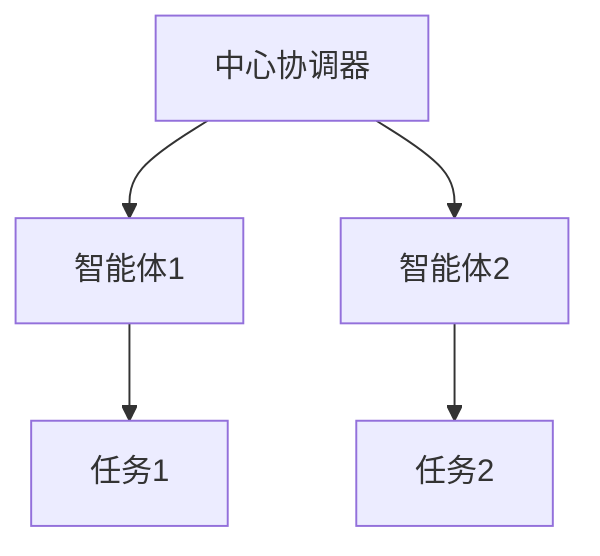
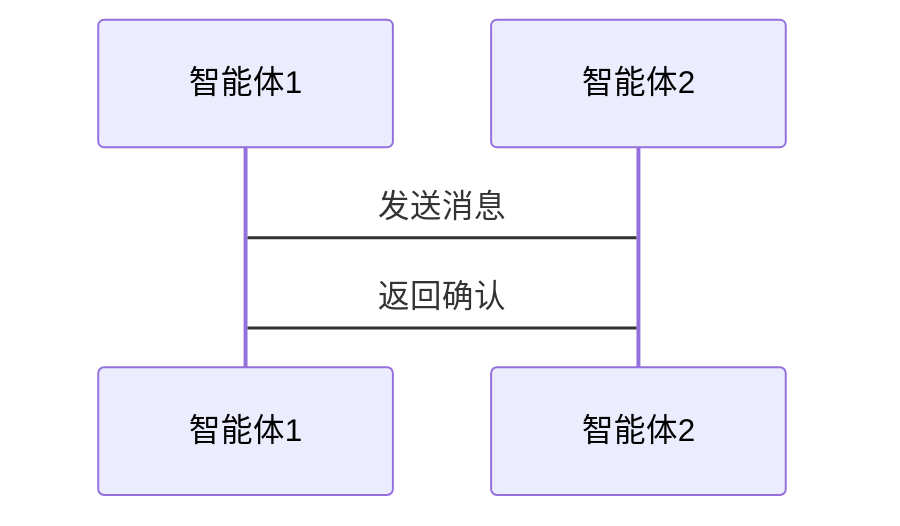
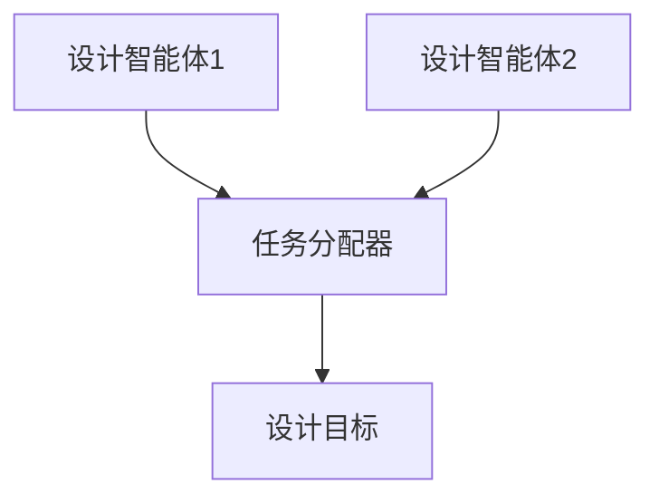
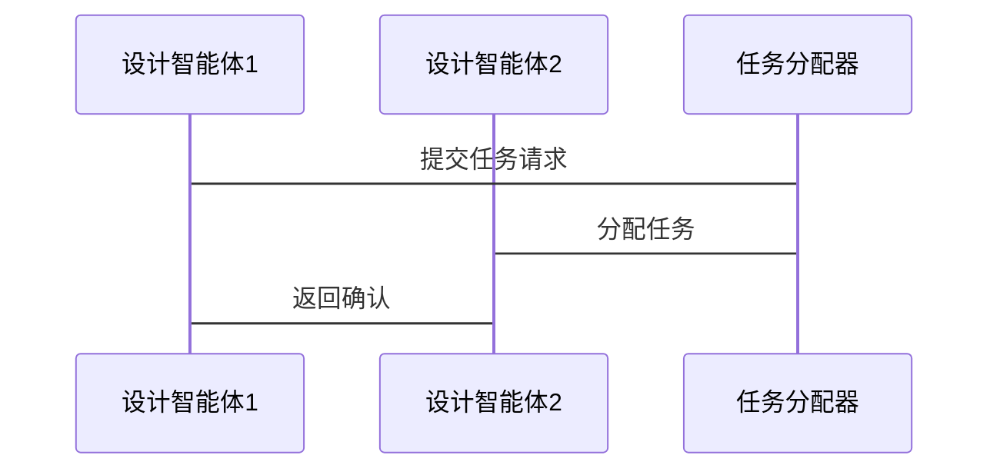
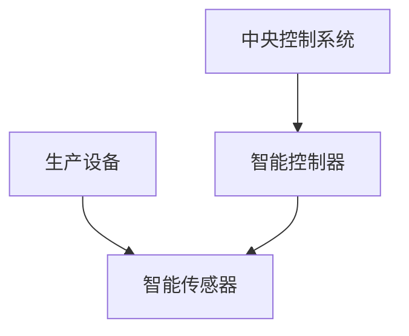
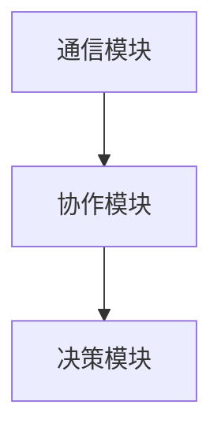
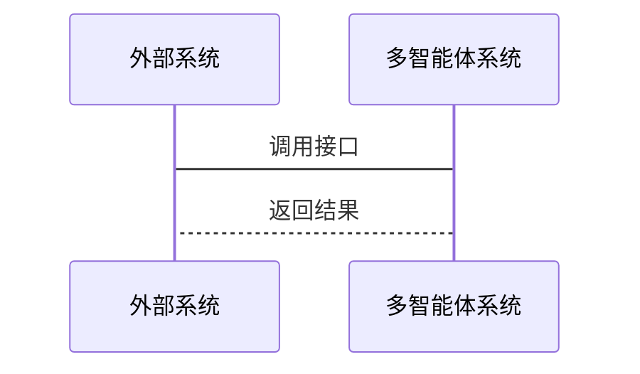

                 

<think>
嗯，用户希望我以《多智能体系统在产品生命周期分析中的应用》为标题，撰写一篇技术博客文章。我需要先理解用户的具体要求。用户提到文章需要逻辑清晰、结构紧凑，语言专业，还要包含摘要和关键词。另外，用户还给出了目录大纲，分为七个部分，每个部分都有详细的小节。

首先，我应该分析用户的需求。用户可能是一位技术专家，或者正在学习这个领域的学生，他们需要一篇结构严谨、内容详实的技术博客。关键词和摘要部分需要明确，帮助读者快速了解文章的核心内容。接下来，我需要按照目录大纲逐步展开每个部分，确保每个章节都有足够的细节和深度。

在撰写过程中，我需要确保每个小节都涵盖背景介绍、核心概念、算法原理、系统架构和项目实战等内容。比如，在产品生命周期概述部分，我需要解释每个阶段的特点和挑战，这可能涉及到产品设计、生产、销售等环节。同时，我需要使用mermaid图来展示系统架构、类图和流程图，帮助读者更好地理解。

此外，用户特别提到要包含数学公式，我需要用latex格式来表示，确保公式正确无误。在算法部分，我需要详细解释算法的原理，并提供代码示例，这样读者可以实际操作和理解。

最后，我需要在文章末尾添加作者信息，确保格式符合要求。整个思考过程需要确保文章结构完整，内容丰富，同时满足用户的所有具体要求。
</think>

# 多智能体系统在产品生命周期分析中的应用

## 关键词：多智能体系统、产品生命周期、协作设计、智能制造、预测维护

## 摘要：
多智能体系统（Multi-Agent System, MAS）是一种由多个智能体组成的分布式系统，这些智能体能够通过协作和协调完成复杂的任务。在产品生命周期管理中，多智能体系统能够通过智能化的协作和数据分析，显著提升产品的设计效率、生产优化、市场预测和维护管理。本文将从多智能体系统的理论基础出发，深入探讨其在产品生命周期分析中的应用，结合实际案例和系统架构设计，详细分析多智能体系统在产品生命周期管理中的优势和实现方法。

---

## 第一部分: 多智能体系统概述

### 第1章: 多智能体系统基础

#### 1.1 多智能体系统的定义与特点

##### 1.1.1 多智能体系统的定义
多智能体系统是由多个智能体（Agent）组成的分布式系统，这些智能体能够通过感知环境、自主决策并采取行动，以完成特定的任务。智能体可以是软件程序、机器人或其他智能设备。

##### 1.1.2 多智能体系统的五大特点

| 特点 | 描述 |
|------|------|
| 分布式 | 智能体分布在不同的位置，通过通信和协作完成任务。 |
| 协作性 | 智能体之间通过协作实现共同目标。 |
| 智能性 | 智能体具备感知、推理和决策能力。 |
| 动态性 | 系统环境动态变化，智能体能够自适应调整行为。 |
| 社会性 | 智能体之间存在社会交互，包括协商、冲突解决等。 |

##### 1.1.3 多智能体系统与传统单智能体系统的区别

| 方面 | 多智能体系统 | 单智能体系统 |
|------|------------|--------------|
| 结构 | 分布式结构 | 集中式结构 |
| 智能体数量 | 多个智能体 | 单个智能体 |
| 协作性 | 高 | 低 |
| 适应性 | 高 | 中 |
| 复杂性 | 高 | 低 |

#### 1.2 多智能体系统的组成与结构

##### 1.2.1 多智能体系统的组成要素

- **智能体**：能够感知环境、推理和决策的个体。
- **环境**：智能体所处的外部环境，包括物理环境和计算环境。
- **通信机制**：智能体之间进行信息交换的渠道。
- **协作协议**：智能体之间的协作规则和通信协议。
- **任务目标**：系统需要完成的具体任务。

##### 1.2.2 多智能体系统的体系结构



##### 1.2.3 多智能体系统的通信机制



#### 1.3 多智能体系统的应用领域

##### 1.3.1 多智能体系统在分布式计算中的应用
多智能体系统能够通过分布式计算提高系统的容错性和性能，例如在分布式数据库和云计算中的应用。

##### 1.3.2 多智能体系统在机器人协作中的应用
在工业自动化和物流领域，多智能体系统能够实现机器人之间的协作，提高生产效率。

##### 1.3.3 多智能体系统在产品生命周期管理中的潜力
通过多智能体系统的协作，可以实现产品设计、生产、销售和维护的全流程智能化管理。

---

## 第二部分: 产品生命周期分析基础

### 第2章: 产品生命周期概述

#### 2.1 产品生命周期的定义与阶段划分

##### 2.1.1 产品生命周期的四个阶段
产品生命周期通常分为四个阶段：引入阶段、成长阶段、成熟阶段和衰退阶段。

##### 2.1.2 每个阶段的特点与挑战

| 阶段 | 特点 | 挑战 |
|------|------|------|
| 引入阶段 | 市场需求不明确 | 市场风险高 |
| 成长阶段 | 市场需求快速增长 | 竞争加剧 |
| 成熟阶段 | 市场需求稳定 | 利润率下降 |
| 衰退阶段 | 市场需求下降 | 清理库存成本高 |

##### 2.1.3 产品生命周期管理的重要性
产品生命周期管理能够帮助企业优化资源分配、提高效率并降低成本。

---

## 第三部分: 多智能体系统在产品生命周期管理中的应用

### 第3章: 多智能体系统在产品设计中的应用

#### 3.1 协作设计的概念与优势

##### 3.1.1 协作设计的定义
协作设计是指多个智能体共同参与产品设计的过程，通过协作完成设计任务。

##### 3.1.2 协作设计的优势
- 提高设计效率
- 优化设计方案
- 提升设计质量

#### 3.2 协作设计中的多智能体系统实现

##### 3.2.1 协作设计的系统架构



##### 3.2.2 协作设计中的任务分配算法



#### 3.3 协作设计中的通信与协调

##### 3.3.1 通信协议的选择
选择适合的通信协议，例如HTTP、MQTT等。

##### 3.3.2 协调机制的设计
通过协商和冲突解决机制确保设计过程的顺利进行。

---

## 第四部分: 实际案例分析

### 第4章: 智能工厂中的多智能体系统应用

#### 4.1 智能工厂的概念与特点

##### 4.1.1 智能工厂的定义
智能工厂是指通过物联网、大数据和人工智能技术实现智能化生产的工厂。

##### 4.1.2 智能工厂的特点
- 自动化生产
- 智能化管理
- 实时监控

#### 4.2 智能工厂中的多智能体系统实现

##### 4.2.1 智能工厂的系统架构



##### 4.2.2 多智能体系统在智能工厂中的应用
- 设备监控与维护
- 生产优化与调度
- 产品质量检测

---

## 第五部分: 系统架构与设计

### 第5章: 多智能体系统的架构设计

#### 5.1 系统架构的分类与选择

##### 5.1.1 分布式架构
适合大规模多智能体系统的应用，例如云计算平台。

##### 5.1.2 集中式架构
适合小型多智能体系统的应用，例如智能家居系统。

#### 5.2 系统功能模块设计

##### 5.2.1 功能模块划分
- 通信模块
- 协作模块
- 决策模块

##### 5.2.2 功能模块的实现



#### 5.3 系统接口设计

##### 5.3.1 接口设计原则
- 易用性
- 可扩展性
- 安全性

##### 5.3.2 接口实现



---

## 第六部分: 项目实战

### 第6章: 多智能体系统的实现

#### 6.1 项目背景与需求分析

##### 6.1.1 项目背景
本项目旨在通过多智能体系统实现产品的全生命周期管理。

##### 6.1.2 项目需求
- 实现产品设计、生产、销售和维护的智能化管理
- 提高系统的协作效率和决策能力

#### 6.2 系统实现

##### 6.2.1 环境配置
- 操作系统：Linux
- 开发工具：Python、ROS（Robot Operating System）
- 数据库：MySQL

##### 6.2.2 核心代码实现

```python
class Agent:
    def __init__(self, name):
        self.name = name
        self.state = 'idle'
    
    def感知环境(self):
        # 感知环境并返回结果
        pass
    
    def推理(self, 状态):
        # 根据状态进行推理
        pass
    
    def行动(self):
        # 根据推理结果采取行动
        pass

class 多智能体系统:
    def __init__(self, agent_list):
        self.agent_list = agent_list
    
    def协作(self):
        for agent in self.agent_list:
            agent.行动()
```

#### 6.3 系统测试与优化

##### 6.3.1 系统测试
- 功能测试
- 性能测试
- 安全测试

##### 6.3.2 系统优化
- 优化通信机制
- 提高协作效率
- 降低系统延迟

---

## 第七部分: 总结与展望

### 第7章: 总结与展望

#### 7.1 总结
本文详细介绍了多智能体系统在产品生命周期管理中的应用，通过理论分析和实际案例，展示了多智能体系统在产品设计、生产优化和市场预测中的巨大潜力。

#### 7.2 展望
未来，随着人工智能和物联网技术的不断发展，多智能体系统在产品生命周期管理中的应用将更加广泛和深入，为企业带来更高的效率和更大的竞争优势。

---

## 作者：AI天才研究院/AI Genius Institute & 禅与计算机程序设计艺术 /Zen And The Art of Computer Programming

---

**注**：由于篇幅限制，本文仅为目录大纲和部分内容展示，完整文章需要进一步扩展每个章节的内容，包括详细的公式推导、代码实现、系统架构图和流程图等。

