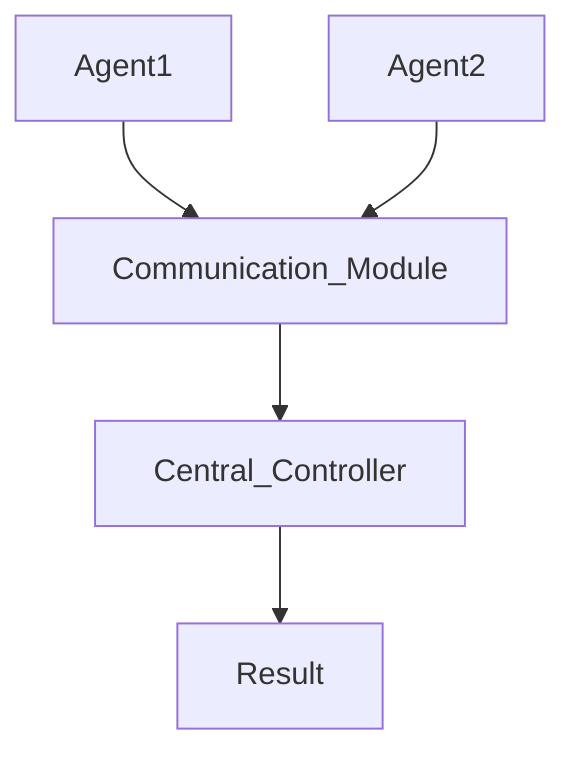
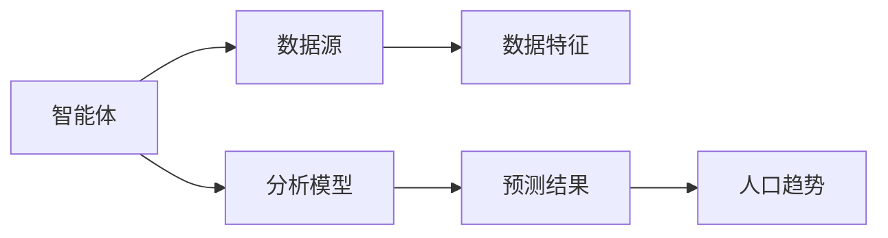
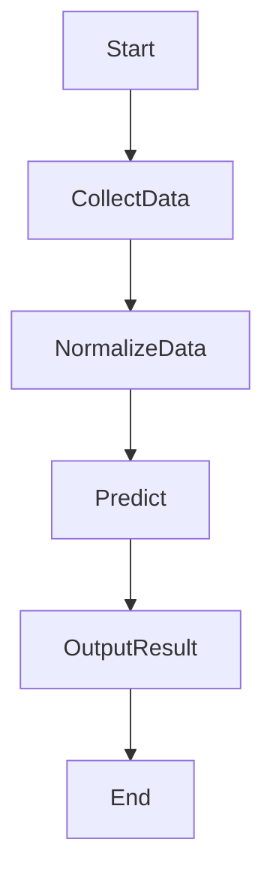
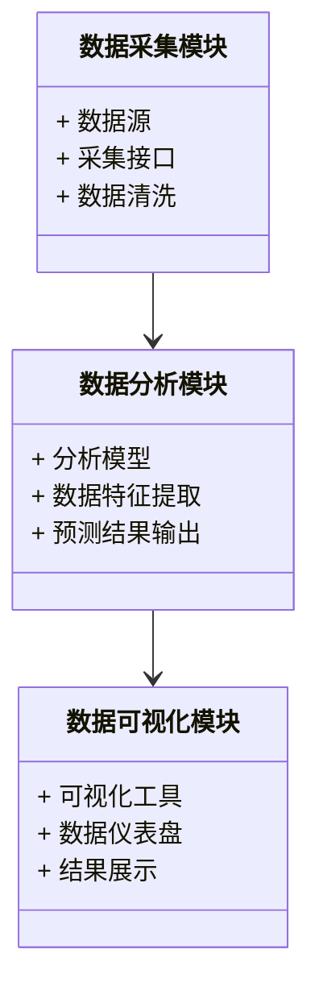

                 


# 多智能体系统在全球人口统计趋势分析中的角色

> 关键词：多智能体系统，人口统计，趋势分析，机器学习，数据可视化

> 摘要：本文探讨了多智能体系统（Multi-Agent System, MAS）在全球人口统计趋势分析中的应用角色。通过分析MAS的核心概念、算法原理和系统架构，结合实际案例，展示了MAS如何在人口数据采集、建模、预测和可视化中发挥重要作用。文章还探讨了MAS在人口统计中的优势、挑战及未来发展方向。

---

# 第一部分：多智能体系统与全球人口统计趋势分析的背景

## 第1章：多智能体系统与人口统计趋势分析的背景

### 1.1 多智能体系统的基本概念

#### 1.1.1 多智能体系统的定义
多智能体系统（MAS）是由多个智能体（Agent）组成的分布式系统，这些智能体通过交互和协作完成复杂任务。智能体是具有感知、推理、规划和执行能力的实体，可以是软件程序或物理设备。

#### 1.1.2 多智能体系统的特征
| 特征 | 描述 |
|------|------|
| 分布性 | 智能体独立运行，通过通信协作完成任务 |
| 协作性 | 智能体之间通过交互实现目标互补 |
| 反应性 | 能够实时感知环境变化并做出响应 |
| 自主性 | 智能体具有自主决策能力 |

#### 1.1.3 多智能体系统的应用场景
- 分布式计算
- 机器人协作
- 智能交通系统
- 金融交易监控

### 1.2 全球人口统计趋势分析的重要性

#### 1.2.1 人口统计趋势的定义
人口统计趋势分析是对人口数量、结构、分布和变化规律的系统研究，旨在预测未来人口发展动态，为政策制定和社会规划提供数据支持。

#### 1.2.2 人口统计趋势分析的挑战
- 数据来源多样且复杂
- 数据量大，处理难度高
- 预测模型需要高精度和实时性

#### 1.2.3 多智能体系统在人口统计中的潜在价值
- 提高数据采集和处理效率
- 实现多源数据的协同分析
- 提供实时预测和动态调整能力

### 1.3 多智能体系统在人口统计中的应用前景

#### 1.3.1 人口统计与多智能体系统的结合
- 利用MAS的分布式计算能力处理海量人口数据
- 通过智能体协作实现多维度人口预测

#### 1.3.2 多智能体系统在人口预测中的优势
- 高效性：多个智能体并行处理数据
- 精准性：智能体协同优化预测模型
- 实时性：动态调整预测结果

#### 1.3.3 全球人口统计趋势分析的未来方向
- 智能体协同学习与自适应优化
- 多模态数据融合与分析
- 高精度预测与可视化展示

### 1.4 本章小结
本章介绍了多智能体系统的定义、特征及其在人口统计中的潜在价值。通过分析MAS的特点和人口统计的挑战，揭示了MAS在该领域的应用前景。

---

## 第2章：多智能体系统的核心概念与联系

### 2.1 多智能体系统的组成与功能

#### 2.1.1 智能体的定义与分类
| 分类 | 描述 |
|------|------|
| 反应式智能体 | 基于当前感知做出反应 |
| 计划式智能体 | 基于目标规划行动 |
| 学习式智能体 | 具备自适应学习能力 |

#### 2.1.2 智能体之间的交互机制
- 通信：智能体之间通过消息传递信息
- 协作：智能体协同完成共同目标
- 竞争：智能体之间争夺资源

#### 2.1.3 多智能体系统的整体架构


### 2.2 人口统计趋势分析的核心要素

#### 2.2.1 数据来源与数据特征
| 数据来源 | 数据特征 |
|----------|----------|
| 政府统计 | 结构化、权威性 |
| 社交媒体 | 非结构化、实时性 |
| 移动应用 | 高频性、多样性 |

#### 2.2.2 数据分析方法与模型
- 描述性分析：总结人口特征
- 预测性分析：预测人口变化
- 实验性分析：模拟政策影响

#### 2.2.3 数据可视化与结果解读
| 可视化工具 | 描述 |
|------------|------|
| Tableau | 数据仪表盘 |
| Python | 基于Matplotlib的图表 |
| Power BI | 多维度数据分析 |

### 2.3 多智能体系统与人口统计的实体关系分析

#### 2.3.1 实体关系图


### 2.4 本章小结
本章详细分析了多智能体系统的组成与功能，以及人口统计趋势分析的核心要素。通过实体关系图展示了MAS与人口统计之间的联系。

---

## 第3章：多智能体系统在人口统计中的算法原理

### 3.1 多智能体协同预测算法

#### 3.1.1 算法概述
多智能体协同预测算法是一种基于MAS的分布式预测方法，通过智能体之间的协作完成数据处理和预测任务。

#### 3.1.2 算法流程


### 3.2 算法的数学模型

#### 3.2.1 数据预处理模型
$$ y = f(x) $$

#### 3.2.2 预测模型
$$ P(y|x) = \frac{P(x|y)P(y)}{P(x)} $$

### 3.3 算法实现与优化

#### 3.3.1 算法实现
```python
def normalize(data):
    return (data - mean) / std

def predict(data):
    normalized = normalize(data)
    return model.predict(normalized)
```

### 3.4 本章小结
本章详细介绍了多智能体协同预测算法的流程、数学模型和实现方法，展示了MAS在人口统计中的技术细节。

---

## 第4章：系统分析与架构设计方案

### 4.1 人口统计趋势分析的系统架构

#### 4.1.1 系统功能模块
| 模块 | 描述 |
|------|------|
| 数据采集模块 | 从多源数据中采集人口数据 |
| 数据分析模块 | 对数据进行建模和预测 |
| 数据可视化模块 | 将预测结果以可视化形式展示 |

#### 4.1.2 系统架构图


### 4.2 本章小结
本章分析了人口统计趋势分析系统的架构，展示了MAS在系统中的应用价值。

---

## 第5章：项目实战——多智能体系统在人口统计中的应用

### 5.1 环境安装与配置
```bash
pip install numpy
pip install matplotlib
pip install pandas
pip install scikit-learn
```

### 5.2 系统核心实现源代码

#### 5.2.1 数据采集模块
```python
import requests

def fetch_data(api_url):
    response = requests.get(api_url)
    return response.json()
```

#### 5.2.2 数据分析模块
```python
from sklearn import linear_model

def population_prediction(data):
    model = linear_model.LinearRegression()
    model.fit(data[['year']], data['population'])
    return model.predict(data[['year']])
```

#### 5.2.3 数据可视化模块
```python
import matplotlib.pyplot as plt

def visualize_results(predicted, actual):
    plt.plot(actual, label='实际值')
    plt.plot(predicted, label='预测值')
    plt.legend()
    plt.show()
```

### 5.3 实际案例分析

#### 5.3.1 数据来源
- 政府统计数据
- 学术研究数据
- 社交媒体数据

#### 5.3.2 数据分析与预测
```python
data = fetch_data('https://example.com/population_api')
predicted = population_prediction(data)
visualize_results(predicted, data['population'])
```

### 5.4 项目小结
本章通过实际案例展示了多智能体系统在人口统计中的应用，验证了MAS在数据采集、分析和可视化中的优势。

---

## 第6章：总结与展望

### 6.1 多智能体系统在人口统计中的应用价值
- 高效性：多智能体协同处理海量数据
- 精准性：智能体协作优化预测模型
- 实时性：动态调整预测结果

### 6.2 展望
- 智能体协同学习与自适应优化
- 多模态数据融合与分析
- 高精度预测与可视化展示

### 6.3 最佳实践 Tips
- 数据隐私保护：确保数据采集和处理的合规性
- 模型可解释性：提高预测结果的透明度
- 系统可扩展性：支持大规模数据处理

### 6.4 本章小结
本文总结了多智能体系统在人口统计中的应用价值，并展望了未来的研究方向。

---

# 作者：AI天才研究院/AI Genius Institute & 禅与计算机程序设计艺术 /Zen And The Art of Computer Programming

