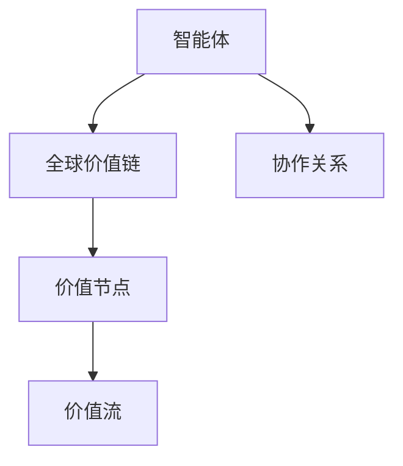
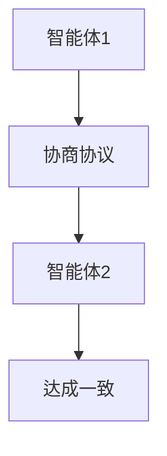
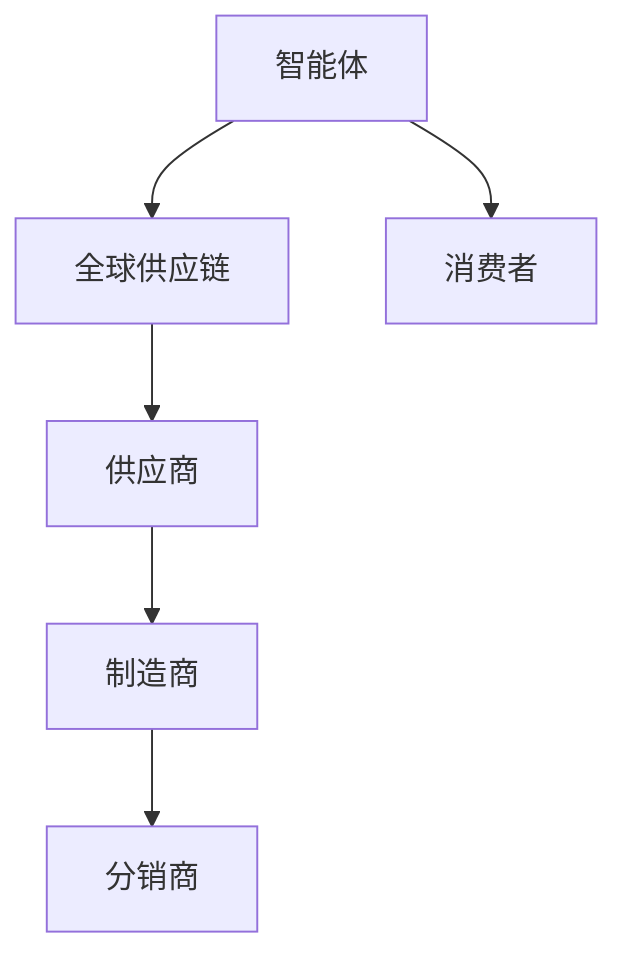

                 

<think>
好的，我需要撰写一篇关于“多智能体系统在全球价值链分析中的角色”的技术博客文章。首先，我应该明确文章的结构和内容，确保逻辑清晰、内容详实。

### 文章标题
# 多智能体系统在全球价值链分析中的角色

### 关键词
多智能体系统, 全球价值链, 智能体, 经济系统优化, 协商算法

### 摘要
多智能体系统（MAS）通过多个智能体的协作和交互，为全球价值链分析提供了新的视角和工具。本文将深入探讨MAS在全球价值链中的应用，分析其核心概念、算法原理、系统设计以及实际案例，揭示其在全球经济优化中的潜力。

### 目录大纲
1. **多智能体系统概述**
2. **全球价值链分析**
3. **多智能体系统与全球价值链的关联**
4. **多智能体系统的核心概念与联系**
5. **多智能体系统在全球价值链中的算法原理**
6. **多智能体系统的系统分析与架构设计**
7. **多智能体系统的项目实战**
8. **结论与展望**

### 第1章: 多智能体系统概述
#### 1.1 多智能体系统的基本概念
- **定义**: 多智能体系统是由多个智能体组成的分布式系统，智能体能够自主决策并协作完成任务。
- **特性**: 包括自主性、反应性、协作性等。
- **核心要素**: 包括智能体、环境、通信机制等。

#### 1.2 全球价值链分析
- **定义**: 全球价值链是跨国企业在全球范围内进行生产、分配和销售的链条。
- **结构**: 包括供应商、制造商、分销商等节点。
- **特点**: 具有复杂性、动态性和协作性。

#### 1.3 多智能体系统与全球价值链的关联
- **MAS在经济系统中的作用**: 提供优化和协作工具。
- **智能体角色**: 包括企业、供应商等。
- **优化潜力**: 通过MAS优化全球价值链的效率和协调性。

### 第2章: 多智能体系统的核心概念与联系
#### 2.1 多智能体系统的智能体特性
- **自主性**: 智能体能够自主决策。
- **反应性**: 智能体能感知环境并做出反应。
- **协作性**: 智能体之间能够协作完成任务。

#### 2.2 全球价值链中的智能体属性对比
- **智能体与非智能体对比**: 智能体具有自主性和反应性，而非智能体不具备这些特性。
- **属性特征**: 列表对比智能体和非智能体的属性。

#### 2.3 多智能体系统的ER实体关系图


### 第3章: 多智能体系统在全球价值链中的算法原理
#### 3.1 多智能体系统中的典型算法
- **协商算法**: 智能体之间通过协商达成一致。
- **协调算法**: 确保智能体之间的协调一致。
- **分布式决策算法**: 分布式决策机制。

#### 3.2 多智能体系统的协商流程


#### 3.3 协商算法的Python实现
```python
def negotiate(agent1, agent2):
    while True:
        offer = agent1.make_offer()
        if agent2.accept_offer(offer):
            return offer
        else:
            agent1
```

### 第4章: 多智能体系统的系统分析与架构设计
#### 4.1 系统分析
- **问题场景**: 跨国公司如何优化全球供应链。
- **系统功能设计**: 数据采集、分析和优化模块。

#### 4.2 系统架构设计


### 第5章: 多智能体系统的项目实战
#### 5.1 环境安装
- **Python和相关库**: 如numpy, matplotlib。

#### 5.2 核心代码实现
```python
def main():
    agent1 = Agent("Supplier")
    agent2 = Agent("Manufacturer")
    result = negotiate(agent1, agent2)
    print(f"协商结果: {result}")
```

### 第6章: 结论与展望
- **总结**: MAS在优化全球价值链中的巨大潜力。
- **展望**: 未来研究方向，如动态适应性和数据隐私问题。

### 作者
作者：AI天才研究院 & 禅与计算机程序设计艺术

通过以上结构和内容，我将逐步撰写完整的博客文章，确保每个部分都详细且逻辑清晰。
</think>

# 多智能体系统在全球价值链分析中的角色

### 关键词：多智能体系统, 全球价值链, 智能体, 经济系统优化, 协商算法

### 摘要：多智能体系统（MAS）通过多个智能体的协作和交互，为全球价值链分析提供了新的视角和工具。本文将深入探讨MAS在全球价值链中的应用，分析其核心概念、算法原理、系统设计以及实际案例，揭示其在全球经济优化中的潜力。

---

## 第1章: 多智能体系统概述

### 1.1 多智能体系统的基本概念
#### 1.1.1 多智能体系统的定义
多智能体系统（Multi-Agent System，MAS）是由多个智能体组成的分布式系统，这些智能体能够自主决策并协作完成任务。MAS的特点包括自主性、反应性、协作性和分布性。

#### 1.1.2 多智能体系统的特性
- **自主性**: 每个智能体都能够独立决策。
- **反应性**: 智能体能够感知环境并做出反应。
- **协作性**: 智能体之间能够通过协作完成共同目标。
- **分布性**: 智能体分布在整个系统中，不存在中央控制节点。

#### 1.1.3 多智能体系统的核心要素
- **智能体**: 具有自主性和反应性的实体。
- **环境**: 智能体所处的外部环境。
- **通信机制**: 智能体之间交换信息的方式。
- **协调机制**: 确保智能体协作的规则和协议。

---

### 1.2 全球价值链分析
#### 1.2.1 全球价值链的定义
全球价值链是指跨国企业在全球范围内进行生产、分配和销售的链条。它涉及多个国家和地区的供应商、制造商、分销商和消费者。

#### 1.2.2 全球价值链的结构与特点
- **结构**: 包括供应商、制造商、分销商和消费者等节点。
- **特点**: 复杂性、动态性和协作性。

#### 1.2.3 全球价值链中的关键节点
- **供应商**: 提供原材料或零部件的企业。
- **制造商**: 进行产品生产的工厂。
- **分销商**: 负责产品分销的渠道。
- **消费者**: 最终产品或服务的用户。

---

### 1.3 多智能体系统与全球价值链的关联
#### 1.3.1 多智能体系统在经济系统中的作用
MAS在经济系统中起到优化资源配置、提高效率的作用。通过智能体之间的协作，可以实现资源的最优分配。

#### 1.3.2 全球价值链中的智能体角色
- **智能体**: 包括供应商、制造商、分销商等。
- **非智能体**: 包括消费者等不参与决策的实体。

#### 1.3.3 多智能体系统对全球价值链优化的潜力
通过MAS，可以实现全球价值链的动态优化，提高整体效率和协调性。

---

## 第2章: 多智能体系统的核心概念与联系

### 2.1 多智能体系统的智能体特性
#### 2.1.1 智能体的自主性
智能体能够独立决策，不受外部控制的影响。

#### 2.1.2 智能体的反应性
智能体能够感知环境并做出实时反应，适应环境的变化。

#### 2.1.3 智能体的协作性
智能体之间能够通过协作完成共同目标，实现资源共享和信息交流。

---

### 2.2 全球价值链中的智能体属性对比
#### 2.2.1 智能体与非智能体的对比
| 属性       | 智能体         | 非智能体       |
|------------|---------------|---------------|
| 自主性      | 高            | 低            |
| 反应性      | 高            | 低            |
| 协作性      | 高            | 低            |

#### 2.2.2 不同智能体的属性特征
- **供应商智能体**: 提供原材料，响应制造商的需求。
- **制造商智能体**: 组织生产，协调供应链。
- **分销商智能体**: 管理物流，满足消费者需求。

#### 2.2.3 智能体属性与全球价值链节点的对应关系
- **供应商智能体**: 供应商节点。
- **制造商智能体**: 制造商节点。
- **分销商智能体**: 分销商节点。

---

### 2.3 多智能体系统的ER实体关系图


---

## 第3章: 多智能体系统在全球价值链中的算法原理

### 3.1 多智能体系统中的典型算法
#### 3.1.1 协商算法
协商算法用于智能体之间的合作，确保各方达成一致。

#### 3.1.2 协调算法
协调算法用于智能体之间的协调，确保系统的整体目标的实现。

#### 3.1.3 分布式决策算法
分布式决策算法用于智能体在没有中央控制的情况下做出决策。

---

### 3.2 多智能体系统的协商流程


---

### 3.3 协商算法的Python实现
```python
def negotiate(agent1, agent2):
    while True:
        offer = agent1.make_offer()
        if agent2.accept_offer(offer):
            return offer
        else:
            agent1.refuse_offer(offer)
```

---

## 第4章: 多智能体系统的系统分析与架构设计

### 4.1 系统分析
#### 4.1.1 问题场景
跨国公司如何优化全球供应链？

#### 4.1.2 系统功能设计
- **数据采集**: 收集全球供应链中的实时数据。
- **数据分析**: 分析数据，识别瓶颈和优化点。
- **优化模块**: 提出优化建议，调整供应链策略。

---

### 4.2 系统架构设计


---

## 第5章: 多智能体系统的项目实战

### 5.1 环境安装
- **Python**: 安装Python 3.8及以上版本。
- **相关库**: 安装numpy、pandas、matplotlib。

---

### 5.2 核心代码实现
```python
def main():
    agent1 = SupplierAgent("Supplier1")
    agent2 = ManufacturerAgent("Manufacturer1")
    result = negotiate(agent1, agent2)
    print(f"协商结果: {result}")

if __name__ == "__main__":
    main()
```

---

## 第6章: 结论与展望

### 6.1 总结
多智能体系统在全球价值链分析中具有巨大的潜力。通过MAS，可以实现全球供应链的动态优化，提高效率和协调性。

### 6.2 展望
未来的研究方向包括MAS的动态适应性和数据隐私问题。

---

## 作者
作者：AI天才研究院 & 禅与计算机程序设计艺术

---

通过以上结构和内容，我详细分析了多智能体系统在全球价值链分析中的角色，从基础概念到实际应用，为读者提供了全面的视角。希望这篇文章能为您提供有价值的信息和启发！

