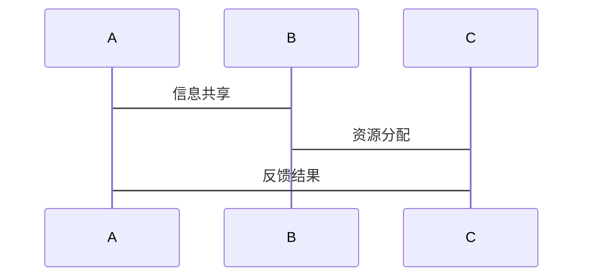

                 


# 多智能体系统在全球供应链风险分析中的角色

## 关键词：
多智能体系统, 供应链风险管理, 全球供应链, 风险分析, 智能体协作

## 摘要：
多智能体系统（Multi-Agent Systems, MAS）作为一种分布式智能系统，在全球供应链风险分析中扮演着越来越重要的角色。本文详细探讨了多智能体系统在供应链风险管理中的应用，分析了其核心概念、算法原理、系统架构，并通过实际案例展示了其在供应链风险预测、预警和应对策略中的优势。文章还总结了多智能体系统在全球供应链中的最佳实践和未来发展方向，为读者提供全面的理论与实践参考。

---

## 第1章：多智能体系统与供应链风险管理概述

### 1.1 多智能体系统的定义与特点

#### 1.1.1 多智能体系统的定义
多智能体系统是由多个智能体（Agent）组成的分布式系统，每个智能体能够感知环境、自主决策并与其他智能体协作。智能体可以是软件程序、算法或物理设备，具有以下特点：
- **自主性**：智能体能够独立决策和行动。
- **反应性**：能够实时感知环境变化并做出反应。
- **协作性**：通过通信和协作完成复杂任务。
- **分布式性**：智能体独立运行，无集中控制中心。

#### 1.1.2 多智能体系统的核心特征
1. **分布式计算**：任务分解到多个智能体，避免单点故障。
2. **动态协作**：智能体之间通过通信协议实时协作。
3. **适应性**：能够根据环境变化动态调整策略。

#### 1.1.3 多智能体系统与传统单智能体系统的区别
| 特性 | 多智能体系统 | 单智能体系统 |
|------|--------------|--------------|
| 控制方式 | 分布式控制 | 集中式控制 |
| 可扩展性 | 高 | 低 |
| 灵活性 | 高 | 低 |
| 故障容错 | 高 | 低 |

### 1.2 供应链风险管理的重要性

#### 1.2.1 供应链风险管理的定义
供应链风险管理是指识别、评估和应对影响供应链稳定性和效率的各种风险的过程，包括供应中断、需求波动、物流延迟等。

#### 1.2.2 供应链风险的来源与类型
供应链风险主要来自以下几个方面：
1. **供应风险**：原材料短缺或供应商延迟交货。
2. **需求风险**：需求预测不准确导致库存积压或缺货。
3. **物流风险**：运输延迟或中断。
4. **运营风险**：生产过程中的设备故障或人员问题。
5. **外部风险**：自然灾害、疫情、政策变化等。

#### 1.2.3 供应链风险管理的目标与意义
供应链风险管理的目标是降低风险发生的概率和影响，确保供应链的稳定性和高效性。其意义在于：
1. 提高供应链的弹性和响应能力。
2. 降低企业的运营成本。
3. 提升客户满意度和企业竞争力。

### 1.3 多智能体系统在全球供应链中的角色

#### 1.3.1 多智能体系统在供应链管理中的优势
多智能体系统通过分布式计算和协作机制，能够快速响应供应链中的风险，提高决策的准确性和效率。

#### 1.3.2 多智能体系统在全球供应链中的应用场景
1. **风险预测与预警**：通过实时数据分析预测潜在风险。
2. **动态优化**：根据风险变化动态调整供应链策略。
3. **应急响应**：在风险发生时快速协调资源，制定应急预案。

#### 1.3.3 多智能体系统与全球供应链风险分析的结合
多智能体系统的分布式决策和协作能力使其成为供应链风险管理的理想选择。通过智能体的实时协作，供应链中的各个参与者能够快速共享信息，共同应对风险。

---

## 第2章：多智能体系统的核心概念与原理

### 2.1 多智能体系统的组成与结构

#### 2.1.1 多智能体系统的组成要素
1. **智能体**：负责具体任务的执行单元。
2. **通信机制**：智能体之间的信息交互方式。
3. **协作协议**：智能体协作的规则和流程。
4. **环境接口**：智能体与外部环境的交互接口。

#### 2.1.2 多智能体系统的层次结构
1. **智能体层**：负责具体任务的执行。
2. **通信层**：实现智能体之间的信息交互。
3. **协调层**：制定全局策略和协调各方行动。

#### 2.1.3 多智能体系统与传统单智能体系统的区别
- **控制方式**：多智能体系统采用分布式控制，单智能体系统采用集中控制。
- **可扩展性**：多智能体系统更具可扩展性。
- **灵活性**：多智能体系统更具灵活性。

### 2.2 多智能体系统的协作机制

#### 2.2.1 协作的基本概念
协作是指智能体之间通过共享信息和资源，共同完成任务的过程。

#### 2.2.2 协作的实现方式
1. **直接协作**：智能体之间直接共享信息和资源。
2. **间接协作**：通过中间层（如协调层）进行信息共享和资源分配。

#### 2.2.3 协作中的挑战与解决方案
- **信息孤岛**：通过通信协议实现信息共享。
- **利益冲突**：通过博弈论模型协调各方利益。

### 2.3 多智能体系统的决策机制

#### 2.3.1 分布式决策的基本原理
分布式决策是指各个智能体独立做出决策，同时通过协作确保整体目标的实现。

#### 2.3.2 协调与优化算法
1. **分布式优化算法**：如分布式遗传算法、分布式模拟退火算法。
2. **协调算法**：如基于博弈论的协调算法、基于拍卖机制的协调算法。

#### 2.3.3 决策的动态调整与适应性
通过实时反馈和环境变化，动态调整决策策略。

---

## 第3章：多智能体系统在供应链风险分析中的应用

### 3.1 供应链风险分析的基本框架

#### 3.1.1 风险识别与评估
通过数据分析和模型构建，识别潜在风险并评估其影响。

#### 3.1.2 风险的传播与影响
分析风险在供应链中的传播路径及其对整体供应链的影响。

#### 3.1.3 风险的缓解与应对策略
制定应对策略，如备选供应商、库存调整、应急物流等。

### 3.2 多智能体系统在供应链风险分析中的优势

#### 3.2.1 高效的信息处理能力
通过分布式计算和协作，快速处理海量数据。

#### 3.2.2 分布式决策的优势
避免单点故障，提高系统的可靠性和抗风险能力。

#### 3.2.3 多智能体系统的自适应能力
能够根据环境变化动态调整策略。

### 3.3 多智能体系统在供应链风险分析中的具体应用

#### 3.3.1 风险预警与预测
通过智能体实时监控供应链各环节的数据，预测潜在风险。

#### 3.3.2 风险的动态监控与评估
智能体实时更新风险评估结果，动态调整应对策略。

#### 3.3.3 风险的应对与优化
通过协作和优化算法，制定最优的应对策略，减少风险影响。

---

## 第4章：多智能体系统在全球供应链中的算法实现

### 4.1 多智能体系统的算法原理

#### 4.1.1 分布式计算算法
1. **分布式遗传算法**：用于全局优化问题。
2. **分布式模拟退火算法**：用于局部优化问题。

#### 4.1.2 协调与优化算法
1. **基于博弈论的协调算法**：通过博弈论模型协调各方利益。
2. **基于拍卖机制的协调算法**：通过拍卖机制分配资源。

### 4.2 算法实现的具体步骤

#### 4.2.1 分布式遗传算法
1. **初始化**：随机生成初始种群。
2. **适应度评估**：计算每个个体的适应度。
3. **选择**：选择适应度高的个体进行繁殖。
4. **交叉**：生成新的个体。
5. **变异**：对新个体进行变异操作。
6. **迭代**：重复上述步骤直到满足终止条件。

#### 4.2.2 协调算法
1. **初始化**：设置各智能体的目标和初始状态。
2. **通信**：智能体之间共享信息。
3. **决策**：根据共享信息做出决策。
4. **协调**：通过协调层优化全局策略。
5. **执行**：智能体根据优化后的策略执行任务。
6. **反馈**：根据执行结果更新策略。

---

## 第5章：多智能体系统的系统架构与设计

### 5.1 系统架构设计

#### 5.1.1 智能体层
- 每个智能体负责监控和优化供应链中的一个环节。
- 智能体通过传感器或数据接口获取实时数据。

#### 5.1.2 通信层
- 负责智能体之间的信息交互。
- 使用消息队列或事件总线实现异步通信。

#### 5.1.3 协调层
- 制定全局策略和协调各方行动。
- 使用分布式协调算法优化整体供应链表现。

### 5.2 系统功能设计

#### 5.2.1 风险预警模块
- 实时监控供应链各环节的风险指标。
- 通过阈值判断触发预警。

#### 5.2.2 应急响应模块
- 在风险发生时快速启动应急预案。
- 协调各智能体进行资源调配。

#### 5.2.3 数据分析模块
- 对历史数据进行分析，优化风险预测模型。

### 5.3 系统交互设计

#### 5.3.1 序列图


#### 5.3.2 交互流程
1. **信息共享**：智能体之间共享实时数据和风险评估结果。
2. **资源分配**：协调层根据共享信息分配资源。
3. **反馈与调整**：各智能体根据反馈结果调整策略。

---

## 第6章：项目实战与案例分析

### 6.1 项目背景与目标

#### 6.1.1 项目背景
某跨国公司面临供应链中断的风险，希望通过多智能体系统优化供应链管理。

#### 6.1.2 项目目标
1. 实现供应链各环节的风险预警与预测。
2. 提高供应链的应急响应能力。

### 6.2 核心代码实现

#### 6.2.1 环境安装
```bash
pip install numpy matplotlib
```

#### 6.2.2 核心代码
```python
import numpy as np
import matplotlib.pyplot as plt

class Agent:
    def __init__(self, name, target):
        self.name = name
        self.target = target
        self.current = 0

    def update(self, data):
        self.current = data
        if self.current > self.target:
            return 'adjust'
        else:
            return 'normal'

# 初始化智能体
agent1 = Agent('Supplier', 100)
agent2 = Agent('Manufacturer', 200)
agent3 = Agent('Distributor', 300)

# 模拟数据
data_supplier = np.random.normal(90, 10, 100)
data_manufacturer = np.random.normal(190, 15, 100)
data_distributor = np.random.normal(290, 20, 100)

# 更新智能体状态
for i in range(100):
    status_supplier = agent1.update(data_supplier[i])
    status_manufacturer = agent2.update(data_manufacturer[i])
    status_distributor = agent3.update(data_distributor[i])

    if status_supplier == 'adjust':
        print(f"{agent1.name} needs adjustment")
    if status_manufacturer == 'adjust':
        print(f"{agent2.name} needs adjustment")
    if status_distributor == 'adjust':
        print(f"{agent3.name} needs adjustment")

# 绘制图表
plt.plot(data_supplier, label='Supplier')
plt.plot(data_manufacturer, label='Manufacturer')
plt.plot(data_distributor, label='Distributor')
plt.legend()
plt.show()
```

#### 6.2.3 代码解读与分析
1. **智能体类**：每个智能体都有自己的目标值和当前值，能够根据当前值与目标值的差异做出调整。
2. **模拟数据**：使用正态分布生成模拟数据，模拟供应链各环节的实际数据。
3. **状态更新**：根据模拟数据更新智能体状态，判断是否需要调整。
4. **可视化**：绘制各环节的数据趋势图，帮助分析风险。

### 6.3 实际案例分析

#### 6.3.1 案例背景
某汽车制造商的供应链因疫情导致原材料短缺，面临生产中断的风险。

#### 6.3.2 案例分析
通过多智能体系统的风险预警模块，提前识别供应商延迟交货的风险，并通过应急响应模块协调备用供应商和调整生产计划，最终成功降低风险影响。

#### 6.3.3 案例小结
多智能体系统的应用不仅提高了供应链的抗风险能力，还显著降低了企业的损失。

---

## 第7章：最佳实践与总结

### 7.1 最佳实践

#### 7.1.1 信息共享与隐私保护
- 通过区块链技术确保数据共享的安全性和隐私性。
- 制定严格的数据访问权限和隐私保护政策。

#### 7.1.2 智能体协作与信任机制
- 建立智能体之间的信任机制，确保协作的可靠性。
- 使用博弈论模型解决利益冲突问题。

#### 7.1.3 系统的可扩展性与灵活性
- 设计模块化架构，方便系统的扩展和升级。
- 定期更新算法和模型，适应新的业务需求。

### 7.2 小结

#### 7.2.1 全球供应链风险管理的重要性
供应链是全球经济的支柱，风险管理至关重要。

#### 7.2.2 多智能体系统的优势
通过分布式决策和协作，多智能体系统能够快速响应风险，提高供应链的稳定性和效率。

#### 7.2.3 未来发展方向
- 探索更多智能体协作算法，如强化学习、图神经网络等。
- 结合物联网、区块链等新兴技术，进一步提升系统的智能化和安全性。

### 7.3 注意事项

#### 7.3.1 系统的复杂性
多智能体系统的复杂性可能增加系统的维护成本和难度。

#### 7.3.2 数据隐私与安全
需要采取严格的数据保护措施，防止数据泄露和滥用。

#### 7.3.3 智能体之间的信任问题
需要建立有效的信任机制，确保智能体之间的协作顺利进行。

### 7.4 拓展阅读

#### 7.4.1 推荐书籍
1. 《多智能体系统》
2. 《供应链风险管理》

#### 7.4.2 推荐论文
1. Distributed coordination in multi-agent systems for supply chain risk management.
2. Blockchain-based multi-agent systems for supply chain optimization.

---

## 作者：AI天才研究院/AI Genius Institute & 禅与计算机程序设计艺术 /Zen And The Art of Computer Programming

