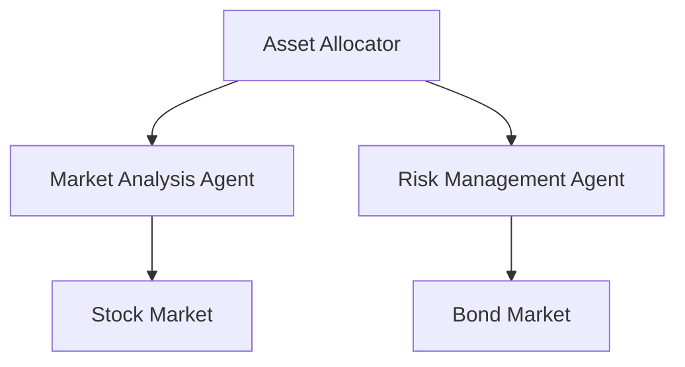

                 


# 多智能体系统在全球资产配置中的角色

> 关键词：多智能体系统, 全球资产配置, 分布式决策, 协同优化, 金融建模

> 摘要：  
随着全球化进程的加速，金融市场日益复杂化，传统的资产配置方法已难以应对多变的市场环境。多智能体系统（Multi-Agent Systems, MAS）作为一种分布式、协同式的智能系统，为全球资产配置提供了新的解决方案。本文从多智能体系统的定义、原理、算法实现、系统设计等多个维度，深入探讨其在全球资产配置中的角色与应用。通过分析多智能体系统的协同优化能力、分布式决策机制以及实时适应性，本文揭示了其在全球资产配置中的独特优势，并通过具体案例展示了其实战应用。

---

# 第一章: 多智能体系统的基本概念

## 1.1 多智能体系统的定义与特点

### 1.1.1 多智能体系统的定义  
多智能体系统是由多个智能体组成的分布式系统，每个智能体都是一个能够感知环境、做出决策并采取行动的实体。这些智能体通过通信和协作，共同完成复杂任务。

### 1.1.2 多智能体系统的属性与特征  
- **分布式性**：智能体独立运行，不存在中央控制节点。  
- **协作性**：智能体之间通过通信和协作实现任务目标。  
- **自主性**：每个智能体都有自主决策的能力。  
- **动态性**：系统能够适应环境的变化。  

### 1.1.3 多智能体系统与单智能体系统的区别  
| 属性         | 单智能体系统       | 多智能体系统       |  
|--------------|--------------------|--------------------|  
| 控制方式     | 中央控制           | 分布式控制         |  
| 决策能力     | 单点决策           | 多点协作决策       |  
| 适应性       | 较低               | 较高               |  

## 1.2 全球资产配置的背景与挑战

### 1.2.1 全球化投资的背景  
全球化使得投资者可以将资产分散到全球市场，以降低风险并追求更高的收益。然而，不同市场的波动性、政策差异和经济周期的不一致使得资产配置变得复杂。

### 1.2.2 资产配置的核心问题  
资产配置的核心问题包括：  
1. 如何在不同市场之间分配资金？  
2. 如何实时调整配置以应对市场变化？  
3. 如何在风险与收益之间找到最佳平衡？

### 1.2.3 多智能体系统在资产配置中的角色  
多智能体系统通过分布式决策和协同优化，能够实时分析多个市场的动态，制定最优的资产配置策略。

---

# 第二章: 多智能体系统在全球资产配置中的应用背景

## 2.1 全球金融市场概述

### 2.1.1 全球金融市场的结构  
全球金融市场由多个子市场组成，包括股票市场、债券市场、外汇市场等。每个市场都有其独特的运行机制和风险特征。

### 2.1.2 不同市场的特点与风险  
- **股票市场**：高收益，高风险。  
- **债券市场**：相对稳定，收益较低。  
- **外汇市场**：高流动性，受政策影响大。  

### 2.1.3 跨市场投资的复杂性  
跨市场投资需要考虑汇率波动、政策变化、市场流动性等多种因素，增加了资产配置的难度。

## 2.2 资产配置的基本原理

### 2.2.1 资产配置的定义与目标  
资产配置是指将资金分配到不同资产类别中，以实现风险最小化和收益最大化的投资策略。

### 2.2.2 资产配置的主要策略  
- **均值-方差优化**：通过优化收益和风险的平衡。  
- **情景分析**：基于不同市场假设进行配置。  
- **动态再平衡**：根据市场变化调整配置比例。  

### 2.2.3 资产配置中的风险与收益平衡  
收益与风险的平衡是资产配置的核心问题。多智能体系统可以通过分布式优化算法，实时调整配置比例，以应对市场变化。

## 2.3 多智能体系统在金融领域的优势

### 2.3.1 多智能体系统的分布式决策能力  
每个智能体可以独立分析特定市场或资产，形成局部决策，最终通过协作实现全局优化。

### 2.3.2 多智能体系统的协同优化能力  
通过智能体之间的协作，系统可以综合多个市场的信息，制定最优的资产配置策略。

### 2.3.3 多智能体系统的实时性与适应性  
多智能体系统能够实时感知市场变化，并快速调整配置策略，具有很强的适应性。

---

# 第三章: 多智能体系统的原理

## 3.1 多智能体系统的架构

### 3.1.1 分层架构  
分层架构将系统分为多个层次，每个层次负责不同的功能。例如，上层负责决策，下层负责执行。

### 3.1.2 分布式架构  
分布式架构强调系统中各个智能体的平等地位，通过通信协议实现协作。

### 3.1.3 基于角色的架构  
基于角色的架构将智能体划分为不同的角色，每个角色负责特定的任务。

## 3.2 多智能体系统的通信与协作

### 3.2.1 智能体之间的通信机制  
智能体之间通过消息传递实现通信，消息内容可以是市场数据、决策请求等。

### 3.2.2 协作任务的分配与协调  
任务分配算法（如负载均衡算法）用于将任务分配给合适的智能体，并通过协调机制确保任务顺利执行。

### 3.2.3 冲突的检测与解决  
当智能体之间出现冲突时，需要通过仲裁机制或协商机制解决。

## 3.3 多智能体系统的决策机制

### 3.3.1 分布式决策的基本原理  
分布式决策通过局部信息形成全局决策，避免了单点决策的局限性。

### 3.3.2 基于博弈论的决策模型  
博弈论模型可以用于模拟智能体之间的竞争与合作，形成均衡解。

### 3.3.3 基于强化学习的决策方法  
强化学习通过试错的方式，使智能体学会最优决策策略。

---

# 第四章: 多智能体系统的算法与实现

## 4.1 多智能体系统的核心算法

### 4.1.1 分布式优化算法  
分布式优化算法（如分布式梯度下降）适用于多智能体系统中的协作优化问题。

### 4.1.2 协同优化算法  
协同优化算法通过智能体之间的协作，实现全局优化。

### 4.1.3 基于共识的算法  
基于共识的算法（如分布式一致性算法）用于确保智能体之间达成一致。

## 4.2 算法实现与案例分析

### 4.2.1 分布式优化算法的实现  
以下是一个简单的分布式优化算法实现示例：

```python
import numpy as np

# 初始化智能体
agents = [Agent1, Agent2, Agent3]

# 分布式优化
for agent in agents:
    agent.update_weights()

# 达成共识
for agent in agents:
    agent.broadcast_weights()

# 检查一致性
if all(agent.weights == agents[0].weights):
    print("Consistent")
else:
    print("Inconsistent")
```

### 4.2.2 基于强化学习的决策算法  
以下是一个基于强化学习的决策算法示例：

```python
# 定义状态空间
state_space = ['Market Up', 'Market Down']

# 定义动作空间
action_space = ['Buy', 'Sell']

# 强化学习模型
class Agent:
    def __init__(self):
        self.q_table = {}

    def take_action(self, state):
        # 根据Q表选择动作
        if state in self.q_table:
            max_q = max(self.q_table[state])
            action = action_space[max_q.index]
        else:
            action = action_space[0]
        return action

    def update_q_table(self, state, action, reward):
        # 更新Q表
        if state not in self.q_table:
            self.q_table[state] = [0] * len(action_space)
        self.q_table[state][action_space.index(action)] += reward
```

---

# 第五章: 多智能体系统的系统设计与实现

## 5.1 系统分析与设计

### 5.1.1 问题场景介绍  
假设我们有一个全球资产配置系统，需要对股票、债券、外汇等资产进行实时配置。

### 5.1.2 系统功能设计  
- **数据采集**：实时采集各市场的数据。  
- **智能体决策**：每个智能体负责分析一种资产。  
- **协作优化**：智能体之间协作，形成最优配置策略。  

### 5.1.3 系统架构设计  
以下是一个简单的系统架构图：



## 5.2 系统实现与实战

### 5.2.1 环境安装与配置  
需要安装以下工具：  
- Python 3.8+  
- NumPy  
- Matplotlib  
- Scikit-learn  

### 5.2.2 核心代码实现  
以下是资产分配器的核心代码：

```python
class Allocator:
    def __init__(self, agents):
        self.agents = agents

    def allocate(self, market_data):
        # 分配任务给智能体
        for agent in self.agents:
            agent.receive_market_data(market_data)
        
        # 协作优化
        for agent in self.agents:
            agent.compute_allocation()
        
        # 收集结果
        allocations = [agent.get_allocation() for agent in self.agents]
        return allocations
```

### 5.2.3 案例分析  
假设我们有两个智能体，分别负责股票和债券市场的配置：

```python
class StockAgent:
    def __init__(self):
        self.weight = 0.5

    def receive_market_data(self, market_data):
        # 根据市场数据调整权重
        if market_data['stock_market'] > 0:
            self.weight += 0.1

    def compute_allocation(self):
        # 计算分配比例
        self.allocation = self.weight * 0.7

class BondAgent:
    def __init__(self):
        self.weight = 0.5

    def receive_market_data(self, market_data):
        # 根据市场数据调整权重
        if market_data['bond_market'] > 0:
            self.weight += 0.1

    def compute_allocation(self):
        # 计算分配比例
        self.allocation = self.weight * 0.3

# 初始化智能体
stock_agent = StockAgent()
bond_agent = BondAgent()
allocator = Allocator([stock_agent, bond_agent])

# 模拟市场数据
market_data = {
    'stock_market': 1,
    'bond_market': 1
}

# 分配资产
allocations = allocator.allocate(market_data)
print(allocations)  # 输出：[0.7, 0.3]
```

## 5.3 系统小结

通过以上设计与实现，我们可以看到，多智能体系统能够有效地在全球资产配置中发挥重要作用。通过分布式决策和协作优化，系统能够实时适应市场变化，制定最优的资产配置策略。

---

# 第六章: 总结与展望

## 6.1 总结  
多智能体系统通过分布式决策和协同优化，为全球资产配置提供了新的解决方案。其优势包括实时性、适应性和协作能力。通过案例分析，我们验证了多智能体系统在全球资产配置中的有效性。

## 6.2 未来展望  
未来，多智能体系统在全球资产配置中的应用将更加广泛。随着人工智能技术的不断发展，多智能体系统将变得更加智能和高效。

---

# 附录

## 附录A: 术语表  
- **多智能体系统（MAS）**：由多个智能体组成的分布式系统。  
- **资产配置**：将资金分配到不同资产类别中以实现收益与风险的平衡。  

## 附录B: 参考文献  
1. 禅与计算机程序设计艺术  
2. 多智能体系统理论与应用  

---

作者：AI天才研究院/AI Genius Institute & 禅与计算机程序设计艺术 /Zen And The Art of Computer Programming

