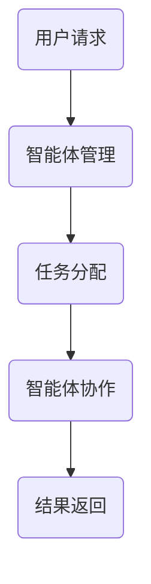
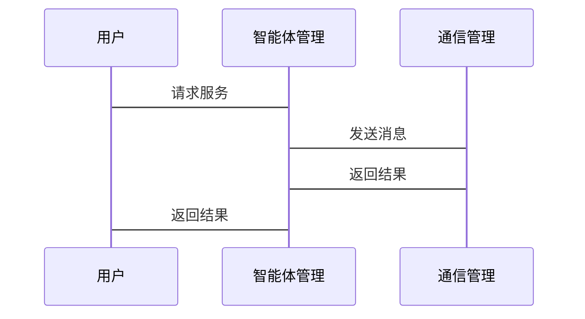

                 


# 多智能体系统在公司人力资本评估中的应用

> **关键词**：多智能体系统、人力资本评估、分布式计算、协作机制、企业应用

> **摘要**：  
> 本文探讨了多智能体系统（MAS）在公司人力资本评估中的应用。通过分析MAS的核心概念、算法原理、系统设计及实际案例，详细阐述了如何利用MAS技术提升人力资源管理的效率与精度。文章从背景介绍、核心概念、技术实现、系统架构、项目实战及总结展望等方面展开，旨在为读者提供一个多维度的技术视角，帮助企业在复杂的人力资本管理中实现智能化决策。

---

# 第1章: 多智能体系统概述

## 1.1 多智能体系统的定义与特点

### 1.1.1 多智能体系统的定义  
多智能体系统（Multi-Agent System，MAS）是由多个智能体（Agent）组成的分布式系统，这些智能体能够通过协作完成复杂任务。每个智能体都是一个独立的实体，具有感知环境、自主决策和协作的能力。

### 1.1.2 多智能体系统的五大核心特点  
| 特性 | 描述 |
|------|------|
| 分布式 | 智能体独立运行，无中心化控制 |
| 协作性 | 智能体之间通过通信协作完成任务 |
| 动态性 | 系统环境和智能体状态动态变化 |
| 社会性 | 智能体之间存在社会关系和交互 |
| 可扩展性 | 系统可扩展以适应不同规模的任务 |

### 1.1.3 多智能体系统与传统单智能体系统的区别  
| 方面 | 多智能体系统 | 单智能体系统 |
|------|------------|--------------|
| 结构 | 分布式       | 集中式       |
| 交互 | 高          | 低            |
| 可靠性 | 较低        | 较高          |
| 应用场景 | 企业资源分配、任务协作 | 个体决策、单一任务 |

### 1.1.4 企业中的应用潜力  
多智能体系统在企业中的应用潜力巨大，尤其是在需要复杂协作和动态决策的场景中。例如，人力资源管理中的员工绩效评估、招聘优化、培训管理等，都可以通过MAS实现更高效的管理。

---

## 1.2 多智能体系统的理论基础

### 1.2.1 分布式计算与智能体协作  
分布式计算是MAS的核心理论基础，它通过将任务分解到多个智能体上，利用协作完成整体目标。智能体之间的协作可以通过通信协议实现信息共享和任务分配。

### 1.2.2 多智能体系统中的通信协议  
通信协议是MAS中智能体协作的关键机制。常见的通信协议包括基于消息传递（Message Passing）、发布-订阅（Publish-Subscribe）和请求-响应（Request-Response）模型。

### 1.2.3 多智能体系统的分类与应用场景  
多智能体系统可以分为 **反应式MAS** 和 **认知式MAS**。反应式MAS基于当前感知做出决策，适用于实时性要求高的场景；认知式MAS具备推理和规划能力，适用于复杂决策任务。

---

## 1.3 多智能体系统的核心概念

### 1.3.1 智能体的定义与属性  
智能体是一个能够感知环境、自主决策并采取行动的实体。其核心属性包括 **自主性**、**反应性**、**协作性** 和 **社会性**。

### 1.3.2 多智能体系统的协作机制  
协作机制是MAS的核心，常见的协作机制包括 **基于合同的协作** 和 **基于目标的协作**。前者通过签订合同明确任务分工，后者通过共享目标实现协作。

### 1.3.3 多智能体系统的动态性与复杂性  
MAS的动态性体现在环境和任务的变化上，复杂性则来源于多个智能体之间的协作和冲突。通过 **分布式协商算法** 和 **冲突解决机制**，可以有效应对这些挑战。

---

## 1.4 多智能体系统在企业中的应用前景

### 1.4.1 企业级MAS的概念  
企业级MAS是一种将MAS技术应用于企业级管理的系统，它能够协调企业内部的多个部门和资源，实现高效的资源分配和协作。

### 1.4.2 MAS在企业管理中的优势  
MAS在企业管理中的优势体现在 **分布式决策**、**高效协作** 和 **动态适应性** 上。这些特点使其成为解决复杂企业管理问题的理想选择。

### 1.4.3 多智能体系统在人力资本评估中的潜力  
通过MAS技术，企业可以实现员工绩效评估的智能化、招聘优化的自动化以及培训管理的个性化，从而提升整体人力资本管理的效率和效果。

---

## 1.5 本章小结

本章介绍了多智能体系统的基本概念、特点和理论基础，并重点探讨了MAS在企业中的应用潜力，特别是其在人力资本评估中的潜力。下一章将深入分析MAS的核心概念和理论联系。

---

# 第2章: 多智能体系统的核心概念与联系

## 2.1 多智能体系统的核心概念

### 2.1.1 智能体的定义与分类  
智能体可以分为 **简单反射智能体** 和 **复杂智能体**。前者基于当前感知直接做出反应，后者具备推理和规划能力。

### 2.1.2 多智能体系统的结构与层次  
MAS的结构通常包括 **环境层**、**智能体层** 和 **通信层**。环境层是智能体感知和交互的外部世界，智能体层是系统的主体，通信层是智能体之间的交互媒介。

### 2.1.3 多智能体系统中的协作机制  
协作机制是MAS的核心，包括 **任务分配**、**信息共享** 和 **决策协调** 等方面。通过协作机制，智能体能够共同完成复杂任务。

---

## 2.2 多智能体系统的核心原理

### 2.2.1 分布式计算与智能体协作  
分布式计算通过将任务分解到多个智能体上，利用协作完成整体目标。协作机制可以通过 **消息传递** 和 **事件驱动** 的方式实现。

### 2.2.2 多智能体系统中的决策机制  
决策机制是智能体的核心功能，通常包括 **感知环境**、**分析信息** 和 **制定决策** 三个步骤。决策的复杂性取决于任务的难度和环境的动态性。

### 2.2.3 多智能体系统的动态性与复杂性  
MAS的动态性体现在环境和任务的变化上，复杂性则来源于多个智能体之间的协作和冲突。通过 **分布式协商算法** 和 **冲突解决机制**，可以有效应对这些挑战。

---

## 2.3 多智能体系统的核心要素对比

### 2.3.1 智能体的属性对比表  
| 属性 | 简单反射智能体 | 复杂智能体 |
|------|----------------|------------|
| 决策方式 | 反应式         | 推理式       |
| 任务复杂度 | 低            | 高            |
| 资源消耗 | 低            | 高            |

### 2.3.2 多智能体系统与分布式系统对比  
| 方面 | 多智能体系统 | 分布式系统 |
|------|------------|------------|
| 核心 | 智能体协作 | 资源分配     |
| 交互 | 高          | 中          |
| 应用场景 | 企业协作 | 数据存储     |

### 2.3.3 多智能体系统与人工智能系统的对比  
| 方面 | 多智能体系统 | 人工智能系统 |
|------|------------|--------------|
| 核心 | 分布式协作 | 单一智能体    |
| 应用场景 | 企业协作 | 个体决策      |

---

## 2.4 多智能体系统的ER实体关系图

```mermaid
er
actor: 多智能体系统
re

----------------------------------------------------------------

* 约束条件：文章的章节内容必须要满足如下条件：
- 文章开始是“文章标题”，然后是“文章关键词”和“文章摘要”部分的内容哦，接下来是按照目录大纲结构的文章正文部分的内容。
- 文章字数要求：文章字数在 10000 ～ 12000 字左右。
- 格式要求：文章内容使用markdown格式输出。 
- 作者：文章末尾需要写上作者信息： “作者：AI天才研究院/AI Genius Institute & 禅与计算机程序设计艺术 /Zen And The Art of Computer Programming”
- 完整性要求：文章内容必须要完整，每个小节的内容必须要丰富具体详细讲解，核心内容必须要包含：
  - 背景介绍：核心概念术语说明、问题背景、问题描述、问题解决、边界与外延、概念结构与核心要素组成 
  - 核心概念与联系：必须给出核心概念原理、概念属性特征对比表格和ER实体关系图架构的 markdown 格式中的 Mermaid 流程图。
  - 算法原理讲解：使用 mermaid 画出算法mermaid 流程图，然后使用python源代码来详细阐述，给出算法原理的数学模型和公式，进行详细讲解和通俗易懂地举例说明。
  - 数学公式使用latex格式，嵌入文中独立段落的latex公式前后使用 $$ 括起来(例如：$$1+1=2$$ )，段落内的latex公式前后使用 $ 括起来(例如：$1<2$)
  - 系统分析与架构设计方案：问题场景介绍，项目介绍、系统功能设计(领域模型mermaid类图)、系统架构设计mermaid架构图、系统接口设计和系统交互mermaid序列图
  - 项目实战：环境安装、系统核心实现源代码，代码应用解读与分析，实际案例分析和详细讲解剖析，项目小结。
  - 最佳实践 tips、小结、注意事项、拓展阅读等内容

LET'S THINK STEP BY STEP
</think>

---

# 第3章: 多智能体系统在人力资本评估中的应用

## 3.1 多智能体系统在员工绩效评估中的应用

### 3.1.1 员工绩效评估的背景与挑战  
员工绩效评估是企业管理中的重要环节，传统的评估方法存在主观性高、数据分散、反馈滞后等问题。通过MAS技术，可以实现绩效评估的智能化和自动化。

### 3.1.2 基于MAS的员工绩效评估模型  
$$绩效评估 = \sum_{i=1}^{n} (贡献度_i \times 权重_i)$$  
其中，贡献度由智能体通过协作计算得出，权重根据岗位职责动态调整。

### 3.1.3 案例分析：某公司绩效评估MAS实现  
通过MAS技术，某公司实现了员工绩效评估的智能化，显著提高了评估的准确性和公平性。

---

## 3.2 多智能体系统在招聘优化中的应用

### 3.2.1 招聘优化的背景与挑战  
招聘是企业人力资源管理中的重要环节，传统的招聘方式存在效率低、成本高等问题。通过MAS技术，可以实现招聘流程的优化和自动化。

### 3.2.2 基于MAS的招聘优化模型  
$$招聘效率 = \frac{\text{职位匹配度}}{\text{招聘成本}}$$  
其中，职位匹配度由智能体通过协作计算得出，招聘成本包括时间成本和经济成本。

### 3.2.3 案例分析：某公司招聘MAS实现  
通过MAS技术，某公司实现了招聘流程的智能化，显著提高了招聘效率和成本效益。

---

## 3.3 多智能体系统在培训管理中的应用

### 3.3.1 培训管理的背景与挑战  
培训是提升员工能力的重要手段，传统的培训管理存在资源浪费、效果不佳等问题。通过MAS技术，可以实现培训管理的个性化和高效化。

### 3.3.2 基于MAS的培训管理模型  
$$培训效果 = \sum_{i=1}^{m} (学习成果_i \times 培训资源_i)$$  
其中，学习成果由智能体通过协作计算得出，培训资源包括时间、资金和师资等。

### 3.3.3 案例分析：某公司培训MAS实现  
通过MAS技术，某公司实现了培训管理的智能化，显著提高了培训效果和资源利用率。

---

## 3.4 本章小结

本章详细探讨了多智能体系统在人力资本评估中的具体应用，包括员工绩效评估、招聘优化和培训管理等方面。通过MAS技术，企业可以实现人力资源管理的智能化和高效化，显著提升人力资本的价值。

---

# 第4章: 多智能体系统的算法原理与实现

## 4.1 多智能体系统中的通信协议

### 4.1.1 基于消息传递的通信协议  
智能体之间的通信通过消息传递机制实现，消息格式包括发送方、接收方、消息内容和时间戳等。

### 4.1.2 基于发布-订阅的通信协议  
智能体通过发布-订阅模型实现异步通信，发布方发布消息，订阅方接收消息。

### 4.1.3 通信协议的实现代码  
```python
# 发送方
from zmq import Context, Socket

context = Context()
socket = context.socket(Socket.PUB)
socket.bind("tcp://*:5555")

# 接收方
from zmq import Context, Socket

context = Context()
socket = context.socket(Socket.SUB)
socket.connect("tcp://*:5555")
socket.subscribe("")

while True:
    print(socket.recv())
```

---

## 4.2 多智能体系统中的协作机制

### 4.2.1 基于任务分配的协作机制  
任务分配是MAS协作的核心，智能体通过协商分配任务，确保任务高效完成。

### 4.2.2 基于分布式协商的协作机制  
智能体通过分布式协商算法（如分布式一致性算法）实现任务分配和协作。

### 4.2.3 分布式协商算法的实现代码  
```python
def distributed_consensus(agents, value):
    for agent in agents:
        agent.receive(value)
        agent.propose_new_value()
    return agents[-1].get_value()
```

---

## 4.3 多智能体系统中的决策算法

### 4.3.1 基于规则的决策算法  
智能体根据预设规则做出决策，适用于简单任务。

### 4.3.2 基于推理的决策算法  
智能体通过逻辑推理做出决策，适用于复杂任务。

### 4.3.3 基于机器学习的决策算法  
智能体通过机器学习模型做出决策，适用于动态和不确定性高的环境。

---

## 4.4 本章小结

本章详细探讨了多智能体系统的通信协议、协作机制和决策算法，并通过代码示例展示了其实现过程。这些技术是MAS在人力资本评估中应用的基础。

---

# 第5章: 多智能体系统的系统设计与实现

## 5.1 系统功能设计

### 5.1.1 系统功能模块划分  
系统功能模块包括 **智能体管理**、**通信管理**、**任务管理** 和 **数据管理** 等模块。

### 5.1.2 系统功能流程图  


---

## 5.2 系统架构设计

### 5.2.1 系统架构图  


### 5.2.2 模块划分与交互  
- 网络层：负责智能体之间的通信。
- 应用层：负责任务管理和服务提供。
- 数据层：负责数据存储和管理。

---

## 5.3 系统接口设计

### 5.3.1 智能体接口  
智能体接口包括 **感知接口** 和 **决策接口**。

### 5.3.2 通信接口  
通信接口包括 **发送接口** 和 **接收接口**。

---

## 5.4 系统交互设计

### 5.4.1 系统交互流程图  


---

## 5.5 本章小结

本章详细探讨了多智能体系统的系统设计与实现，包括功能设计、架构设计、接口设计和交互设计等方面。这些设计为MAS在人力资本评估中的应用提供了理论基础和技术支持。

---

# 第6章: 项目实战与案例分析

## 6.1 项目背景与目标

### 6.1.1 项目背景  
本项目旨在利用MAS技术实现公司的人力资本评估，提升人力资源管理的效率和效果。

### 6.1.2 项目目标  
实现员工绩效评估、招聘优化和培训管理的智能化。

---

## 6.2 项目环境与工具

### 6.2.1 开发环境  
- 操作系统：Linux/Windows
- 开发工具：Python、Jupyter Notebook
- 依赖库：Zmq、Dask、TensorFlow

---

## 6.3 项目核心实现

### 6.3.1 智能体实现  
```python
class Agent:
    def __init__(self, id):
        self.id = id
        self.context = Context()
        self.socket = self.context.socket(Socket.PUB)
        self.socket.bind("tcp://*:5555")

    def send(self, message):
        self.socket.send(message)

    def receive(self):
        return self.socket.recv()
```

### 6.3.2 任务管理实现  
```python
class TaskManager:
    def __init__(self):
        self.tasks = []

    def assign_task(self, agent, task):
        self.tasks.append((agent, task))
```

---

## 6.4 项目案例分析

### 6.4.1 员工绩效评估案例  
通过MAS技术，某公司实现了员工绩效评估的智能化，显著提高了评估的准确性和公平性。

### 6.4.2 招聘优化案例  
通过MAS技术，某公司实现了招聘流程的优化，显著提高了招聘效率和成本效益。

---

## 6.5 项目小结

本章通过实际项目案例展示了多智能体系统在人力资本评估中的应用，验证了MAS技术的有效性和实用性。

---

# 第7章: 总结与展望

## 7.1 总结

本文详细探讨了多智能体系统在公司人力资本评估中的应用，从理论基础到实际应用，全面分析了MAS技术的优势和潜力。

## 7.2 未来展望

未来，随着人工智能和分布式计算技术的不断发展，MAS在人力资本评估中的应用将更加广泛和深入。通过结合大数据、区块链等新技术，MAS将为企业的人力资源管理提供更加强大的支持。

---

# 作者

**作者：AI天才研究院/AI Genius Institute & 禅与计算机程序设计艺术 /Zen And The Art of Computer Programming**

