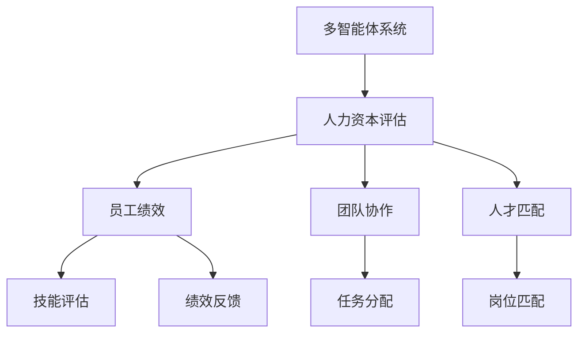
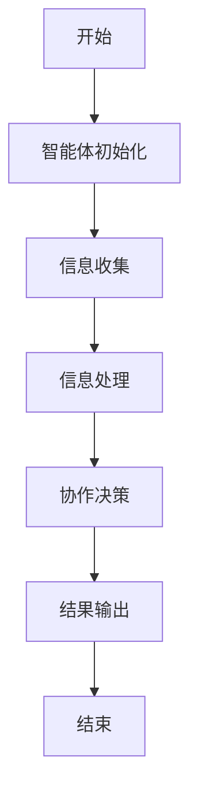
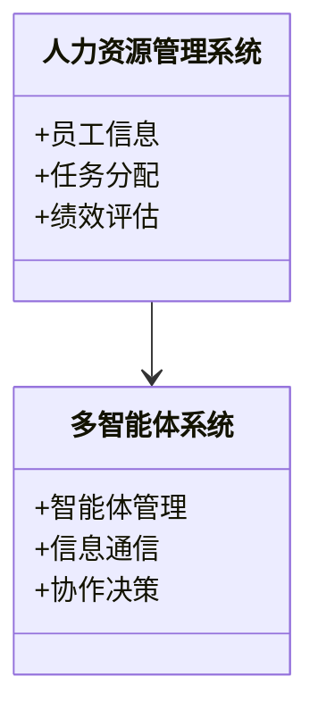
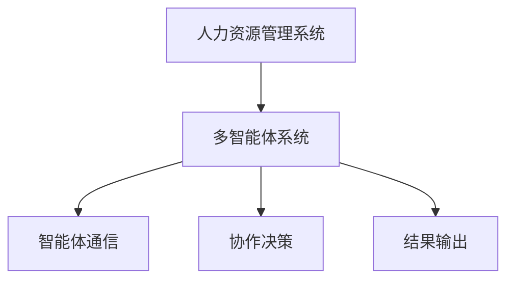
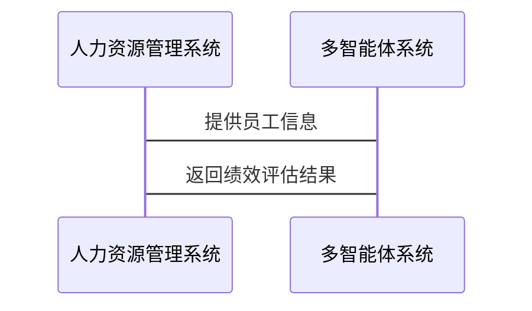

                 


# 多智能体系统在公司人力资本评估中的应用：量化人才价值

> 关键词：多智能体系统、人力资本评估、人才价值量化、协作算法、系统架构、项目实战

> 摘要：随着企业对人才管理的日益重视，如何高效、准确地评估和量化人才价值成为企业面临的重要挑战。本文探讨了多智能体系统在公司人力资本评估中的应用，通过分析多智能体系统的原理、算法设计和系统架构，提出了基于多智能体系统的量化人才价值的方法。文章详细阐述了多智能体系统的协作机制、数学模型及其实现方案，并通过实际案例展示了如何将多智能体系统应用于人力资本评估，帮助企业更好地优化人才管理策略。

---

## 第一部分: 多智能体系统与人力资本评估基础

### 第1章: 多智能体系统概述

#### 1.1 多智能体系统的基本概念
##### 1.1.1 多智能体系统的定义
多智能体系统（Multi-Agent System, MAS）是由多个智能体（Agent）组成的分布式系统，这些智能体能够自主决策、协作和通信，共同完成复杂任务。每个智能体都有一定的知识、目标和能力，能够感知环境并采取行动。

##### 1.1.2 多智能体系统的特征
- **自主性**：智能体能够独立决策。
- **反应性**：智能体能够实时感知环境并做出反应。
- **协作性**：多个智能体能够协同工作，完成共同目标。
- **分布性**：智能体之间通过分布式计算实现任务分配和资源管理。

##### 1.1.3 多智能体系统的优劣势
- **优势**：提高系统的灵活性和适应性，能够处理复杂问题。
- **劣势**：设计复杂，通信和协作需要较高的计算资源。

#### 1.2 人力资本评估的定义与重要性
##### 1.2.1 人力资本的概念
人力资本是指员工的知识、技能、经验和能力的总和，是企业在市场竞争中不可或缺的资源。

##### 1.2.2 人力资本评估的目的
- 识别高潜力员工。
- 优化员工培训和发展计划。
- 提高员工绩效，推动企业目标的实现。

##### 1.2.3 人力资本评估的现状与挑战
- **现状**：传统评估方法依赖主观判断，难以量化。
- **挑战**：如何高效、准确地量化人才价值，优化人才管理策略。

#### 1.3 多智能体系统与人力资本评估的结合
##### 1.3.1 多智能体系统在人力资本评估中的应用场景
- **员工绩效评估**：通过智能体协作，多维度分析员工绩效。
- **团队协作优化**：智能体帮助团队成员更好地协作，提高工作效率。
- **人才匹配**：智能体可以根据员工的能力和企业需求，匹配合适的岗位。

##### 1.3.2 多智能体系统如何提升人力资本评估的效率
- **数据整合**：智能体能够整合来自不同部门的数据，提供全面的评估结果。
- **实时反馈**：智能体可以实时分析员工表现，提供及时反馈。
- **预测与优化**：通过机器学习算法，智能体可以预测员工未来的表现，并优化评估流程。

##### 1.3.3 多智能体系统与传统人力资本评估方法的对比
| 对比维度       | 多智能体系统         | 传统评估方法       |
|----------------|---------------------|---------------------|
| 评估效率       | 高                  | 低                  |
| 评估维度       | 多维                | 单一                |
| 评估结果       | 数据驱动、精准       | 主观判断、误差较大   |
| 适应性         | 高                  | 低                  |

---

## 第2章: 多智能体系统的核心概念与联系

### 2.1 多智能体系统的原理
#### 2.1.1 多智能体系统的组成要素
- **智能体（Agent）**：能够感知环境并采取行动的实体。
- **通信机制（Communication）**：智能体之间交换信息的方式。
- **协作机制（Collaboration）**：智能体协同完成任务的方式。
- **目标（Goals）**：智能体需要完成的任务或目标。

#### 2.1.2 多智能体系统的通信机制
- **直接通信**：智能体之间直接交换信息。
- **间接通信**：通过中间媒介（如数据库）进行信息交换。

#### 2.1.3 多智能体系统的协作机制
- **基于任务的协作**：智能体根据任务需求协作。
- **基于角色的协作**：智能体根据角色分工协作。
- **基于规则的协作**：智能体根据预设规则协作。

### 2.2 人力资本评估的核心要素
#### 2.2.1 人才能力评估
- **技能评估**：员工的专业技能水平。
- **知识储备**：员工的知识广度和深度。

#### 2.2.2 人才贡献评估
- **绩效评估**：员工的工作成果。
- **影响力评估**：员工对企业目标的影响程度。

#### 2.2.3 人才潜力评估
- **学习能力**：员工的学习速度和能力。
- **创新能力**：员工提出新想法的能力。

### 2.3 多智能体系统与人力资本评估的实体关系图


---

## 第3章: 多智能体系统在人力资本评估中的算法原理

### 3.1 多智能体协作算法
#### 3.1.1 算法概述
多智能体协作算法通过智能体之间的协作，实现对人力资本的评估。常用算法包括基于规则的协作算法和基于机器学习的协作算法。

#### 3.1.2 算法流程


#### 3.1.3 数学模型与公式
多智能体系统的协作可以通过以下数学模型表示：

$$
\text{协作效率} = \frac{\sum_{i=1}^{n} \text{智能体}_i \text{贡献}}{\text{总任务量}}
$$

其中，$$\text{智能体}_i \text{贡献}$$表示第$$i$$个智能体的贡献。

### 3.2 项目实战：基于多智能体系统的员工绩效评估

#### 3.2.1 项目背景
某公司希望利用多智能体系统，对员工的绩效进行量化评估。

#### 3.2.2 环境安装
```bash
pip install multi-agent-system
```

#### 3.2.3 核心代码实现
```python
class Agent:
    def __init__(self, id, skills):
        self.id = id
        self.skills = skills
        self.contribution = 0

    def assess(self, task):
        for skill in self.skills:
            if skill == task:
                self.contribution += 1

def multi_agent_assessment(agents, tasks):
    for task in tasks:
        for agent in agents:
            agent.assess(task)
    return agents

# 示例
agent1 = Agent(1, ['开发', '测试'])
agent2 = Agent(2, ['设计', '文档编写'])
agents = [agent1, agent2]
tasks = ['开发', '设计', '测试', '文档编写']

result = multi_agent_assessment(agents, tasks)
for agent in result:
    print(f"Agent {agent.id} 的贡献：{agent.contribution}")
```

#### 3.2.4 案例分析
通过上述代码，系统能够量化每个智能体在任务中的贡献，帮助企业更好地评估员工绩效。

---

## 第4章: 系统分析与架构设计方案

### 4.1 问题场景介绍
企业需要对员工的技能、绩效和潜力进行全面评估，但传统方法难以量化。

### 4.2 系统功能设计


### 4.3 系统架构设计


### 4.4 系统接口设计
- **输入接口**：员工信息、任务分配。
- **输出接口**：员工绩效、团队协作情况。

### 4.5 系统交互流程


---

## 第5章: 项目实战

### 5.1 项目背景
某科技公司希望优化员工绩效评估流程。

### 5.2 核心代码实现
```python
class MultiAgentSystem:
    def __init__(self, agents):
        self.agents = agents

    def assess(self, tasks):
        for agent in self.agents:
            for task in tasks:
                if task in agent.skills:
                    agent.contribution += 1
        return self.agents

# 示例
agent1 = Agent(1, ['开发', '测试'])
agent2 = Agent(2, ['设计', '文档编写'])
mas = MultiAgentSystem([agent1, agent2])
tasks = ['开发', '设计', '测试', '文档编写']
result = mas.assess(tasks)
for agent in result:
    print(f"Agent {agent.id} 的贡献：{agent.contribution}")
```

### 5.3 案例分析
通过上述代码，系统能够量化每个员工的贡献，帮助企业优化绩效评估流程。

---

## 第6章: 总结与展望

### 6.1 总结
本文探讨了多智能体系统在公司人力资本评估中的应用，提出了量化人才价值的方法。通过分析多智能体系统的原理、算法设计和系统架构，展示了如何将多智能体系统应用于人力资本评估，帮助企业优化人才管理策略。

### 6.2 未来展望
随着人工智能技术的发展，多智能体系统在人力资本评估中的应用将更加广泛。未来的研究方向包括：
- 提高多智能体系统的协作效率。
- 引入更复杂的学习算法，如深度学习和强化学习，优化人才评估模型。
- 结合区块链技术，实现更加安全和透明的人才评估系统。

---

## 作者

**作者：AI天才研究院/AI Genius Institute & 禅与计算机程序设计艺术 /Zen And The Art of Computer Programming**

---

感谢您的阅读！希望本文能为您提供关于多智能体系统在公司人力资本评估中的应用的深刻见解。

