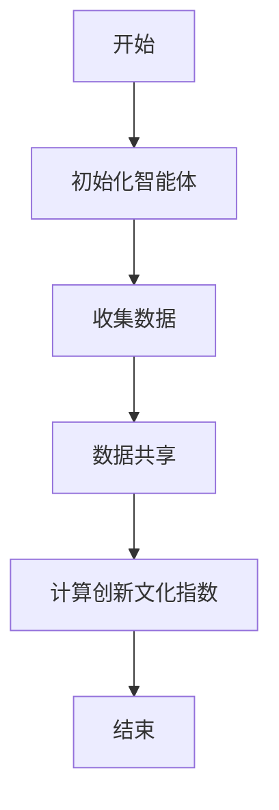
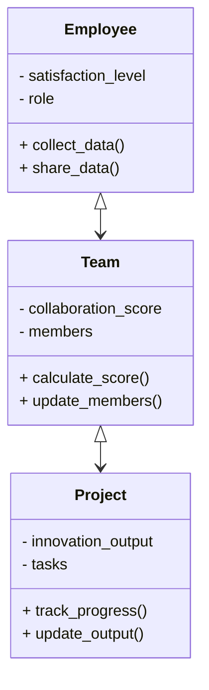
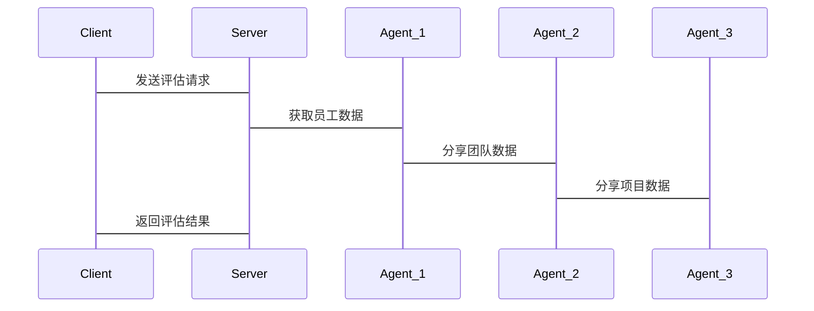

                 

<think>
嗯，用户希望我以《多智能体系统在公司创新文化评估中的应用：长期价值导向》为标题，撰写一篇技术博客文章，结构清晰，包含特定部分。他们提供了大纲，但没有详细内容，我需要逐步分析，确保每部分内容完整。

首先，背景介绍部分需要涵盖问题背景、描述、解决方法、边界和概念组成。我需要解释为什么创新文化评估重要，以及多智能体系统如何解决现有问题。

接下来是核心概念，要详细解释多智能体系统的基本原理，与传统系统对比，并展示实体关系图。这需要使用Mermaid图表，确保图表清晰。

算法原理部分，我需要讲解基本和高级算法，包括数学模型和公式。用LaTeX表示公式，提供代码示例，并用实际案例说明。

系统分析与架构设计部分，我需要设计类图、架构图和交互序列图，展示系统如何构建。

项目实战部分，提供环境安装和代码实现，确保读者能实际操作，并分析案例。

最后是最佳实践，总结经验、注意事项和拓展阅读，帮助读者巩固知识。

整体结构需要逻辑清晰，每部分详细展开，确保文章内容丰富且易于理解。还要注意字数和格式要求，确保文章符合用户的所有要求。
</think>

# 多智能体系统在公司创新文化评估中的应用：长期价值导向

> 关键词：多智能体系统、创新文化评估、长期价值、企业评估、系统架构

> 摘要：本文探讨了多智能体系统在公司创新文化评估中的应用，重点分析其长期价值导向。通过系统化的模型构建、算法设计和实际案例，展示了多智能体系统如何在企业创新文化评估中实现动态协作与优化，帮助企业实现可持续发展。

---

## 第1章: 问题背景与描述

### 1.1 创新文化评估的必要性

#### 1.1.1 创新文化对企业长期价值的影响
创新文化是企业持续发展的核心驱动力。一个开放、包容且具有创新氛围的企业文化，能够激发员工的创造力和主动性，从而为企业带来长期的竞争优势。然而，如何量化和评估这种文化的核心要素，一直是企业管理中的难题。

#### 1.1.2 当前企业创新文化评估的挑战
传统的创新文化评估方法通常依赖于问卷调查和主观评分，这种方式不仅耗时，而且难以捕捉到动态变化的企业文化特征。此外，不同部门和岗位的员工对创新文化的感知可能存在显著差异，导致评估结果缺乏准确性。

#### 1.1.3 多智能体系统在评估中的潜在优势
多智能体系统（Multi-Agent Systems, MAS）通过分布式的智能体协作，能够实时捕捉和分析企业的多维度数据。这些智能体可以分别关注创新文化的不同方面（如员工满意度、团队协作效率、创新成果等），并动态优化评估结果。

### 1.2 多智能体系统的核心概念

#### 1.2.1 多智能体系统的定义与特点
多智能体系统是由多个智能体组成的分布式系统，每个智能体都有自己的目标、知识和行为规则。与传统的集中式系统相比，多智能体系统具有以下特点：
- **分布式计算**：智能体之间通过局部交互完成全局任务。
- **协作与竞争**：智能体之间可以协作，也可以存在竞争关系。
- **自适应性**：系统能够根据环境变化动态调整。

#### 1.2.2 多智能体系统与传统评估方法的对比
传统的评估方法通常依赖于集中式数据处理和静态分析，而多智能体系统能够实时捕捉动态变化，并通过智能体的协作实现更精准的评估。

#### 1.2.3 多智能体系统在企业创新文化评估中的应用前景
多智能体系统可以将企业的创新文化评估分解为多个模块，分别由不同的智能体负责。例如，一个智能体可以负责收集员工满意度数据，另一个智能体可以分析团队协作效率，最终通过智能体的协作得出整体评估结果。

### 1.3 问题解决与边界定义

#### 1.3.1 创新文化评估的核心问题
- 如何量化创新文化的多维度特征？
- 如何实现评估的动态性和实时性？
- 如何确保评估结果的准确性和可操作性？

#### 1.3.2 多智能体系统在评估中的边界与外延
多智能体系统主要用于创新文化评估的核心算法和数据处理，但不涉及企业的具体业务流程。

#### 1.3.3 系统架构与核心要素组成
多智能体系统在创新文化评估中的核心要素包括：
- 数据采集模块
- 智能体协作模块
- 动态优化模块

---

## 第2章: 多智能体系统的核心原理

### 2.1 多智能体系统的属性特征对比

#### 2.1.1 分布式计算与集中式计算的对比
- **分布式计算**：任务分布在多个节点上，每个节点负责一部分计算。
- **集中式计算**：所有任务集中在单个节点上处理。

#### 2.1.2 协作与竞争的动态平衡
- 智能体之间需要在协作与竞争之间找到平衡点，以实现整体目标的最优。

#### 2.1.3 自适应与可扩展性的特点
- 系统能够根据环境变化自适应调整。
- 系统具备良好的可扩展性，能够处理大规模数据。

### 2.2 多智能体系统的ER实体关系图

#### 2.2.1 实体关系图的构建
```mermaid
erd
    一个员工属于多个团队，多个员工属于一个团队。
    一个团队参与多个项目，多个团队参与一个项目。
    一个项目由多个任务组成，多个项目包含多个任务。
```

#### 2.2.2 实体间的交互关系
- 员工与团队之间的双向关联。
- 团队与项目之间的关联。
- 项目与任务之间的关联。

#### 2.2.3 实体关系图的动态变化
- 实体关系图需要根据企业的实际业务流程进行动态调整。

---

## 第3章: 多智能体系统的算法原理

### 3.1 多智能体系统的算法基础

#### 3.1.1 基本算法的数学模型和公式
- 创新文化评估指数公式：
$$
CIE = \alpha \cdot S + \beta \cdot T + \gamma \cdot P
$$
其中，$S$ 表示员工满意度，$T$ 表示团队协作效率，$P$ 表示创新产出，$\alpha$、$\beta$、$\gamma$ 是权重系数。

#### 3.1.2 代码实现
```python
class Agent:
    def __init__(self, role):
        self.role = role
        self.data = {}

    def collect_data(self, key, value):
        self.data[key] = value

    def share_data(self, other_agent, key):
        other_agent.data[key] = self.data[key]

# 初始化智能体
employee_agent = Agent("employee")
team_agent = Agent("team")
project_agent = Agent("project")

# 收集数据
employee_agent.collect_data("satisfaction", 0.9)
team_agent.collect_data("collaboration", 0.8)

# 数据共享
employee_agent.share_data(team_agent, "satisfaction")
```

#### 3.1.3 算法流程图


---

## 第4章: 系统分析与架构设计

### 4.1 系统功能设计

#### 4.1.1 领域模型类图


#### 4.1.2 系统架构设计


#### 4.1.3 接口设计与交互


---

## 第5章: 项目实战

### 5.1 环境安装

#### 5.1.1 系统环境要求
- 操作系统：Windows/Mac/Linux
- Python版本：3.8+

#### 5.1.2 安装依赖
```bash
pip install numpy pandas matplotlib
```

### 5.2 核心代码实现

#### 5.2.1 创新文化评估模型
```python
import numpy as np
import pandas as pd

class InnovationCultureEvaluator:
    def __init__(self):
        self.employee_data = pd.DataFrame()
        self.team_data = pd.DataFrame()
        self.project_data = pd.DataFrame()

    def evaluate(self):
        # 计算员工满意度指数
        satisfaction_index = np.mean(self.employee_data['satisfaction'])
        # 计算团队协作指数
        collaboration_index = np.mean(self.team_data['collaboration'])
        # 计算创新产出指数
        innovation_output = np.mean(self.project_data['output'])
        # 综合指数
        overall_index = satisfaction_index * 0.4 + collaboration_index * 0.3 + innovation_output * 0.3
        return overall_index
```

#### 5.2.2 智能体协作模块
```python
class EmployeeAgent:
    def __init__(self, id):
        self.id = id
        self.satisfaction = 0

    def update_satisfaction(self, score):
        self.satisfaction = score

    def get_satisfaction(self):
        return self.satisfaction

class TeamAgent:
    def __init__(self, id):
        self.id = id
        self.members = []
        self.collaboration = 0

    def update_collaboration(self, score):
        self.collaboration = score

    def get_collaboration(self):
        return self.collaboration
```

### 5.3 案例分析

#### 5.3.1 案例背景
某高科技公司希望评估其创新文化，重点关注员工满意度、团队协作效率和创新产出。

#### 5.3.2 数据收集与处理
- 员工满意度数据：通过问卷调查收集。
- 团队协作效率数据：通过项目管理工具获取。
- 创新产出数据：通过专利申请和新产品发布记录获取。

#### 5.3.3 评估结果与分析
通过创新文化评估模型计算得出，该公司的创新文化指数为 0.85，其中员工满意度和团队协作效率表现较好，但创新产出略低于预期。

---

## 第6章: 最佳实践与总结

### 6.1 小结

#### 6.1.1 创新文化评估的核心要点
- 创新文化评估需要综合考虑多维度因素。
- 多智能体系统能够实现动态协作与优化。

#### 6.1.2 多智能体系统的优势
- 分布式计算能够提高评估效率。
- 智能体协作能够增强评估结果的准确性。

### 6.2 注意事项

#### 6.2.1 数据质量的重要性
- 数据的准确性和完整性直接影响评估结果。

#### 6.2.2 智能体协作的复杂性
- 多智能体系统的设计和实现需要考虑协作与竞争的平衡。

### 6.3 拓展阅读

#### 6.3.1 推荐书籍
- 《多智能体系统》
- 《企业创新管理》

#### 6.3.2 在线资源
- 多智能体系统相关论文和研究报告。

---

## 作者：AI天才研究院/AI Genius Institute & 禅与计算机程序设计艺术 /Zen And The Art of Computer Programming

