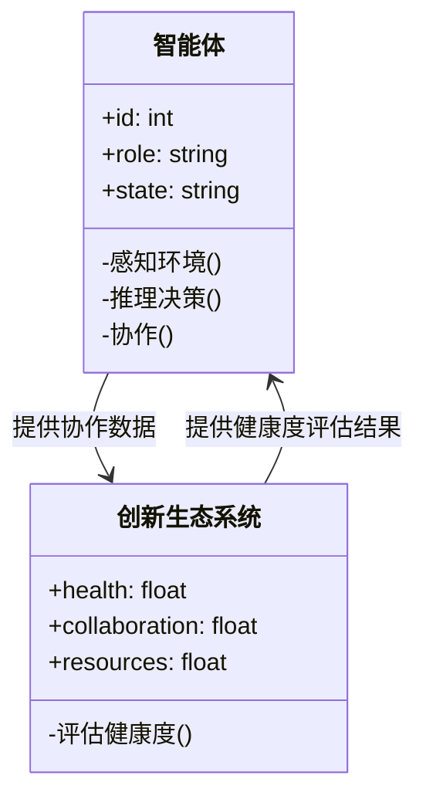
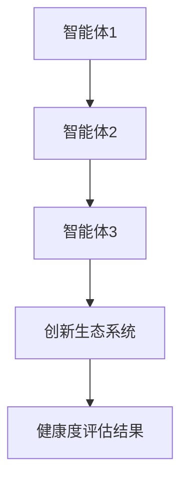
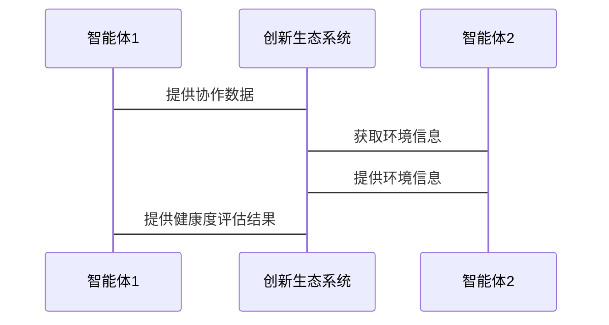

                 

<think>
嗯，用户希望我写一篇关于《多智能体系统在公司创新生态系统健康度评估中的应用》的技术博客文章，并且要按照指定的目录结构来写。首先，我需要理解整个任务的要求，确保涵盖所有必要的部分。

首先，文章需要有标题、关键词和摘要。标题已经给出来了，关键词包括多智能体系统、创新生态系统、健康度评估、企业创新、协作机制、系统架构和AI技术。摘要需要简明扼要地总结文章的核心内容，所以我得先概述整个主题。

接下来，按照目录结构，我需要逐章逐节展开。第一章是多智能体系统的概述，包括基本概念、组成和结构。这部分需要简单明了地解释多智能体系统是什么，它的特点以及与单智能体系统的区别。我可能需要举一些实际例子来帮助读者理解。

第二章讨论创新生态系统，定义和特征，这部分需要说明创新生态系统是什么，它包括哪些要素，以及它的特点。我可能会画一个图表来展示创新生态系统的组成部分。

第三章是关于健康度评估的背景和意义，这部分要说明为什么评估创新生态系统健康度很重要，以及多智能体系统在其中的应用优势。我需要详细解释创新对企业发展的核心作用，以及健康度评估对企业价值的影响。

接下来的章节深入探讨多智能体系统在创新生态系统中的具体应用，包括它们的关系、算法原理、系统架构和项目实战。在算法部分，我需要用数学模型和公式来详细讲解，可能还需要用Mermaid流程图来展示算法流程。系统架构部分需要设计一个清晰的架构图，展示各个模块之间的关系。

项目实战部分需要提供具体的代码实现，解读代码的功能，并分析实际案例。这部分要确保读者能够跟随步骤进行实际操作，理解代码的作用和算法的实际应用。

最后，总结部分需要回顾整个内容，强调多智能体系统的优势和未来的发展方向。同时，给出一些最佳实践的建议和注意事项，帮助读者更好地应用这些技术。

我需要确保文章结构清晰，逻辑连贯，每一部分内容详细且易于理解。同时，语言要专业但不过于复杂，避免使用过于晦涩的术语，确保读者能够轻松跟随。

在写作过程中，我可能会遇到如何解释复杂的概念，或者如何将理论与实际应用结合起来的挑战。这时候，我需要多举例子，用实际案例来说明，让读者更容易理解。

总的来说，我需要一步步地按照目录结构来撰写，确保每一部分都详细且完整，同时注意文章的整体连贯性和逻辑性。这样才能写出一篇高质量的技术博客文章，满足用户的需求。
</think>

# 多智能体系统在公司创新生态系统健康度评估中的应用

> 关键词：多智能体系统，创新生态系统，健康度评估，企业创新，协作机制，系统架构，AI技术

> 摘要：本文探讨了多智能体系统在公司创新生态系统健康度评估中的应用。通过分析创新生态系统的构成和健康度评估的重要性，结合多智能体系统的分布式协作特性，提出了基于多智能体系统的健康度评估模型和方法。文章详细介绍了多智能体系统的核心概念、算法原理、系统架构设计以及实际应用案例，为企业的创新生态系统管理提供了新的思路和解决方案。

---

# 第一部分: 多智能体系统与创新生态系统概述

## 第1章: 多智能体系统概述

### 1.1 多智能体系统的基本概念

#### 1.1.1 多智能体系统的定义
多智能体系统（Multi-Agent System, MAS）是由多个智能体（Agent）组成的分布式系统，这些智能体通过协作完成复杂的任务。智能体是具有感知、决策、执行能力的实体，能够独立工作并与其他智能体或环境进行交互。

#### 1.1.2 多智能体系统的特征
- **自主性**：智能体能够自主决策。
- **反应性**：能够实时感知环境并做出反应。
- **协作性**：多个智能体通过协作完成任务。
- **分布式性**：系统由多个智能体组成，不存在中心控制节点。

#### 1.1.3 多智能体系统与单智能体系统的区别
| 特性          | 单智能体系统          | 多智能体系统          |
|---------------|----------------------|----------------------|
| 结构          | 单一控制中心         | 分布式结构           |
| 协作方式      | 单一决策              | 多智能体协作          |
| 复杂性        | 简单                 | 复杂                 |

### 1.2 多智能体系统的组成与结构

#### 1.2.1 智能体的基本构成
智能体由以下部分组成：
- **感知器**：感知环境信息。
- **推理器**：对信息进行分析和推理。
- **行动器**：根据推理结果采取行动。

#### 1.2.2 多智能体系统的层次结构
多智能体系统的层次结构包括：
- **物理层**：智能体的物理实现。
- **逻辑层**：智能体的逻辑推理和决策。
- **协作层**：智能体之间的协作机制。

#### 1.2.3 多智能体系统的通信机制
多智能体系统中，智能体之间的通信可以通过以下方式实现：
- **直接通信**：智能体之间直接交换信息。
- **间接通信**：通过中间代理进行信息传递。
- **发布-订阅模式**：智能体发布信息，其他智能体订阅。

## 第2章: 创新生态系统概述

### 2.1 创新生态系统的核心要素

#### 2.1.1 创新生态系统的定义
创新生态系统是一个由企业、合作伙伴、供应商、客户、员工等多方参与者组成的网络，通过协作和资源共享实现创新。

#### 2.1.2 创新生态系统的核心要素
- **创新主体**：包括企业、员工、合作伙伴等。
- **创新资源**：包括技术、资金、数据等。
- **创新环境**：包括政策、文化、市场等。

### 2.2 创新生态系统的特征

#### 2.2.1 开放性
创新生态系统是一个开放的系统，允许多方参与者加入。

#### 2.2.2 多样性
创新生态系统中的参与者具有多样性和互补性。

#### 2.2.3 协作性
创新生态系统依赖于多方参与者之间的协作。

## 第3章: 公司创新生态系统健康度评估的背景与意义

### 3.1 创新生态系统健康度评估的必要性

#### 3.1.1 创新对企业发展的核心作用
创新是企业持续发展的核心动力。

#### 3.1.2 创新生态系统健康度对企业价值的影响
健康的创新生态系统能够提高企业的竞争力和创新能力。

### 3.2 多智能体系统在创新生态系统评估中的优势

#### 3.2.1 多智能体系统的分布式计算能力
多智能体系统能够处理复杂的分布式计算任务。

#### 3.2.2 多智能体系统的协作能力
多智能体系统能够模拟多方参与者之间的协作关系。

#### 3.2.3 多智能体系统的动态适应性
多智能体系统能够适应创新生态系统中的动态变化。

---

# 第二部分: 多智能体系统在创新生态系统中的应用

## 第4章: 多智能体系统与创新生态系统的关系

### 4.1 多智能体系统在创新生态系统中的角色

#### 4.1.1 智能体作为创新主体的体现
智能体可以代表企业、员工、合作伙伴等创新主体。

#### 4.1.2 智能体之间的协作关系
智能体之间的协作模拟了创新生态系统中的多方协作。

### 4.2 创新生态系统健康度评估的核心概念

#### 4.2.1 健康度评估的指标体系
健康度评估的指标包括：
- **创新活力**：创新主体的活跃程度。
- **资源丰富度**：创新资源的充足程度。
- **协作强度**：创新主体之间的协作程度。

#### 4.2.2 多智能体系统在健康度评估中的作用
多智能体系统可以实时监测和评估创新生态系统的健康状态。

---

## 第5章: 创新生态系统健康度评估的算法原理

### 5.1 多智能体系统健康度评估的数学模型

#### 5.1.1 智能体协作的数学模型
$$C = \sum_{i=1}^{n} w_i x_i$$
其中，$C$ 表示协作程度，$w_i$ 表示权重，$x_i$ 表示协作指标。

#### 5.1.2 创新生态系统健康度的综合评估公式
$$H = \alpha C + \beta R + \gamma D$$
其中，$H$ 表示健康度，$\alpha$、$\beta$、$\gamma$ 表示各部分的权重，$C$ 表示协作程度，$R$ 表示资源丰富度，$D$ 表示多样性。

### 5.2 多智能体系统健康度评估的算法流程

#### 5.2.1 算法步骤
1. 初始化智能体。
2. 智能体感知环境信息。
3. 智能体进行推理和决策。
4. 智能体之间协作完成任务。
5. 评估健康度并输出结果。

#### 5.2.2 算法实现
```python
def assess_health():
    # 初始化智能体
    agents = initialize_agents()
    # 智能体感知环境
    perceptions =感知环境信息()
    # 智能体推理和决策
    decisions =推理决策(perceptions)
    # 智能体协作
    collaboration =协作(agents, decisions)
    # 评估健康度
    health =评估健康度(collaboration)
    return health
```

### 5.3 算法的数学模型与公式

#### 5.3.1 协作程度计算
$$C = \frac{\sum_{i=1}^{n} w_i x_i}{\sum_{i=1}^{n} w_i}$$
其中，$w_i$ 是协作指标的权重，$x_i$ 是协作指标的值。

#### 5.3.2 资源丰富度计算
$$R = \frac{\sum_{i=1}^{m} p_i y_i}{\sum_{i=1}^{m} p_i}$$
其中，$p_i$ 是资源指标的权重，$y_i$ 是资源指标的值。

---

## 第6章: 系统分析与架构设计方案

### 6.1 项目场景介绍
公司希望通过多智能体系统来评估创新生态系统的健康度，优化创新过程。

### 6.2 系统功能设计

#### 6.2.1 领域模型类图


### 6.3 系统架构设计

#### 6.3.1 系统架构图


### 6.4 系统接口设计

#### 6.4.1 系统接口
- **输入接口**：智能体感知环境信息。
- **输出接口**：智能体协作数据，健康度评估结果。

### 6.5 系统交互序列图



---

## 第7章: 项目实战

### 7.1 环境安装与配置

#### 7.1.1 安装Python环境
安装Python 3.8及以上版本，安装必要的库（如`mermaid`、`networkx`等）。

### 7.2 核心代码实现

#### 7.2.1 智能体类实现
```python
class Agent:
    def __init__(self, id, role):
        self.id = id
        self.role = role
        self.state = "idle"
    
    def 感知环境(self, environment):
        # 感知环境信息
        pass
    
    def 推理决策(self):
        # 推理和决策
        pass
    
    def 协作(self, other_agents):
        # 协作
        pass
```

#### 7.2.2 创新生态系统评估类实现
```python
class InnovationEcosystem:
    def __init__(self, agents):
        self.agents = agents
        self.health = 0.0
    
    def 评估健康度(self):
        # 计算协作程度
        collaboration = 0.0
        for agent in self.agents:
            collaboration += agent.推理决策()
        self.health = collaboration * 0.5
```

### 7.3 实际案例分析

#### 7.3.1 案例背景
某公司希望通过多智能体系统评估其创新生态系统的健康度。

#### 7.3.2 案例实现
```python
agents = [
    Agent(1, "研发团队"),
    Agent(2, "市场团队"),
    Agent(3, "供应链团队")
]
ecosystem = InnovationEcosystem(agents)
ecosystem.评估健康度()
print("健康度:", ecosystem.health)
```

---

## 第8章: 总结与展望

### 8.1 总结
多智能体系统在公司创新生态系统健康度评估中的应用具有重要意义。通过分布式协作和动态适应性，多智能体系统能够有效评估创新生态系统的健康状态。

### 8.2 展望
未来，随着人工智能和大数据技术的发展，多智能体系统在创新生态系统中的应用将更加广泛和深入。

---

# 作者：AI天才研究院 & 禅与计算机程序设计艺术

---

通过以上结构和内容，文章详细介绍了多智能体系统在公司创新生态系统健康度评估中的应用，从理论到实践，从算法到系统架构，为读者提供了全面的指导和参考。

