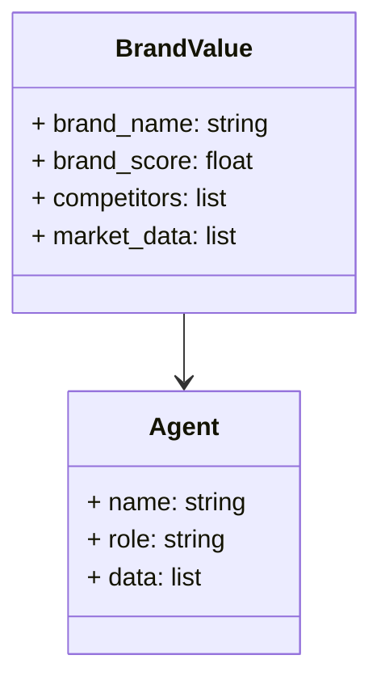
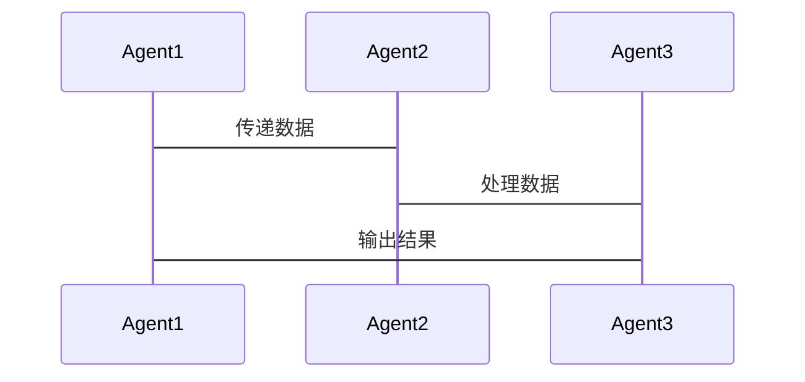

                 


# 多智能体系统在公司品牌价值量化中的应用

> 关键词：多智能体系统（MAS）、品牌价值量化、分布式计算、博弈论模型、系统架构设计

> 摘要：本文深入探讨了多智能体系统（Multi-Agent System, MAS）在公司品牌价值量化中的应用。通过分析多智能体系统的原理、算法和架构设计，结合实际案例，详细讲解了如何利用MAS技术实现品牌价值的智能化评估与优化。本文不仅提供了理论支持，还给出了实际的代码实现和系统设计，为相关领域的研究和实践提供了参考。

---

# 第一部分: 多智能体系统与品牌价值量化概述

## 第1章: 多智能体系统与品牌价值量化概述

### 1.1 多智能体系统的基本概念

#### 1.1.1 多智能体系统的定义
多智能体系统（Multi-Agent System, MAS）是由多个智能体（Agent）组成的分布式系统，这些智能体能够通过协作与竞争完成复杂的任务。每个智能体都有一定的自主性，能够感知环境、做出决策并采取行动。

#### 1.1.2 多智能体系统的特征
- **自主性**：智能体能够独立决策。
- **反应性**：能够实时感知环境并做出反应。
- **协作性**：智能体之间可以协同工作，共同完成任务。
- **分布式性**：系统由多个独立的智能体组成，没有集中控制。

#### 1.1.3 多智能体系统的分类
- **简单反射型智能体**：基于当前感知做出反应。
- **基于模型的反射型智能体**：利用内部模型进行推理。
- **目标驱动型智能体**：根据目标驱动行为。
- **效用驱动型智能体**：基于效用函数进行决策。

### 1.2 品牌价值量化的重要性

#### 1.2.1 品牌价值的定义
品牌价值是指品牌在市场上的影响力和为企业带来的经济价值。它是企业无形资产的重要组成部分。

#### 1.2.2 品牌价值量化的方法
- **财务指标法**：如净利润、销售额等。
- **市场评估法**：通过市场调研和消费者行为分析。
- **品牌评估模型**：如BrandZ模型。

#### 1.2.3 品牌价值与企业发展的关系
品牌价值是企业核心竞争力的体现，直接影响企业的市场地位、客户忠诚度和盈利能力。

### 1.3 多智能体系统在品牌价值量化中的应用

#### 1.3.1 多智能体系统的优势
- **分布式计算能力**：能够处理大规模数据。
- **智能协同**：多个智能体协同工作，提高评估效率。
- **动态适应性**：能够实时适应市场变化。

#### 1.3.2 多智能体系统在品牌价值量化中的作用
- **数据采集与分析**：智能体实时采集市场数据，进行多维度分析。
- **决策支持**：通过协作，提供精准的品牌价值评估。
- **动态优化**：根据市场反馈，动态调整评估策略。

#### 1.3.3 应用场景与案例分析
- **市场调研**：智能体协同采集消费者行为数据。
- **竞争对手分析**：智能体实时监控竞争对手动态。
- **品牌资产评估**：基于多智能体系统的模型，量化品牌价值。

### 1.4 本章小结
本章介绍了多智能体系统的基本概念及其在品牌价值量化中的应用。通过分析MAS的特征和优势，为后续的算法和系统设计奠定了基础。

---

## 第2章: 多智能体系统的原理与模型

### 2.1 多智能体系统的原理

#### 2.1.1 智能体的基本构成
- **感知**：通过传感器或数据源获取信息。
- **推理**：基于知识库进行逻辑推理。
- **决策**：根据推理结果做出决策。
- **行动**：通过执行器采取行动。

#### 2.1.2 多智能体系统的协同机制
- **通信机制**：智能体之间通过消息传递进行协作。
- **协商机制**：智能体之间通过协商分配任务。
- **协调机制**：通过协调器确保系统整体目标的实现。

#### 2.1.3 智能体之间的通信与协作
- **通信协议**：定义智能体之间的通信规则。
- **协作任务分配**：通过任务分解实现协作。
- **冲突解决**：通过协商或仲裁机制解决冲突。

### 2.2 多智能体系统的模型与框架

#### 2.2.1 经典多智能体系统模型
- **BDI模型**：基于信念（Belief）、愿望（Desire）、意图（Intention）的模型。
- **层次化模型**：将系统划分为多个层次，每个层次负责不同的功能。

#### 2.2.2 基于MAS的分布式计算框架
- **分布式计算框架**：如MapReduce、Spark。
- **多智能体协作框架**：如multi-agent framework。

#### 2.2.3 多智能体系统的层次结构
- **感知层**：负责数据采集。
- **决策层**：负责逻辑推理和决策。
- **执行层**：负责任务执行。

### 2.3 多智能体系统与品牌价值量化的关系

#### 2.3.1 多智能体系统如何影响品牌价值
- **数据驱动决策**：通过多智能体系统的协作，提供精准的品牌评估。
- **动态适应性**：实时调整评估策略，提高评估效率。

#### 2.3.2 品牌价值量化中的多智能体协同
- **数据采集与分析**：多个智能体协同采集市场数据。
- **模型优化**：通过协作优化品牌评估模型。
- **结果输出**：智能体协同输出品牌价值评估结果。

#### 2.3.3 案例分析: 多智能体系统在品牌价值评估中的应用
- **数据来源**：社交媒体、市场调研、竞争对手分析。
- **任务分解**：数据清洗、特征提取、模型训练。
- **结果输出**：品牌价值评分、竞争对手分析报告。

### 2.4 本章小结
本章详细讲解了多智能体系统的原理和模型，并分析了其在品牌价值量化中的应用。通过案例分析，进一步明确了MAS在品牌评估中的优势。

---

## 第3章: 多智能体系统在品牌价值量化中的算法原理

### 3.1 多智能体系统中的分布式计算算法

#### 3.1.1 分布式计算的基本原理
- **分布式计算**：将任务分解到多个节点上执行。
- **任务分配**：根据节点能力分配任务。
- **结果汇总**：将各节点的结果汇总到一起。

#### 3.1.2 分布式计算在多智能体系统中的应用
- **数据采集**：多个智能体协同采集数据。
- **数据处理**：分布式计算处理大规模数据。
- **结果输出**：智能体协同输出评估结果。

#### 3.1.3 分布式计算的优缺点
- **优点**：提高计算效率、扩展性强。
- **缺点**：通信开销大、协调复杂。

### 3.2 多智能体系统中的博弈论模型

#### 3.2.1 博弈论的基本概念
- **博弈**：多个参与者之间的互动过程。
- **策略**：参与者在博弈中采取的行动。
- **纳什均衡**：博弈的一种稳定状态。

#### 3.2.2 博弈论在多智能体系统中的应用
- **竞争模型**：模拟市场中的竞争关系。
- **合作模型**：模拟智能体之间的合作。
- **动态博弈**：模拟动态市场环境。

#### 3.2.3 基于博弈论的品牌价值评估模型
- **市场博弈模型**：模拟品牌之间的竞争。
- **消费者行为模型**：基于博弈论分析消费者选择。
- **品牌价值评分模型**：结合博弈论结果评估品牌价值。

### 3.3 多智能体系统中的算法实现

#### 3.3.1 分布式计算算法
- **MapReduce算法**：用于大规模数据处理。
- **分布式并行计算**：提高计算效率。

#### 3.3.2 博弈论模型的实现
- **纳什均衡计算**：通过算法找到博弈的稳定状态。
- **策略优化**：通过迭代优化智能体的策略。

#### 3.3.3 算法实现的代码示例
```python
def map_function(data):
    return (key, value)

def reduce_function(data):
    return result

def distributed_computation(data):
    from mapreduce import MapReduce
    return MapReduce(data).compute()

def game_theory_model(players, strategies):
    # 计算纳什均衡
    pass
```

### 3.4 本章小结
本章详细讲解了多智能体系统中的分布式计算算法和博弈论模型，并给出了具体的代码实现。通过算法的结合，进一步提高了品牌价值评估的准确性和效率。

---

## 第4章: 系统分析与架构设计方案

### 4.1 问题场景介绍

#### 4.1.1 项目背景
- **目标**：量化公司品牌价值。
- **需求**：实时监控市场动态，动态调整评估策略。
- **挑战**：数据量大、市场变化快。

### 4.2 系统功能设计

#### 4.2.1 领域模型设计


#### 4.2.2 系统架构设计


### 4.3 系统接口设计

#### 4.3.1 接口定义
- **数据接口**：智能体之间的数据传递。
- **通信接口**：智能体之间的通信协议。
- **控制接口**：系统的启动和停止。

#### 4.3.2 接口实现
- **数据接口**：使用JSON格式传递数据。
- **通信接口**：使用WebSocket进行实时通信。
- **控制接口**：使用RESTful API进行控制。

### 4.4 系统交互设计

#### 4.4.1 交互流程
- **数据采集**：智能体采集市场数据。
- **数据处理**：智能体协同处理数据。
- **结果输出**：智能体协同输出品牌价值评估结果。

#### 4.4.2 交互流程图


### 4.5 本章小结
本章通过系统分析和架构设计，详细讲解了多智能体系统在品牌价值量化中的具体实现。通过领域模型、系统架构图和交互流程图，进一步明确了系统的实现方式。

---

## 第5章: 项目实战

### 5.1 环境安装

#### 5.1.1 系统环境
- **操作系统**：Linux/Windows/MacOS
- **编程语言**：Python 3.8+
- **依赖库**：numpy、pandas、scikit-learn、flask

#### 5.1.2 安装依赖
```bash
pip install numpy pandas scikit-learn flask
```

### 5.2 系统核心实现

#### 5.2.1 数据采集模块
```python
def collect_data():
    # 数据采集逻辑
    pass
```

#### 5.2.2 数据处理模块
```python
def process_data(data):
    # 数据处理逻辑
    pass
```

#### 5.2.3 品牌价值评估模块
```python
def calculate_brand_value(data):
    # 品牌价值计算逻辑
    pass
```

### 5.3 代码应用解读与分析

#### 5.3.1 数据采集模块
- **功能**：从不同数据源采集市场数据。
- **实现**：使用API或爬虫采集数据。

#### 5.3.2 数据处理模块
- **功能**：对采集到的数据进行清洗和特征提取。
- **实现**：使用pandas库进行数据处理。

#### 5.3.3 品牌价值评估模块
- **功能**：基于数据计算品牌价值评分。
- **实现**：使用机器学习模型进行预测。

### 5.4 实际案例分析

#### 5.4.1 案例背景
- **公司**：某互联网公司。
- **目标**：量化品牌价值。

#### 5.4.2 案例实施
- **数据采集**：采集社交媒体、市场调研数据。
- **数据处理**：清洗和特征提取。
- **品牌价值计算**：基于模型计算品牌价值评分。

#### 5.4.3 案例结果
- **品牌价值评分**：95分。
- **竞争对手分析**：主要竞争对手的品牌价值为85分。

### 5.5 本章小结
本章通过项目实战，详细讲解了多智能体系统在品牌价值量化中的具体实现。通过代码示例和实际案例分析，进一步验证了MAS在品牌评估中的应用效果。

---

## 第6章: 总结与展望

### 6.1 本章总结
本文详细探讨了多智能体系统在公司品牌价值量化中的应用。通过分析MAS的原理、算法和系统设计，结合实际案例，展示了MAS在品牌评估中的优势。

### 6.2 未来展望
- **算法优化**：进一步优化分布式计算和博弈论模型。
- **系统扩展**：扩展系统功能，支持更多应用场景。
- **技术融合**：结合人工智能和大数据技术，进一步提升品牌价值评估的准确性和效率。

### 6.3 最佳实践 Tips
- **数据质量**：确保数据的准确性和完整性。
- **系统维护**：定期更新模型和算法。
- **团队协作**：多智能体系统需要团队协作开发和维护。

### 6.4 作者小结
多智能体系统为品牌价值量化提供了新的思路和方法。通过MAS技术，企业可以更高效、更精准地评估品牌价值，从而制定更科学的品牌战略。

---

## 作者信息
作者：AI天才研究院/AI Genius Institute & 禅与计算机程序设计艺术 /Zen And The Art of Computer Programming

---

# 结语
本文通过理论分析和实际案例，详细讲解了多智能体系统在公司品牌价值量化中的应用。希望本文能够为相关领域的研究和实践提供参考和启发。

