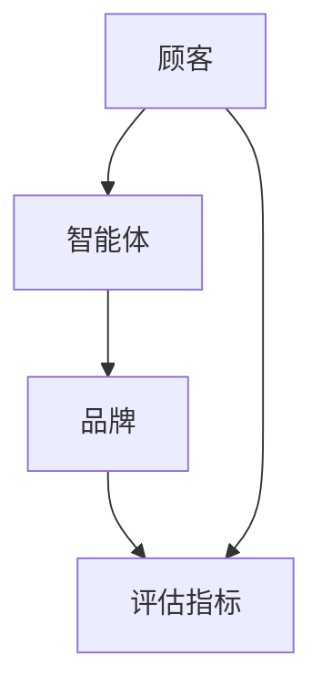
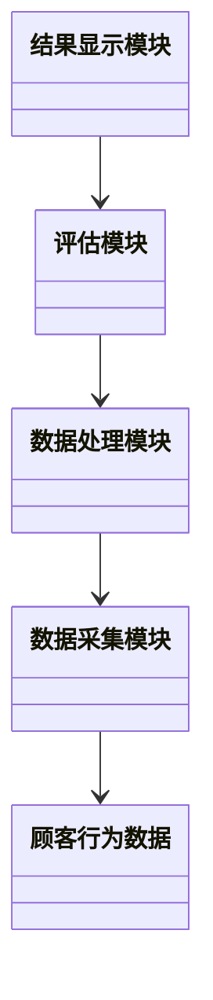
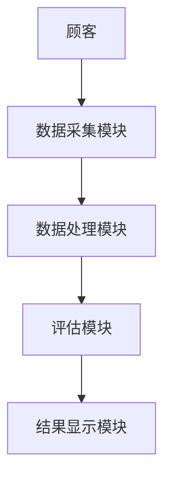
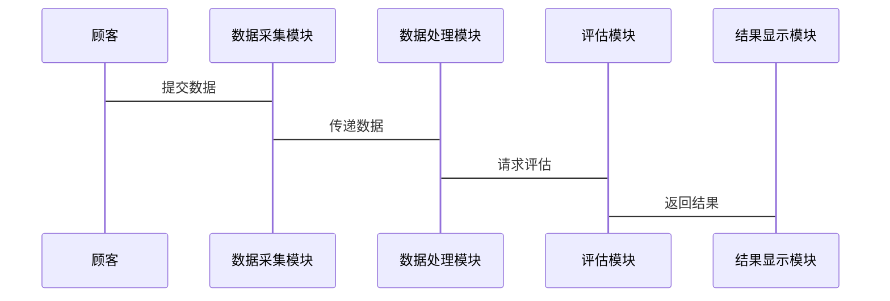

                 

<think>
嗯，我现在要帮用户写一篇关于《多智能体系统在公司品牌忠诚度动态评估中的应用》的技术博客。首先，我需要理解用户的需求。他们希望文章结构清晰，逻辑严谨，技术深入，同时用吸引人的章节标题，关键词和摘要。

用户提到要包括背景、核心概念、算法、系统架构、项目实战等部分。我得先确定每个部分的具体内容。背景部分需要解释多智能体系统是什么，品牌忠诚度的重要性，以及动态评估的必要性。这部分要让读者明白为什么MAS适合品牌忠诚度评估。

接下来，核心概念部分要详细讲解多智能体系统的原理和品牌忠诚度评估的要素。可能需要画个实体关系图，展示顾客、智能体、品牌和评估指标之间的关系。用Mermaid图会更清晰。

然后是算法原理，这部分需要详细描述协作算法和动态评估模型。我应该用Mermaid流程图展示算法步骤，并提供Python代码示例，这样读者可以理解如何实现这些算法。

系统分析与架构设计部分，我需要介绍项目背景，设计系统功能，可能用领域模型图展示。系统架构图用Mermaid表示，说明各个组件如何协作。接口设计和交互序列图也很重要，展示系统如何与外界通信。

项目实战部分，得提供环境安装步骤，核心代码实现，解读代码，并通过案例分析来展示实际应用。最后，给出项目小结，总结经验。

最后，最佳实践部分，包括小结、注意事项和拓展阅读，帮助读者巩固知识。作者信息也别忘了，要加上。

现在，我需要确保每个部分都有足够的细节，同时结构紧凑，逻辑清晰。关键词要准确，摘要要涵盖核心内容。整体控制在10000到12000字左右，确保内容丰富且完整。

总结一下，我需要从背景到实战，一步步详细讲解，用图表和代码辅助说明，确保读者能够理解并应用多智能体系统到品牌忠诚度评估中。这样写出来的博客应该能满足用户的需求，既有深度又易于理解。
</think>

```markdown
# 多智能体系统在公司品牌忠诚度动态评估中的应用

> 关键词：多智能体系统, 品牌忠诚度, 动态评估, 协作算法, 实体关系图, 系统架构设计

> 摘要：本文详细探讨了多智能体系统（MAS）在公司品牌忠诚度动态评估中的应用。通过分析MAS的核心原理、品牌忠诚度评估的关键要素，结合协作算法和动态评估模型，构建了一个基于MAS的动态评估系统。文章从系统背景、核心概念、算法原理、系统架构设计、项目实战等多维度展开，提供了丰富的理论支持和实践指导。

---

# 第一部分: 多智能体系统与品牌忠诚度评估的背景介绍

# 第1章: 多智能体系统概述

## 1.1 多智能体系统的基本概念

### 1.1.1 多智能体系统的定义
多智能体系统（Multi-Agent System, MAS）是由多个智能体（Agent）组成的分布式系统，这些智能体能够通过协作完成复杂的任务。智能体是具有感知、推理和行动能力的实体，能够独立决策并与其他智能体或环境进行交互。

### 1.1.2 多智能体系统的组成部分
1. **智能体（Agent）**：能够感知环境、做出决策并执行动作的基本单元。
2. **通信机制**：智能体之间通过通信协议交换信息。
3. **协作协议**：定义智能体之间的协作规则和任务分配方式。
4. **环境**：智能体所处的外部世界，可能是物理环境或抽象环境。

### 1.1.3 多智能体系统的分类与特点
1. **分类**：
   - **简单MAS**：智能体之间协作简单，任务分解明确。
   - **复杂MAS**：智能体之间协作复杂，任务分解动态。
2. **特点**：
   - **分布式**：智能体独立决策。
   - **协作性**：智能体通过协作完成任务。
   - **动态性**：环境和任务需求可能动态变化。

## 1.2 品牌忠诚度的定义与动态评估的重要性

### 1.2.1 品牌忠诚度的定义
品牌忠诚度是指消费者对某一品牌产品的偏好程度和持续购买意愿。忠诚的消费者通常会对品牌有较高的满意度和情感认同。

### 1.2.2 品牌忠诚度动态评估的重要性
品牌忠诚度会受到市场环境、消费者行为、产品质量和竞争因素的影响，动态评估能够帮助企业及时发现潜在问题并调整策略。

### 1.2.3 动态评估与传统评估方法的区别
- **传统评估方法**：定期进行调查或问卷，评估结果静态。
- **动态评估方法**：实时监测消费者行为和市场反馈，评估结果动态更新。

## 1.3 多智能体系统在品牌忠诚度评估中的优势

### 1.3.1 多智能体系统的分布式计算优势
MAS能够将品牌忠诚度评估的任务分解到多个智能体，每个智能体负责特定部分的数据分析和评估。

### 1.3.2 多智能体系统的实时协作能力
智能体之间能够实时交换信息，快速响应市场变化，提高评估的实时性和准确性。

### 1.3.3 多智能体系统在复杂场景中的应用潜力
MAS能够处理多维度、多因素的复杂场景，例如消费者行为、市场趋势和竞争分析。

## 1.4 本章小结

---

# 第二部分: 多智能体系统的核心概念与品牌忠诚度评估的联系

# 第2章: 多智能体系统的原理与品牌忠诚度评估的核心要素

## 2.1 多智能体系统的原理

### 2.1.1 智能体的基本属性
1. **感知能力**：智能体能够感知环境中的信息。
2. **推理能力**：智能体能够基于感知信息进行推理。
3. **行动能力**：智能体能够根据推理结果采取行动。

### 2.1.2 智能体的协作机制
- **任务分配**：智能体之间通过协作协议分配任务。
- **信息共享**：智能体之间通过通信机制共享信息。
- **冲突解决**：智能体之间通过协商解决冲突。

### 2.1.3 多智能体系统的通信协议
- **通信模型**：定义智能体之间的通信方式。
- **消息格式**：定义消息的结构和内容。
- **协议实现**：实现具体的通信机制。

## 2.2 品牌忠诚度评估的核心要素

### 2.2.1 顾客行为数据的采集与分析
- **数据采集**：通过问卷调查、社交媒体数据、销售数据等获取顾客行为数据。
- **数据分析**：通过数据挖掘和机器学习技术分析顾客行为数据。

### 2.2.2 品牌认知度的量化方法
- **品牌认知度**：消费者对品牌的了解程度。
- **量化方法**：通过市场调研、竞争对手分析等方法量化品牌认知度。

### 2.2.3 顾客满意度的动态评估指标
- **动态评估指标**：顾客满意度、品牌忠诚度、净推荐值等。
- **动态更新方法**：通过实时数据更新评估结果。

## 2.3 多智能体系统与品牌忠诚度评估的实体关系图

### 2.3.1 实体关系图的 Mermaid 表示


## 2.4 本章小结

---

# 第三部分: 多智能体系统在品牌忠诚度评估中的算法原理

# 第3章: 多智能体协作算法与动态评估模型

## 3.1 多智能体协作算法

### 3.1.1 分布式协作算法的定义
分布式协作算法是指在多个智能体之间通过分布式计算完成协作任务的算法。

### 3.1.2 基于智能体的协作流程
1. **任务分解**：将整体任务分解为多个子任务。
2. **任务分配**：将子任务分配给不同的智能体。
3. **信息共享**：智能体之间共享相关信息。
4. **协作执行**：智能体根据分配的任务和共享的信息协作完成任务。

### 3.1.3 协作算法的实现步骤
1. **初始化**：定义智能体、任务和通信机制。
2. **任务分解**：将任务分解为子任务。
3. **任务分配**：将子任务分配给智能体。
4. **信息共享**：智能体之间共享相关信息。
5. **协作执行**：智能体协作完成任务。
6. **结果汇总**：汇总各智能体的执行结果。

## 3.2 动态评估模型的构建

### 3.2.1 动态评估模型的数学

$$
\text{品牌忠诚度} = f(\text{顾客满意度}, \text{品牌认知度}, \text{净推荐值})
$$

其中，$f$ 是一个综合函数，可以根据具体需求进行调整。

### 3.2.2 动态评估模型的实现步骤
1. **数据采集**：采集顾客行为数据。
2. **数据预处理**：清洗和转换数据。
3. **模型训练**：训练动态评估模型。
4. **模型部署**：将模型部署到实际应用中。
5. **实时更新**：根据新数据实时更新模型。

## 3.3 本章小结

---

# 第四部分: 系统分析与架构设计

# 第4章: 系统分析与架构设计方案

## 4.1 项目背景

### 4.1.1 项目背景介绍
本项目旨在通过多智能体系统实现公司品牌忠诚度的动态评估，帮助企业及时了解品牌忠诚度的变化，优化品牌管理策略。

### 4.1.2 项目目标
1. 实现品牌忠诚度的动态评估。
2. 提供实时的品牌忠诚度评估结果。
3. 支持多维度的品牌忠诚度分析。

## 4.2 系统功能设计

### 4.2.1 系统功能模块
1. **数据采集模块**：负责采集顾客行为数据。
2. **数据处理模块**：负责对数据进行清洗和转换。
3. **评估模块**：负责品牌忠诚度的动态评估。
4. **结果显示模块**：负责展示评估结果。

### 4.2.2 系统功能的 Mermaid 领域模型图


## 4.3 系统架构设计

### 4.3.1 系统架构的 Mermaid 表示


### 4.3.2 系统接口设计
1. **数据接口**：数据采集模块与数据处理模块之间的接口。
2. **评估接口**：数据处理模块与评估模块之间的接口。
3. **显示接口**：评估模块与结果显示模块之间的接口。

### 4.3.3 系统交互的 Mermaid 序列图


## 4.4 本章小结

---

# 第五部分: 项目实战

# 第5章: 项目实战与案例分析

## 5.1 项目实战环境安装

### 5.1.1 环境要求
- 操作系统：Windows 10 或更高版本，或 Linux 系统。
- Python：3.6 或更高版本。
- 开发工具：PyCharm 或 VS Code。
- 第三方库：numpy, pandas, scikit-learn, matplotlib。

### 5.1.2 安装步骤
1. 安装 Python。
2. 安装必要的第三方库：
   ```bash
   pip install numpy pandas scikit-learn matplotlib
   ```

## 5.2 系统核心实现源代码

### 5.2.1 协作算法的实现代码
```python
class Agent:
    def __init__(self, id):
        self.id = id
        self.data = None

    def receive_data(self, data):
        self.data = data

    def process_data(self):
        # 具体的处理逻辑可以根据需求实现
        pass

# 初始化智能体
agents = [Agent(1), Agent(2), Agent(3)]

# 分配任务
for agent in agents:
    agent.receive_data("任务数据")

# 协作执行
for agent in agents:
    agent.process_data()

# 汇总结果
results = [agent.data for agent in agents]
```

### 5.2.2 动态评估模型的实现代码
```python
from sklearn.linear_model import LinearRegression

# 数据准备
import numpy as np
import pandas as pd

# 加载数据
data = pd.read_csv('customer_data.csv')

# 训练模型
model = LinearRegression()
model.fit(data[['顾客满意度', '品牌认知度']], data['净推荐值'])

# 预测结果
new_data = pd.DataFrame({'顾客满意度': [0.8], '品牌认知度': [0.9]})
prediction = model.predict(new_data)
print('预测的净推荐值为:', prediction[0])
```

## 5.3 代码解读与分析

### 5.3.1 协作算法的代码解读
1. **Agent 类**：定义智能体类，包含 ID 和数据属性。
2. **receive_data 方法**：接收数据。
3. **process_data 方法**：处理数据。
4. **初始化智能体**：创建多个智能体实例。
5. **分配任务**：将任务数据分配给智能体。
6. **协作执行**：智能体处理数据。
7. **汇总结果**：汇总各智能体的执行结果。

### 5.3.2 动态评估模型的代码解读
1. **数据准备**：加载顾客行为数据。
2. **训练模型**：使用线性回归模型训练动态评估模型。
3. **预测结果**：使用训练好的模型预测新的数据。

## 5.4 实际案例分析

### 5.4.1 案例背景
某公司希望评估其品牌忠诚度，通过多智能体系统实现动态评估。

### 5.4.2 案例分析
1. **数据采集**：采集顾客满意度、品牌认知度和净推荐值等数据。
2. **数据处理**：清洗和转换数据。
3. **模型训练**：训练动态评估模型。
4. **模型预测**：预测品牌忠诚度。

## 5.5 项目小结

---

# 第六部分: 最佳实践与总结

# 第6章: 最佳实践与总结

## 6.1 小结

### 6.1.1 核心观点总结
- 多智能体系统能够有效支持品牌忠诚度的动态评估。
- 通过协作算法和动态评估模型，能够实现品牌忠诚度的实时更新。

## 6.2 最佳实践 tips

### 6.2.1 系统设计 tips
- 确保系统具有良好的可扩展性。
- 选择合适的通信机制。

### 6.2.2 代码实现 tips
- 确保代码的可读性和可维护性。
- 使用合适的第三方库和工具。

## 6.3 注意事项

### 6.3.1 系统设计注意事项
- 确保系统的安全性和稳定性。
- 定期更新系统和模型。

### 6.3.2 代码实现注意事项
- 注意数据的安全性和隐私保护。
- 确保代码的高效性和可扩展性。

## 6.4 拓展阅读

### 6.4.1 推荐阅读书籍
1. 《Multi-Agent Systems: Algorithm and Applications》
2. 《Dynamic Customer Loyalty Analysis》

### 6.4.2 推荐学习资源
1. [多智能体系统课程](https://example.com/multi-agent-systems)
2. [动态评估模型学习资料](https://example.com/dynamic-assessment-models)

---

# 结语

通过本文的详细讲解，读者可以深入了解多智能体系统在公司品牌忠诚度动态评估中的应用。从系统背景到算法原理，从系统设计到项目实战，本文为读者提供了全面的知识支持和实践指导。

---

# 作者：AI天才研究院/AI Genius Institute & 禅与计算机程序设计艺术 /Zen And The Art of Computer Programming
```

