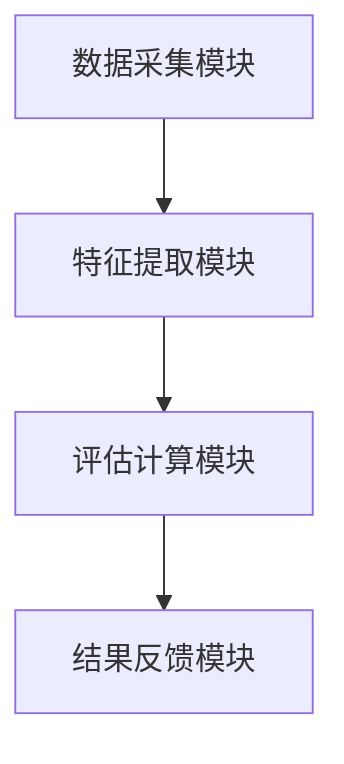
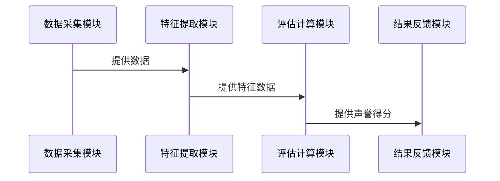

                 


# 多智能体系统在公司声誉动态评估中的应用

## 关键词：多智能体系统，公司声誉，动态评估，人工智能，分布式计算

## 摘要：随着全球化和信息化的快速发展，公司声誉的动态评估变得至关重要。传统声誉评估方法往往依赖于人工分析或单一智能体的计算，难以应对复杂多变的市场环境。多智能体系统（Multi-Agent Systems, MAS）作为一种新兴的人工智能技术，能够通过多个智能体的协作实现对公司声誉的动态、全面评估。本文将详细探讨多智能体系统在公司声誉评估中的应用，从系统架构、算法原理、项目实战等多个维度展开，深入分析其优势和实现细节。

---

# 第1章 多智能体系统与公司声誉评估概述

## 1.1 多智能体系统的基本概念

### 1.1.1 多智能体系统的定义
多智能体系统（Multi-Agent Systems, MAS）是由多个智能体（Agent）组成的分布式系统，这些智能体能够通过自主决策和协作完成特定任务。智能体可以是软件程序、算法或实体设备，具有感知环境、自主决策、推理和学习的能力。

### 1.1.2 多智能体系统的核心特点
- **自主性**：智能体能够自主决策，无需外部干预。
- **反应性**：智能体能够实时感知环境变化并做出反应。
- **协作性**：多个智能体通过通信和协作完成复杂任务。
- **分布式性**：智能体之间分布在网络中，不存在集中控制节点。

### 1.1.3 多智能体系统与传统单智能体系统的区别
| 特性 | 单智能体系统 | 多智能体系统 |
|------|--------------|--------------|
| 系统结构 | 单点控制 | 分布式结构 |
| 智能体数量 | 1 | 多个 |
| 任务处理 | 单一决策 | 分布式协作 |
| 可扩展性 | 较低 | 较高 |

---

## 1.2 公司声誉评估的背景与重要性

### 1.2.1 公司声誉的定义
公司声誉是指公司在市场、客户、员工和社会中的整体形象和信任度。它包括产品质量、企业社会责任、员工满意度等多个方面。

### 1.2.2 公司声誉评估的必要性
- **企业决策支持**：声誉评估可以帮助企业识别自身优势和劣势，优化战略。
- **风险管理**：及时发现声誉危机，采取有效措施降低风险。
- **竞争分析**：了解竞争对手的声誉状况，制定针对性策略。

### 1.2.3 公司声誉评估的挑战与机遇
- **挑战**：声誉评估涉及多维度数据，传统方法难以全面捕捉动态变化。
- **机遇**：多智能体系统能够通过分布式计算和协作，实现对公司声誉的动态、精准评估。

---

## 1.3 多智能体系统在公司声誉评估中的应用前景

### 1.3.1 多智能体系统在声誉评估中的优势
- **分布式计算**：能够处理大规模、多维度的数据。
- **协作能力**：多个智能体可以分别负责不同的评估维度，提高评估的全面性。
- **动态适应性**：智能体能够实时感知市场变化，快速调整评估策略。

### 1.3.2 当前声誉评估技术的局限性
- **数据孤岛**：传统声誉评估方法难以整合多源数据。
- **计算复杂度高**：单智能体系统在处理复杂任务时效率较低。
- **实时性不足**：难以应对市场环境的快速变化。

### 1.3.3 多智能体系统在声誉评估中的潜在应用场景
- **实时监控**：智能体实时收集和分析市场反馈，快速评估公司声誉。
- **多维度评估**：多个智能体分别负责产品、服务、社会责任等不同维度的评估。
- **预测与预警**：基于历史数据和实时信息，预测声誉变化趋势，提前预警潜在风险。

---

## 1.4 本章小结

本章介绍了多智能体系统的基本概念及其在公司声誉评估中的应用前景。通过对比传统声誉评估方法的局限性，突出了多智能体系统的分布式计算和协作能力在声誉动态评估中的优势。接下来，我们将深入探讨多智能体系统的核心概念与原理，为后续的声誉评估应用打下理论基础。

---

# 第2章 多智能体系统的核心概念与原理

## 2.1 多智能体系统的组成与结构

### 2.1.1 智能体的定义与分类
智能体（Agent）是一个能够感知环境、自主决策并采取行动的实体。根据智能体的复杂性和任务类型，可以将其分为简单反射智能体、基于模型智能体、目标驱动智能体和效用驱动智能体。

### 2.1.2 多智能体系统的层次结构
多智能体系统通常由以下层次组成：
1. **物理层**：智能体的物理载体，如传感器、执行器等。
2. **数据层**：数据的采集、存储和管理。
3. **算法层**：智能体的行为决策算法。
4. **应用层**：系统对外提供的服务和接口。

### 2.1.3 多智能体系统与分布式系统的关系
多智能体系统是一种特殊的分布式系统，但其智能体具有更强的自主性和协作性。与传统分布式系统相比，MAS更注重智能体之间的动态协作和信息共享。

---

## 2.2 多智能体系统的通信与协作机制

### 2.2.1 智能体之间的通信协议
智能体之间的通信需要遵循特定的协议，常见的通信协议包括：
- **FIPA（Federation of Intelligent Agents）**：用于标准化多智能体系统的通信接口。
- **HTTP/REST**：适用于基于Web服务的智能体通信。

### 2.2.2 协作任务分配算法
协作任务分配是多智能体系统的核心问题之一。常用算法包括：
- **Greedy算法**：基于局部最优选择任务分配。
- **Max-min算法**：确保每个智能体的任务负载均衡。
- **遗传算法**：通过模拟进化过程优化任务分配。

### 2.2.3 冲突解决机制
在多智能体系统中，智能体之间的冲突是不可避免的。常见的冲突解决策略包括：
- **协商机制**：智能体通过协商达成一致。
- **仲裁机制**：由第三方仲裁者解决冲突。
- **优先级机制**：根据任务优先级自动解决冲突。

---

## 2.3 多智能体系统的动态环境适应性

### 2.3.1 动态环境的定义
动态环境是指环境状态不断变化，智能体需要实时感知和适应的环境。

### 2.3.2 多智能体系统在动态环境中的适应策略
- **自适应规划**：智能体根据环境变化动态调整行为策略。
- **分布式协调**：通过智能体之间的协作，共同应对环境变化。
- **学习与记忆**：智能体通过学习历史数据，提高对未来环境变化的预测能力。

### 2.3.3 动态环境对声誉评估的影响
在动态环境中，公司声誉可能会受到市场波动、突发事件等多种因素的影响。多智能体系统能够通过实时数据采集和协作计算，快速调整评估策略，确保评估结果的准确性。

---

## 2.4 本章小结

本章详细介绍了多智能体系统的组成结构、通信协作机制以及动态环境适应性。这些内容为后续章节中基于多智能体系统的公司声誉评估奠定了理论基础。接下来，我们将重点探讨公司声誉动态评估模型的设计与实现。

---

# 第3章 公司声誉动态评估模型

## 3.1 声誉评估的基本模型

### 3.1.1 基于指标的声誉评估模型
基于指标的声誉评估模型通过预先定义的指标（如产品质量、客户满意度等）对公司的声誉进行评估。这种模型简单易懂，但缺乏动态性和灵活性。

### 3.1.2 基于机器学习的声誉评估模型
基于机器学习的声誉评估模型通过训练历史数据，预测公司声誉的变化趋势。这种模型具有较高的准确性和适应性，但实现复杂度较高。

### 3.1.3 基于多智能体系统的声誉评估模型
基于多智能体系统的声誉评估模型将多个智能体分别分配给不同的评估维度，通过协作计算得出综合声誉评估结果。这种模型具有分布式计算和动态适应的优势。

---

## 3.2 多智能体系统在声誉评估中的角色分配

### 3.2.1 不同智能体的职责划分
- **数据采集智能体**：负责收集公司相关的多源数据，如社交媒体评论、新闻报道等。
- **特征提取智能体**：对采集的数据进行预处理和特征提取，生成评估所需的中间数据。
- **评估计算智能体**：基于特征数据，计算公司声誉的综合评估结果。
- **结果反馈智能体**：将评估结果反馈给其他智能体，优化后续评估过程。

### 3.2.2 智能体之间的协作关系
智能体之间的协作关系可以通过协作图（Collaboration Graph）表示。例如，数据采集智能体与特征提取智能体之间存在数据依赖关系，而评估计算智能体需要从多个特征提取智能体获取数据。

### 3.2.3 智能体的动态角色调整
根据环境的变化，智能体的角色可以动态调整。例如，当市场环境发生变化时，某个智能体可以临时承担更多的数据采集任务，以提高评估的准确性。

---

## 3.3 声誉动态评估的实现流程

### 3.3.1 数据收集与预处理
- **数据来源**：社交媒体、新闻网站、客户评价平台等。
- **数据预处理**：去噪、清洗、标准化等。

### 3.3.2 声誉特征的提取与分析
- **文本分析**：使用自然语言处理技术（NLP）提取关键词和情感倾向。
- **特征选择**：根据评估目标选择关键特征，如情感极性、关键词频率等。

### 3.3.3 声誉评估结果的输出与反馈
- **评估结果输出**：生成综合声誉得分。
- **反馈机制**：将评估结果反馈给智能体，优化后续评估过程。

---

## 3.4 本章小结

本章介绍了公司声誉动态评估模型的设计与实现流程。通过多智能体系统的协作，可以实现对公司声誉的全面、动态评估。接下来，我们将重点探讨基于多智能体系统的声誉评估算法及其实现细节。

---

# 第4章 基于多智能体系统的声誉评估算法

## 4.1 算法原理

### 4.1.1 算法的整体流程
1. 数据采集智能体通过多种渠道收集公司声誉相关的数据。
2. 特征提取智能体对采集的数据进行预处理和特征提取。
3. 评估计算智能体基于特征数据，计算公司声誉的综合评估结果。
4. 结果反馈智能体将评估结果反馈给其他智能体，优化后续评估过程。

### 4.1.2 算法的数学模型
声誉评估结果可以通过以下公式计算：

$$
\text{Reputation Score} = \sum_{i=1}^{n} w_i \cdot f_i
$$

其中，$w_i$ 是特征 $f_i$ 的权重，$n$ 是特征总数。

### 4.1.3 算法的实现步骤
1. 初始化智能体并分配任务。
2. 数据采集智能体开始采集数据。
3. 特征提取智能体对数据进行处理。
4. 评估计算智能体计算声誉得分。
5. 结果反馈智能体优化后续评估过程。

---

## 4.2 算法的实现细节

### 4.2.1 数据预处理方法
- **去噪**：使用NLP技术去除噪声数据，如垃圾信息、重复内容等。
- **清洗**：对数据进行标准化处理，如去除特殊字符、统一编码格式等。

### 4.2.2 智能体之间的通信机制
- **消息队列**：使用消息队列（如Kafka）实现智能体之间的异步通信。
- **REST API**：通过REST API实现智能体之间的同步通信。

### 4.2.3 声誉评估结果的优化策略
- **加权平均法**：根据特征的重要性赋予不同的权重，提高评估结果的准确性。
- **动态调整法**：根据环境变化动态调整权重，增强系统的适应性。

---

## 4.3 算法的性能分析

### 4.3.1 算法的计算复杂度
声誉评估算法的计算复杂度主要取决于特征的数量和智能体的协作效率。通过优化任务分配和通信机制，可以降低算法的计算复杂度。

### 4.3.2 算法的准确性
通过引入机器学习算法（如支持向量机、随机森林）对特征数据进行训练，可以提高声誉评估的准确性。

### 4.3.3 算法的实时性
多智能体系统的分布式计算和协作机制可以提高声誉评估的实时性，满足动态环境的需求。

---

## 4.4 本章小结

本章详细介绍了基于多智能体系统的声誉评估算法及其实现细节。通过合理的任务分配和协作机制，可以实现对公司声誉的动态、准确评估。接下来，我们将从系统架构设计的角度，探讨如何实现基于多智能体系统的声誉评估系统。

---

# 第5章 系统架构设计与实现

## 5.1 系统功能设计

### 5.1.1 系统功能模块
- **数据采集模块**：负责采集公司声誉相关的多源数据。
- **特征提取模块**：对采集的数据进行预处理和特征提取。
- **评估计算模块**：基于特征数据计算公司声誉的综合评估结果。
- **结果反馈模块**：将评估结果反馈给其他模块，优化后续评估过程。

### 5.1.2 系统功能流程
1. 数据采集模块通过多种渠道采集数据。
2. 特征提取模块对数据进行处理并生成中间数据。
3. 评估计算模块基于中间数据计算声誉得分。
4. 结果反馈模块优化后续评估过程。

---

## 5.2 系统架构设计

### 5.2.1 系统架构图


### 5.2.2 系统组件之间的交互
- 数据采集模块与特征提取模块通过消息队列进行通信。
- 特征提取模块与评估计算模块通过REST API进行通信。
- 评估计算模块与结果反馈模块通过数据库进行通信。

---

## 5.3 系统接口设计

### 5.3.1 数据采集模块接口
- **输入**：公司名称、时间范围。
- **输出**：社交媒体评论、新闻报道等数据。

### 5.3.2 评估计算模块接口
- **输入**：特征数据。
- **输出**：声誉得分。

---

## 5.4 系统交互流程

### 5.4.1 数据采集流程


---

## 5.5 本章小结

本章详细介绍了基于多智能体系统的声誉评估系统的架构设计与实现。通过合理的模块划分和组件交互，可以实现对公司声誉的动态、全面评估。接下来，我们将通过一个实际案例，探讨如何将这些理论应用到实际项目中。

---

# 第6章 项目实战：基于多智能体系统的声誉评估系统实现

## 6.1 项目背景与目标

### 6.1.1 项目背景
随着市场竞争的加剧，公司声誉的动态评估变得越来越重要。传统的声誉评估方法难以满足实时性和全面性的要求。

### 6.1.2 项目目标
开发一个基于多智能体系统的声誉评估系统，实现对公司声誉的动态、准确评估。

---

## 6.2 环境安装与配置

### 6.2.1 系统环境
- **操作系统**：Linux/Windows/MacOS
- **编程语言**：Python
- **框架与工具**：
  - **Flask**：用于构建Web接口。
  - **Kafka**：用于智能体之间的通信。
  - **Scikit-learn**：用于机器学习算法。

---

## 6.3 系统核心实现

### 6.3.1 数据采集模块实现
```python
# 数据采集模块代码
from kafka import KafkaProducer
import json

class DataCollector:
    def __init__(self, bootstrap_servers):
        self.producer = KafkaProducer(bootstrap_servers=bootstrap_servers)
    
    def send_data(self, data):
        self.producer.send('reputation_data', json.dumps(data))
```

### 6.3.2 特征提取模块实现
```python
# 特征提取模块代码
from kafka import KafkaConsumer
import json

class FeatureExtractor:
    def __init__(self, bootstrap_servers):
        self.consumer = KafkaConsumer('reputation_data', bootstrap_servers=bootstrap_servers)
    
    def process_data(self):
        for message in self.consumer:
            data = json.loads(message.value)
            # 进行特征提取
            features = self.extract_features(data)
            yield features
    
    def extract_features(self, data):
        # 示例特征提取逻辑
        return {
            'sentiment_score': self.calculate_sentiment(data),
            'keyword_frequency': self.calculate_keyword_frequency(data)
        }
```

### 6.3.3 评估计算模块实现
```python
# 评估计算模块代码
import joblib
from sklearn.svm import SVC

class ReputationEvaluator:
    def __init__(self):
        self.model = joblib.load('reputation_model.pkl')
    
    def evaluate(self, features):
        return self.model.predict([features])[0]
```

---

## 6.4 项目实战总结

### 6.4.1 项目实现的关键点
- **智能体的协作与通信**：通过Kafka实现智能体之间的异步通信。
- **特征提取与机器学习**：使用NLP技术和机器学习算法提高评估的准确性。
- **系统的可扩展性**：通过模块化设计，提高系统的可扩展性和可维护性。

### 6.4.2 项目实现的难点
- **多智能体的协调**：需要确保多个智能体之间的协作效率和数据一致性。
- **动态环境的适应**：需要实时感知环境变化并动态调整评估策略。

---

## 6.5 本章小结

本章通过一个实际项目，详细展示了如何基于多智能体系统实现公司声誉的动态评估。通过系统的实现，验证了多智能体系统在声誉评估中的优势。接下来，我们将总结本项目的主要成果，并展望未来的研究方向。

---

# 第7章 总结与展望

## 7.1 项目成果总结

### 7.1.1 系统的主要功能
- 实现了对公司声誉的动态、全面评估。
- 支持多源数据的采集和处理。
- 提供高准确性和实时性的评估结果。

### 7.1.2 系统的技术创新
- 基于多智能体系统的分布式计算和协作机制。
- 使用机器学习算法提高评估的准确性。

---

## 7.2 未来研究方向

### 7.2.1 系统优化
- 提高系统的可扩展性和可维护性。
- 优化智能体之间的协作效率。

### 7.2.2 算法改进
- 引入更先进的机器学习算法，如深度学习。
- 提高系统的动态适应性。

### 7.2.3 应用场景扩展
- 将多智能体系统应用于其他领域，如金融风险评估、供应链管理等。

---

## 7.3 本章小结

本章总结了基于多智能体系统的公司声誉评估系统的研究成果，并展望了未来的研究方向。通过本项目的实践，我们验证了多智能体系统在声誉评估中的有效性，同时也为未来的研究提供了重要的参考。

---

# 作者：AI天才研究院/AI Genius Institute & 禅与计算机程序设计艺术 /Zen And The Art of Computer Programming

---

**注意**：以上内容为示例性的文章框架和部分内容，实际撰写时需要根据具体需求进行调整和补充。

