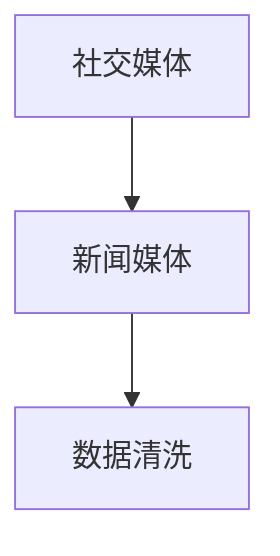
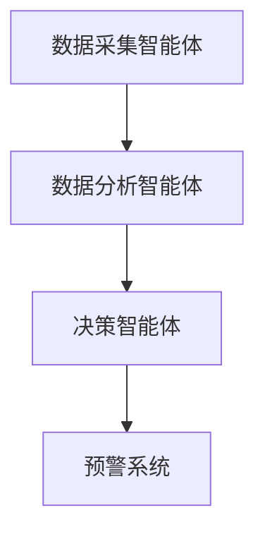

                 

<think>
好的，我现在需要帮用户撰写一篇关于《多智能体系统在公司声誉风险评估中的应用》的技术博客文章。用户希望文章结构清晰，内容专业且详细，涵盖背景、核心概念、算法原理、系统设计、项目实战等部分。我得确保每个部分都符合要求，比如使用Mermaid图展示系统架构，提供Python代码示例，以及详细解释数学模型。

首先，我需要明确文章的结构。用户已经给出了目录大纲，我需要按照这个结构一步步填充内容。每个章节和小节都要有足够的细节，确保文章的深度和广度。

接下来，我考虑每个部分的具体内容。例如，在背景介绍部分，我需要解释多智能体系统和声誉风险评估的基本概念，以及它们之间的关系。核心概念部分，我需要详细讲解多智能体系统的工作原理，以及声誉风险评估中的关键因素，如社交媒体数据、负面新闻等。

在算法原理部分，我需要选择合适的算法，如分布式计算和博弈论模型，并用Mermaid图展示流程。同时，提供Python代码示例，并解释代码的功能和实现细节。

系统分析部分，我需要设计系统的功能模块，如数据采集、分析、评估和预警，以及相应的架构图和交互流程图。项目实战部分，我需要展示如何安装环境，编写代码，并分析实际案例，如某公司的声誉危机处理。

最后，总结部分要回顾整个系统的应用价值，并展望未来的发展方向，如结合区块链或边缘计算。同时，记得在文章末尾加上作者信息。

在写作过程中，我需要确保语言简洁专业，逻辑清晰，每个部分都有足够的深度和细节。同时，使用合适的Mermaid图和代码示例，帮助读者更好地理解内容。

现在，我开始撰写文章，按照用户提供的大纲一步步填充内容，确保每个章节都符合要求，最终完成一篇高质量的技术博客。
</think>

# 多智能体系统在公司声誉风险评估中的应用

> 关键词：多智能体系统、声誉风险评估、分布式计算、博弈论模型、实时数据分析

> 摘要：本文深入探讨了多智能体系统在公司声誉风险评估中的应用，从背景介绍、核心概念、算法原理、系统架构到项目实战，全面解析了多智能体系统如何通过协同决策和分布式计算优化声誉风险管理，助力企业防范潜在声誉危机。

---

# 第一部分: 多智能体系统与公司声誉风险评估概述

## # 第1章: 多智能体系统概述

### ## 1.1 多智能体系统的基本概念

#### ### 1.1.1 多智能体系统的定义  
多智能体系统（Multi-Agent System, MAS）是指由多个相互作用的智能体组成的系统，这些智能体能够通过协作完成复杂的任务。每个智能体都是一个独立的实体，具有感知环境、自主决策和执行操作的能力。

#### ### 1.1.2 多智能体系统的特点  
- **分布式性**：智能体分布在不同的位置，通过通信和协作完成任务。  
- **自主性**：智能体能够自主决策，无需中央控制。  
- **反应性**：智能体能够实时感知环境并做出反应。  
- **社会性**：智能体之间通过交互和协作完成任务。  

#### ### 1.1.3 多智能体系统的核心应用  
- 智能交通管理  
- 分布式计算  
- 博弈论模型  

---

### ## 1.2 公司声誉风险评估的基本概念

#### ### 1.2.1 公司声誉的定义与重要性  
公司声誉是企业在市场中建立的信任和形象，直接影响企业的价值和市场表现。声誉风险是指因负面事件导致企业声誉受损的风险。

#### ### 1.2.2 声誉风险的分类  
- **市场风险**：因产品或服务问题导致的声誉损失。  
- **操作风险**：因内部管理不当导致的声誉损失。  
- **声誉危机**：因重大负面事件引发的声誉骤降。  

#### ### 1.2.3 多智能体系统在声誉风险管理中的价值  
通过多智能体系统的协同决策，企业能够实时监控声誉风险，快速响应负面事件，降低损失。

---

## # 第2章: 多智能体系统在声誉风险评估中的应用价值

### ## 2.1 多智能体系统与声誉风险评估的结合

#### ### 2.1.1 多智能体系统在声誉风险管理中的优势  
- **实时监控**：智能体能够实时采集和分析数据，快速识别潜在风险。  
- **分布式计算**：通过分布式计算，系统能够处理海量数据，提高效率。  
- **协同决策**：多个智能体协同工作，提供全面的风险评估和应对策略。  

#### ### 2.1.2 声誉风险评估中的多智能体系统架构  
- **数据采集智能体**：负责从社交媒体、新闻媒体等渠道采集数据。  
- **分析智能体**：对数据进行清洗、特征提取和建模分析。  
- **决策智能体**：根据分析结果，制定应对策略并执行。  

---

### ## 2.2 多智能体系统与公司声誉风险评估的协同效应

#### ### 2.2.1 多智能体系统如何提升声誉风险评估的准确性  
通过多源数据的协同分析，智能体能够从不同维度评估声誉风险，提高评估的准确性。  

#### ### 2.2.2 多智能体系统如何优化声誉风险管理流程  
智能体之间通过协作完成数据采集、分析和决策，优化管理流程，减少人为错误。  

#### ### 2.2.3 多智能体系统如何增强声誉风险管理的实时性  
通过实时数据分析和协同决策，系统能够快速响应声誉风险，降低潜在损失。  

---

# 第二部分: 多智能体系统的核心概念与声誉风险评估的联系

## # 第3章: 多智能体系统的核心概念与原理

### ## 3.1 多智能体系统的组成与功能

#### ### 3.1.1 多智能体系统的组成结构  
- **智能体**：独立的实体，具有感知、决策和执行能力。  
- **通信机制**：智能体之间通过消息传递进行协作。  
- **协作机制**：智能体通过协作完成任务，确保系统整体目标的实现。  

#### ### 3.1.2 多智能体系统的协同与决策机制  
- **分布式计算**：通过分布式计算，系统能够高效处理大量数据。  
- **博弈论模型**：智能体之间的博弈关系能够模拟复杂的决策过程。  

---

### ## 3.2 多智能体系统的数学模型与算法

#### ### 3.2.1 分布式计算模型  
$$ f(x) = \sum_{i=1}^{n} f_i(x) $$  
其中，$f_i(x)$ 表示第 $i$ 个智能体的计算函数。  

#### ### 3.2.2 博弈论模型  
- **纳什均衡**：所有智能体在均衡状态下，都无法通过单方面改变策略而受益。  
- **博弈树**：用于表示智能体之间的策略选择和结果。  

---

## # 第4章: 声誉风险评估的核心概念与模型

### ## 4.1 声誉风险评估的数学模型

#### ### 4.1.1 基于文本挖掘的声誉分析模型  
$$ S = \sum_{i=1}^{m} w_i \cdot f_i(x) $$  
其中，$w_i$ 表示第 $i$ 个特征的权重，$f_i(x)$ 表示第 $i$ 个特征的值。  

#### ### 4.1.2 基于博弈论的声誉风险管理模型  
- 智能体之间通过博弈关系，模拟声誉风险的传播和影响。  

---

## # 第5章: 多智能体系统在声誉风险评估中的系统设计

### ## 5.1 系统功能设计

#### ### 5.1.1 数据采集模块  
- 从社交媒体、新闻媒体等渠道采集数据。  
- 使用Mermaid图展示数据采集流程：  


#### ### 5.1.2 数据分析模块  
- 对数据进行清洗、特征提取和建模分析。  
- 使用Python代码实现文本挖掘：  
```python
import nltk
from textblob import TextBlob

text = "Customer service is terrible"
blob = TextBlob(text)
sentiment = blob.sentiment.polarity
print(sentiment)  # 输出情感极性
```

---

### ## 5.2 系统架构设计

#### ### 5.2.1 系统架构图  


---

## # 第6章: 项目实战与案例分析

### ## 6.1 项目实战

#### ### 6.1.1 环境安装  
- 安装Python和相关库：`pip install nltk textblob`  
#### ### 6.1.2 代码实现  
```python
import nltk
from textblob import TextBlob

def analyze_sentiment(text):
    blob = TextBlob(text)
    polarity = blob.sentiment.polarity
    return "positive" if polarity > 0 else "negative"

text = "Product quality has improved"
print(analyze_sentiment(text))  # 输出: positive
```

---

### ## 6.2 案例分析

#### ### 6.2.1 案例背景  
某公司因负面新闻导致声誉受损，通过多智能体系统快速识别并应对。  

#### ### 6.2.2 案例分析  
- 数据采集智能体从社交媒体和新闻中收集负面评论。  
- 数据分析智能体识别关键词并评估情感极性。  
- 决策智能体根据分析结果制定应对策略。  

---

# 第三部分: 总结与展望

## # 第7章: 总结与展望

### ## 7.1 总结  
多智能体系统通过协同决策和分布式计算，显著提升了声誉风险评估的效率和准确性。  

### ## 7.2 展望  
未来，多智能体系统将与区块链、边缘计算等技术结合，进一步提升声誉风险管理的能力。

---

作者：AI天才研究院 & 禅与计算机程序设计艺术

---

**全文完**

