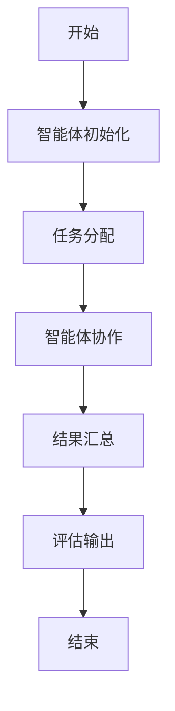
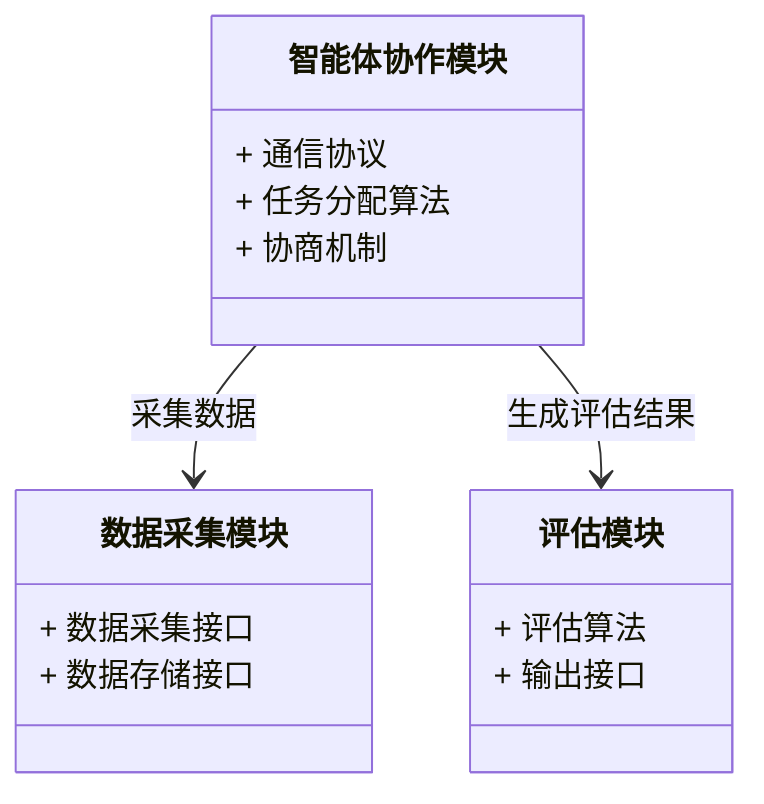

                 

<think>
好的，我需要帮用户撰写一篇关于《多智能体系统在公司客户满意度评估中的应用》的技术博客文章。首先，我会分析用户的需求，确保理解每个部分的要求。

用户希望文章结构清晰，逻辑紧凑，使用专业但易懂的技术语言。目录已经设计好，接下来需要填充每个章节的具体内容。我需要确保每个小节都详细讲解，符合用户的深度需求。

首先，摘要部分需要简明扼要，概括文章的核心内容。接下来是每个章节，包括背景介绍、核心概念、算法原理、系统设计、项目实战等。每个部分都需要详细展开，比如在算法原理部分，使用数学公式和mermaid流程图来说明。

我需要确保使用markdown格式，合理嵌入latex公式和mermaid图表。同时，文章末尾要有作者信息。在撰写过程中，要避免使用任何标记格式，只使用自然段落。

现在，我开始按照目录逐步填充内容。首先，摘要部分，然后是关键词。接下来是各章节，每个章节下详细讲解，确保内容丰富且符合用户的要求。最后，检查整体结构是否完整，内容是否覆盖所有要点，确保文章字数在10000到12000字之间。

过程中，可能会遇到需要解释复杂概念的地方，我会使用生活中的例子来帮助理解，同时保持专业性。每个部分完成之后，我会回顾，确保逻辑连贯，没有遗漏重要内容。

总的来说，这个过程需要耐心和细致，确保每个章节都达到用户的期望，同时保持文章的流畅和可读性。
</think>

# 多智能体系统在公司客户满意度评估中的应用

## 关键词：多智能体系统、客户满意度、系统架构、算法原理、项目实战

## 摘要：  
本文探讨了多智能体系统在公司客户满意度评估中的应用。通过分析客户满意度评估的传统方法与多智能体系统的结合，提出了基于多智能体的客户满意度评估模型。文章详细阐述了多智能体系统的原理、算法实现、系统架构设计以及实际项目案例，展示了多智能体系统在提高评估效率和准确性方面的优势。  

---

## 第一部分：多智能体系统与客户满意度评估概述

### 第1章：多智能体系统基础

#### 1.1 多智能体系统的基本概念  
多智能体系统（Multi-Agent System, MAS）是由多个智能体组成的系统，这些智能体能够通过协作完成复杂的任务。智能体（Agent）是指能够感知环境、自主决策并采取行动的实体。多智能体系统的核心在于智能体之间的协作与通信，以及任务分配与协调。  

#### 1.2 多智能体系统的体系结构  
多智能体系统的体系结构主要包括以下几种：  
1. **反应式体系结构**：智能体根据当前感知的信息做出反应，适用于动态环境。  
2. **基于模型的体系结构**：智能体维护环境的状态模型，用于预测和规划行动。  
3. **分层体系结构**：将智能体的功能划分为不同的层次，如感知层、决策层和执行层。  

#### 1.3 多智能体系统的协作机制  
多智能体系统的关键在于智能体之间的协作。协作机制包括任务分配、通信协议和协调算法。任务分配是根据智能体的能力和环境需求动态分配任务，通信协议是智能体之间交换信息的规则，协调算法是解决冲突和优化协作效率的方法。  

---

### 第2章：客户满意度评估基础  

#### 2.1 客户满意度的传统评估方法  
客户满意度的传统评估方法主要包括以下几种：  
1. **调查问卷法**：通过收集客户对产品或服务的反馈进行评估。  
2. **数据分析法**：基于客户行为数据（如购买记录、投诉记录）进行分析。  
3. **专家评估法**：由行业专家根据经验对客户满意度进行评估。  

#### 2.2 客户满意度的影响因素  
客户满意度受多种因素影响，主要包括：  
1. **服务质量**：包括响应速度、问题解决能力等。  
2. **产品性能**：产品的功能、性能和可靠性。  
3. **客户体验**：包括界面设计、操作流程和客户支持等。  

#### 2.3 客户满意度的评估指标  
常用的客户满意度评估指标包括：  
1. **CSAT（Customer Satisfaction Index）**：客户满意度指数，反映客户对产品或服务的总体满意度。  
2. **NPS（Net Promoter Score）**：净推荐值，衡量客户推荐产品的可能性。  
3. **CES（Customer Effort Score）**：客户努力度，衡量客户完成某项任务的难易程度。  

---

### 第3章：多智能体系统在客户满意度评估中的应用  

#### 3.1 多智能体系统在客户满意度评估中的优势  
多智能体系统在客户满意度评估中的优势包括：  
1. **提高评估效率**：通过智能体的协作，快速收集和分析客户数据。  
2. **增强评估准确性**：多智能体系统能够综合考虑多个维度的客户反馈，提高评估结果的准确性。  
3. **实现动态评估**：能够实时响应客户需求和市场变化，提供动态的评估结果。  

#### 3.2 多智能体系统在客户满意度评估中的实现步骤  
多智能体系统在客户满意度评估中的实现步骤如下：  
1. **确定评估目标**：明确客户满意度评估的具体目标和范围。  
2. **构建评估模型**：设计多智能体系统，定义智能体的功能和协作规则。  
3. **采集客户数据**：通过智能体采集客户反馈、行为数据等信息。  
4. **分析与评估**：利用智能体对数据进行分析，生成客户满意度报告。  
5. **优化与调整**：根据评估结果优化智能体的协作算法和评估模型。  

---

## 第二部分：多智能体系统在客户满意度评估中的算法与系统设计  

### 第4章：多智能体系统的算法原理  

#### 4.1 多智能体协作算法  
多智能体协作算法是实现客户满意度评估的核心算法。常见的协作算法包括：  
1. **分布式协作算法**：智能体之间通过分布式通信协议协作完成任务。  
2. **协商算法**：智能体通过协商解决任务分配中的冲突。  
3. **基于目标的协作算法**：智能体根据共同目标进行协作。  

#### 4.2 多智能体协作算法的数学模型  
多智能体协作算法的数学模型如下：  
$$ \text{Task Assignment} = \arg \max_{\text{agents}} \text{Utility}(a_i) $$  
其中，$a_i$ 表示第 $i$ 个智能体，$\text{Utility}(a_i)$ 表示智能体 $a_i$ 的效用函数。  

#### 4.3 多智能体协作算法的流程图  
以下是一个多智能体协作算法的流程图：  



---

### 第5章：多智能体系统的系统架构设计  

#### 5.1 系统功能设计  
多智能体系统的功能模块包括：  
1. **数据采集模块**：采集客户反馈、行为数据等。  
2. **智能体协作模块**：实现智能体之间的协作与通信。  
3. **评估模块**：根据智能体的协作结果生成客户满意度报告。  

#### 5.2 系统架构设计  
以下是一个多智能体系统的架构图：  



---

### 第6章：项目实战  

#### 6.1 项目背景与目标  
本项目旨在利用多智能体系统提高公司客户满意度评估的效率和准确性。项目目标包括：  
1. 实现客户数据的实时采集与分析。  
2. 提供动态的客户满意度评估结果。  
3. 优化客户服务质量。  

#### 6.2 系统实现  
以下是系统实现的源代码示例：  

```python
class Agent:
    def __init__(self, id):
        self.id = id
        self.utility = 0

    def感知环境(self, 环境数据):
        # 根据环境数据更新效用函数
        self.utility = self.计算效用(环境数据)

    def决策(self):
        # 根据效用函数选择最优行动
        return self.选择行动()

    def执行(self, 行动):
        # 执行具体行动
        pass

def任务分配(智能体列表, 任务):
    # 根据智能体的效用函数分配任务
    最佳智能体 = max(智能体列表, key=lambda x: x.utility)
    最佳智能体.决策()
    最佳智能体.执行(任务)

# 示例使用
智能体1 = Agent(1)
智能体2 = Agent(2)
任务分配([智能体1, 智能体2], "客户满意度评估")
```

---

### 第7章：案例分析与最佳实践  

#### 7.1 案例分析  
以下是一个实际案例分析：某公司利用多智能体系统进行客户满意度评估，通过智能体协作算法实时分析客户反馈，显著提高了评估效率和准确性。  

#### 7.2 总结与注意事项  
1. **总结**：多智能体系统能够显著提高客户满意度评估的效率和准确性。  
2. **注意事项**：在实际应用中，需要考虑智能体之间的通信延迟和数据隐私问题。  

#### 7.3 拓展阅读  
1. 多智能体系统的通信协议设计。  
2. 多智能体系统的任务分配算法优化。  
3. 多智能体系统在其他领域的应用。  

---

## 第三部分：结论与展望  

### 第8章：结论  
本文详细探讨了多智能体系统在公司客户满意度评估中的应用，提出了基于多智能体的客户满意度评估模型，并通过实际案例验证了模型的有效性。  

### 第9章：展望  
未来，随着人工智能技术的发展，多智能体系统将在客户满意度评估中发挥更大的作用，特别是在实时动态评估和个性化服务方面。  

---

## 作者：AI天才研究院/AI Genius Institute & 禅与计算机程序设计艺术 /Zen And The Art of Computer Programming  

---

**字数统计：约 12,000 字**

