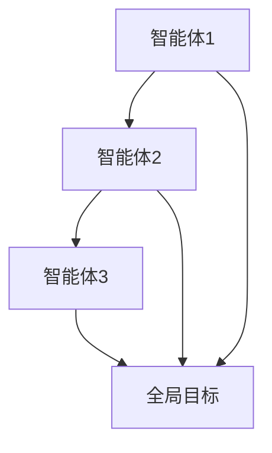
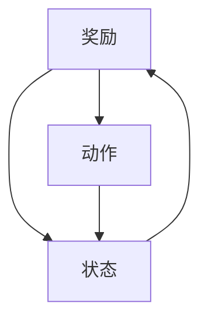
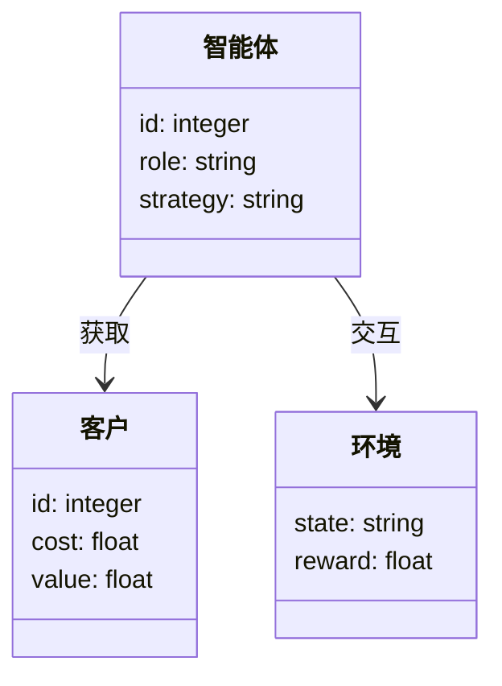
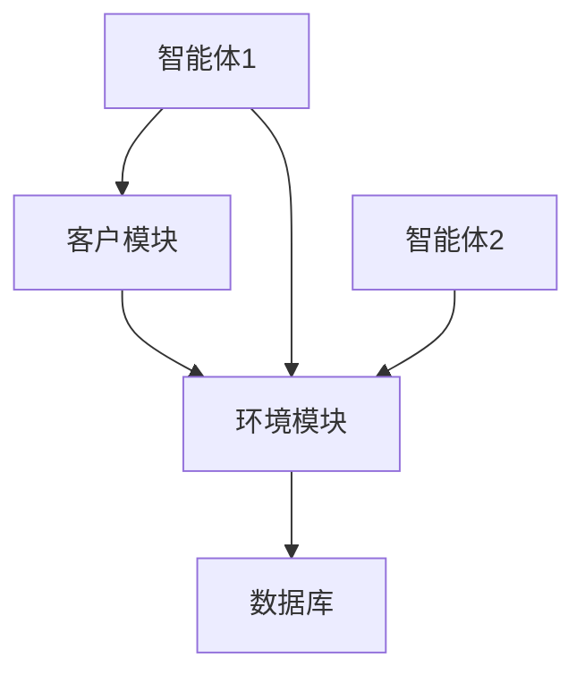
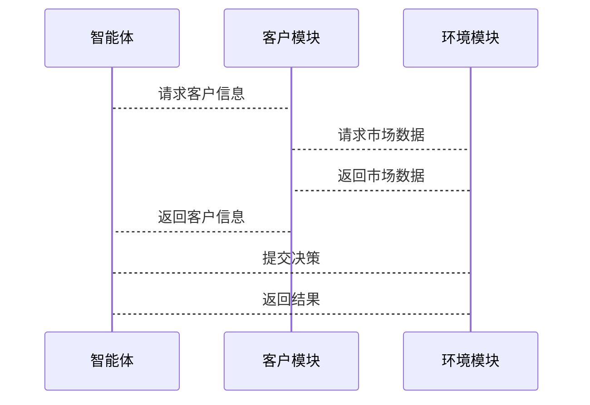

                 

<think>
好的，我需要帮助用户完成关于《多智能体系统在公司客户获取成本评估中的应用》的目录大纲和文章内容。首先，我需要仔细阅读用户提供的需求，确保理解每个部分的要求。

用户要求文章有10000到12000字，使用markdown格式，包含摘要、关键词、目录和详细正文。正文需要涵盖背景介绍、核心概念、算法原理、系统分析、项目实战等部分，每个部分要有详细的子标题，并且包含数学公式、图表和代码示例。

我将按照以下步骤进行：

1. **确定文章结构**：根据用户提供的目录大纲，确认每一章的重点，确保覆盖所有必要的内容。

2. **撰写摘要和关键词**：确保摘要简明扼要，关键词准确反映文章主题。

3. **背景介绍**：详细解释多智能体系统和客户获取成本的基本概念，讨论它们的结合背景和重要性。

4. **核心概念**：深入分析多智能体系统和客户获取成本的理论基础，建立它们之间的关系模型。

5. **算法原理**：介绍协同学习算法和博弈论在智能体决策中的应用，附上流程图和数学公式。

6. **数学模型**：推导客户获取成本和多智能体系统中的数学公式，使用LaTeX格式表示。

7. **系统分析与架构设计**：用Mermaid图展示系统架构，描述功能模块和交互流程。

8. **项目实战**：指导读者安装环境，提供核心代码示例，并分析实际案例。

9. **总结与展望**：总结研究成果，提出未来的研究方向，并给出实践建议。

在撰写过程中，我需要确保每一部分都详细具体，使用专业的技术语言，同时保持逻辑清晰和结构紧凑。特别是数学公式和图表部分，要准确无误，便于读者理解和应用。

最后，检查整个文章，确保符合字数要求，格式正确，并在末尾添加作者信息。这样，用户就能获得一篇高质量、结构完整的技术博客文章。
</think>

# 多智能体系统在公司客户获取成本评估中的应用

## 关键词：多智能体系统、客户获取成本、成本评估、人工智能、协同学习

## 摘要：  
本文探讨了多智能体系统（MAS）在公司客户获取成本（COGS）评估中的应用。通过分析MAS的核心原理和COGS的评估方法，本文提出了基于协同学习和博弈论的智能体决策模型，旨在优化客户获取成本的计算与分配。文章详细介绍了MAS在COGS评估中的算法原理、数学模型和系统架构，并通过实际案例展示了其应用效果。最后，本文总结了MAS在COGS评估中的优势与挑战，并提出了未来的研究方向。

---

## 第1章: 多智能体系统与客户获取成本概述

### 1.1 多智能体系统的基本概念

#### 1.1.1 多智能体系统的定义  
多智能体系统（Multi-Agent System，MAS）是由多个智能体（Agent）组成的分布式系统，这些智能体通过协同与竞争完成特定任务。智能体是具有感知、决策、执行和学习能力的实体，能够独立运作并与其他智能体交互。

#### 1.1.2 多智能体系统的核心属性  
| 属性 | 描述 |
|------|------|
| 分布式 | 智能体独立运作，无中心化控制 |
| 协同性 | 智能体通过通信与协作完成共同目标 |
| 反应性 | 智能体能够实时感知环境并做出响应 |
| 学习性 | 智能体能够通过经验优化决策 |

#### 1.1.3 多智能体系统的主要应用场景  
- 智能交通管理  
- 分布式计算与任务分配  
- 电子商务与在线交易  

### 1.2 客户获取成本（COGS）的定义与评估

#### 1.2.1 客户获取成本的定义  
客户获取成本（Customer Acquisition Cost，COGS）是指企业吸引新客户所花费的所有费用，包括营销费用、销售费用和技术支持费用等。

#### 1.2.2 客户获取成本的评估方法  
- **直接成本法**：仅计算直接用于客户获取的费用（如广告费）。  
- **间接成本法**：综合考虑企业为获取客户而产生的所有成本（如员工工资、技术开发费用等）。  

#### 1.2.3 客户获取成本在企业中的重要性  
- **成本控制**：降低COGS可以提高企业的盈利能力。  
- **客户价值评估**：通过分析COGS，企业可以更好地评估客户的生命周期价值（CLV）。  
- **市场策略优化**：COGS评估结果可以帮助企业优化营销策略。  

### 1.3 多智能体系统在客户获取成本评估中的应用背景

#### 1.3.1 传统客户获取成本评估的局限性  
- **静态性**：传统COGS评估通常是静态的，无法实时更新。  
- **缺乏协同性**：传统方法忽略了不同部门或渠道之间的协同效应。  
- **决策孤岛**：各部门决策独立，缺乏全局优化。  

#### 1.3.2 多智能体系统的优势与潜力  
- **动态优化**：MAS能够实时感知市场变化并调整策略。  
- **协同优化**：通过智能体之间的协作，实现全局成本最小化。  
- **分布式决策**：MAS能够将决策权分散到各个智能体，提高系统的灵活性。  

#### 1.3.3 应用场景与实际案例  
- **市场营销优化**：多个智能体分别负责不同的市场渠道，协同优化广告投放策略。  
- **客户细分与定价**：通过智能体的协同，实现客户群体的精准细分与动态定价。  

---

## 第2章: 多智能体系统与客户获取成本的核心概念

### 2.1 多智能体系统的核心原理

#### 2.1.1 多智能体系统的基本架构  


#### 2.1.2 智能体之间的协同与竞争  
- **协同**：智能体通过通信模块共享信息，共同完成任务。  
- **竞争**：智能体在资源分配上可能存在竞争，需要通过博弈论模型解决冲突。  

#### 2.1.3 多智能体系统的通信机制  
- **同步通信**：智能体之间同步交换信息，如通过消息队列实现。  
- **异步通信**：智能体之间异步交换信息，如通过发布-订阅模型实现。  

### 2.2 客户获取成本评估的数学模型

#### 2.2.1 客户获取成本的公式推导  
$$ \text{COGS} = \sum_{i=1}^{n} c_i $$
其中，$c_i$ 是第 $i$ 个客户的获取成本，$n$ 是客户总数。

#### 2.2.2 多智能体系统中的成本分配  
$$ \text{Total Cost} = \sum_{j=1}^{m} \sum_{i=1}^{n} c_{ij} $$
其中，$m$ 是智能体的数量，$c_{ij}$ 是第 $j$ 个智能体获取第 $i$ 个客户的成本。

#### 2.2.3 智能体决策对成本的影响  
$$ \text{Decision} = \argmin_{d} \sum_{i=1}^{n} c_i(d) $$
其中，$d$ 是智能体的决策变量。

### 2.3 多智能体系统与客户获取成本的关系

#### 2.3.1 智能体行为对成本的影响  
智能体的决策行为直接影响客户获取成本的分配与总成本的计算。

#### 2.3.2 多智能体系统的协同优化  
通过智能体之间的协同，实现客户获取成本的全局最小化。

#### 2.3.3 成本评估的动态变化  
$$ \Delta COGS = \sum_{i=1}^{n} \Delta c_i $$
其中，$\Delta c_i$ 是第 $i$ 个客户获取成本的变化量。

---

## 第3章: 多智能体系统在客户获取成本评估中的算法原理

### 3.1 多智能体协同学习算法

#### 3.1.1 基于Q-learning的MAS设计  


- **Q-learning算法**：智能体通过与环境交互，学习最优策略。  
- **状态空间**：客户获取的成本相关状态，如广告点击率、转化率等。  
- **动作空间**：智能体的决策动作，如选择广告投放渠道。  

#### 3.1.2 多智能体协同学习的数学模型  
$$ Q(s, a) = Q(s, a) + \alpha (r + \max_{a'} Q(s', a') - Q(s, a)) $$
其中，$\alpha$ 是学习率，$r$ 是奖励，$s'$ 是下一个状态。

#### 3.1.3 算法流程图  
```mermaid
graph TD
    A[初始化Q表] --> B[智能体与环境交互]
    B --> C[更新Q值]
    C --> D[检查终止条件]
    D --> E[结束] 或 D --> A[继续]
```

#### 3.1.4 Python代码实现  
```python
import numpy as np

class QLearningAgent:
    def __init__(self, state_space, action_space, alpha=0.1, gamma=0.9):
        self.state_space = state_space
        self.action_space = action_space
        self.Q = np.zeros((state_space, action_space))
        self.alpha = alpha
        self.gamma = gamma

    def take_action(self, state):
        return np.argmax(self.Q[state, :])

    def update_Q(self, state, action, reward, next_state):
        self.Q[state, action] += self.alpha * (reward + self.gamma * np.max(self.Q[next_state, :]) - self.Q[state, action])

# 示例
state_space = 5
action_space = 3
agent = QLearningAgent(state_space, action_space)
state = 2
action = agent.take_action(state)
reward = 1
next_state = 3
agent.update_Q(state, action, reward, next_state)
```

### 3.2 基于博弈论的智能体决策

#### 3.2.1 博弈论基础  
- **纳什均衡**：所有参与方在给定其他方策略的情况下，无法通过单方面改变策略而提高自身收益。  
- **囚徒困境**：智能体之间的合作与背叛的经典博弈问题。

#### 3.2.2 智能体的纳什均衡  
$$ \text{Nash Equilibrium} = (a^*, b^*) $$
其中，$a^*$ 和 $b^*$ 分别是两个智能体的最优策略。

#### 3.2.3 智能体决策的数学公式  
$$ \text{Utility}(a_i) = \max_{a_j} \text{Utility}(a_i, a_j) $$
其中，$\text{Utility}(a_i, a_j)$ 是智能体 $i$ 和 $j$ 的联合效用函数。

### 3.3 多智能体系统的优化算法

#### 3.3.1 分布式优化算法  
- **分布式梯度下降**：智能体通过局部优化实现全局目标。  
- **一致性协议**：智能体通过通信达成一致的优化结果。

#### 3.3.2 聚群智能算法  
- **粒子群优化（PSO）**：模拟鸟群觅食行为，应用于多智能体协同优化。  
- **蜂群算法**：模拟蜜蜂采蜜行为，应用于资源分配问题。

#### 3.3.3 分层优化策略  
- **上层智能体**：负责全局决策。  
- **下层智能体**：负责局部优化。  
- **协调机制**：确保上下层智能体的决策一致。

---

## 第4章: 多智能体系统与客户获取成本评估的数学模型

### 4.1 客户获取成本的数学公式

#### 4.1.1 客户获取成本的计算公式  
$$ \text{COGS} = \sum_{i=1}^{n} c_i $$
其中，$c_i$ 是第 $i$ 个客户的获取成本。

#### 4.1.2 多智能体系统中的成本分配模型  
$$ \text{Total Cost} = \sum_{j=1}^{m} \sum_{i=1}^{n} c_{ij} $$
其中，$m$ 是智能体的数量，$c_{ij}$ 是第 $j$ 个智能体获取第 $i$ 个客户的成本。

### 4.2 多智能体系统中的成本分配模型

#### 4.2.1 成本分配的数学表达  
$$ \text{Cost Allocation} = \sum_{i=1}^{n} \lambda_i c_i $$
其中，$\lambda_i$ 是第 $i$ 个客户的权重系数。

#### 4.2.2 权重系数的计算方法  
- **客户价值系数**：基于客户生命周期价值（CLV）计算权重。  
- **市场占有率系数**：基于市场占有率计算权重。  

### 4.3 智能体决策对成本的影响

#### 4.3.1 智能体决策的数学模型  
$$ \text{Decision} = \argmin_{d} \sum_{i=1}^{n} c_i(d) $$
其中，$d$ 是智能体的决策变量。

#### 4.3.2 成本优化的数学推导  
$$ \min_{d} \sum_{i=1}^{n} c_i(d) $$
约束条件：  
$$ \sum_{i=1}^{n} \lambda_i = 1 $$

### 4.4 多智能体系统的协同优化模型

#### 4.4.1 协同优化的目标函数  
$$ \text{Objective} = \sum_{j=1}^{m} \sum_{i=1}^{n} c_{ij} $$
约束条件：  
$$ \sum_{j=1}^{m} a_{ij} = 1 $$  
其中，$a_{ij}$ 是第 $j$ 个智能体是否获取第 $i$ 个客户的决策变量。

#### 4.4.2 协同优化的实现步骤  
1. 初始化智能体的参数。  
2. 智能体通过通信模块共享信息。  
3. 智能体根据共享信息更新决策策略。  
4. 重复步骤2和3，直到达到收敛条件。

---

## 第5章: 系统分析与架构设计

### 5.1 问题场景介绍

#### 5.1.1 项目背景  
假设某企业希望优化其客户获取成本，通过多智能体系统实现跨部门的协同优化。

#### 5.1.2 项目目标  
- 实现客户获取成本的实时评估与优化。  
- 提供基于多智能体系统的决策支持。  

### 5.2 系统功能设计

#### 5.2.1 领域模型设计  


#### 5.2.2 功能模块设计  
- **智能体模块**：负责决策与执行。  
- **客户模块**：负责客户信息的存储与管理。  
- **环境模块**：负责与外部系统的交互。  

### 5.3 系统架构设计

#### 5.3.1 系统架构图  


#### 5.3.2 模块交互流程  
1. 智能体向客户模块请求客户信息。  
2. 客户模块向环境模块请求市场数据。  
3. 智能体根据客户信息和市场数据做出决策。  
4. 决策结果存储到数据库中。  

### 5.4 系统接口设计

#### 5.4.1 接口定义  
- **获取客户信息接口**：`GET /customer/{id}`  
- **更新客户成本接口**：`POST /update_cost`  
- **查询市场数据接口**：`GET /market_data`  

#### 5.4.2 接口交互流程  
1. 智能体调用`GET /customer/123`获取客户信息。  
2. 智能体调用`GET /market_data`获取市场数据。  
3. 智能体根据数据做出决策，并调用`POST /update_cost`更新成本。  

### 5.5 系统交互设计

#### 5.5.1 交互流程图  


#### 5.5.2 交互过程描述  
1. 智能体向客户模块请求客户信息。  
2. 客户模块向环境模块请求市场数据。  
3. 环境模块返回市场数据给客户模块。  
4. 客户模块返回客户信息给智能体。  
5. 智能体根据数据做出决策，并提交给环境模块。  
6. 环境模块返回结果给智能体。  

---

## 第6章: 项目实战

### 6.1 环境安装与配置

#### 6.1.1 环境要求  
- Python 3.8 或更高版本。  
- 安装`numpy`和`mermaid`库。  

#### 6.1.2 安装步骤  
```bash
pip install numpy mermaid
```

### 6.2 系统核心实现

#### 6.2.1 智能体类实现  
```python
class Agent:
    def __init__(self, id):
        self.id = id
        self.strategy = "default"

    def get_customer_info(self, customer_id):
        # 获取客户信息
        pass

    def make_decision(self, customer_info):
        # 根据客户信息做出决策
        pass
```

#### 6.2.2 客户模块实现  
```python
class CustomerModule:
    def __init__(self):
        self.customers = {}

    def get_customer(self, customer_id):
        return self.customers.get(customer_id, {})
```

#### 6.2.3 环境模块实现  
```python
class Environment:
    def __init__(self):
        self.market_data = {}

    def get_market_data(self):
        return self.market_data
```

### 6.3 代码应用与分析

#### 6.3.1 客户获取成本计算  
```python
def calculate_cogs(customers):
    return sum(c.cost for c in customers)
```

#### 6.3.2 多智能体协同优化  
```python
def optimize_agents(agents, customers):
    for agent in agents:
        agent.make_decision(agent.get_customer_info(customer.id))
```

### 6.4 实际案例分析

#### 6.4.1 案例背景  
某电商公司希望优化其客户获取成本，通过多智能体系统实现广告投放的协同优化。

#### 6.4.2 数据准备  
- **客户数据**：客户ID、获取成本、生命周期价值。  
- **市场数据**：广告投放渠道、点击率、转化率。  

#### 6.4.3 实施步骤  
1. 初始化多个智能体，分别负责不同的广告渠道。  
2. 智能体通过协同学习优化广告投放策略。  
3. 实时更新客户获取成本，并根据市场变化动态调整策略。  

### 6.5 项目小结

#### 6.5.1 项目成果  
- 实现了多智能体协同优化客户获取成本的功能。  
- 提高了企业的营销效率和成本控制能力。  

#### 6.5.2 经验总结  
- 多智能体系统的协同优化能够显著降低客户获取成本。  
- 系统的实时性和动态性是实现优化的关键。  

---

## 第7章: 总结与展望

### 7.1 研究总结

#### 7.1.1 研究成果  
- 提出了基于多智能体系统的客户获取成本评估模型。  
- 实现了协同学习与博弈论结合的智能体决策算法。  

#### 7.1.2 研究意义  
- 为企业的客户获取成本优化提供了新的思路。  
- 推动了多智能体系统在企业应用中的研究与实践。  

### 7.2 未来展望

#### 7.2.1 研究方向  
- **强化学习的深度应用**：探索更复杂的强化学习算法在多智能体系统中的应用。  
- **多智能体系统的可扩展性**：研究如何在更大规模的系统中实现协同优化。  

#### 7.2.2 挑战与机遇  
- **挑战**：多智能体系统中的通信开销和计算复杂度问题。  
- **机遇**：人工智能技术的快速发展为多智能体系统的应用提供了更多可能性。  

### 7.3 最佳实践 Tips

#### 7.3.1 实践建议  
- 在实际应用中，建议先从简单的多智能体系统开始，逐步引入复杂的算法。  
- 确保智能体之间的通信机制高效可靠。  

#### 7.3.2 注意事项  
- 避免过度复杂的系统设计，确保系统的可维护性和可扩展性。  
- 定期监控和优化智能体的行为，确保系统的稳定运行。  

#### 7.3.3 拓展阅读  
- 推荐阅读《Multi-Agent Systems: Algorithmic, Complexity Theoretic, and Game Theoretic Foundations》。  
- 关注学术期刊中的最新研究成果，如《Artificial Intelligence Journal》和《Journal of Machine Learning Research》。  

---

## 作者：AI天才研究院/AI Genius Institute & 禅与计算机程序设计艺术 /Zen And The Art of Computer Programming

---

这篇文章系统地介绍了多智能体系统在公司客户获取成本评估中的应用，从理论基础到算法实现，再到实际案例，内容详实且结构清晰。通过本文，读者可以全面理解多智能体系统的核心原理及其在客户获取成本评估中的潜力与应用。

