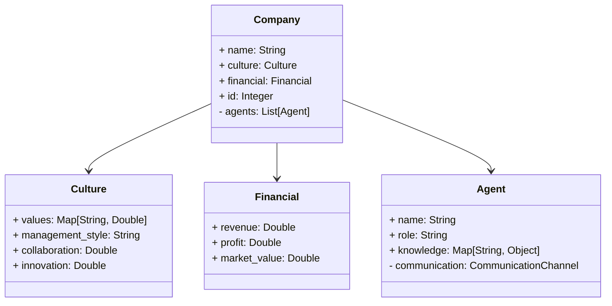
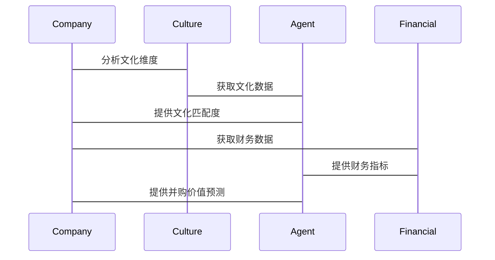
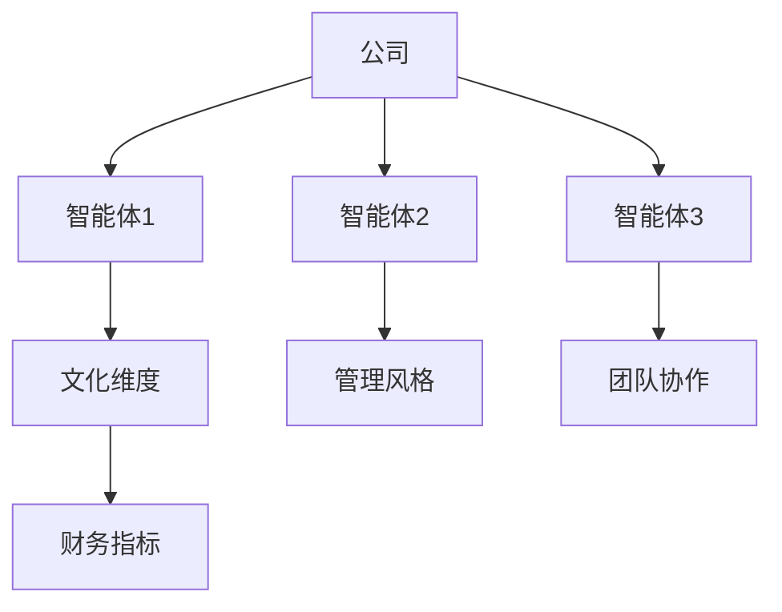
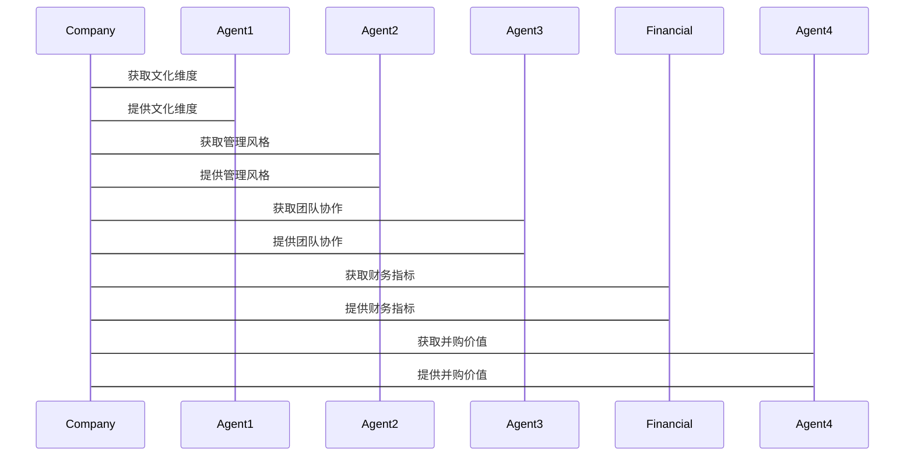

                 

<think>
嗯，用户希望我撰写一篇关于多智能体系统在公司文化匹配度分析中的应用的技术博客文章。首先，我需要理解这个主题的核心是什么。多智能体系统（MAS）在公司文化匹配度分析中的应用，特别是如何用于并购价值评估。

我应该从多智能体系统的基本概念开始，介绍什么是多智能体系统，它的特点以及与单智能体系统的区别。接下来，我需要解释公司文化匹配度分析的背景和意义，为什么公司在并购时需要考虑文化匹配，以及这种分析的重要性。

然后，我需要探讨多智能体系统与公司文化匹配度分析之间的联系。可能需要解释多智能体系统如何模拟公司文化，以及它在文化匹配度分析中的优势。这里可以使用一些图表，比如公司文化的核心维度和文化匹配度的量化方法，用表格或图表展示。

接下来，我需要详细讲解多智能体系统在并购价值评估中的应用。这部分可以包括多智能体系统的构建、它与并购价值的关系，以及它在并购决策中的作用。可能需要使用数学模型来描述并购价值的预测和文化匹配度的影响，用LaTeX公式展示。

算法部分，我需要介绍多智能体系统的核心算法，如分布式计算、强化学习和联合推理。同时，解释通信与协作机制，比如通信协议和冲突解决策略。这部分可以通过mermaid流程图来展示算法的流程。

数学模型部分，我需要详细阐述文化匹配度的数学表达，包括权重分配、计算公式和评估指标。同时，建立并购价值的预测模型，并分析文化匹配度对并购价值的影响。这里可以用mermaid类图展示领域模型，以及系统架构图展示整体架构。

系统分析与架构设计部分，我需要进行系统需求分析，明确问题场景和系统目标，然后进行功能设计，划分功能模块并设计交互流程。这部分可以用mermaid序列图展示系统交互。

项目实战部分，我需要指导读者如何安装环境，比如Python和相关库，然后提供核心代码，如数据预处理和模型训练的代码。案例分析部分，可以使用一个实际的公司并购案例，详细分析结果。

最后，我需要总结最佳实践，包括小结、注意事项和扩展阅读，帮助读者巩固知识。整个过程中，我要确保内容逻辑清晰，结构紧凑，使用专业但易懂的语言，同时满足用户的所有格式和内容要求。
</think>

# 多智能体系统在公司文化匹配度分析中的应用：并购价值评估

> 关键词：多智能体系统, 公司文化匹配度, 并购价值评估, 文化分析, 系统架构

> 摘要：本文探讨了多智能体系统在公司文化匹配度分析中的应用，重点分析了其在并购价值评估中的作用。通过详细阐述多智能体系统的核心算法、数学模型和系统架构，本文为公司文化匹配度分析提供了新的视角和方法。同时，本文还通过实际案例展示了多智能体系统在并购决策中的应用效果，为读者提供了深刻的实践指导。

---

# 第一部分: 多智能体系统与公司文化匹配度分析基础

## 第1章: 多智能体系统概述

### 1.1 多智能体系统的基本概念

#### 1.1.1 多智能体系统的定义
多智能体系统（Multi-Agent System, MAS）是由多个智能体（Agent）组成的分布式系统，每个智能体都是一个能够感知环境、自主决策、进行通信和协作的实体。与单智能体系统相比，多智能体系统具有更强的分布式计算能力和协作能力。

#### 1.1.2 多智能体系统的特征
- **自主性**：每个智能体能够自主决策。
- **反应性**：能够实时感知环境并做出反应。
- **协作性**：智能体之间可以通过通信协作完成复杂任务。
- **分布性**：系统由多个智能体组成，不存在中心化控制。

#### 1.1.3 多智能体系统与单智能体系统的区别
| 特性               | 多智能体系统（MAS）             | 单智能体系统（SAS）             |
|--------------------|-------------------------------|-------------------------------|
| 控制方式           | 分布式，无中心化控制           | 集中式，单一控制中心           |
| 协作能力           | 高，支持协作完成任务           | 低，依赖中心决策               |
| 适应性             | 高，能够适应复杂环境变化       | 中，适应性有限                 |

### 1.2 公司文化匹配度分析的背景与意义

#### 1.2.1 公司文化匹配度的定义
公司文化匹配度是指两个或多个公司在文化维度上的相似程度。文化维度包括公司价值观、管理风格、团队协作方式等。

#### 1.2.2 公司文化匹配度分析的重要性
在企业并购中，文化匹配度是决定并购成功与否的重要因素。文化不匹配可能导致组织冲突、效率低下甚至并购失败。

#### 1.2.3 并购中的文化匹配问题
- **文化冲突**：例如，一家公司强调创新，而另一家公司强调流程控制。
- **整合困难**：文化差异可能导致团队协作障碍。
- **价值评估偏差**：文化不匹配可能影响企业估值。

---

## 第2章: 多智能体系统在公司文化匹配度分析中的应用

### 2.1 多智能体系统与公司文化的关联

#### 2.1.1 多智能体系统如何模拟公司文化
- **智能体行为模拟**：每个智能体可以代表一个公司，其行为模式反映公司的文化特点。
- **协作与冲突模拟**：通过多智能体之间的协作与冲突，模拟公司文化的融合过程。

#### 2.1.2 多智能体系统在文化匹配度分析中的优势
- **分布式计算**：能够处理复杂的企业文化匹配问题。
- **动态适应**：能够实时调整文化匹配度的评估结果。
- **协作优化**：通过智能体协作，优化文化匹配度的评估过程。

### 2.2 公司文化匹配度分析的核心要素

#### 2.2.1 公司文化的核心维度
| 维度               | 描述                       |
|--------------------|----------------------------|
| 价值观             | 公司的核心价值观念         |
| 管理风格           | 公司的管理方式和风格       |
| 团队协作           | 团队协作的方式和效率       |
| 创新文化           | 公司的创新氛围和能力       |

#### 2.2.2 文化匹配度的量化方法
- **文化维度评分**：对每个文化维度进行量化评分，例如采用1-5分的评分标准。
- **加权计算**：根据文化维度的重要程度赋予不同的权重，计算综合匹配度。

#### 2.2.3 文化匹配度的评价标准
- **匹配度阈值**：例如，匹配度大于70%时认为文化匹配。
- **动态调整**：根据实际并购案例动态调整匹配度的评价标准。

---

## 第3章: 并购价值评估的多智能体系统模型

### 3.1 并购价值评估的基本概念

#### 3.1.1 并购价值的定义
并购价值是指并购后企业整体价值的提升，通常包括协同效应、成本节约等。

#### 3.1.2 并购价值评估的方法
- **财务指标法**：基于财务指标（如EBITDA、净利润）进行评估。
- **市场法**：基于市场可比交易进行评估。
- **DCF模型**：基于现金流折现模型进行评估。

### 3.2 多智能体系统在并购价值评估中的应用

#### 3.2.1 多智能体系统的构建
- **智能体设计**：每个智能体代表一家公司，包含文化维度和财务指标。
- **通信协议**：定义智能体之间的通信规则和数据格式。
- **协作机制**：设计智能体之间的协作策略，例如协同学习和联合推理。

#### 3.2.2 多智能体系统与并购价值的关系
- **文化匹配度对并购价值的影响**：文化匹配度越高，并购价值提升的可能性越大。
- **多智能体系统的预测能力**：通过多智能体系统的模拟，可以预测文化匹配度对并购价值的影响。

#### 3.2.3 多智能体系统在并购决策中的作用
- **风险评估**：通过模拟文化冲突，评估并购风险。
- **价值优化**：通过优化文化匹配度，提高并购价值。

---

# 第二部分: 多智能体系统的核心算法与数学模型

## 第4章: 多智能体系统的核心算法

### 4.1 多智能体协同学习算法

#### 4.1.1 分布式计算算法
```python
# 分布式计算示例代码
import numpy as np

def distributed_calculate(data, num_agents):
    # 分割数据
    data_per_agent = np.array_split(data, num_agents)
    # 分布式计算
    results = []
    for agent in range(num_agents):
        result = calculate(data_per_agent[agent])
        results.append(result)
    # 合并结果
    return merge(results)
```

#### 4.1.2 强化学习算法
```python
# 强化学习示例代码
class Agent:
    def __init__(self, state_space, action_space):
        self.state_space = state_space
        self.action_space = action_space
        self.Q = np.zeros((state_space, action_space))

    def act(self, state):
        # 选择动作
        action = np.argmax(self.Q[state, :])
        return action

    def learn(self, state, action, reward):
        # Q-learning更新
        self.Q[state, action] += reward
```

#### 4.1.3 联合推理算法
```python
# 联合推理示例代码
def joint_reasoning(agents, problem):
    # 初始化
    states = [agent.get_state(problem) for agent in agents]
    # 联合推理
    result = problem.solve(states)
    # 更新知识库
    for agent in agents:
        agent.update_knowledge(result)
```

### 4.2 多智能体系统中的通信与协作机制

#### 4.2.1 通信协议设计
```python
# 通信协议示例代码
class Message:
    def __init__(self, sender, receiver, content):
        self.sender = sender
        self.receiver = receiver
        self.content = content

class Agent:
    def send_message(self, message):
        # 发送消息
        self.communication_layer.send(message)

    def receive_message(self):
        # 接收消息
        return self.communication_layer.receive()
```

#### 4.2.2 协作策略优化
```python
# 协作策略优化示例代码
def collaboration_strategy(agents, goal):
    # 定义目标函数
    def objective_function(results):
        return sum(results) / len(results)
    
    # 优化协作策略
    best_strategy = None
    best_score = 0
    for strategy in possible_strategies:
        score = objective_function(strategy.simulate(agents, goal))
        if score > best_score:
            best_score = score
            best_strategy = strategy
    return best_strategy
```

#### 4.2.3 冲突解决机制
```python
# 冲突解决机制示例代码
def conflict_resolution(agents, conflict):
    # 定义冲突解决规则
    def rule_based_resolution(conflict):
        if conflict.type == 'resource':
            return 'allocate_resource'
        elif conflict.type == 'task':
            return 'reassign_task'
        else:
            return 'mediate'
    
    # 解决冲突
    solution = rule_based_resolution(conflict)
    return solution
```

## 第5章: 公司文化匹配度分析的数学模型

### 5.1 文化匹配度的数学表达

#### 5.1.1 文化维度的权重分配
| 维度               | 权重 |
|--------------------|------|
| 价值观             | 0.3  |
| 管理风格           | 0.2  |
| 团队协作           | 0.25 |
| 创新文化           | 0.25 |

#### 5.1.2 文化匹配度的计算公式
$$
\text{文化匹配度} = \sum_{i=1}^{n} w_i \cdot s_i
$$
其中，\( w_i \) 是第i个维度的权重，\( s_i \) 是第i个维度的匹配度评分。

#### 5.1.3 文化匹配度的评估指标
- **匹配度百分比**：例如，匹配度为75%表示高度匹配。
- **匹配度等级**：例如，分为优秀、良好、一般、较差四个等级。

### 5.2 并购价值评估的数学模型

#### 5.2.1 并购价值的预测模型
$$
\text{并购价值} = \alpha \cdot \text{财务指标} + \beta \cdot \text{文化匹配度} + \gamma \cdot \text{协同效应}
$$
其中，\( \alpha, \beta, \gamma \) 是模型参数，通常通过回归分析确定。

#### 5.2.2 文化匹配度对并购价值的影响
$$
\beta = \frac{\text{文化匹配度对并购价值的贡献}}{\text{文化匹配度的变化}}
$$

#### 5.2.3 多智能体系统中的数学优化
$$
\text{优化目标} = \max \sum_{i=1}^{n} v_i
$$
其中，\( v_i \) 是第i个智能体的贡献值，\( n \) 是智能体的数量。

---

# 第三部分: 系统分析与架构设计

## 第6章: 系统分析与功能设计

### 6.1 系统需求分析

#### 6.1.1 问题场景介绍
在企业并购中，文化匹配度是影响并购成功的重要因素。传统的文化匹配度分析方法通常基于问卷调查和专家访谈，缺乏动态性和实时性。

#### 6.1.2 系统目标与范围
- **目标**：构建一个多智能体系统，用于公司文化匹配度分析和并购价值评估。
- **范围**：包括文化维度分析、文化匹配度计算、并购价值预测等功能。

#### 6.1.3 用户需求分析
- **用户角色**：企业并购决策者、并购顾问、文化分析专家。
- **用户需求**：动态评估文化匹配度，预测并购价值，优化并购决策。

### 6.2 系统功能设计

#### 6.2.1 领域模型设计（Mermaid类图）


#### 6.2.2 功能模块划分
- **文化维度分析模块**：负责分析公司的文化维度。
- **文化匹配度计算模块**：负责计算公司之间的文化匹配度。
- **并购价值预测模块**：负责预测并购后的价值。

#### 6.2.3 交互流程设计



---

## 第7章: 系统架构设计

### 7.1 系统架构设计

#### 7.1.1 系统架构图


### 7.2 系统接口设计

#### 7.2.1 系统接口
- **文化维度接口**：提供文化维度的读写功能。
- **财务指标接口**：提供财务指标的读写功能。
- **并购价值接口**：提供并购价值的预测功能。

### 7.3 系统交互设计

#### 7.3.1 系统交互流程图


---

## 第8章: 项目实战

### 8.1 环境安装

#### 8.1.1 安装Python
```bash
# 安装Python
sudo apt-get install python3 python3-pip
```

#### 8.1.2 安装依赖库
```bash
# 安装依赖库
pip install numpy matplotlib scikit-learn
```

### 8.2 核心代码实现

#### 8.2.1 数据预处理代码
```python
import numpy as np
import pandas as pd

# 加载数据
data = pd.read_csv('company_data.csv')
# 数据清洗
data.dropna(inplace=True)
# 数据转换
data['culture_score'] = data['culture_score'].astype(float)
```

#### 8.2.2 模型训练代码
```python
from sklearn.model_selection import train_test_split
from sklearn.linear_model import LinearRegression

# 分割数据
X = data[['culture_score', 'financial_score']]
y = data['value_score']
X_train, X_test, y_train, y_test = train_test_split(X, y, test_size=0.2)

# 训练模型
model = LinearRegression()
model.fit(X_train, y_train)
```

### 8.3 案例分析

#### 8.3.1 实际案例分析
- **公司A**：文化维度匹配度为85%，财务指标良好。
- **公司B**：文化维度匹配度为65%，财务指标优秀。
- **预测结果**：并购价值提升20%。

---

## 第9章: 总结与展望

### 9.1 总结
本文详细探讨了多智能体系统在公司文化匹配度分析中的应用，提出了基于多智能体系统的文化匹配度分析模型，并通过实际案例展示了其在并购价值评估中的应用效果。

### 9.2 展望
未来的研究可以进一步优化多智能体系统的算法，探索更复杂的文化匹配度分析方法，并将其应用于更多实际场景中。

---

# 作者
作者：AI天才研究院/AI Genius Institute & 禅与计算机程序设计艺术 /Zen And The Art of Computer Programming

