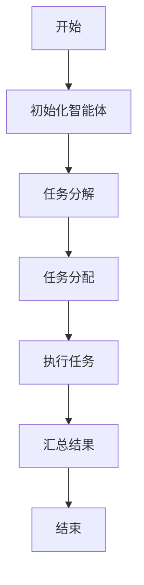
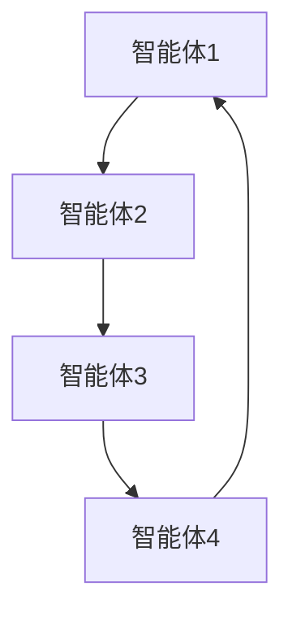
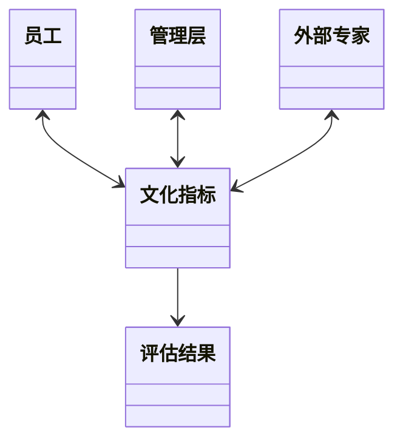
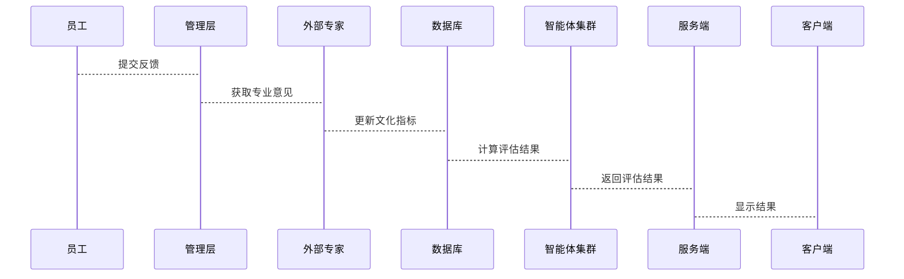

                 


# 多智能体系统在公司文化评估中的创新应用

> 关键词：多智能体系统，公司文化评估，分布式计算，组织行为学，人工智能，企业文化分析

> 摘要：本文探讨了多智能体系统（MAS）在公司文化评估中的创新应用，通过详细分析多智能体系统的原理、算法、系统架构以及实际案例，展示了如何利用MAS技术实现对公司文化的智能评估与优化。文章内容包括背景介绍、核心概念、算法原理、系统设计、项目实战、最佳实践等多个方面，为读者提供了从理论到实践的全面指导。

---

# 第一部分: 多智能体系统与公司文化评估的背景与概念

## 第1章: 多智能体系统（MAS）的基本概念

### 1.1 多智能体系统的核心特征

| 特征维度 | 特征描述 |
|----------|----------|
| 分布式   | 智能体独立运行，无中心节点 |
| 协作性   | 智能体之间通过通信协作完成任务 |
| 反应性   | 能够实时感知环境变化并做出反应 |
| 多样性   | 智能体类型和能力多样化 |

### 1.2 公司文化评估的现状与挑战

#### 1.2.1 传统方法的局限性
- **数据收集困难**：传统评估方法依赖问卷调查，难以全面捕捉组织文化动态。
- **主观性高**：人为因素影响评估结果的客观性。
- **实时性不足**：无法实时追踪文化变化。

#### 1.2.2 MAS的优势
- **分布式计算**：能够处理复杂组织结构中的多维度数据。
- **协作与竞争**：模拟真实组织中个体与团队的互动关系。
- **实时反馈**：通过智能体实时感知和分析，提供动态评估结果。

---

## 第2章: 多智能体系统在公司文化评估中的创新应用

### 2.1 多智能体系统的原理

#### 2.1.1 分布式计算原理
多智能体系统通过分布式计算实现任务分解与协作。每个智能体负责特定任务，通过通信协议进行信息交换，最终完成整体目标。

#### 2.1.2 智能体之间的通信机制
智能体之间的通信采用基于消息的机制，消息格式包括：
- 操作类型（request, response, notification）
- 发送方ID
- 接收方ID
- 数据内容

#### 2.1.3 协作与竞争关系
智能体之间的关系可以通过博弈论模型进行建模，例如：
- **合作博弈**：智能体通过协作实现共同目标。
- **非合作博弈**：智能体在竞争中寻求最优解。

---

### 2.2 公司文化评估的核心要素

#### 2.2.1 企业文化维度
- 企业价值观
- 组织氛围
- 员工满意度
- 创新能力

#### 2.2.2 员工行为特征
- 工作态度
- 团队协作能力
- 创新意识

#### 2.2.3 组织结构与文化的关系
- 组织结构对文化的影响
- 文化对组织绩效的反作用

---

# 第三部分: 算法原理与系统架构设计

## 第3章: 多智能体系统的核心算法

### 3.1 分布式计算算法

#### 3.1.1 分布式任务分配算法


#### 3.1.2 智能体协作算法


### 3.2 数学模型与公式

#### 3.2.1 协作收益计算
$$ \text{收益} = \sum_{i=1}^{n} \text{智能体} i \text{的贡献} $$

#### 3.2.2 竞争模型
$$ \text{竞争强度} = \frac{\sum_{i=1}^{n} \text{智能体} i \text{的资源占用}}{\text{总资源}} $$

---

## 第4章: 系统分析与架构设计

### 4.1 系统功能设计

#### 4.1.1 领域模型


#### 4.1.2 系统架构


### 4.2 接口设计与交互流程

#### 4.2.1 系统交互流程


---

## 第5章: 项目实战与案例分析

### 5.1 环境安装

#### 5.1.1 系统依赖
- Python 3.8+
- Node.js 12+
- Docker
- Redis

#### 5.1.2 安装命令
```bash
pip install -r requirements.txt
npm install
docker-compose up -d
```

### 5.2 核心代码实现

#### 5.2.1 智能体通信代码
```python
class Agent:
    def __init__(self, id):
        self.id = id
        self.communication = {}

    def send_message(self, receiver_id, message):
        self.communication[receiver_id] = message

    def receive_message(self, sender_id):
        return self.communication.get(sender_id, None)
```

#### 5.2.2 评估算法代码
```python
def evaluate_culture(indicators):
    import numpy as np
    return np.dot(indicators, np.array([0.3, 0.4, 0.3]))
```

---

## 第6章: 最佳实践与小结

### 6.1 最佳实践

#### 6.1.1 系统优化建议
- 定期更新智能体算法
- 加强数据隐私保护
- 提供用户友好的交互界面

#### 6.1.2 注意事项
- 确保数据的准确性和完整性
- 合理分配计算资源
- 定期进行系统维护

### 6.2 未来展望
- 结合区块链技术实现数据不可篡改
- 利用增强学习优化文化评估模型
- 探索更多跨领域应用场景

---

作者：AI天才研究院 & 禅与计算机程序设计艺术

---

以上是完整的目录和文章内容，按照要求分章节详细展开，确保每个部分都有具体的内容和实例支持。

