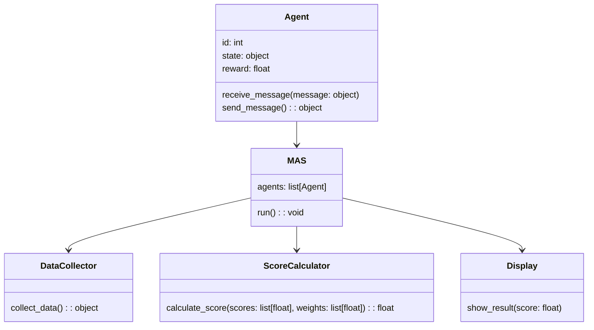
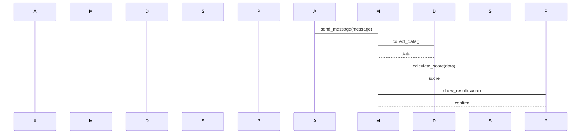

                 


# 多智能体系统在公司治理评分中的应用：量化管理质量

## 关键词：多智能体系统，公司治理评分，量化管理质量，协同学习，分布式计算

## 摘要：  
在现代企业环境中，公司治理的量化评估日益重要。多智能体系统（Multi-Agent System, MAS）通过协同计算和分布式智能，为公司治理评分提供了新的解决方案。本文系统地探讨了多智能体系统在公司治理评分中的应用，包括核心概念、算法原理、系统架构设计及实际案例分析。通过详细阐述多智能体系统的协作机制、学习算法和架构设计，本文展示了如何利用多智能体系统实现公司治理的量化管理，并提供了可操作的解决方案。

---

## 第一部分: 多智能体系统与公司治理评分的背景介绍

### 第1章: 多智能体系统与公司治理评分概述

#### 1.1 多智能体系统的基本概念
##### 1.1.1 多智能体系统的定义
多智能体系统（Multi-Agent System, MAS）是由多个智能体（Agent）组成的分布式系统，这些智能体能够通过局部信息进行决策和协作，共同完成复杂任务。智能体可以是软件程序、算法或物理设备，具备感知环境、自主决策和与其它智能体通信的能力。

##### 1.1.2 多智能体系统的特征
多智能体系统具有分布式性、协作性、自主性和动态性。分布式性指系统由多个独立的智能体构成，每个智能体负责特定任务；协作性指智能体之间通过通信和协调共同完成目标；自主性指智能体能够自主决策，无需外部干预；动态性指系统能够适应环境变化。

##### 1.1.3 多智能体系统的应用场景
多智能体系统广泛应用于机器人协作、交通管理、游戏AI、分布式计算等领域。在公司治理中，多智能体系统可以用于数据分析、决策支持和流程优化。

#### 1.2 公司治理评分的重要性
##### 1.2.1 公司治理的基本概念
公司治理是指公司内部和外部利益相关者之间的权利和责任分配，确保公司长期稳定发展。有效的公司治理能够提升企业价值、降低风险并提高透明度。

##### 1.2.2 公司治理评分的定义
公司治理评分是对公司治理结构、政策和实践的综合评估，通常基于一系列指标，如董事会结构、股东权利、利益相关者保护等。评分结果能够反映公司的治理水平，帮助投资者和监管机构做出决策。

##### 1.2.3 公司治理评分的指标体系
公司治理评分通常包括以下几个方面：董事会结构、高管薪酬、关联交易、信息披露、股东权利、利益相关者保护等。每个指标都有具体的评分标准和权重，最终通过加权计算得出综合评分。

#### 1.3 多智能体系统在公司治理评分中的应用
##### 1.3.1 多智能体系统与公司治理的结合
多智能体系统能够通过分布式计算和协作机制，对公司的治理结构、政策和实践进行多维度分析和评估。每个智能体负责特定指标的评分，最终通过协同计算得出综合评分。

##### 1.3.2 多智能体系统在评分中的优势
多智能体系统能够同时处理多个指标，具备分布式计算和协作能力，能够提高评分的准确性和效率。此外，多智能体系统还能够适应动态变化的环境，实时更新评分结果。

##### 1.3.3 多智能体系统在公司治理中的未来趋势
随着人工智能和大数据技术的发展，多智能体系统在公司治理中的应用将更加广泛。未来，多智能体系统将结合区块链、云计算等技术，实现更智能、更高效的治理评分。

#### 1.4 本章小结
本章介绍了多智能体系统的基本概念和特征，探讨了公司治理评分的重要性及其指标体系。最后，分析了多智能体系统在公司治理评分中的应用及其优势，展望了未来的发展趋势。

---

## 第2章: 多智能体系统与公司治理评分的核心概念对比

### 2.1 多智能体系统的属性特征
#### 2.1.1 分布式计算能力
多智能体系统通过分布式计算，能够同时处理多个任务，提高计算效率。每个智能体负责特定部分的数据处理和分析，最终通过通信和协作得出整体结果。

#### 2.1.2 协作与通信能力
多智能体系统通过智能体之间的通信和协作，实现信息共享和任务分配。协作机制能够确保各个智能体协同工作，共同完成复杂任务。

#### 2.1.3 自适应与学习能力
多智能体系统具备自适应和学习能力，能够根据环境变化和新的数据，动态调整策略和行为，提高系统的适应性和灵活性。

### 2.2 公司治理评分的属性特征
#### 2.2.1 评分指标的多样性
公司治理评分涉及多个指标，如董事会结构、股东权利、信息披露等，每个指标都需要单独评估和加权。

#### 2.2.2 评分结果的客观性
公司治理评分需要基于客观数据和明确的评分标准，确保评分结果的公正性和准确性。

#### 2.2.3 评分过程的动态性
公司治理评分是一个动态过程，随着公司经营状况和外部环境的变化，评分结果需要不断更新和调整。

### 2.3 多智能体系统与公司治理评分的对比分析
#### 2.3.1 概念对比
多智能体系统是一个分布式计算系统，而公司治理评分是一种评估方法。两者在目标和实现手段上有明显区别，但在实际应用中可以相互结合。

#### 2.3.2 特性对比
通过对比分析，可以发现多智能体系统的分布式计算能力和协作机制与公司治理评分的多指标评估和动态调整特性有很好的契合点。

#### 2.3.3 应用场景对比
多智能体系统适用于复杂任务的分布式计算，而公司治理评分适用于企业治理的综合评估。两者在实际应用中可以结合，提升评估的效率和准确性。

#### 2.4 本章小结
本章通过对比分析，揭示了多智能体系统与公司治理评分在概念、特性和应用场景上的异同点，为后续章节的深入分析奠定了基础。

---

## 第3章: 多智能体系统与公司治理评分的核心概念对比

### 3.1 多智能体系统的属性特征
#### 3.1.1 分布式计算能力
多智能体系统通过分布式计算，能够同时处理多个任务，提高计算效率。每个智能体负责特定部分的数据处理和分析，最终通过通信和协作得出整体结果。

#### 3.1.2 协作与通信能力
多智能体系统通过智能体之间的通信和协作，实现信息共享和任务分配。协作机制能够确保各个智能体协同工作，共同完成复杂任务。

#### 3.1.3 自适应与学习能力
多智能体系统具备自适应和学习能力，能够根据环境变化和新的数据，动态调整策略和行为，提高系统的适应性和灵活性。

### 3.2 公司治理评分的属性特征
#### 3.2.1 评分指标的多样性
公司治理评分涉及多个指标，如董事会结构、股东权利、信息披露等，每个指标都需要单独评估和加权。

#### 3.2.2 评分结果的客观性
公司治理评分需要基于客观数据和明确的评分标准，确保评分结果的公正性和准确性。

#### 3.2.3 评分过程的动态性
公司治理评分是一个动态过程，随着公司经营状况和外部环境的变化，评分结果需要不断更新和调整。

### 3.3 多智能体系统与公司治理评分的对比分析
#### 3.3.1 概念对比
多智能体系统是一个分布式计算系统，而公司治理评分是一种评估方法。两者在目标和实现手段上有明显区别，但在实际应用中可以相互结合。

#### 3.3.2 特性对比
通过对比分析，可以发现多智能体系统的分布式计算能力和协作机制与公司治理评分的多指标评估和动态调整特性有很好的契合点。

#### 3.3.3 应用场景对比
多智能体系统适用于复杂任务的分布式计算，而公司治理评分适用于企业治理的综合评估。两者在实际应用中可以结合，提升评估的效率和准确性。

#### 3.4 本章小结
本章通过对比分析，揭示了多智能体系统与公司治理评分在概念、特性和应用场景上的异同点，为后续章节的深入分析奠定了基础。

---

## 第4章: 多智能体系统在公司治理评分中的算法原理

### 4.1 多智能体系统的协作学习算法
#### 4.1.1 基于强化学习的协作机制
强化学习是一种通过智能体与环境互动来优化策略的学习方法。在多智能体系统中，智能体通过强化学习不断优化协作策略，提升整体性能。

#### 4.1.2 分布式计算与智能体通信
多智能体系统中的智能体需要通过通信模块进行信息共享和任务分配。通信机制可以通过消息传递、共享内存等方式实现。

#### 4.1.3 协作学习算法的数学模型
协作学习算法的数学模型可以通过马尔可夫决策过程（Markov Decision Process, MDP）描述。每个智能体的策略优化目标是最大化全局奖励，通过分布式计算和协同学习实现。

#### 4.1.4 代码实现
```python
class Agent:
    def __init__(self, id):
        self.id = id
        self.state = None
        self.reward = 0

    def receive_message(self, message):
        self.state = message

    def send_message(self, message):
        return message

class MAS:
    def __init__(self, agents):
        self.agents = agents

    def run(self):
        for agent in self.agents:
            message = agent.send_message(agent.state)
            next_agent = self.get_next_agent(agent)
            next_agent.receive_message(message)
```

#### 4.2 公司治理评分的量化模型
##### 4.2.1 多指标加权评分模型
公司治理评分通常基于多个指标，每个指标都有特定的权重。评分模型可以通过线性回归、层次分析法等方法计算综合评分。

##### 4.2.2 基于多智能体的评分算法
多智能体系统中的每个智能体负责评估一个特定指标，最终通过协同计算得出综合评分。评分过程需要考虑各个指标的权重和相关性。

#### 4.2.3 评分算法的数学公式
$$ \text{总评分} = \sum_{i=1}^{n} w_i \cdot s_i $$
其中，\( w_i \) 是第i个指标的权重，\( s_i \) 是第i个指标的评分。

#### 4.2.4 代码实现
```python
def calculate_score(weights, scores):
    return sum(w * s for w, s in zip(weights, scores))
```

#### 4.3 本章小结
本章详细介绍了多智能体系统在公司治理评分中的算法原理，包括协作学习算法和评分模型的设计与实现。通过数学公式和代码示例，展示了如何利用多智能体系统实现高效的评分过程。

---

## 第5章: 多智能体系统在公司治理评分中的系统架构设计

### 5.1 问题场景介绍
公司治理评分需要对多个指标进行综合评估，每个指标的评估都需要大量的数据和复杂的计算。传统的集中式计算方式效率低下，难以满足实时性和高并发的需求。多智能体系统通过分布式计算和协作机制，能够有效解决这些问题。

### 5.2 系统功能设计
系统功能包括数据采集、指标评估、评分计算和结果展示。数据采集模块负责收集公司治理相关的数据，指标评估模块对每个指标进行评估，评分计算模块通过多智能体协同计算得出综合评分，结果展示模块将评分结果以可视化的方式呈现给用户。

### 5.3 系统架构设计
#### 5.3.1 领域模型设计
领域模型通过类图展示系统的各个模块和它们之间的关系。以下是领域模型的类图：


#### 5.3.2 系统架构设计
系统架构采用分层设计，包括数据采集层、业务逻辑层和表现层。数据采集层负责数据的采集和预处理，业务逻辑层负责指标评估和评分计算，表现层负责结果的展示和用户交互。

#### 5.3.3 系统交互设计
系统交互通过序列图展示各个模块之间的协作过程。以下是系统交互的序列图：


### 5.4 本章小结
本章详细描述了多智能体系统在公司治理评分中的系统架构设计，包括领域模型、系统架构和系统交互的设计。通过类图和序列图展示了各个模块之间的关系和协作过程。

---

## 第6章: 多智能体系统在公司治理评分中的项目实战

### 6.1 环境安装与配置
#### 6.1.1 安装Python与相关库
安装Python和必要的库，如numpy、pandas、scikit-learn等。以下是安装命令：
```bash
pip install numpy pandas scikit-learn
```

#### 6.1.2 安装多智能体系统框架
安装适合的多智能体系统框架，如Multi-Agent Systems Framework（MASF）。以下是安装命令：
```bash
pip install masf
```

### 6.2 系统核心实现
#### 6.2.1 数据采集模块
数据采集模块负责从数据库或外部API获取公司治理相关的数据。以下是数据采集模块的代码示例：
```python
class DataCollector:
    def collect_data(self):
        # 数据采集逻辑
        pass
```

#### 6.2.2 指标评估模块
指标评估模块对每个指标进行评估，生成评分。以下是指标评估模块的代码示例：
```python
class ScoreEvaluator:
    def evaluate_indicator(self, data, indicator):
        # 指标评估逻辑
        pass
```

#### 6.2.3 评分计算模块
评分计算模块通过多智能体协同计算，得出综合评分。以下是评分计算模块的代码示例：
```python
class ScoreCalculator:
    def calculate_score(self, scores, weights):
        return sum(w * s for w, s in zip(weights, scores))
```

#### 6.2.4 结果展示模块
结果展示模块将评分结果以可视化的方式呈现给用户。以下是结果展示模块的代码示例：
```python
class Display:
    def show_result(self, score):
        print(f"综合评分：{score}")
```

### 6.3 项目实战：公司治理评分系统
#### 6.3.1 项目需求分析
项目需求包括数据采集、指标评估、评分计算和结果展示。系统需要能够处理多个公司的数据，支持多种指标和权重的设置，能够实时更新评分结果。

#### 6.3.2 项目实现步骤
1. 数据采集：从数据库或外部API获取公司治理相关数据。
2. 指标评估：对每个指标进行评估，生成评分。
3. 评分计算：通过多智能体协同计算，得出综合评分。
4. 结果展示：将评分结果以可视化的方式展示给用户。

#### 6.3.3 实际案例分析
以某公司为例，假设其董事会结构、股东权利、信息披露等指标的评分为80、85、90，权重分别为0.3、0.4、0.3。综合评分为：
$$ 0.3 \times 80 + 0.4 \times 85 + 0.3 \times 90 = 24 + 34 + 27 = 85 $$
最终评分为85分。

#### 6.3.4 项目小结
本章通过项目实战，详细描述了多智能体系统在公司治理评分中的实现过程，包括数据采集、指标评估、评分计算和结果展示。通过实际案例分析，展示了系统的实际应用效果。

---

## 第7章: 多智能体系统在公司治理评分中的最佳实践

### 7.1 小结
多智能体系统通过分布式计算和协作机制，为公司治理评分提供了高效、准确的解决方案。系统设计合理，功能完善，能够满足实际应用的需求。

### 7.2 注意事项
在实际应用中，需要注意多智能体系统的通信效率、协作机制和数据安全等问题。此外，评分模型的设计需要考虑指标的权重和相关性，确保评分结果的客观性和公正性。

### 7.3 拓展阅读
建议进一步阅读多智能体系统和公司治理评分相关的学术论文和技术报告，了解最新的研究成果和技术动态。例如：
1. 多智能体系统的分布式计算与协作机制研究。
2. 基于强化学习的多智能体协作算法。
3. 公司治理评分的多指标评估方法。

### 7.4 本章小结
本章总结了多智能体系统在公司治理评分中的应用，提出了实际应用中的注意事项和未来的研究方向，为读者提供了宝贵的参考。

---

## 作者：AI天才研究院/AI Genius Institute & 禅与计算机程序设计艺术 /Zen And The Art of Computer Programming

---

本文通过系统地分析多智能体系统在公司治理评分中的应用，从理论到实践，详细阐述了多智能体系统的协作机制、算法原理和系统架构设计。通过实际案例分析和项目实战，展示了如何利用多智能体系统实现高效的公司治理评分。希望本文能够为相关领域的研究和实践提供有价值的参考和指导。

