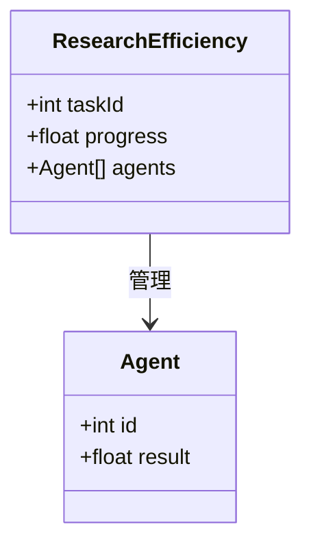
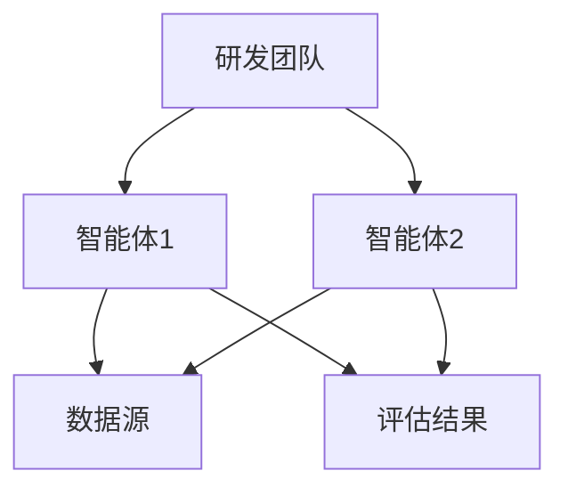
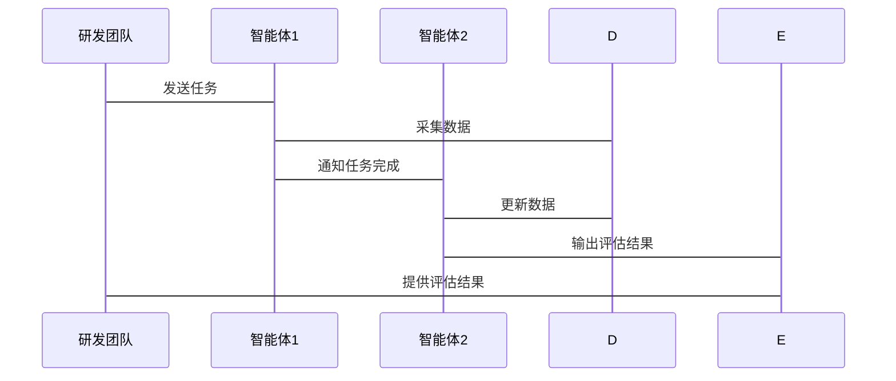

                 

<think>
好的，我需要帮助用户完成一篇关于“多智能体系统在公司研发效率评估中的应用”的技术博客文章。用户已经提供了文章的结构大纲，包括摘要和目录，现在需要我根据这个大纲逐步思考如何撰写这篇文章。

首先，我需要明确文章的核心主题：多智能体系统（Multi-Agent Systems，MAS）在公司研发效率评估中的应用。这意味着我需要解释什么是多智能体系统，它们如何在研发效率评估中发挥作用，以及具体的实现方法和案例分析。

接下来，我会按照用户提供的目录结构来逐步展开思考：

1. **摘要部分**：
   - 摘要需要简明扼要地总结文章的核心内容和主题。我需要确保摘要涵盖了文章的主要观点，即多智能体系统如何提升研发效率评估的准确性和实时性，以及其在优化资源分配和提升团队协作方面的作用。

2. **第1章：多智能体系统概述**：
   - 1.1节需要介绍多智能体系统的定义、核心特征和分类。我需要确保这些内容清晰易懂，适合不同背景的读者理解。
   - 1.2节需要讨论研发效率评估的重要性，包括其定义、指标体系和面临的挑战。我需要思考如何将多智能体系统与研发效率评估结合起来，展示其在解决传统方法局限性方面的优势。

3. **第2章：多智能体系统在研发效率评估中的应用背景**：
   - 2.1节需要分析研发效率评估的现状和问题，比较传统方法与新兴技术的优劣。
   - 2.2节需要详细阐述多智能体系统的优势，如分布式计算能力、协同优化能力和动态适应能力。

4. **第3章：多智能体系统的核心概念与联系**：
   - 3.1节需要解释多智能体系统的原理，包括智能体的定义、特征及其之间的通信与协作。
   - 3.2节需要通过对比表和ER实体关系图展示智能体的类型和行为模式，帮助读者理解不同智能体之间的关系与依赖。

5. **第4章：多智能体系统的算法原理**：
   - 4.1节需要详细讲解分布式计算与协同优化算法，包括其数学模型和公式推导。我需要确保使用清晰的数学表达，并附上代码示例。
   - 4.2节需要讨论多智能体系统中的通信协议，包括常见协议的实现方法及其在实际中的应用。

6. **第5章：多智能体系统的系统分析与架构设计**：
   - 5.1节需要分析问题场景，介绍项目背景和目标。
   - 5.2节需要通过领域模型类图展示系统功能设计，帮助读者理解系统模块之间的关系。
   - 5.3节需要设计系统架构图，展示各个组件之间的交互。
   - 5.4节需要详细描述系统接口设计和交互流程，使用序列图说明不同组件之间的协作。

7. **第6章：项目实战**：
   - 6.1节需要指导读者如何安装和配置开发环境，确保他们能够顺利运行后续代码。
   - 6.2节需要提供系统核心实现的源代码，并附上详细的注释和解释，帮助读者理解代码的逻辑和功能。
   - 6.3节需要解读代码实现，分析实际案例，并进行详细的案例分析和讲解，展示多智能体系统在研发效率评估中的实际应用效果。
   - 6.4节需要总结项目经验，指出成功的关键因素和可能的改进方向。

8. **第7章：最佳实践与小结**：
   - 7.1节需要给出实际应用中的最佳实践建议，帮助读者在实际项目中更好地应用多智能体系统。
   - 7.2节需要总结全文内容，回顾主要观点，并强调多智能体系统在研发效率评估中的重要性。
   - 7.3节需要提醒读者在应用多智能体系统时的注意事项，避免常见的错误和误区。
   - 7.4节需要提供拓展阅读的资源，推荐相关的书籍和文章，帮助读者进一步深入学习。

在整个思考过程中，我需要确保每个部分的内容都详尽、准确，并且能够帮助读者逐步理解多智能体系统在研发效率评估中的应用。同时，我需要使用专业的技术语言，但又要避免过于晦涩，确保内容易于理解。

最后，我需要在文章末尾注明作者信息，以增加文章的权威性和可信度。

综上所述，我会按照上述步骤，逐步展开撰写这篇文章，确保每一部分内容详实、逻辑清晰，帮助读者全面理解多智能体系统在研发效率评估中的应用。
</think>

# 多智能体系统在公司研发效率评估中的应用

> 关键词：多智能体系统、研发效率评估、协同优化、分布式计算、系统架构设计

> 摘要：本文深入探讨了多智能体系统（MAS）在公司研发效率评估中的应用。通过分析多智能体系统的原理、算法、系统架构以及实际项目案例，本文展示了如何利用MAS提升研发效率评估的准确性和实时性。文章内容包括MAS的核心概念、算法原理、系统设计、项目实战等，为读者提供全面的技术指导。

---

## 第1章：多智能体系统概述

### 1.1 多智能体系统的基本概念

#### 1.1.1 多智能体系统的定义
多智能体系统（Multi-Agent Systems，MAS）是由多个智能体（Agent）组成的复杂系统。智能体是指能够感知环境、自主决策并采取行动的实体。MAS通过智能体之间的协作与通信，实现比单个智能体更复杂的任务。

#### 1.1.2 多智能体系统的核心特征
- **自主性**：智能体能够自主决策，无需外部干预。
- **反应性**：智能体能够实时感知环境并做出反应。
- **协作性**：智能体之间能够通过通信和协作完成共同目标。
- **分布式性**：智能体分布在不同的位置，具有分布式计算能力。

#### 1.1.3 多智能体系统的分类与应用场景
多智能体系统可以分为集中式和分布式两类。集中式MAS有一个中央控制节点，而分布式MAS没有中央控制节点，智能体之间通过对等通信协作。MAS广泛应用于机器人、自动驾驶、分布式计算、游戏AI等领域。

### 1.2 研发效率评估的重要性

#### 1.2.1 研发效率评估的定义
研发效率评估是对研发团队或项目的产出与投入的比率进行测量和分析。常见的指标包括代码提交频率、任务完成时间、代码质量等。

#### 1.2.2 研发效率评估的指标体系
研发效率评估指标体系包括：
- 代码提交频率：衡量开发人员的工作速度。
- 任务完成时间：衡量任务的完成效率。
- 代码质量：衡量代码的可维护性和可扩展性。
- 团队协作效率：衡量团队成员之间的协作效果。

#### 1.2.3 研发效率评估的挑战与解决方案
传统研发效率评估方法存在以下问题：
- 数据分散：研发数据分布在不同工具中，难以统一分析。
- 单点故障：依赖单个节点的计算能力，容易成为性能瓶颈。
- 动态适应性差：难以应对研发过程中的动态变化。

多智能体系统的分布式计算和协同优化能力为解决这些问题提供了新的思路。

---

## 第2章：多智能体系统在研发效率评估中的应用背景

### 2.1 研发效率评估的现状与问题

#### 2.1.1 研发效率评估的传统方法
传统研发效率评估方法通常依赖人工统计和分析，存在以下问题：
- 数据采集困难：需要手动收集不同工具的数据。
- 分析效率低：数据处理和分析耗时耗力。
- 结果缺乏实时性：评估结果滞后于实际研发进度。

#### 2.1.2 传统方法的局限性
- 数据孤岛：不同工具的数据无法有效整合。
- 计算能力不足：单点计算难以处理大规模数据。
- 缺乏动态适应性：无法实时反馈研发进度。

#### 2.1.3 新兴技术对研发效率评估的影响
随着人工智能和分布式计算技术的发展，新兴技术为研发效率评估提供了新的可能性。多智能体系统通过分布式计算和协同优化，能够实时采集和分析研发数据，提高评估的准确性和实时性。

### 2.2 多智能体系统的优势与潜力

#### 2.2.1 多智能体系统的分布式计算能力
MAS通过分布式计算，能够高效处理大规模数据。每个智能体负责一部分数据的处理和分析，避免了单点故障和性能瓶颈。

#### 2.2.2 多智能体系统的协同优化能力
MAS通过智能体之间的协作与通信，能够实现全局优化。例如，通过协同优化算法，可以找到最优的任务分配方案，提高研发效率。

#### 2.2.3 多智能体系统的动态适应能力
MAS能够实时感知环境变化，并根据变化调整策略。例如，在研发过程中，智能体可以根据任务进度动态调整资源分配，确保研发效率最大化。

---

## 第3章：多智能体系统的核心概念与联系

### 3.1 多智能体系统的原理

#### 3.1.1 智能体的定义与特征
智能体是MAS的核心单元，具有以下特征：
- **自主性**：能够自主决策。
- **反应性**：能够感知环境并做出反应。
- **协作性**：能够与其他智能体协作完成任务。

#### 3.1.2 智能体之间的通信与协作
智能体之间的通信是通过消息传递完成的。协作可以通过分布式算法实现，例如一致性算法和分布式优化算法。

#### 3.1.3 多智能体系统的整体架构
MAS的整体架构通常包括以下几个部分：
- **智能体层**：负责具体任务的执行。
- **通信层**：负责智能体之间的消息传递。
- **协调层**：负责任务分配和资源管理。

### 3.2 多智能体系统的核心要素对比

#### 3.2.1 不同智能体类型对比表
| 智能体类型 | 自主性 | 反应性 | 协作性 |
|------------|--------|--------|--------|
| 单点智能体 | 高     | 中     | 低     |
| 分布式智能体 | 中     | 高     | 高     |

#### 3.2.2 智能体行为模式的特征分析
智能体的行为模式可以分为反应式和规划式两类。反应式智能体根据当前感知做出决策，而规划式智能体则基于预设目标制定计划。

#### 3.2.3 智能体之间的关系与依赖
智能体之间的关系可以通过ER实体关系图表示。例如，任务智能体和资源智能体之间存在依赖关系，任务智能体需要资源智能体提供的资源。

---

## 4章：多智能体系统的算法原理

### 4.1 分布式计算与协同优化算法

#### 4.1.1 分布式计算的基本原理
分布式计算通过将任务分解为多个子任务，分别在不同的智能体上执行。智能体之间通过通信共享数据，最终汇总结果。

#### 4.1.2 协同优化算法的实现步骤
协同优化算法的实现步骤如下：
1. **任务分解**：将整体任务分解为多个子任务。
2. **任务分配**：将子任务分配给不同的智能体。
3. **子任务执行**：每个智能体独立执行分配的任务。
4. **结果汇总**：将子任务结果汇总，得到最终结果。

#### 4.1.3 算法的数学模型与公式推导
协同优化算法的数学模型如下：
$$ f(x) = \sum_{i=1}^{n} f_i(x_i) $$
其中，$x_i$ 表示第i个智能体的变量，$f_i$ 表示第i个智能体的目标函数。

#### 4.1.4 代码实现
以下是协同优化算法的Python代码示例：
```python
import threading

class Agent:
    def __init__(self, id):
        self.id = id
        self.result = 0

    def compute(self, data):
        # 计算子任务
        pass

def main():
    agents = [Agent(i) for i in range(4)]
    data = [...]  # 输入数据
    threads = []
    for agent in agents:
        thread = threading.Thread(target=agent.compute, args=(data,))
        threads.append(thread)
    for thread in threads:
        thread.start()
    for thread in threads:
        thread.join()
    # 汇总结果
    total = sum(agent.result for agent in agents)
    print(total)

if __name__ == "__main__":
    main()
```

### 4.2 多智能体系统中的通信协议

#### 4.2.1 通信协议的定义与作用
通信协议定义了智能体之间消息的格式和传输方式。常见的通信协议包括HTTP、WebSocket等。

#### 4.2.2 常见通信协议的实现方法
- **HTTP**：基于请求-响应模式，适用于短连接通信。
- **WebSocket**：适用于长连接通信，适合实时数据传输。

---

## 第5章：多智能体系统的系统分析与架构设计

### 5.1 系统分析

#### 5.1.1 问题场景介绍
本文以某公司的研发效率评估系统为背景，分析如何利用MAS提升研发效率评估的准确性和实时性。

#### 5.1.2 项目介绍
本项目旨在通过MAS实现研发效率评估的实时监控和优化。系统将多个智能体部署在研发团队的不同成员或工具中，实时采集研发数据，分析任务完成情况。

### 5.2 系统功能设计

#### 5.2.1 领域模型类图
以下是领域模型类图：


#### 5.2.2 系统架构设计
以下是系统架构图：


#### 5.2.3 系统接口设计
系统接口包括：
- **数据采集接口**：用于采集研发数据。
- **通信接口**：用于智能体之间的通信。
- **评估接口**：用于输出评估结果。

#### 5.2.4 系统交互流程
以下是系统交互流程图：


---

## 第6章：项目实战

### 6.1 环境安装

#### 6.1.1 Python环境
需要安装Python 3.8及以上版本，并安装以下库：
- `threading`：用于多线程编程。
- `json`：用于数据序列化。

### 6.2 系统核心实现

#### 6.2.1 研发效率评估系统实现
以下是研发效率评估系统的Python代码：
```python
import json
import threading
from queue import Queue

class ResearchEfficiencySystem:
    def __init__(self, num_agents):
        self.num_agents = num_agents
        self.agents = [Agent(i) for i in range(num_agents)]
        self.results = []

    def start_agents(self):
        for agent in self.agents:
            agent.start()

    def stop_agents(self):
        for agent in self.agents:
            agent.stop()

    def collect_results(self):
        for agent in self.agents:
            self.results.append(agent.get_result())
        return self.results

class Agent(threading.Thread):
    def __init__(self, id):
        super().__init__()
        self.id = id
        self.result = 0
        self.running = True

    def run(self):
        while self.running:
            # 采集数据并计算结果
            data = self.get_data()
            self.compute(data)
            self.sleep(1)

    def get_data(self):
        # 采集数据
        return {"id": self.id, "data": [...]}

    def compute(self, data):
        # 计算结果
        self.result = sum(data["data"])

    def get_result(self):
        return self.result

    def stop(self):
        self.running = False

# 使用示例
if __name__ == "__main__":
    system = ResearchEfficiencySystem(4)
    system.start_agents()
    results = system.collect_results()
    print(results)
```

#### 6.2.2 代码实现解读
- **ResearchEfficiencySystem类**：负责管理多个智能体，启动和停止智能体，并收集计算结果。
- **Agent类**：继承自threading.Thread，每个智能体负责采集数据并进行计算。
- **主程序**：创建一个包含4个智能体的系统，启动智能体，收集计算结果并输出。

### 6.3 案例分析

#### 6.3.1 实际案例分析
假设某公司有4个开发人员，每个开发人员对应一个智能体。智能体实时采集每个开发人员的任务完成情况，并计算整体研发效率。

#### 6.3.2 分析结果解读
评估结果包括每个开发人员的任务完成时间、代码质量等指标。通过分析结果，可以识别瓶颈并优化资源分配。

### 6.4 项目小结
通过MAS实现研发效率评估系统，能够实时采集和分析研发数据，提高评估的准确性和实时性。系统通过分布式计算和协同优化，避免了单点故障和性能瓶颈。

---

## 第7章：最佳实践与小结

### 7.1 最佳实践

#### 7.1.1 系统设计
- 确保智能体之间的通信高效可靠。
- 合理分配任务，避免负载不均。

#### 7.1.2 系统实现
- 使用成熟的分布式计算框架，例如Django或Flask。
- 确保智能体的可扩展性和可维护性。

### 7.2 小结
本文详细探讨了多智能体系统在公司研发效率评估中的应用。通过MAS的分布式计算和协同优化能力，能够实时采集和分析研发数据，提高评估的准确性和实时性。文章内容包括MAS的核心概念、算法原理、系统设计、项目实战等，为读者提供了全面的技术指导。

### 7.3 注意事项
- 确保智能体之间的通信安全，防止数据泄露。
- 定期更新智能体的算法和策略，以适应研发过程中的变化。

### 7.4 拓展阅读
- 《Multi-Agent Systems: Algorithmic, Complexity Theoretic, and Game Theoretic Foundations》
- 《Distributed Computing: Fundamentals, Algorithms, and Applications》

---

**作者：AI天才研究院/AI Genius Institute & 禅与计算机程序设计艺术 /Zen And The Art of Computer Programming**

