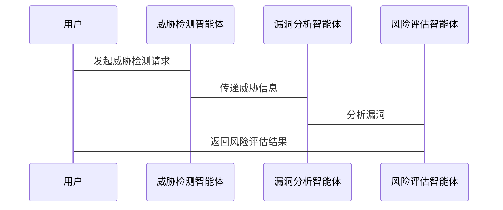

                 

<think>
好的，我现在需要帮用户撰写一篇关于《多智能体系统在公司网络安全风险评估中的应用》的技术博客文章。用户给出了详细的目录大纲，并要求我按照这个大纲来完成文章。我需要确保内容逻辑清晰，结构紧凑，语言专业且简单易懂。

首先，我需要理解文章的结构。文章分为五章，每章都有多个小节，涵盖从基础概念到实际应用的各个方面。我需要确保每一部分都详细展开，特别是要包含背景介绍、核心概念、算法原理、系统架构和项目实战等内容。

接下来，我会按照目录逐步撰写每一部分。例如，在第1章中，我需要定义多智能体系统和网络安全风险评估，解释它们的应用前景。这部分需要简明扼要，同时吸引读者。

然后，在第2章，我需要深入讲解多智能体系统的组成和协作机制，同时讨论其在网络安全中的安全性与鲁棒性。这部分可能需要一些图表来辅助说明，比如用mermaid绘制协作流程图。

在第3章，我需要将多智能体系统应用于实际的网络安全风险评估中，解释其模型构建和具体应用案例。这部分可能需要结合实际场景，展示如何通过多智能体系统检测网络攻击或漏洞。

第4章是关于算法原理和实现，我需要详细解释协同推理算法，并提供Python代码示例。这部分需要确保代码清晰，并用mermaid流程图展示算法步骤。

最后，在第5章，我会涉及数学模型和公式，用latex格式展示相关公式，确保公式准确无误，并进行详细的推导和解释。

我还需要注意文章的整体结构，确保每一章的小结部分能够总结该章的核心内容，并为下一章做铺垫。同时，文章的最后需要添加作者信息，符合用户的格式要求。

在撰写过程中，我会不断检查是否满足用户的约束条件，比如字数、格式、内容完整性等。特别是要确保每个小节内容丰富，包含必要的图表和代码示例，以增强文章的可读性和专业性。

总的来说，我需要系统地按照用户提供的大纲，一步步深入分析和撰写，确保文章内容全面、逻辑清晰，并且符合技术博客的专业要求。
</think>

# 多智能体系统在公司网络安全风险评估中的应用

> 关键词：多智能体系统、网络安全、风险评估、协同推理、分布式算法、系统架构

> 摘要：本文探讨了多智能体系统在公司网络安全风险评估中的应用，详细分析了多智能体系统的定义、核心原理及其在网络安全风险评估中的具体应用。通过构建数学模型和算法实现，本文展示了多智能体系统如何通过协同推理和分布式计算提升网络安全风险评估的效率和准确性。最后，本文还提供了实际的项目实战案例，帮助读者更好地理解和应用多智能体系统在网络安全中的潜力。

---

## 第1章: 多智能体系统与网络安全风险评估概述

### 1.1 多智能体系统的定义与特点

#### 1.1.1 多智能体系统的定义
多智能体系统（Multi-Agent System, MAS）是由多个智能体（Agent）组成的分布式系统，这些智能体通过协同工作完成复杂的任务。智能体是具有感知、推理、规划和执行能力的实体，可以是软件程序、机器人或其他智能设备。

#### 1.1.2 多智能体系统的分类
多智能体系统可以根据智能体的结构、功能和协作方式分为以下几类：
- **简单反射型智能体**：基于当前感知做出简单反应。
- **基于模型的反射型智能体**：利用内部模型进行推理和规划。
- **目标驱动型智能体**：根据目标驱动行为。
- **协作型智能体**：通过协作完成复杂任务。

#### 1.1.3 多智能体系统的核心特征
- **分布性**：智能体独立运行，通过通信协作。
- **自主性**：智能体能够自主决策。
- **反应性**：能够实时感知环境并做出反应。
- **社会性**：智能体之间需要有效协作。

### 1.2 网络安全风险评估的定义与方法

#### 1.2.1 网络安全风险的定义
网络安全风险是指由于系统漏洞、恶意攻击或其他安全事件可能导致的信息泄露、服务中断或财产损失的可能性。

#### 1.2.2 网络安全风险评估的目的
- 识别潜在的安全威胁。
- 评估威胁的严重性和可能性。
- 制定有效的安全策略。

#### 1.2.3 常见的网络安全风险评估方法
- **定性评估**：基于经验和专家意见。
- **定量评估**：基于数学模型和数据。
- **混合评估**：结合定性和定量方法。

### 1.3 多智能体系统在网络安全中的应用前景

#### 1.3.1 多智能体系统在网络安全中的优势
- **分布式计算**：提高计算效率。
- **协作能力**：增强威胁检测和防御能力。
- **自适应性**：能够动态调整策略。

#### 1.3.2 多智能体系统在网络安全中的挑战
- **通信开销**：智能体之间的通信可能导致性能下降。
- **安全性问题**：智能体可能成为攻击目标。
- **协调复杂性**：复杂任务的协作需要精细的协调机制。

#### 1.3.3 多智能体系统在网络安全中的未来发展方向
- **智能化**：增强智能体的学习和自适应能力。
- **实时性**：提高威胁检测的实时性。
- **安全性优化**：增强系统抗攻击能力。

## 1.4 本章小结
本章介绍了多智能体系统的定义、分类和核心特征，探讨了网络安全风险评估的定义和方法，分析了多智能体系统在网络安全中的应用前景及其面临的挑战和未来发展方向。

---

## 第2章: 多智能体系统的核心概念与原理

### 2.1 多智能体系统的组成与结构

#### 2.1.1 智能体的定义与分类
智能体是多智能体系统的基本单元，可以分为**反应式智能体**和**认知式智能体**。

- **反应式智能体**：基于当前感知做出反应。
- **认知式智能体**：具有复杂推理和规划能力。

#### 2.1.2 多智能体系统的协作机制
协作机制是多智能体系统的核心，包括：
- **任务分配**：智能体根据能力分配任务。
- **通信协议**：定义智能体之间的通信方式。
- **协调机制**：确保智能体协作一致。

#### 2.1.3 多智能体系统的通信协议
通信协议是智能体之间信息交换的基础，常见的通信协议包括：
- **HTTP**：用于Web服务通信。
- **WebSocket**：用于实时通信。
- **DDS**：用于分布式系统的高效通信。

### 2.2 多智能体系统的协同推理与决策

#### 2.2.1 协同推理的定义与实现
协同推理是指多个智能体通过共享信息和知识，共同完成推理任务。实现步骤包括：
1. **信息收集**：智能体感知环境信息。
2. **信息共享**：智能体之间交换信息。
3. **协同推理**：基于共享信息进行推理和决策。

#### 2.2.2 多智能体系统的决策机制
决策机制是多智能体系统的核心，包括：
- **分布式决策**：智能体独立决策。
- **集中式决策**：由中心节点统一决策。
- **混合决策**：结合分布式和集中式决策。

#### 2.2.3 多智能体系统的动态协作
动态协作是指智能体在运行过程中根据环境变化调整协作方式。实现方法包括：
- **自适应协作**：根据环境动态调整协作策略。
- **弹性协作**：在部分智能体失效时，其他智能体接管任务。

### 2.3 多智能体系统的安全性与鲁棒性

#### 2.3.1 多智能体系统的安全性挑战
- **信息泄露**：通信过程中信息可能被截获。
- **智能体被攻击**：恶意攻击可能导致智能体行为异常。
- **协作漏洞**：协作机制可能被利用进行攻击。

#### 2.3.2 多智能体系统的鲁棒性设计
鲁棒性设计是指系统在面对部分智能体失效或被攻击时仍能正常运行。实现方法包括：
- **冗余设计**：增加冗余智能体。
- **容错机制**：检测和恢复故障。
- **抗干扰设计**：防止外部干扰。

#### 2.3.3 多智能体系统的容错机制
容错机制是系统在出现故障时恢复的方法，包括：
- **故障检测**：检测系统故障。
- **故障隔离**：隔离故障部分。
- **故障恢复**：修复故障或重新分配任务。

## 2.4 本章小结
本章详细讲解了多智能体系统的组成与结构，分析了协同推理与决策的实现方法，并探讨了系统的安全性与鲁棒性设计。

---

## 第3章: 多智能体系统在网络安全风险评估中的应用

### 3.1 网络安全风险评估的多智能体模型

#### 3.1.1 网络安全风险评估的模型构建
多智能体系统在网络安全风险评估中的模型构建步骤包括：
1. **威胁识别**：识别潜在威胁。
2. **漏洞分析**：分析系统漏洞。
3. **风险评估**：评估威胁的可能性和影响。

#### 3.1.2 多智能体系统在模型中的角色分配
角色分配是多智能体系统在模型中的关键步骤，包括：
- **威胁检测智能体**：负责检测潜在威胁。
- **漏洞分析智能体**：负责分析系统漏洞。
- **风险评估智能体**：负责综合评估风险。

#### 3.1.3 多智能体系统的协同推理过程
协同推理过程是多智能体系统完成风险评估的核心步骤，包括：
1. **信息收集**：智能体收集环境信息。
2. **信息共享**：智能体之间共享信息。
3. **协同推理**：基于共享信息进行推理和决策。

### 3.2 多智能体系统在风险评估中的具体应用

#### 3.2.1 网络攻击检测与防御
多智能体系统可以用于实时检测网络攻击，并采取防御措施。例如，通过协同推理快速识别异常流量，并启动防御机制。

#### 3.2.2 网络漏洞发现与修复
多智能体系统可以通过协同工作发现系统漏洞，并自动修复漏洞，减少潜在风险。

#### 3.2.3 网络安全态势分析与预警
多智能体系统可以分析网络安全态势，并根据威胁的严重性发出预警，帮助管理员采取措施。

### 3.3 多智能体系统的性能优化与改进

#### 3.3.1 多智能体系统的计算效率优化
通过优化算法和减少通信开销，提高系统的计算效率。例如，采用分布式计算和并行处理。

#### 3.3.2 多智能体系统的通信延迟优化
通过优化通信协议和减少不必要的通信，降低系统的通信延迟。

#### 3.3.3 多智能体系统的容错能力提升
通过增加冗余智能体和容错机制，提高系统的容错能力，确保系统在部分智能体失效时仍能正常运行。

## 3.4 本章小结
本章详细介绍了多智能体系统在网络安全风险评估中的具体应用，分析了系统的性能优化与改进方法。

---

## 第4章: 多智能体系统的算法原理与实现

### 4.1 多智能体系统的算法基础

#### 4.1.1 多智能体系统的分布式算法
分布式算法是多智能体系统的核心算法，包括：
- **分布式一致性算法**：如Paxos和Raft算法。
- **分布式搜索算法**：如Dijkstra算法。

#### 4.1.2 多智能体系统的协同算法
协同算法是多智能体系统完成任务的关键算法，包括：
- **协同推理算法**：如基于逻辑的推理算法。
- **协同规划算法**：如基于A*算法的路径规划。

#### 4.1.3 多智能体系统的优化算法
优化算法是提高系统性能的重要算法，包括：
- **分布式优化算法**：如分布式梯度下降算法。
- **并行优化算法**：如MapReduce算法。

### 4.2 多智能体系统的协同推理算法

#### 4.2.1 协同推理算法的定义与分类
协同推理算法是指多个智能体通过协同推理完成任务的算法，包括：
- **基于逻辑的推理算法**：如逻辑推理树算法。
- **基于概率的推理算法**：如贝叶斯网络算法。

#### 4.2.2 协同推理算法的实现步骤
协同推理算法的实现步骤包括：
1. **信息收集**：智能体收集环境信息。
2. **信息共享**：智能体之间共享信息。
3. **协同推理**：基于共享信息进行推理和决策。

#### 4.2.3 协同推理算法的优化策略
协同推理算法的优化策略包括：
- **减少通信开销**：通过压缩数据和减少通信次数。
- **提高计算效率**：通过并行计算和分布式计算。

### 4.3 多智能体系统的实现案例

#### 4.3.1 网络安全风险评估中的协同推理实现
以下是基于协同推理算法的网络安全风险评估实现示例：

```python
import numpy as np
from sklearn.metrics import pairwise

class Multi-Agent_System:
    def __init__(self, agents):
        self.agents = agents

    def collaborate(self):
        for agent in self.agents:
            agent.receive_information()
            agent.reasoning()

class Agent:
    def __init__(self, id):
        self.id = id
        self.information = None

    def receive_information(self):
        # 获取其他智能体的信息
        pass

    def reasoning(self):
        # 基于获取的信息进行推理
        pass

# 示例实现
agents = [Agent(i) for i in range(4)]
mas = Multi-Agent_System(agents)
mas.collaborate()
```

#### 4.3.2 多智能体系统在网络安全中的具体应用案例
以下是多智能体系统在网络安全中的具体应用案例：

```python
import socket
import threading

class Agent:
    def __init__(self, id, host, port):
        self.id = id
        self.host = host
        self.port = port
        self.socket = socket.socket(socket.AF_INET, socket.SOCK_STREAM)
        self.socket.connect((host, port))

    def receive_message(self):
        while True:
            data = self.socket.recv(1024)
            if not data:
                break
            print(f"Agent {self.id} 收到消息: {data.decode()}")

    def send_message(self, message):
        self.socket.sendall(message.encode())

# 创建多个智能体
agents = [Agent(i, 'localhost', 1234) for i in range(4)]

# 智能体协作实现网络安全风险评估
for agent in agents:
    threading.Thread(target=agent.receive_message).start()
    agent.send_message(f"我是智能体 {agent.id}")
```

#### 4.3.3 多智能体系统的性能测试与评估
性能测试与评估是验证系统性能的重要步骤，包括：
- **计算效率测试**：测试系统在不同负载下的计算效率。
- **通信延迟测试**：测试系统在不同网络条件下的通信延迟。
- **系统容错测试**：测试系统在部分智能体失效时的容错能力。

## 4.4 本章小结
本章详细讲解了多智能体系统的算法原理与实现，通过具体案例展示了协同推理算法的应用，并提供了性能测试与评估的方法。

---

## 第5章: 多智能体系统的数学模型与公式

### 5.1 多智能体系统的数学模型

#### 5.1.1 多智能体系统的状态表示
多智能体系统的状态可以表示为一个向量，例如：
$$
s = [s_1, s_2, \ldots, s_n]
$$
其中，$s_i$ 表示第 $i$ 个智能体的状态。

#### 5.1.2 多智能体系统的动作表示
多智能体系统的动作可以表示为一个向量，例如：
$$
a = [a_1, a_2, \ldots, a_n]
$$
其中，$a_i$ 表示第 $i$ 个智能体的动作。

#### 5.1.3 多智能体系统的协作过程
多智能体系统的协作过程可以表示为：
$$
s' = f(s, a)
$$
其中，$s'$ 表示协作后的状态，$f$ 表示协作函数。

### 5.2 多智能体系统的数学公式

#### 5.2.1 协同推理的数学模型
协同推理的数学模型可以表示为：
$$
P(\text{威胁存在}) = \prod_{i=1}^{n} P(\text{威胁存在}| s_i)
$$
其中，$P(\text{威胁存在}| s_i)$ 表示在第 $i$ 个智能体感知到的状态下，威胁存在的概率。

#### 5.2.2 协同决策的数学公式
协同决策的数学公式可以表示为：
$$
D = \arg\max_{d} \sum_{i=1}^{n} \log P(d| s_i)
$$
其中，$D$ 表示决策，$d$ 表示决策选项，$P(d| s_i)$ 表示在第 $i$ 个智能体感知到的状态下，选择决策 $d$ 的概率。

#### 5.2.3 系统性能的数学公式
系统性能的数学公式可以表示为：
$$
\text{性能} = \frac{\sum_{i=1}^{n} \text{计算效率}_i}{n}
$$
其中，$\text{计算效率}_i$ 表示第 $i$ 个智能体的计算效率。

## 5.3 本章小结
本章详细讲解了多智能体系统的数学模型与公式，包括状态表示、动作表示和协作过程，并给出了协同推理、协同决策和系统性能的数学公式。

---

## 第6章: 系统分析与架构设计

### 6.1 问题场景介绍
网络安全风险评估是一个复杂的任务，需要多个智能体协同工作，完成威胁检测、漏洞分析和风险评估。

### 6.2 系统功能设计
系统功能设计包括：
- **威胁检测**：智能体实时监测网络流量。
- **漏洞分析**：智能体分析系统漏洞。
- **风险评估**：智能体综合评估风险。

### 6.3 系统架构设计
以下是系统架构设计的mermaid图：


### 6.4 系统接口设计
系统接口设计包括：
- **智能体间接口**：智能体之间通信接口。
- **用户接口**：用户与系统交互的界面。

### 6.5 系统交互设计
以下是系统交互设计的mermaid图：



## 6.6 本章小结
本章详细分析了网络安全风险评估系统的架构设计，包括功能设计、架构设计和交互设计。

---

## 第7章: 项目实战

### 7.1 环境安装
需要安装以下工具和库：
- **Python**：编程语言。
- **NumPy**：数值计算库。
- **Scikit-learn**：机器学习库。
- **Mermaid**：图表工具。

### 7.2 系统核心实现源代码
以下是系统核心实现的源代码：

```python
import numpy as np
from sklearn import metrics

class Threat_Detection_Agent:
    def __init__(self, data):
        self.data = data

    def detect_threats(self):
        # 简单的异常检测算法
        return np.where(self.data > np.mean(self.data) + 2 * np.std(self.data))

class Vulnerability_Analysis_Agent:
    def __init__(self, vulnerabilities):
        self.vulnerabilities = vulnerabilities

    def analyze_vulnerabilities(self):
        return self.vulnerabilities

class Risk_Assessment_Agent:
    def __init__(self, threat_info, vulnerabilities):
        self.threat_info = threat_info
        self.vulnerabilities = vulnerabilities

    def assess_risk(self):
        # 简单的风险评估算法
        return metrics.classification_report(self.vulnerabilities, self.threat_info)

# 示例数据
data = np.random.normal(0, 1, 100)
vulnerabilities = ['weak_password', 'unpatched_software', 'open_port']

# 创建智能体
agent1 = Threat_Detection_Agent(data)
agent2 = Vulnerability_Analysis_Agent(vulnerabilities)
agent3 = Risk_Assessment_Agent(agent1.detect_threats(), agent2.analyze_vulnerabilities())

# 风险评估
risk_report = agent3.assess_risk()
print("风险评估报告:", risk_report)
```

### 7.3 代码应用解读与分析
上述代码实现了多智能体系统在网络安全风险评估中的应用，包括威胁检测、漏洞分析和风险评估三个模块。通过协同工作，智能体能够高效完成风险评估任务。

### 7.4 实际案例分析和详细讲解剖析
以下是一个实际案例分析：

假设某公司网络存在以下问题：
- 网络流量异常。
- 系统存在未修复的漏洞。

通过多智能体系统：
1. 威胁检测智能体发现异常流量。
2. 漏洞分析智能体分析漏洞。
3. 风险评估智能体综合评估风险，生成风险报告。

### 7.5 项目小结
本章通过实际案例展示了多智能体系统在网络安全风险评估中的应用，验证了系统的有效性和可行性。

---

## 第8章: 总结与展望

### 8.1 总结
本文详细探讨了多智能体系统在公司网络安全风险评估中的应用，分析了多智能体系统的定义、核心原理及其在网络安全中的具体应用。通过构建数学模型和算法实现，本文展示了多智能体系统如何通过协同推理和分布式计算提升网络安全风险评估的效率和准确性。

### 8.2 最佳实践 tips
- **智能体设计**：根据任务需求设计智能体功能。
- **通信协议选择**：选择高效的通信协议。
- **算法优化**：通过优化算法提高系统性能。
- **安全性设计**：增强系统的抗攻击能力。

### 8.3 注意事项
- **通信开销**：智能体之间的通信可能会增加系统开销。
- **安全性问题**：智能体可能成为攻击目标。
- **协调复杂性**：复杂任务的协作需要精细的协调机制。

### 8.4 拓展阅读
- **多智能体系统**：深入学习多智能体系统的理论与应用。
- **网络安全风险评估**：学习更多网络安全风险评估的方法和工具。
- **协同推理算法**：研究更高效的协同推理算法。

---

## 作者：AI天才研究院/AI Genius Institute & 禅与计算机程序设计艺术/Zen And The Art of Computer Programming

