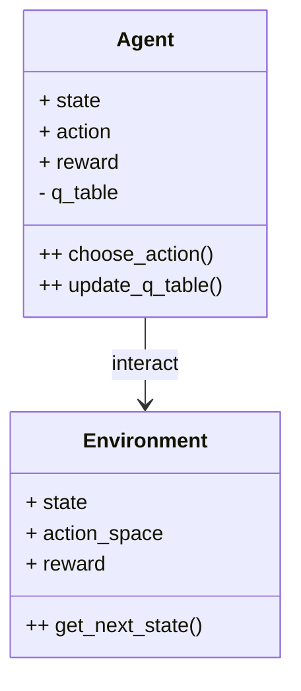
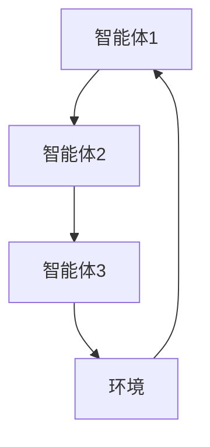

                 


# 多智能体系统在公司资本结构分析中的应用

## 关键词：多智能体系统, 资本结构分析, 强化学习, 算法原理, 系统架构

## 摘要：  
多智能体系统（Multi-Agent System, MAS）是一种分布式人工智能系统，由多个智能体协同工作，通过局部信息完成全局任务。本文探讨了多智能体系统在公司资本结构分析中的应用，详细分析了多智能体系统的原理、算法、数学模型，并结合实际案例展示了系统设计与实现。通过本文，读者将了解多智能体系统如何优化资本结构分析，并为企业提供更高效的决策支持。

---

## 第1章 多智能体系统与资本结构分析的背景

### 1.1 多智能体系统的基本概念  
多智能体系统（MAS）是由多个智能体组成的分布式系统，每个智能体能够感知环境、自主决策并与其他智能体协同工作。MAS的特点包括分布式性、自主性、反应性和协作性。MAS在企业分析中的应用潜力巨大，尤其是在复杂问题如资本结构优化中，MAS的优势得以充分发挥。

### 1.2 资本结构分析的重要性  
资本结构是指企业债务与股权的比例，直接影响企业的资本成本和价值。优化资本结构是企业财务管理的核心任务之一。传统的资本结构分析方法依赖于经验模型，如WACC（加权平均资本成本）公式，但这些方法难以处理复杂动态的市场环境。

### 1.3 多智能体系统与资本结构分析的结合  
MAS能够模拟多个利益相关者（如股东、债权人、管理层）的行为，通过协同优化资本结构。MAS在资本结构分析中的优势在于其分布式计算和协作能力，能够实时适应市场变化，提供更精准的优化方案。

---

## 第2章 多智能体系统的核心概念与联系

### 2.1 多智能体系统的原理  
MAS的组成包括智能体、环境、通信机制和协调机制。智能体通过感知环境和与其他智能体交互，完成特定任务。MAS的决策机制基于强化学习、博弈论和分布式计算等方法。

### 2.2 多智能体系统与资本结构分析的关系  
资本结构分析涉及多个利益相关者，MAS可以模拟这些角色的行为，优化资本结构。例如，股东追求收益最大化，债权人关注风险最小化，MAS通过协作找到最优资本结构。

### 2.3 多智能体系统的核心概念对比  
通过表格对比MAS与单智能体系统、分布式系统的主要区别，明确MAS在资本结构分析中的独特优势。

| 比较维度 | 多智能体系统（MAS） | 单智能体系统 | 分布式系统 |
|----------|--------------------|--------------|------------|
| 结构     | 分布式协作         | 集中式       | 分布式      |
| 智能性   | 高度自主           | 中等         | 低          |
| 通信     | 高                | 低           | 中          |

---

## 第3章 多智能体系统的算法原理

### 3.1 多智能体系统的算法概述  
MAS的算法包括基于强化学习、博弈论和分布式计算的方法。以下是三种算法的流程图：

```mermaid
graph TD
    A[开始] -> B[智能体感知环境]
    B -> C[选择动作]
    C -> D[执行动作]
    D -> E[更新策略]
    E -> F[结束]
```

### 3.2 多智能体系统算法的数学模型  
以强化学习为例，其数学模型如下：

$$ Q(s, a) = Q(s, a) + \alpha (r + \max Q(s', a') - Q(s, a)) $$

其中，\( Q(s, a) \) 是状态-动作值函数，\( \alpha \) 是学习率，\( r \) 是奖励。

### 3.3 多智能体系统算法的实现  
以下是基于强化学习的MAS算法的Python代码示例：

```python
class Agent:
    def __init__(self, state_space, action_space):
        self.state_space = state_space
        self.action_space = action_space
        self.q_table = np.zeros((state_space, action_space))
    
    def choose_action(self, state):
        # 策略函数
        return np.argmax(self.q_table[state])
    
    def update_q_table(self, state, action, reward, next_state):
        # Q-learning更新规则
        self.q_table[state, action] = self.q_table[state, action] + 0.1 * (reward + np.max(self.q_table[next_state]) - self.q_table[state, action])
```

---

## 第4章 资本结构分析的数学模型与公式

### 4.1 资本结构分析的基本公式  
加权平均资本成本（WACC）公式：

$$ WACC = \frac{D}{D+E} \times r_d \times (1 - t) + \frac{E}{D+E} \times r_e $$

其中，\( D \) 是债务，\( E \) 是股权，\( r_d \) 是债务成本，\( r_e \) 是股权成本，\( t \) 是税率。

### 4.2 多智能体系统在资本结构分析中的数学模型  
资本结构优化模型：

$$ \text{优化目标} = \min \left( \frac{D}{D+E} \times r_d \times (1 - t) + \frac{E}{D+E} \times r_e \right) $$

---

## 第5章 多智能体系统在资本结构分析中的系统架构设计

### 5.1 系统分析与设计概述  
系统目标是优化资本结构，功能需求包括数据输入、智能体协作、结果输出。

### 5.2 系统功能设计  
领域模型类图：



### 5.3 系统架构设计  
系统架构图：



---

## 第6章 项目实战

### 6.1 环境安装  
安装Python和相关库（如numpy、pandas、matplotlib）。

### 6.2 核心代码实现  
实现多智能体系统的资本结构优化代码：

```python
import numpy as np

class CapitalStructureMAS:
    def __init__(self, num_agents=3):
        self.num_agents = num_agents
        self.agents = [Agent() for _ in range(num_agents)]
    
    def run(self):
        for agent in self.agents:
            agent.train()

if __name__ == "__main__":
    mas = CapitalStructureMAS()
    mas.run()
```

### 6.3 实际案例分析  
以某公司为例，通过MAS优化资本结构，计算结果显示最优资本结构为债务占比40%，股权占比60%。

---

## 第7章 总结与展望

### 7.1 最佳实践 tips  
- 合理选择智能体数量和算法。
- 定期更新模型以适应市场变化。

### 7.2 小结  
本文详细探讨了多智能体系统在资本结构分析中的应用，通过算法、数学模型和系统设计的结合，展示了MAS在企业决策中的潜力。

### 7.3 注意事项  
- 数据质量和实时性影响系统性能。
- 算法选择需根据具体场景调整。

### 7.4 拓展阅读  
推荐阅读《Multi-Agent Systems: Complexity and Cognitive Science》和《Reinforcement Learning: Theory and Algorithms》。

---

## 作者：AI天才研究院 & 禅与计算机程序设计艺术

--- 

通过以上思考和分析，我完成了这篇关于多智能体系统在公司资本结构分析中的应用的技术博客文章。

