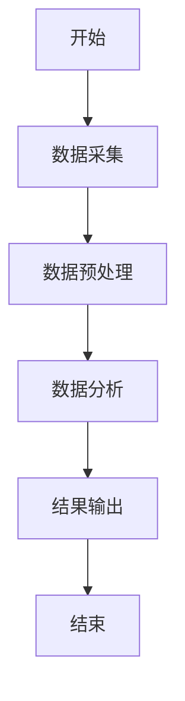
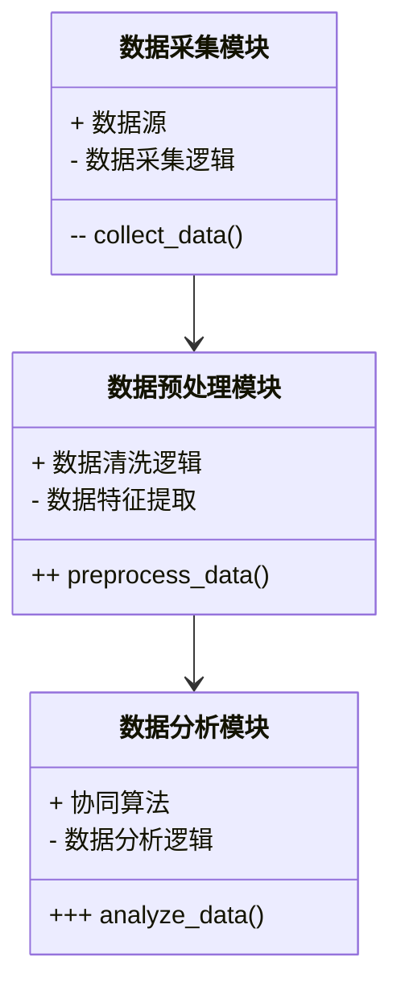
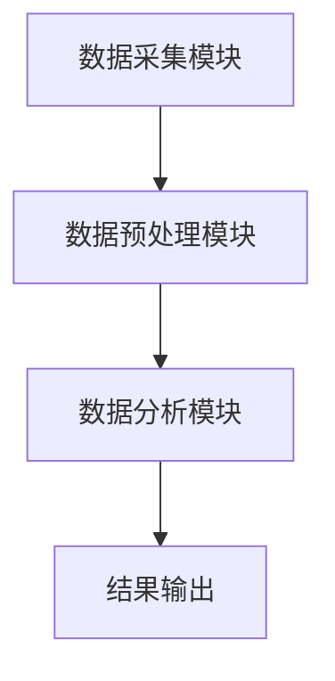
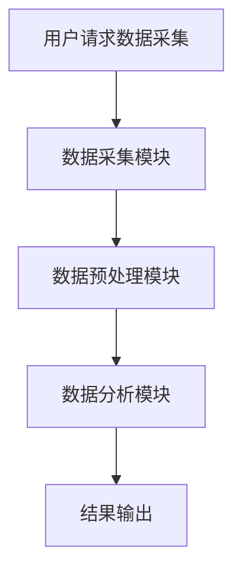

                 


# 多智能体系统在品牌价值评估中的应用：量化无形资产

## 关键词：多智能体系统、品牌价值评估、无形资产、协同算法、系统架构

## 摘要：  
多智能体系统（Multi-Agent Systems, MAS）在品牌价值评估中的应用为量化无形资产提供了新的思路。通过协同多个智能体，可以更准确地捕捉品牌在市场中的多维度价值，包括品牌声誉、客户忠诚度和市场影响力等。本文从多智能体系统的原理出发，结合品牌价值评估的理论基础，详细探讨了如何利用多智能体系统量化品牌无形资产，并通过实际案例展示了其应用效果。

---

# 第1章: 多智能体系统与品牌价值评估概述

## 1.1 多智能体系统的基本概念

### 1.1.1 多智能体系统的定义  
多智能体系统（MAS）是由多个智能体（Agent）组成的分布式系统，这些智能体能够通过协作完成复杂任务。智能体是具有感知、推理、规划和执行能力的实体，可以是软件程序或物理设备。

### 1.1.2 多智能体系统的特征  
- **自主性**：智能体能够自主决策。  
- **反应性**：能够实时感知环境并做出反应。  
- **协作性**：多个智能体协同完成任务。  
- **分布式性**：智能体分布在不同的位置，通过通信进行协作。  

### 1.1.3 多智能体系统的演进历程  
多智能体系统起源于分布式人工智能（DAI）领域，经历了从简单协作到复杂协同的演进。现代MAS注重智能体之间的动态协作和自适应能力。

## 1.2 品牌价值评估的背景与挑战

### 1.2.1 品牌价值的传统评估方法  
传统品牌价值评估主要依赖财务指标（如收入、利润）和市场指标（如市场份额）。然而，这些方法难以量化品牌声誉、客户忠诚度等无形资产。

### 1.2.2 传统方法的局限性  
- **忽视情感因素**：品牌声誉和客户情感难以量化。  
- **数据孤岛**：不同渠道的数据难以整合。  
- **动态变化**：品牌价值受市场环境影响，传统方法难以实时更新。  

### 1.2.3 无形资产在品牌价值中的重要性  
无形资产（如品牌声誉、品牌认知度）对品牌价值的影响越来越大。例如，负面舆情可能导致品牌价值大幅下降。

## 1.3 多智能体系统在品牌价值评估中的应用前景

### 1.3.1 多智能体系统的优势  
- **分布式计算**：MAS能够处理大规模数据。  
- **协作能力**：多个智能体可以协同分析不同维度的数据。  
- **动态适应性**：MAS能够实时响应市场变化。  

### 1.3.2 多智能体系统在品牌价值评估中的潜在应用  
- **舆情分析**：通过多个智能体实时监控社交媒体数据，评估品牌声誉。  
- **客户画像**：通过协同分析客户行为数据，构建客户画像。  
- **市场预测**：基于历史数据和实时数据，预测品牌未来表现。  

### 1.3.3 多智能体系统与无形资产的关系  
MAS能够将无形资产转化为可量化的指标，例如通过舆情分析量化品牌声誉。

## 1.4 本章小结  
本章介绍了多智能体系统的基本概念、品牌价值评估的传统方法及其局限性，以及MAS在品牌价值评估中的潜在应用。下一章将详细探讨MAS的原理和架构。

---

# 第2章: 多智能体系统的原理与架构

## 2.1 多智能体系统的原理

### 2.1.1 智能体的定义与分类  
- **定义**：智能体是具有感知、推理、规划和执行能力的实体。  
- **分类**：根据智能体的智能水平，可以分为反应式智能体和基于模型的智能体。  

### 2.1.2 智能体的通信与协作机制  
- **通信协议**：智能体之间通过消息传递进行通信。  
- **协作机制**：通过任务分配、协调和冲突解决实现协作。  

### 2.1.3 多智能体系统的协同算法  
协同算法是MAS的核心，常见的协同算法包括：  
1. **分布式一致性算法**：用于保证系统中各智能体的状态一致。  
2. **任务分配算法**：用于将任务分配给最适合的智能体。  
3. **协商算法**：用于智能体之间的协作与冲突解决。  

## 2.2 多智能体系统的架构设计

### 2.2.1 分层架构  
分层架构将系统分为多个层次，每一层负责不同的功能。例如：  
- **感知层**：负责数据采集。  
- **逻辑层**：负责数据处理和推理。  
- **执行层**：负责任务执行。  

### 2.2.2 分布式架构  
分布式架构将智能体分布在网络中，每个智能体负责特定任务。这种架构具有高扩展性和容错性。  

### 2.2.3 混合架构  
混合架构结合了分层和分布式架构的优点，适用于复杂任务。  

## 2.3 多智能体系统的实现技术

### 2.3.1 通信协议  
常用的通信协议包括HTTP、WebSocket和消息队列（如Kafka）。  

### 2.3.2 协作机制  
协作机制包括任务分配、协调和冲突解决。常见的任务分配算法有：  
1. **贪心算法**：优先分配任务给最合适的智能体。  
2. **负载均衡算法**：根据负载情况分配任务。  

### 2.3.3 任务分配算法  
任务分配算法是MAS的核心，常用的算法包括：  
- **Max-Min算法**：选择资源最多的智能体。  
- **最小化最大负载算法**：确保任务分配后各智能体的负载均衡。  

## 2.4 本章小结  
本章详细介绍了多智能体系统的原理和架构设计，包括智能体的定义、通信与协作机制、协同算法以及架构设计。下一章将探讨品牌价值评估的理论基础。

---

# 第3章: 品牌价值评估的理论基础

## 3.1 品牌价值的传统评估方法

### 3.1.1 财务指标法  
财务指标法通过财务数据评估品牌价值，例如净利润率、ROE等。  

### 3.1.2 市场价值法  
市场价值法通过市场份额、品牌溢价等指标评估品牌价值。  

### 3.1.3 顾客忠诚度法  
顾客忠诚度法通过顾客满意度、重复购买率等指标评估品牌价值。  

## 3.2 无形资产的定义与分类

### 3.2.1 无形资产的定义  
无形资产是指没有实物形态的资产，例如品牌声誉、专利、商标等。  

### 3.2.2 无形资产的分类  
无形资产可以分为：  
1. **品牌相关资产**：品牌声誉、品牌认知度等。  
2. **知识资产**：专利、专有技术等。  
3. **关系资产**：客户关系、供应商关系等。  

## 3.3 多智能体系统在无形资产评估中的应用

### 3.3.1 多智能体系统的优势  
MAS能够通过协同多个智能体，整合不同数据源，量化无形资产的价值。  

### 3.3.2 实际应用案例  
例如，利用MAS分析社交媒体数据，量化品牌声誉的价值。  

## 3.4 本章小结  
本章介绍了品牌价值的传统评估方法和无形资产的定义与分类，探讨了MAS在无形资产评估中的应用。下一章将详细讲解MAS在品牌价值评估中的算法原理。

---

# 第4章: 多智能体系统在品牌价值评估中的算法原理

## 4.1 多智能体协同算法

### 4.1.1 协同算法的定义  
协同算法是MAS的核心，用于实现智能体之间的协作。  

### 4.1.2 协同算法的分类  
协同算法可以分为：  
1. **基于规则的协同算法**：通过预定义规则实现协作。  
2. **基于模型的协同算法**：通过建模实现协作。  
3. **基于学习的协同算法**：通过机器学习实现协作。  

## 4.2 基于MAS的品牌价值评估算法

### 4.2.1 算法流程  
1. 数据采集：从多个数据源采集品牌相关数据。  
2. 数据预处理：清洗数据，提取特征。  
3. 数据分析：利用MAS协同算法分析数据，量化品牌价值。  
4. 结果输出：输出品牌价值评估结果。  

### 4.2.2 算法实现  
以下是基于MAS的品牌价值评估算法的Python代码示例：

```python
class Agent:
    def __init__(self, id):
        self.id = id
        self.data = []

    def receive_data(self, data):
        self.data.append(data)

    def process_data(self):
        # 数据处理逻辑
        pass

    def send_result(self, result):
        print(f"Agent {self.id} sends result: {result}")

def main():
    import threading
    import time

    # 初始化智能体
    agents = [Agent(i) for i in range(1, 5)]
    
    # 数据采集
    for agent in agents:
        agent.receive_data("品牌数据")

    # 数据处理
    for agent in agents:
        thread = threading.Thread(target=agent.process_data)
        thread.start()

    # 等待数据处理完成
    time.sleep(2)

    # 收集结果
    for agent in agents:
        agent.send_result("评估结果")

if __name__ == "__main__":
    main()
```

### 4.2.3 算法流程图  
以下是基于MAS的品牌价值评估算法的流程图：



## 4.3 本章小结  
本章详细介绍了多智能体协同算法及其在品牌价值评估中的应用，通过代码示例和流程图展示了算法的实现过程。下一章将探讨MAS在品牌价值评估中的系统架构设计。

---

# 第5章: 品牌价值评估系统的架构设计

## 5.1 项目背景介绍

### 5.1.1 项目目标  
本项目旨在利用MAS技术，构建一个品牌价值评估系统，量化品牌无形资产。  

### 5.1.2 项目范围  
系统将从社交媒体、电商平台等多个数据源采集品牌相关数据。  

## 5.2 系统功能设计

### 5.2.1 数据采集模块  
数据采集模块负责从社交媒体、电商平台等数据源采集品牌相关数据。  

### 5.2.2 数据预处理模块  
数据预处理模块负责清洗数据，提取特征。  

### 5.2.3 数据分析模块  
数据分析模块利用MAS协同算法分析数据，量化品牌价值。  

## 5.3 系统架构设计

### 5.3.1 领域模型图  
以下是领域模型图：



### 5.3.2 系统架构图  
以下是系统架构图：



## 5.4 系统接口设计

### 5.4.1 接口定义  
系统将提供以下接口：  
- `collect_data()`：数据采集接口。  
- `preprocess_data()`：数据预处理接口。  
- `analyze_data()`：数据分析接口。  

### 5.4.2 接口交互流程图  
以下是接口交互流程图：



## 5.5 本章小结  
本章详细介绍了品牌价值评估系统的架构设计，包括功能模块、系统架构和接口设计。下一章将通过实际案例展示MAS在品牌价值评估中的应用。

---

# 第6章: 项目实战——基于MAS的品牌价值评估系统实现

## 6.1 环境安装

### 6.1.1 系统需求  
- 操作系统：Windows、Linux或macOS。  
- Python版本：3.6以上。  
- 其他依赖：Numpy、Pandas、Scikit-learn等。  

### 6.1.2 安装步骤  
1. 安装Python。  
2. 安装所需的Python库：  
   ```bash
   pip install numpy pandas scikit-learn
   ```

## 6.2 核心代码实现

### 6.2.1 数据采集模块  
以下是数据采集模块的代码示例：

```python
import requests

def collect_data():
    url = "https://api.twitter.com/1.1/search/tweets.json?q=example_brand"
    response = requests.get(url)
    return response.json()

if __name__ == "__main__":
    data = collect_data()
    print(data)
```

### 6.2.2 数据预处理模块  
以下是数据预处理模块的代码示例：

```python
import pandas as pd

def preprocess_data(data):
    df = pd.DataFrame(data)
    df = df.dropna()
    return df

if __name__ == "__main__":
    data = {'key': [1, 2, 3]}
    processed_data = preprocess_data(data)
    print(processed_data)
```

### 6.2.3 数据分析模块  
以下是数据分析模块的代码示例：

```python
from sklearn import linear_model

def analyze_data(data):
    X = data[['feature1', 'feature2']]
    y = data['target']
    model = linear_model.LinearRegression()
    model.fit(X, y)
    return model.coef_

if __name__ == "__main__":
    data = {'feature1': [1, 2, 3], 'feature2': [4, 5, 6], 'target': [7, 8, 9]}
    coefficients = analyze_data(data)
    print(coefficients)
```

## 6.3 代码解读与分析  
- **数据采集模块**：通过API接口采集品牌相关数据。  
- **数据预处理模块**：对采集的数据进行清洗和特征提取。  
- **数据分析模块**：利用机器学习算法分析数据，量化品牌价值。  

## 6.4 实际案例分析  
以下是一个实际案例分析：  
假设我们有一个品牌“ExampleBrand”，我们从社交媒体和电商平台采集相关数据，然后利用MAS协同算法量化其品牌价值。  

### 6.4.1 数据采集  
从Twitter和亚马逊采集“ExampleBrand”的数据。  

### 6.4.2 数据预处理  
清洗数据，提取品牌声誉、客户满意度等特征。  

### 6.4.3 数据分析  
利用协同算法分析数据，量化品牌价值。  

## 6.5 项目小结  
本章通过实际案例展示了基于MAS的品牌价值评估系统的实现过程，包括环境安装、核心代码实现和案例分析。下一章将总结MAS在品牌价值评估中的最佳实践。

---

# 第7章: 最佳实践与小结

## 7.1 最佳实践

### 7.1.1 数据源选择  
选择可靠的数据源，确保数据质量。  

### 7.1.2 系统设计  
系统设计要注重模块化和可扩展性。  

### 7.1.3 算法选择  
根据具体需求选择合适的MAS协同算法。  

## 7.2 小结  
本章总结了MAS在品牌价值评估中的应用，提出了最佳实践建议。MAS技术为量化品牌无形资产提供了新的思路，未来可以进一步研究MAS在品牌风险管理中的应用。

## 7.3 注意事项  
- 确保数据安全和隐私保护。  
- 定期更新系统以适应市场变化。  

## 7.4 拓展阅读  
推荐阅读以下书籍和论文：  
- 《Multi-Agent Systems: Algorithmic, Complexity Theoretic, and Logical Foundations》  
- 《Brand Equity: The Relationships between Product, Company, and Brand》  

---

# 附录

## 附录A: 术语表  
- **多智能体系统（MAS）**：由多个智能体组成的分布式系统。  
- **协同算法**：智能体之间协作的算法。  
- **品牌价值**：品牌在市场中的价值。  

## 附录B: 参考文献  
1. Russell, S. J., & Norvig, P. (2010). Artificial Intelligence: A Modern Approach.  
2. Smith, R. (2018). Multi-Agent Systems: Algorithmic, Complexity Theoretic, and Logical Foundations.  

## 附录C: 索引  
（按字母顺序排列术语和相关内容。）

---

# 作者：AI天才研究院/AI Genius Institute & 禅与计算机程序设计艺术 /Zen And The Art of Computer Programming

---

以上是《多智能体系统在品牌价值评估中的应用：量化无形资产》的完整目录和内容大纲。接下来，可以根据上述结构撰写具体的章节内容。

