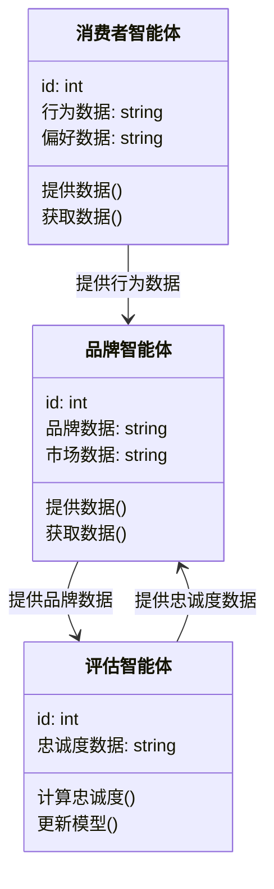
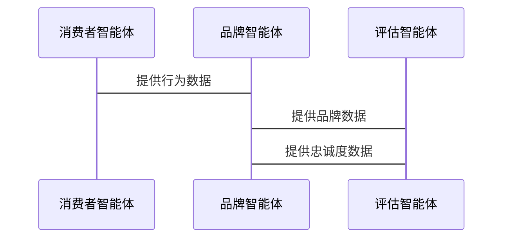

                 


# 多智能体系统在品牌忠诚度动态评估中的应用

## 关键词：
多智能体系统、品牌忠诚度、动态评估、协同学习、实时反馈

## 摘要：
本文探讨了多智能体系统（MAS）在品牌忠诚度动态评估中的应用，详细分析了MAS的核心概念、品牌忠诚度评估的需求，以及两者的结合方式。通过算法原理、系统架构设计和项目实战，展示了如何利用MAS实现品牌忠诚度的动态评估，提供了实时反馈和多维度分析的能力。本文还讨论了MAS的优势、局限性及未来研究方向。

---

# 第一部分: 多智能体系统与品牌忠诚度评估基础

## 第1章: 多智能体系统概述

### 1.1 多智能体系统的基本概念

#### 1.1.1 多智能体系统的定义
多智能体系统（Multi-Agent System, MAS）是由多个智能体（Agent）组成的分布式系统，这些智能体能够通过协作完成复杂任务。智能体是具有感知环境、自主决策和行动能力的实体，可以是软件程序或物理设备。

#### 1.1.2 多智能体系统的体系结构
MAS的体系结构主要分为**集中式**和**分布式**两种：
- **集中式MAS**：有一个中央协调器，负责分配任务和协调智能体的行动。
- **分布式MAS**：智能体之间直接通信，无中央协调器。

#### 1.1.3 多智能体系统的分类与特点
- **反应式MAS**：基于当前环境状态做出反应。
- **认知MAS**：具有推理和规划能力，能够理解复杂任务。
- **分布式MAS**：智能体之间通过通信协作完成任务。

MAS的特点包括：
1. **分布式智能**：任务由多个智能体协作完成。
2. **自主性**：智能体能够自主决策。
3. **动态性**：系统能够适应环境变化。

### 1.2 多智能体系统的核心原理

#### 1.2.1 分布式智能与协作机制
MAS通过智能体之间的协作实现复杂任务。协作机制包括：
- **任务分配**：智能体根据自身能力和环境状态分配任务。
- **通信协议**：智能体之间通过通信协议交换信息。
- **协调机制**：通过协商解决冲突，确保协作顺利进行。

#### 1.2.2 智能体之间的通信与协调
通信与协调是MAS的核心。智能体通过**消息传递**或**共享知识库**进行通信，确保协作顺利。协调机制包括：
- **同步**：确保所有智能体在同一时间点行动。
- **协商**：智能体通过协商解决任务分配冲突。

#### 1.2.3 多智能体系统的动态适应性
MAS能够根据环境变化动态调整行为。动态适应性体现在：
- **自适应算法**：智能体能够根据环境变化调整策略。
- **容错性**：系统能够在部分智能体故障时继续运行。

### 1.3 多智能体系统的应用领域

#### 1.3.1 电子商务中的应用
MAS在电子商务中的应用包括：
- **推荐系统**：智能体根据用户行为推荐商品。
- **供应链管理**：智能体协作优化库存和物流。

#### 1.3.2 社交网络中的应用
MAS在社交网络中的应用包括：
- **信息传播**：智能体协作传播信息。
- **社群分析**：智能体分析社群结构和影响力。

#### 1.3.3 品牌忠诚度评估中的应用
MAS在品牌忠诚度评估中的应用包括：
- **消费者行为建模**：智能体模拟消费者行为。
- **品牌互动网络构建**：智能体分析品牌与消费者之间的互动。

---

## 第2章: 品牌忠诚度评估的背景与挑战

### 2.1 品牌忠诚度的定义与影响因素

#### 2.1.1 品牌忠诚度的定义
品牌忠诚度是指消费者对某一品牌产品的偏好程度。忠诚的消费者会在多个品牌中选择该品牌，即使面临竞争产品或价格变化。

#### 2.1.2 影响品牌忠诚度的主要因素
影响品牌忠诚度的因素包括：
1. **产品质量**：产品质量直接影响消费者满意度。
2. **品牌认知**：消费者对品牌的认知和形象影响忠诚度。
3. **服务体验**：优质的客户服务能提升品牌忠诚度。
4. **价格敏感性**：价格变化对忠诚度的影响因消费者而异。
5. **竞争环境**：市场竞争的激烈程度也会影响忠诚度。

#### 2.1.3 品牌忠诚度的测量方法
品牌忠诚度的测量方法包括：
- **直接测量**：通过问卷调查收集消费者偏好。
- **间接测量**：通过市场行为数据（如购买频率、市场份额）分析忠诚度。

### 2.2 品牌忠诚度动态评估的必要性

#### 2.2.1 市场环境的动态变化
市场环境的动态变化要求品牌忠诚度评估能够实时更新。例如，市场竞争加剧、消费者偏好变化等都会影响品牌忠诚度。

#### 2.2.2 消费者行为的复杂性
消费者行为受到多种因素影响，包括个人偏好、社会影响、经济状况等。动态评估需要考虑这些复杂因素。

#### 2.2.3 传统评估方法的局限性
传统评估方法通常基于静态数据，无法捕捉动态变化。例如，定期调查只能提供某一时间点的忠诚度数据，无法反映实时变化。

### 2.3 动态评估的核心需求

#### 2.3.1 实时性与动态性
动态评估需要实时捕捉消费者行为变化，及时更新忠诚度评估结果。

#### 2.3.2 数据的多维度性
品牌忠诚度评估需要考虑多维度数据，包括消费者行为、市场环境、产品特征等。

#### 2.3.3 模型的可解释性
评估模型需要具有可解释性，以便企业根据结果调整策略。

---

## 第3章: 多智能体系统与品牌忠诚度评估的结合

### 3.1 多智能体系统在品牌忠诚度评估中的优势

#### 3.1.1 分布式数据处理能力
MAS能够处理分布式数据，适用于多维度、多来源的数据分析。

#### 3.1.2 多维度信息整合能力
MAS能够整合消费者行为、市场环境、产品特征等多维度信息，提供全面的评估结果。

#### 3.1.3 动态适应性与实时性
MAS能够实时更新评估结果，适应市场环境的动态变化。

### 3.2 多智能体系统与品牌忠诚度评估的核心联系

#### 3.2.1 智能体的角色分配
在品牌忠诚度评估中，智能体可以扮演以下角色：
- **数据采集智能体**：负责收集消费者行为数据。
- **数据处理智能体**：负责处理和分析数据。
- **评估智能体**：负责计算品牌忠诚度。

#### 3.2.2 信息流的传递机制
信息流的传递机制包括：
- **数据采集**：智能体通过传感器或数据库采集数据。
- **数据处理**：智能体对数据进行清洗、转换和分析。
- **结果反馈**：评估结果反馈给相关决策者。

#### 3.2.3 协作学习与知识共享
MAS通过协作学习和知识共享提高评估的准确性和实时性。智能体之间通过通信共享数据和知识，提高整体评估能力。

### 3.3 品牌忠诚度评估中的多智能体系统架构

#### 3.3.1 中心智能体与分布式智能体的结合
MAS可以采用中心智能体与分布式智能体结合的架构。中心智能体负责协调和管理，分布式智能体负责具体任务。

#### 3.3.2 智能体之间的通信协议
智能体之间的通信需要遵循特定的协议，确保数据传输的准确性和可靠性。

#### 3.3.3 动态评估模型的设计与实现
动态评估模型需要能够实时更新，适应环境变化。模型设计需要考虑数据流、算法选择和结果反馈。

---

## 第4章: 多智能体协同学习算法

### 4.1 多智能体协同学习算法概述

#### 4.1.1 协作学习的基本概念
协作学习是指多个智能体通过协作完成学习任务。协作学习的核心是智能体之间的通信与协调。

#### 4.1.2 协作学习的优势
协作学习的优势包括：
- **知识共享**：智能体之间共享知识，提高整体学习效果。
- **任务分配**：智能体根据自身能力分配任务，提高效率。

#### 4.1.3 协作学习的实现方法
协作学习的实现方法包括：
- **分布式学习**：智能体在分布式环境中学习。
- **集中式学习**：智能体将数据集中到中央学习器进行学习。

### 4.2 多智能体协作学习算法的实现

#### 4.2.1 算法原理
协作学习算法的核心是智能体之间的通信与协调。智能体通过通信协议交换数据和信息，共同完成学习任务。

#### 4.2.2 算法实现步骤
1. **任务分配**：智能体根据自身能力和环境状态分配任务。
2. **数据采集**：智能体采集相关数据。
3. **数据处理**：智能体对数据进行清洗和转换。
4. **模型训练**：智能体基于数据训练模型。
5. **结果反馈**：智能体将结果反馈给决策者。

### 4.3 动态评估模型的数学模型

#### 4.3.1 动态评估模型的数学表示
动态评估模型可以用以下公式表示：
$$
L(t) = \alpha \cdot L(t-1) + (1-\alpha) \cdot S(t)
$$
其中，$L(t)$ 表示第 $t$ 时刻的忠诚度，$\alpha$ 表示衰减系数，$S(t)$ 表示第 $t$ 时刻的短期忠诚度。

#### 4.3.2 动态评估模型的优化
动态评估模型的优化需要考虑以下因素：
- **参数选择**：选择合适的衰减系数 $\alpha$。
- **数据更新频率**：根据实时数据更新模型。

---

## 第5章: 品牌忠诚度动态评估的系统架构设计

### 5.1 系统功能设计

#### 5.1.1 系统功能模块
系统功能模块包括：
- **数据采集模块**：负责采集消费者行为数据。
- **数据处理模块**：负责数据清洗和转换。
- **评估模块**：负责计算品牌忠诚度。
- **反馈模块**：负责将评估结果反馈给决策者。

#### 5.1.2 系统功能流程
系统功能流程包括：
1. **数据采集**：智能体采集消费者行为数据。
2. **数据处理**：智能体对数据进行清洗和转换。
3. **模型训练**：智能体基于数据训练模型。
4. **结果反馈**：智能体将结果反馈给决策者。

### 5.2 系统架构设计

#### 5.2.1 领域模型的类图
以下是领域模型的类图：


#### 5.2.2 系统架构图
以下是系统架构图：


#### 5.2.3 系统交互序列图
以下是系统交互序列图：


### 5.3 系统接口设计

#### 5.3.1 接口定义
系统接口包括：
- **数据接口**：智能体之间的数据交互接口。
- **通信接口**：智能体之间的通信接口。

#### 5.3.2 接口实现
数据接口和通信接口需要遵循特定的协议，确保数据传输的准确性和可靠性。

---

## 第6章: 项目实战——品牌忠诚度动态评估系统

### 6.1 项目背景与目标

#### 6.1.1 项目背景
本项目旨在利用多智能体系统实现品牌忠诚度的动态评估。通过实时分析消费者行为和市场环境，提供准确的忠诚度评估结果。

#### 6.1.2 项目目标
项目目标包括：
1. 实现实时数据采集和处理。
2. 实现品牌忠诚度的动态评估。
3. 提供实时反馈和决策支持。

### 6.2 环境配置与核心代码实现

#### 6.2.1 环境配置
项目环境配置包括：
- **操作系统**：Linux
- **编程语言**：Python
- **框架**：Django
- **数据库**：MySQL

#### 6.2.2 核心代码实现
以下是核心代码实现：
```python
class ConsumerAgent:
    def __init__(self, id):
        self.id = id
        self.behavior_data = {}

    def provide_data(self):
        return self.behavior_data

    def get_data(self, data):
        self.behavior_data = data

class BrandAgent:
    def __init__(self, id):
        self.id = id
        self.brand_data = {}

    def provide_data(self):
        return self.brand_data

    def get_data(self, data):
        self.brand_data = data

class LoyaltyEvaluator:
    def __init__(self, id):
        self.id = id
        self.loyalty_data = {}

    def calculate_loyalty(self):
        # 具体计算逻辑
        pass

    def update_model(self):
        # 模型更新逻辑
        pass
```

#### 6.2.3 功能模块分析
功能模块包括：
- **数据采集模块**：负责采集消费者行为数据。
- **数据处理模块**：负责数据清洗和转换。
- **评估模块**：负责计算品牌忠诚度。
- **反馈模块**：负责将评估结果反馈给决策者。

### 6.3 项目实战案例分析

#### 6.3.1 案例背景
假设我们有一个电商平台，需要评估品牌忠诚度。我们可以通过MAS实现实时评估。

#### 6.3.2 实施步骤
1. **数据采集**：智能体采集消费者行为数据。
2. **数据处理**：智能体对数据进行清洗和转换。
3. **模型训练**：智能体基于数据训练模型。
4. **结果反馈**：智能体将结果反馈给决策者。

#### 6.3.3 实施结果与分析
通过MAS实现品牌忠诚度的动态评估，能够实时捕捉消费者行为变化，提供准确的评估结果。通过分析结果，企业可以调整营销策略，提升品牌忠诚度。

---

## 第7章: 总结与展望

### 7.1 总结
本文探讨了多智能体系统在品牌忠诚度动态评估中的应用，详细分析了MAS的核心概念、品牌忠诚度评估的需求，以及两者的结合方式。通过算法原理、系统架构设计和项目实战，展示了如何利用MAS实现品牌忠诚度的动态评估。

### 7.2 未来研究方向
未来的研究方向包括：
1. **MAS的优化**：进一步优化MAS的算法和架构，提高评估的准确性和实时性。
2. **多模态数据融合**：研究如何融合多模态数据，提高评估的全面性。
3. **动态环境下的MAS适应性**：研究MAS在动态环境下的适应性，提高系统的鲁棒性。

---

## 作者信息

作者：AI天才研究院/AI Genius Institute & 禅与计算机程序设计艺术/Zen And The Art of Computer Programming

---

以上是一个详细的博客文章大纲，涵盖了从背景介绍到项目实战的各个方面。每部分都详细阐述了MAS在品牌忠诚度动态评估中的应用，确保内容全面且逻辑清晰。

