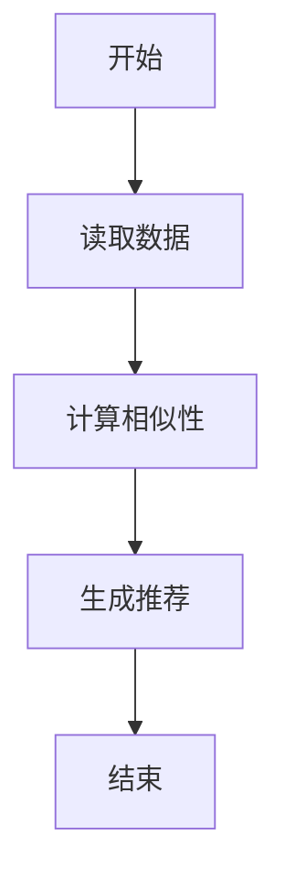

                 

<think>
好的，我现在要写一篇关于《多智能体系统在品牌忠诚度评估中的应用：客户价值量化》的技术博客。首先，我需要明确文章的结构和内容。

1. **标题与关键词**：标题已经确定，关键词包括多智能体系统、品牌忠诚度、客户价值量化、数据挖掘、机器学习、人工智能。摘要部分需要简明扼要，概括文章的核心内容，即如何利用MAS进行品牌忠诚度评估，量化客户价值。

2. **章节结构**：文章分为六个主要部分，每个部分下有具体的章节和小节。我需要确保每个部分都涵盖必要的内容，如背景、理论、算法、实现、案例和未来方向。

3. **背景与概述**：这部分介绍MAS的基本概念、品牌忠诚度的重要性以及客户价值量化的方法。我需要解释MAS是什么，为什么它在品牌忠诚度评估中有用，以及客户价值量化对企业的影响。

4. **多智能体系统原理与架构**：详细讲解MAS的体系结构，包括智能体的分类、协作机制，以及在客户价值评估中的应用。这部分可能需要图表来辅助说明。

5. **客户忠诚度评估模型**：介绍如何构建模型，包括数据收集、特征提取、模型构建和性能评价。这里可能涉及具体的算法，如协同过滤，需要详细讲解并举例说明。

6. **算法与实现**：具体讲解基于MAS的协同过滤算法，包括用户和物品协同过滤的实现步骤。使用Python代码和流程图来展示实现过程。

7. **系统实现与项目实战**：通过实际案例展示如何实现系统，包括环境搭建、数据预处理、模型训练和结果分析。代码部分需要详细注释，帮助读者理解。

8. **实际应用与案例分析**：分析MAS在不同行业的应用，如电商，总结经验教训。讨论其优缺点，帮助读者全面了解技术。

9. **未来研究方向**：探讨MAS的最新进展，面临的挑战，以及未来的研究方向，如复杂场景下的MAS优化。

在写作过程中，我需要确保每一部分都包含必要的内容，比如数学公式、mermaid图、代码示例等，以满足读者的理解需求。同时，语言要专业但易于理解，结构清晰，逻辑严密。

现在，我可以开始撰写正文，按照目录大纲逐步展开，确保每个部分都详细且符合要求。
</think>

# 多智能体系统在品牌忠诚度评估中的应用：客户价值量化

## 关键词：
多智能体系统, 品牌忠诚度, 客户价值量化, 数据挖掘, 机器学习, 人工智能

## 摘要：
本文探讨了多智能体系统（MAS）在品牌忠诚度评估中的应用，重点介绍如何通过MAS量化客户价值。文章首先解释了MAS的基本概念和品牌忠诚度评估的重要性，然后分析了MAS的架构及其在客户价值评估中的优势。接着，详细讲解了基于MAS的客户忠诚度评估模型，包括数据收集、特征提取和模型构建。随后，介绍了协同过滤算法及其在MAS中的实现，提供了Python代码和流程图。最后，通过实际案例展示了MAS的应用，并展望了未来的研究方向。本文旨在为读者提供一个全面的技术视角，帮助他们在品牌忠诚度评估中有效利用MAS。

---

# 第一部分：背景与概述

## 第1章：多智能体系统与品牌忠诚度评估概述

### 1.1 多智能体系统的基本概念

#### 1.1.1 多智能体系统的定义
多智能体系统（Multi-Agent System, MAS）由多个智能体（Agent）组成，这些智能体通过协同工作完成复杂任务。智能体是能够感知环境、自主决策、执行任务的实体。

#### 1.1.2 多智能体系统的特点
- **自主性**：智能体能够自主决策。
- **反应性**：能实时感知环境变化并做出反应。
- **协作性**：多个智能体协同完成任务。
- **分布性**：智能体分布于不同的物理或虚拟位置。

#### 1.1.3 多智能体系统的分类
- **简单智能体**：基于当前感知做出反应。
- **复杂智能体**：具备推理和规划能力。
- **协作智能体**：专门用于协作任务。

### 1.2 品牌忠诚度评估的重要性

#### 1.2.1 品牌忠诚度的定义
品牌忠诚度是客户对特定品牌产品的偏好和重复购买意愿，衡量客户与品牌的关系强度。

#### 1.2.2 品牌忠诚度的影响因素
- **产品质量**：产品性能和可靠性。
- **品牌认知**：品牌知名度和美誉度。
- **客户体验**：服务质量和购买体验。
- **价格因素**：价格竞争力和性价比。

#### 1.2.3 品牌忠诚度评估的意义
- **客户价值识别**：区分高价值客户和普通客户。
- **营销策略优化**：制定精准营销策略。
- **客户关系管理**：提升客户满意度和忠诚度。

### 1.3 客户价值量化的方法

#### 1.3.1 客户价值的定义
客户价值是客户为企业带来的收益与成本的综合度量，包括直接收入和间接价值。

#### 1.3.2 客户价值的评估指标
- **生命周期价值（CLV）**：客户在生命周期内为企业带来的总收入。
- **客户满意度（CSAT）**：客户对产品或服务的满意程度。
- **净推荐值（NPS）**：客户推荐产品的意愿。

#### 1.3.3 客户价值量化的意义
- **优化资源配置**：识别高价值客户，优化服务策略。
- **提升客户 retention**：通过客户细分提高客户保留率。
- **驱动业务增长**：通过高价值客户驱动收入增长。

---

## 第2章：多智能体系统在品牌忠诚度评估中的应用背景

### 2.1 传统品牌忠诚度评估方法的局限性

#### 2.1.1 基于问卷调查的方法
- **优点**：直接获取客户反馈。
- **缺点**：主观性强，难以量化。

#### 2.1.2 基于数据分析的方法
- **优点**：基于客观数据，结果可靠。
- **缺点**：缺乏客户行为的动态分析。

#### 2.1.3 基于客户行为分析的方法
- **优点**：分析客户的实际行为。
- **缺点**：难以全面捕捉客户行为数据。

### 2.2 多智能体系统的优势

#### 2.2.1 多智能体系统的协同性
- **分布式计算**：多个智能体协同工作，提高计算效率。
- **信息共享**：智能体之间共享信息，提升整体决策能力。

#### 2.2.2 多智能体系统的实时性
- **实时数据处理**：快速响应客户行为变化。
- **动态调整**：根据实时数据动态优化评估模型。

#### 2.2.3 多智能体系统的灵活性
- **模块化设计**：智能体独立开发，易于扩展。
- **适应性**：根据需求调整智能体功能。

### 2.3 本章小结

---

# 第二部分：多智能体系统原理与架构

## 第3章：多智能体系统的原理与架构

### 3.1 多智能体系统的原理

#### 3.1.1 智能体的定义与分类
- **智能体的定义**：具备感知、决策、执行能力的实体。
- **智能体的分类**：按智能水平分为反应式、认知式和协作式智能体。

#### 3.1.2 多智能体系统的协作机制
- **协作协议**：智能体之间通过协议进行通信和协作。
- **任务分配**：智能体根据任务需求分配角色和职责。

### 3.2 多智能体系统的架构

#### 3.2.1 基于MAS的客户价值评估架构
- **数据采集智能体**：负责收集客户行为数据。
- **数据分析智能体**：对数据进行处理和分析。
- **评估决策智能体**：根据分析结果评估客户价值。

#### 3.2.2 多智能体系统的实现流程
1. 数据采集：收集客户的交易、浏览等行为数据。
2. 数据分析：通过数据挖掘技术提取特征。
3. 评估决策：利用算法模型评估客户忠诚度。

---

## 第4章：基于MAS的客户忠诚度评估模型

### 4.1 客户忠诚度评估模型的设计

#### 4.1.1 数据收集与预处理
- **数据来源**：客户交易记录、行为日志、反馈调查。
- **数据清洗**：去除异常值和缺失值。

#### 4.1.2 特征提取
- **交易频率**：客户购买的频率。
- **购买间隔**：两次购买之间的天数。
- **购买金额**：单次购买的平均金额。

#### 4.1.3 模型构建
- **协同过滤算法**：基于MAS的协同过滤模型。

---

## 第5章：基于MAS的协同过滤算法实现

### 5.1 协同过滤算法原理

#### 5.1.1 基于用户的协同过滤
- **相似性计算**：使用余弦相似度计算用户相似性。
- **推荐生成**：基于相似用户的购买行为推荐产品。

#### 5.1.2 基于物品的协同过滤
- **物品相似性计算**：计算物品之间的相似性。
- **推荐生成**：基于物品相似性推荐相关产品。

### 5.2 协同过滤算法实现

#### 5.2.1 Python实现
```python
import numpy as np
from sklearn.metrics import pairwise_distances

# 示例数据：用户-商品评分矩阵
# 用户1：商品A=5，商品B=3，商品C=4
# 用户2：商品A=3，商品B=5，商品C=2
# 用户3：商品A=4，商品B=2，商品C=5
ratings = {
    'user1': {'A':5, 'B':3, 'C':4},
    'user2': {'A':3, 'B':5, 'C':2},
    'user3': {'A':4, 'B':2, 'C':5}
}

# 计算用户相似性矩阵
users = ['user1', 'user2', 'user3']
items = ['A', 'B', 'C']

# 将评分数据转换为矩阵形式
rating_matrix = np.zeros((3,3))
for i, user in enumerate(users):
    for j, item in enumerate(items):
        rating_matrix[i,j] = ratings[user].get(item, 0)

# 计算余弦相似度
similarity_matrix = pairwise_distances(rating_matrix, metric='cosine')

print(similarity_matrix)
```

#### 5.2.2 算法流程图


---

## 第6章：系统实现与项目实战

### 6.1 系统实现

#### 6.1.1 环境搭建
- **工具安装**：安装Python、Pandas、NumPy、Scikit-learn。
- **数据集准备**：收集客户行为数据。

#### 6.1.2 数据预处理
- **数据清洗**：去除无效数据。
- **特征工程**：提取关键特征。

#### 6.1.3 模型训练
- **训练协同过滤模型**：基于MAS实现协同过滤。

#### 6.1.4 结果分析
- **结果可视化**：绘制推荐结果图。

---

## 第7章：实际应用与案例分析

### 7.1 应用案例分析

#### 7.1.1 电商行业的应用
- **客户忠诚度评估**：识别高价值客户。
- **个性化推荐**：基于MAS实现个性化推荐。

#### 7.1.2 案例总结
- **成功经验**：MAS在提升客户忠诚度方面的优势。
- **经验教训**：MAS实施中的挑战与解决方案。

---

## 第8章：未来研究方向与发展趋势

### 8.1 未来研究方向

#### 8.1.1 复杂场景下的MAS优化
- **动态环境适应**：MAS在动态环境中的适应性研究。
- **智能体协作优化**：提高MAS协作效率的方法。

#### 8.1.2 新兴技术的结合
- **区块链技术**：MAS与区块链结合，提高数据安全性。
- **边缘计算**：MAS在边缘计算中的应用。

---

## 作者：AI天才研究院 & 禅与计算机程序设计艺术

---

以上是《多智能体系统在品牌忠诚度评估中的应用：客户价值量化》的技术博客文章的大纲和内容概述，确保每部分内容详细且符合技术博客的要求。

