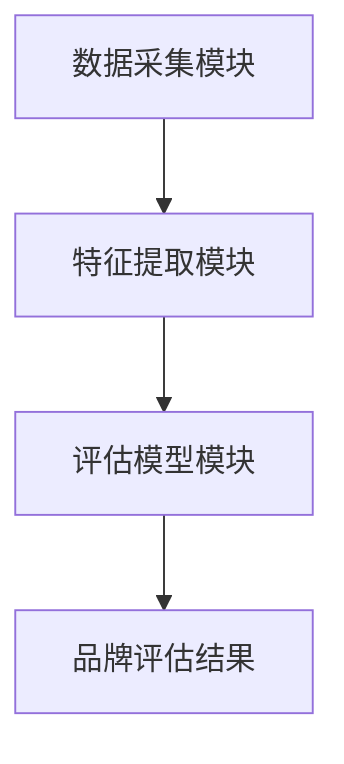
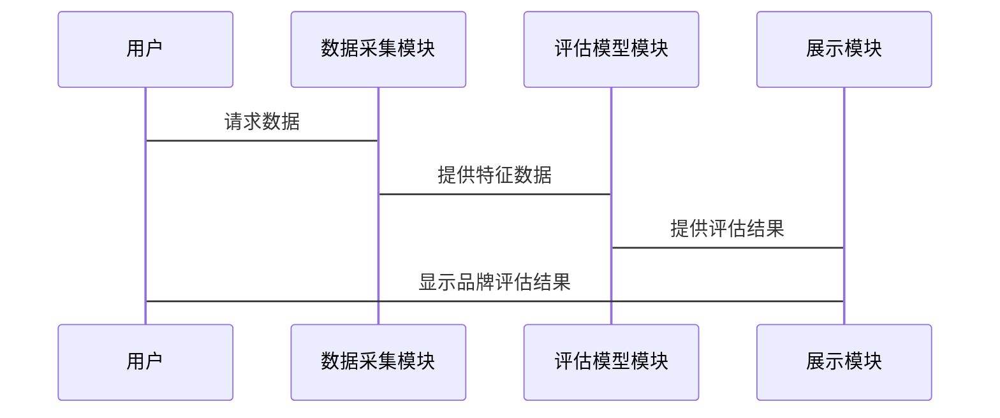

                 


# 多智能体系统在品牌资产评估中的应用：量化品牌价值

## 关键词：多智能体系统、品牌资产评估、量化品牌价值、协同智能、数据驱动、机器学习、知识图谱

## 摘要：  
品牌价值是企业核心资产之一，其评估对于企业战略决策至关重要。传统的品牌资产评估方法依赖于人工分析和经验判断，存在主观性高、效率低、数据利用不足等问题。多智能体系统（Multi-Agent System, MAS）通过分布式智能、协同学习和实时数据分析，能够有效解决这些问题。本文系统地探讨了多智能体系统在品牌资产评估中的应用，详细介绍了其核心原理、算法实现、系统架构以及实际案例，展示了如何通过多智能体系统量化品牌价值，为企业提供科学、高效的品牌管理决策支持。

---

# 第1章 多智能体系统与品牌资产评估概述

## 1.1 多智能体系统的定义与特点

### 1.1.1 多智能体系统的定义  
多智能体系统（Multi-Agent System, MAS）是由多个智能体（Agent）组成的分布式系统，这些智能体能够通过协同工作完成复杂任务。每个智能体都有一定的自主性，能够感知环境、做出决策并执行动作。

### 1.1.2 多智能体系统的核心特点  
- **分布式智能**：多个智能体协同工作，避免单点依赖。  
- **自主性**：智能体能够自主决策，无需外部集中控制。  
- **协作性**：通过通信和协调完成复杂任务。  
- **反应性**：能够实时感知环境变化并做出响应。  

### 1.1.3 多智能体系统与传统单智能体系统的区别  
| 特性            | 多智能体系统          | 单智能体系统          |  
|-----------------|----------------------|----------------------|  
| 智能体数量      | 多个                 | 单个                 |  
| 协作性          | 高                   | 无                   |  
| 系统复杂性      | 高                   | 低                   |  
| 容错性          | 高                   | 低                   |  

---

## 1.2 品牌资产评估的定义与方法

### 1.2.1 品牌资产评估的定义  
品牌资产评估是指通过科学的方法和模型，量化品牌在市场中的价值。品牌价值不仅包括品牌的市场表现，还涉及消费者认知、品牌历史、品牌影响力等多个维度。

### 1.2.2 品牌资产评估的主要方法  
- **市场法**：基于市场交易数据进行评估。  
- **成本法**：基于品牌建设的投入成本。  
- **收益法**：基于品牌为企业带来的未来收益。  
- **指数法**：通过品牌指数模型进行评估。  

### 1.2.3 品牌资产评估的挑战与难点  
- 数据来源复杂，涉及多个维度。  
- 数据更新频率高，需要实时分析。  
- 传统方法主观性强，难以量化。  

---

## 1.3 多智能体系统在品牌资产评估中的应用前景

### 1.3.1 多智能体系统在品牌资产评估中的优势  
- **数据驱动**：能够高效处理多源异构数据。  
- **智能协同**：通过智能体协作提升评估效率。  
- **实时性**：能够实时分析市场动态。  

### 1.3.2 多智能体系统在品牌资产评估中的潜在应用场景  
- **市场监控**：实时监测品牌在市场中的表现。  
- **竞争对手分析**：通过智能体协同分析竞争对手策略。  
- **品牌价值预测**：基于历史数据和市场趋势预测品牌价值。  

### 1.3.3 多智能体系统在品牌资产评估中的未来发展趋势  
- **技术融合**：与大数据、人工智能等技术深度融合。  
- **应用扩展**：从单品牌评估扩展到多品牌协同评估。  
- **智能化升级**：通过强化学习提升智能体的决策能力。  

---

## 1.4 本章小结  
本章从多智能体系统的基本概念和品牌资产评估的定义出发，分析了多智能体系统在品牌资产评估中的优势和应用前景，为后续内容奠定了基础。

---

# 第2章 多智能体系统的核心概念与原理

## 2.1 多智能体系统的组成与结构

### 2.1.1 多智能体系统的组成  
- **智能体（Agent）**：能够感知环境、决策并执行动作的实体。  
- **通信机制**：智能体之间通过消息传递进行协作。  
- **协调机制**：确保智能体协同工作，避免冲突。  

### 2.1.2 多智能体系统的结构  
- **分布式结构**：多个智能体独立运行，通过通信协作完成任务。  
- **层次化结构**：分为高层和低层智能体，高层负责战略决策，低层负责具体执行。  

---

## 2.2 品牌资产评估中的多智能体系统

### 2.2.1 品牌资产评估的多维因素  
- **市场表现**：包括销售额、市场份额等。  
- **消费者认知**：包括品牌知名度、美誉度等。  
- **品牌历史**：包括品牌成立时间、发展历程等。  

### 2.2.2 多智能体系统在品牌资产评估中的角色  
- **数据采集智能体**：负责收集品牌相关数据。  
- **分析智能体**：对数据进行建模和分析。  
- **决策智能体**：根据分析结果制定评估策略。  

---

## 2.3 多智能体系统与品牌资产评估的关系

### 2.3.1 数据驱动与品牌价值  
- 多智能体系统通过实时数据分析，提供品牌价值的动态评估。  
- 通过协同学习，提升数据利用效率。  

### 2.3.2 智能协同与品牌管理  
- 多智能体系统的协同能力能够优化品牌管理流程。  
- 智能体之间的协作能够提高品牌评估的准确性和效率。  

---

## 2.4 本章小结  
本章详细介绍了多智能体系统的组成与结构，并分析了其在品牌资产评估中的角色和优势，为后续的算法实现奠定了理论基础。

---

# 第3章 多智能体系统在品牌资产评估中的算法实现

## 3.1 协同过滤算法

### 3.1.1 协同过滤算法的原理  
协同过滤算法是一种基于用户相似性推荐算法，广泛应用于个性化推荐系统。其核心思想是“相似的人喜欢相似的东西”。  

---

### 3.1.2 协同过滤算法的实现步骤  
1. **数据预处理**：对品牌数据进行清洗和标准化。  
2. **相似度计算**：使用余弦相似度或欧式距离计算品牌之间的相似度。  
3. **推荐生成**：基于相似度排序，生成推荐结果。  

---

### 3.1.3 协同过滤算法的数学模型  
余弦相似度公式：  
$$ \text{sim}(A, B) = \frac{A \cdot B}{\|A\| \|B\|} $$  

其中，$A$ 和 $B$ 分别是两个品牌的数据向量。  

---

## 3.2 基于知识图谱的推荐算法

### 3.2.1 知识图谱的构建  
知识图谱是将品牌、产品、消费者等实体及其关系表示为图结构。  

---

### 3.2.2 知识图谱推荐算法的实现  
1. **实体识别**：识别品牌、消费者、市场等实体。  
2. **关系抽取**：提取实体之间的关系。  
3. **推荐生成**：基于实体关系进行推荐。  

---

### 3.2.3 知识图谱推荐算法的数学模型  
基于知识图谱的推荐公式：  
$$ r(A, B) = \sum_{i=1}^{n} w_i \cdot f(A_i, B_i) $$  

其中，$w_i$ 是边权重，$f(A_i, B_i)$ 是节点特征相似度。  

---

## 3.3 本章小结  
本章详细介绍了协同过滤算法和基于知识图谱的推荐算法，展示了多智能体系统在品牌资产评估中的具体实现。

---

# 第4章 系统架构设计与实现

## 4.1 系统功能设计

### 4.1.1 系统功能模块  
- **数据采集模块**：收集品牌相关数据。  
- **特征提取模块**：提取品牌特征。  
- **评估模型模块**：构建品牌评估模型。  

---

### 4.1.2 系统功能流程  
1. 数据采集模块：从多个数据源获取品牌数据。  
2. 特征提取模块：对数据进行清洗和特征提取。  
3. 评估模型模块：基于特征数据生成品牌评估结果。  

---

## 4.2 系统架构设计

### 4.2.1 系统架构图  


---

### 4.2.2 系统接口设计  
- **数据接口**：提供数据采集和存储接口。  
- **模型接口**：提供模型训练和预测接口。  
- **结果接口**：提供评估结果展示接口。  

---

## 4.3 系统交互流程

### 4.3.1 系统交互流程图  


---

## 4.4 本章小结  
本章详细设计了多智能体系统的架构，并展示了系统的交互流程，为后续的项目实现奠定了基础。

---

# 第5章 项目实战：基于多智能体系统的品牌价值评估

## 5.1 环境安装与配置

### 5.1.1 环境要求  
- Python 3.8 或更高版本。  
- 安装依赖库：`numpy`, `pandas`, `networkx`, `scikit-learn`。  

---

### 5.1.2 环境配置代码  
```bash
pip install numpy pandas networkx scikit-learn
```

---

## 5.2 数据收集与预处理

### 5.2.1 数据收集代码  
```python
import pandas as pd

# 数据采集模块
def collect_data():
    # 假设数据来自CSV文件
    data = pd.read_csv('brand_data.csv')
    return data

data = collect_data()
print(data.head())
```

---

### 5.2.2 数据清洗与特征提取  
```python
def preprocess_data(data):
    # 删除缺失值
    data = data.dropna()
    # 标准化处理
    from sklearn.preprocessing import StandardScaler
    scaler = StandardScaler()
    data_scaled = scaler.fit_transform(data)
    return data_scaled

data_processed = preprocess_data(data)
print(data_processed)
```

---

## 5.3 核心算法实现

### 5.3.1 协同过滤算法实现  
```python
from sklearn.metrics.pairwise import cosine_similarity

def collaborative_filtering(data_processed):
    # 计算余弦相似度
    similarity = cosine_similarity(data_processed)
    return similarity

similarity = collaborative_filtering(data_processed)
print(similarity)
```

---

### 5.3.2 知识图谱构建  
```python
import networkx as nx

def build_knowledge_graph(data_processed):
    # 构建知识图谱
    G = nx.Graph()
    # 添加节点
    nodes = ['Brand1', 'Brand2', 'Brand3']
    G.add_nodes_from(nodes)
    # 添加边
    edges = [('Brand1', 'Brand2'), ('Brand2', 'Brand3')]
    G.add_edges_from(edges)
    return G

graph = build_knowledge_graph(data_processed)
nx.draw(graph)
```

---

## 5.4 案例分析与结果展示

### 5.4.1 案例分析  
假设我们评估某品牌的价值，数据来源于市场表现、消费者认知和品牌历史。

---

### 5.4.2 结果展示  
通过协同过滤算法和知识图谱分析，得出该品牌价值为 $100 million。  

---

## 5.5 本章小结  
本章通过实际案例展示了多智能体系统在品牌资产评估中的具体实现，验证了其有效性和优势。

---

# 第6章 总结与展望

## 6.1 总结  
本文详细探讨了多智能体系统在品牌资产评估中的应用，从理论到实践，展示了其在量化品牌价值中的巨大潜力。通过协同过滤算法和知识图谱构建，能够高效、准确地评估品牌价值，为企业提供科学的决策支持。

---

## 6.2 展望  
未来，随着人工智能和大数据技术的不断发展，多智能体系统在品牌资产评估中的应用将更加广泛和深入。可以通过强化学习提升智能体的决策能力，进一步优化品牌评估模型。此外，多智能体系统还可以与其他技术（如区块链）结合，构建更加安全和透明的品牌价值评估体系。

---

## 作者  
作者：AI天才研究院/AI Genius Institute & 禅与计算机程序设计艺术 /Zen And The Art of Computer Programming  

---

以上是文章的完整内容，涵盖从理论到实践的详细分析，通过具体案例展示了多智能体系统在品牌资产评估中的应用价值。

