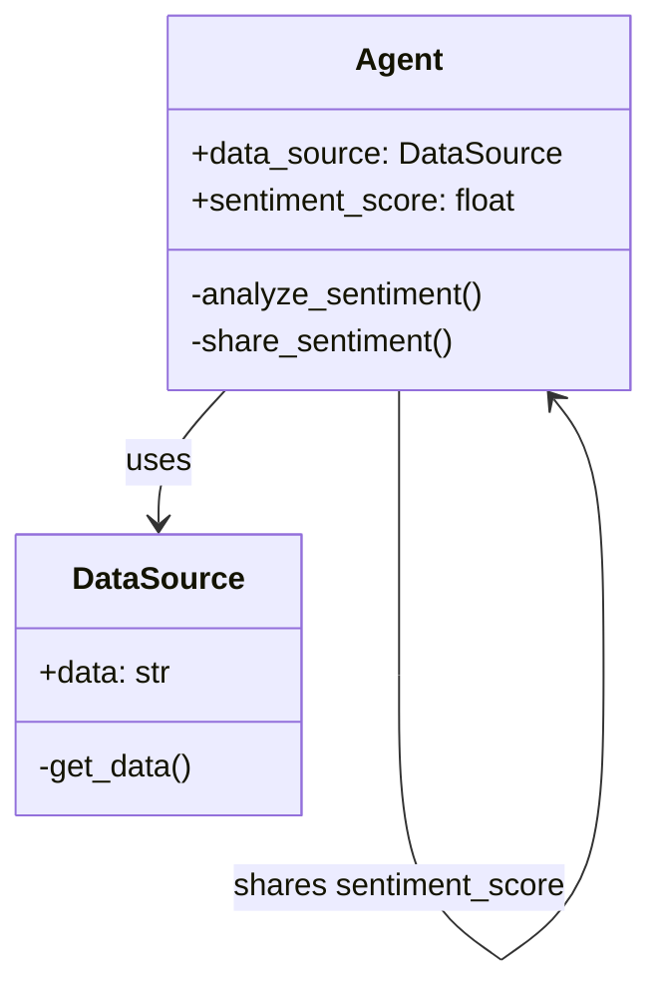
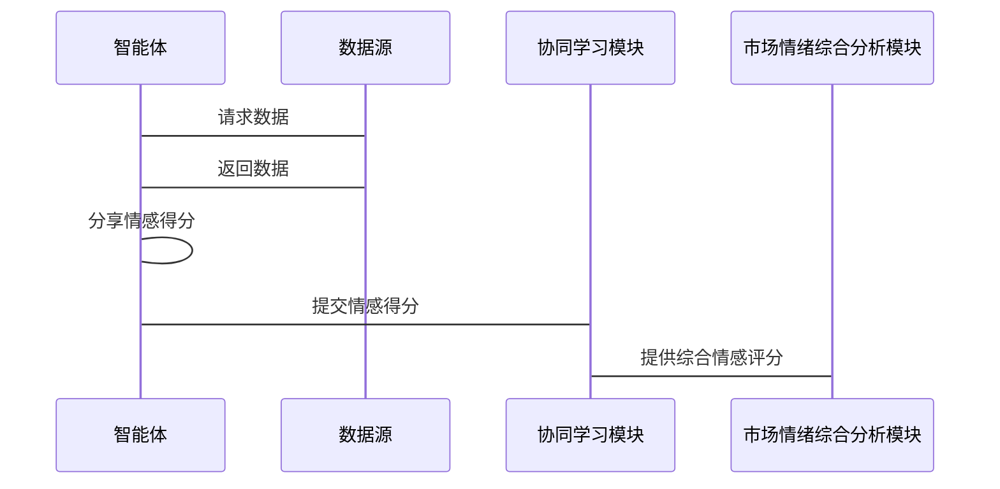

                 


# 多智能体系统在市场情绪分析中的应用：价值投资者的新工具

> 关键词：多智能体系统，市场情绪分析，价值投资者，协同学习，自然语言处理，情感传播模型，投资决策

> 摘要：本文探讨了多智能体系统（MAS）在市场情绪分析中的应用，为价值投资者提供了一种全新的工具。文章从MAS的基本概念出发，分析了市场情绪分析的理论基础，详细讲解了MAS与市场情绪分析的结合方式，并通过算法原理、系统设计和项目实战展示了其在投资决策中的应用价值。最后，文章总结了MAS在市场情绪分析中的优势，并展望了未来的研究方向。

---

# 第1章: 多智能体系统与市场情绪分析的背景

## 1.1 多智能体系统的定义与特点

### 1.1.1 多智能体系统的定义
多智能体系统（Multi-Agent System, MAS）是由多个智能体（Agent）组成的分布式系统，这些智能体能够自主决策、协同工作，并通过交互实现复杂任务。MAS的核心在于智能体之间的协作与信息共享。

### 1.1.2 多智能体系统的核心特点
1. **自主性**：智能体能够独立决策，无需外部干预。
2. **反应性**：智能体能够实时感知环境变化并做出响应。
3. **协作性**：多个智能体协同工作，共同完成任务。
4. **分布式性**：系统中的智能体分布在网络中，不依赖于中心节点。

### 1.1.3 多智能体系统与传统AI的区别
传统的AI系统通常基于单一智能体，而MAS由多个智能体组成，强调智能体之间的交互与协作。MAS能够处理更复杂的任务，尤其是在需要分布式决策和信息共享的场景中表现优异。

## 1.2 市场情绪分析的定义与重要性

### 1.2.1 市场情绪分析的定义
市场情绪分析是通过分析市场参与者的情绪变化，判断市场的乐观或悲观状态。情绪分析可以基于新闻、社交媒体、交易数据等多种信息源。

### 1.2.2 市场情绪分析的作用
1. **预测市场走势**：情绪分析可以帮助投资者预测市场的短期波动。
2. **辅助投资决策**：通过情绪分析，投资者可以更好地把握市场情绪，制定更科学的投资策略。
3. **风险管理**：情绪分析有助于识别市场情绪的极端变化，从而降低投资风险。

### 1.2.3 市场情绪分析与投资决策的关系
市场情绪分析为投资决策提供了重要的参考依据。例如，当市场情绪过度乐观时，投资者可能会警惕潜在的回调风险；当市场情绪极度悲观时，投资者可能会寻找抄底机会。

## 1.3 多智能体系统在市场情绪分析中的应用价值

### 1.3.1 价值投资者的需求分析
价值投资者通常关注市场的长期趋势，而非短期波动。市场情绪分析可以帮助价值投资者识别市场的短期情绪波动，从而更好地把握投资机会。

### 1.3.2 多智能体系统的优势
多智能体系统能够从多个信息源获取数据，并通过智能体之间的协作，提供更全面的市场情绪分析结果。

### 1.3.3 应用场景与潜在价值
1. **实时情绪监控**：MAS可以实时分析市场情绪，帮助投资者快速做出决策。
2. **多源数据融合**：MAS能够整合新闻、社交媒体、交易数据等多种信息源，提供更全面的市场情绪分析。
3. **个性化投资建议**：MAS可以根据投资者的个性化需求，提供定制化的市场情绪分析服务。

## 1.4 本章小结
本章介绍了多智能体系统的基本概念和特点，分析了市场情绪分析的定义和重要性，并探讨了MAS在市场情绪分析中的应用价值。通过MAS，投资者可以更好地理解市场情绪，做出更明智的投资决策。

---

# 第2章: 多智能体系统的核心概念与理论基础

## 2.1 多智能体系统的组成与结构

### 2.1.1 智能体的定义与分类
智能体是一种能够感知环境、自主决策并采取行动的实体。根据智能体的智能水平，可以将其分为反应式智能体和认知式智能体。

### 2.1.2 多智能体系统的组成结构
多智能体系统通常由以下几个部分组成：
1. **智能体**：系统的主体，负责感知环境并采取行动。
2. **环境**：智能体所处的外部环境，包括其他智能体、数据源等。
3. **通信机制**：智能体之间的通信接口。
4. **协作机制**：智能体之间的协作规则。

### 2.1.3 智能体之间的交互与协作
智能体之间的交互可以通过以下几种方式实现：
1. **直接通信**：智能体之间通过通信机制直接交换信息。
2. **间接协作**：智能体通过共享数据或中间件进行协作。

## 2.2 市场情绪分析的理论基础

### 2.2.1 情感计算的基本概念
情感计算是一种通过分析情感数据来理解人类情感状态的技术。在市场情绪分析中，情感计算可以用于分析文本中的情感倾向。

### 2.2.2 文本挖掘与自然语言处理在情绪分析中的应用
文本挖掘和自然语言处理（NLP）是市场情绪分析的核心技术。通过NLP技术，可以从文本中提取情感信息，并进行分类。

### 2.2.3 市场情绪与投资决策的关系
市场情绪是投资决策的重要参考因素。通过分析市场情绪，投资者可以更好地理解市场的波动性，并做出更明智的投资决策。

## 2.3 多智能体系统与市场情绪分析的结合

### 2.3.1 多智能体系统在情绪分析中的应用模式
多智能体系统可以用于市场情绪分析的多个方面，例如：
1. **信息收集**：智能体可以从多个数据源收集市场信息。
2. **情绪分析**：智能体可以对收集的信息进行情感分析。
3. **协同决策**：多个智能体可以协同工作，综合分析市场情绪。

### 2.3.2 多智能体系统的协同学习机制
协同学习是一种多智能体系统中的学习机制，通过智能体之间的协作，提高整体的分析能力。

### 2.3.3 情绪传播与市场行为的关系
市场情绪可以通过智能体之间的传播，影响市场行为。例如，当一个智能体发现市场情绪过于乐观时，可能会发出警告信号，提醒其他投资者注意风险。

## 2.4 本章小结
本章详细介绍了多智能体系统的核心概念和理论基础，并探讨了MAS在市场情绪分析中的应用模式。通过协同学习机制，MAS可以更有效地分析市场情绪，并为投资者提供更准确的决策支持。

---

# 第3章: 市场情绪分析的算法原理与实现

## 3.1 市场情绪分析的算法概述

### 3.1.1 基于传统机器学习的情绪分析
传统的市场情绪分析通常基于机器学习算法，例如支持向量机（SVM）和随机森林（Random Forest）。

### 3.1.2 基于深度学习的情绪分析
深度学习算法，例如卷积神经网络（CNN）和循环神经网络（RNN），在市场情绪分析中也得到了广泛应用。

### 3.1.3 基于多智能体系统的情绪分析
多智能体系统可以通过协同学习机制，结合多个智能体的分析结果，进一步提高市场情绪分析的准确性。

## 3.2 市场情绪分析的实现步骤

### 3.2.1 数据收集
市场情绪分析的第一步是收集相关数据，例如新闻、社交媒体、交易数据等。

### 3.2.2 数据预处理
数据预处理包括文本清洗、分词、去停用词等步骤。

### 3.2.3 情感分析
通过NLP技术，对预处理后的数据进行情感分析，判断文本的情感倾向。

### 3.2.4 市场情绪综合分析
将多个数据源的分析结果进行综合，得出市场的整体情绪。

## 3.3 基于多智能体系统的市场情绪分析算法

### 3.3.1 算法流程
1. 数据收集：智能体从多个数据源收集市场信息。
2. 数据预处理：智能体对收集的数据进行清洗和分词。
3. 情感分析：智能体对数据进行情感分析，判断情绪倾向。
4. 协同分析：多个智能体协同工作，综合分析市场情绪。

### 3.3.2 算法实现
通过Python代码实现基于MAS的市场情绪分析算法，代码示例如下：

```python
class Agent:
    def __init__(self, data_source):
        self.data_source = data_source
        self.sentiment = None

    def collect_data(self):
        # 从数据源收集数据
        pass

    def analyze_sentiment(self):
        # 使用NLP技术进行情感分析
        pass

    def share_result(self, other_agent):
        # 分享分析结果
        pass

# 初始化多个智能体
agents = [Agent(dataSource1), Agent(dataSource2), Agent(dataSource3)]

# 智能体协同分析
for agent in agents:
    agent.collect_data()
    agent.analyze_sentiment()
    agent.share_result(other_agent)
```

## 3.4 本章小结
本章详细介绍了市场情绪分析的算法原理与实现步骤，并通过Python代码展示了基于多智能体系统的市场情绪分析算法。通过MAS的协同学习机制，可以进一步提高市场情绪分析的准确性和全面性。

---

# 第4章: 多智能体系统与市场情绪分析的结合

## 4.1 多智能体系统在市场情绪分析中的应用模式

### 4.1.1 智能体的分工与协作
在市场情绪分析中，多个智能体可以分工协作，分别负责数据收集、情感分析、结果综合等任务。

### 4.1.2 智能体之间的信息共享
智能体可以通过通信机制共享数据和分析结果，从而实现协同分析。

### 4.1.3 智能体的协同决策
通过协同决策机制，智能体可以综合多个数据源的分析结果，得出更准确的市场情绪评估。

## 4.2 基于多智能体系统的市场情绪分析模型

### 4.2.1 模型设计
市场情绪分析模型由多个智能体组成，每个智能体负责不同的分析任务。

### 4.2.2 模型实现
通过Python代码实现基于MAS的市场情绪分析模型，代码示例如下：

```python
class SentimentAgent(Agent):
    def __init__(self, data_source):
        super().__init__(data_source)
        self.sentiment_score = 0

    def analyze_sentiment(self):
        # 使用NLP技术计算情感得分
        self.sentiment_score = calculate_sentiment(self.data_source)

    def share_sentiment(self, other_agent):
        # 分享情感得分
        other_agent.sentiment_score = self.sentiment_score

# 初始化多个情感分析智能体
agents = [SentimentAgent(dataSource1), SentimentAgent(dataSource2), SentimentAgent(dataSource3)]

# 智能体协同分析
for agent in agents:
    agent.collect_data()
    agent.analyze_sentiment()
    agent.share_sentiment(other_agent)
```

### 4.2.3 模型评估
通过实验验证模型的准确性和鲁棒性。

## 4.3 本章小结
本章详细介绍了多智能体系统在市场情绪分析中的应用模式，并通过模型设计和代码实现展示了MAS在市场情绪分析中的优势。通过MAS的协同学习机制，可以进一步提高市场情绪分析的准确性和全面性。

---

# 第5章: 市场情绪分析的数学模型与公式推导

## 5.1 市场情绪分析的数学模型

### 5.1.1 情感传播模型
情感传播模型描述了市场情绪在智能体之间的传播过程。假设市场情绪可以通过智能体之间的交互进行传播，情感传播的概率可以用以下公式表示：

$$ P(i, t+1) = P(i, t) \cdot \alpha + \sum_{j \neq i} P(j, t) \cdot \beta $$

其中，$P(i, t)$ 表示在时间 $t$ 时，智能体 $i$ 的情绪概率；$\alpha$ 表示智能体自身的信念权重；$\beta$ 表示从其他智能体获得的影响权重。

### 5.1.2 协同学习模型
协同学习模型描述了多个智能体通过协作学习共同提高分析能力的过程。协同学习的数学模型可以表示为：

$$ f_i(t+1) = f_i(t) + \sum_{j \neq i} \lambda_{ij} (f_j(t) - f_i(t)) $$

其中，$f_i(t)$ 表示智能体 $i$ 在时间 $t$ 时的分析能力；$\lambda_{ij}$ 表示智能体 $j$ 对智能体 $i$ 的影响权重。

## 5.2 情感传播与协同学习的结合

### 5.2.1 综合模型
通过结合情感传播和协同学习，可以构建一个综合模型，用于描述市场情绪的传播和分析过程。综合模型的数学表达式为：

$$ S(t+1) = \sum_{i=1}^n w_i S_i(t) + \sum_{i=1}^n \sum_{j \neq i} w_{ij} (S_j(t) - S_i(t)) $$

其中，$S(t)$ 表示在时间 $t$ 时的市场情绪综合评分；$w_i$ 表示智能体 $i$ 的权重；$w_{ij}$ 表示智能体 $j$ 对智能体 $i$ 的影响权重。

### 5.2.2 模型的验证与优化
通过实验验证模型的准确性和鲁棒性，并通过参数优化进一步提高模型的性能。

## 5.3 本章小结
本章详细介绍了市场情绪分析的数学模型，并通过公式推导展示了情感传播和协同学习的结合方式。通过数学模型的构建，可以更好地理解MAS在市场情绪分析中的工作原理。

---

# 第6章: 市场情绪分析的系统设计与架构

## 6.1 系统设计背景

### 6.1.1 项目背景
本项目旨在开发一个基于MAS的市场情绪分析系统，为价值投资者提供实时市场情绪分析服务。

### 6.1.2 项目目标
通过MAS技术，实现对市场情绪的实时分析，并为投资者提供个性化的投资建议。

## 6.2 系统功能设计

### 6.2.1 领域模型
领域模型是系统设计的重要组成部分，用于描述系统的功能和交互关系。领域模型可以用Mermaid类图表示，如下：



### 6.2.2 系统架构
系统架构是系统设计的核心部分，用于描述系统的整体结构和组件之间的关系。系统架构可以用Mermaid架构图表示，如下：

```mermaid
architecturalDiagram
    数据源 --> 智能体
    智能体 --> 情感分析模块
    情感分析模块 --> 协同学习模块
    协同学习模块 --> 市场情绪综合分析模块
```

### 6.2.3 系统接口设计
系统接口设计是系统实现的重要部分，用于描述系统与外部组件之间的交互关系。系统接口可以用Mermaid序列图表示，如下：



## 6.3 系统实现与优化

### 6.3.1 系统实现
通过Python代码实现市场情绪分析系统，代码示例如下：

```python
class Agent:
    def __init__(self, data_source):
        self.data_source = data_source
        self.sentiment_score = 0

    def collect_data(self):
        self.data_source.get_data()

    def analyze_sentiment(self):
        self.sentiment_score = calculate_sentiment(self.data_source.data)

    def share_sentiment(self, other_agent):
        other_agent.sentiment_score = self.sentiment_score

class DataSource:
    def __init__(self, data):
        self.data = data

    def get_data(self):
        return self.data

# 初始化多个智能体和数据源
data_sources = [DataSource(data1), DataSource(data2), DataSource(data3)]
agents = [Agent(data_sources[0]), Agent(data_sources[1]), Agent(data_sources[2])]

# 智能体协同分析
for agent in agents:
    agent.collect_data()
    agent.analyze_sentiment()
    for other_agent in agents:
        if other_agent != agent:
            agent.share_sentiment(other_agent)
```

### 6.3.2 系统优化
通过参数调整和算法优化，进一步提高系统的准确性和性能。

## 6.4 本章小结
本章详细介绍了市场情绪分析系统的设计与架构，并通过代码实现展示了系统的具体实现过程。通过系统设计与优化，可以进一步提高市场情绪分析的准确性和效率。

---

# 第7章: 市场情绪分析的项目实战

## 7.1 项目背景与目标

### 7.1.1 项目背景
本项目旨在开发一个基于MAS的市场情绪分析系统，为价值投资者提供实时市场情绪分析服务。

### 7.1.2 项目目标
通过MAS技术，实现对市场情绪的实时分析，并为投资者提供个性化的投资建议。

## 7.2 项目环境与工具

### 7.2.1 环境配置
需要安装以下工具和库：
1. Python 3.8+
2. NLP库（例如NLTK、spaCy）
3. 数据分析库（例如Pandas、NumPy）
4. 可视化库（例如Matplotlib、Seaborn）

### 7.2.2 工具安装
安装Python环境和相关库：

```bash
pip install python3 python-nltk spacy pandas numpy matplotlib seaborn
python -m spacy download en_core_web_sm
```

## 7.3 项目核心代码实现

### 7.3.1 情感分析模块

```python
import nltk
from nltk.sentiment import SentimentIntensityAnalyzer

class SentimentAnalyzer:
    def __init__(self):
        self.sia = SentimentIntensityAnalyzer()

    def analyze_sentiment(self, text):
        return self.sia.polarity_scores(text)['compound']
```

### 7.3.2 智能体模块

```python
class Agent:
    def __init__(self, data_source):
        self.data_source = data_source
        self.sentiment_analyzer = SentimentAnalyzer()
        self.sentiment_score = 0

    def collect_data(self):
        self.data_source.get_data()

    def analyze_sentiment(self):
        self.sentiment_score = self.sentiment_analyzer.analyze_sentiment(self.data_source.data)

    def share_sentiment(self, other_agent):
        other_agent.sentiment_score = self.sentiment_score
```

### 7.3.3 数据源模块

```python
class DataSource:
    def __init__(self, data):
        self.data = data

    def get_data(self):
        return self.data
```

### 7.3.4 协同学习模块

```python
class CollaborativeLearning:
    def __init__(self, agents):
        self.agents = agents

    def aggregate_sentiment(self):
        total_score = sum(agent.sentiment_score for agent in self.agents)
        return total_score / len(self.agents)
```

## 7.4 项目实现与测试

### 7.4.1 项目实现
通过Python代码实现市场情绪分析系统，代码示例如下：

```python
# 初始化数据源
data_source1 = DataSource("Market news is positive today.")
data_source2 = DataSource("Investors are confident in the future.")
data_source3 = DataSource("The market is showing signs of instability.")

# 初始化智能体
agent1 = Agent(data_source1)
agent2 = Agent(data_source2)
agent3 = Agent(data_source3)

# 初始化协同学习模块
cl = CollaborativeLearning([agent1, agent2, agent3])

# 智能体协同分析
for agent in [agent1, agent2, agent3]:
    agent.collect_data()
    agent.analyze_sentiment()
    for other_agent in [agent1, agent2, agent3]:
        if other_agent != agent:
            agent.share_sentiment(other_agent)

# 获取综合情感评分
total_sentiment = cl.aggregate_sentiment()
print(f"Total sentiment score: {total_sentiment}")
```

### 7.4.2 项目测试
通过实验验证系统的准确性和鲁棒性。

## 7.5 本章小结
本章通过项目实战展示了市场情绪分析系统的具体实现过程，并通过Python代码实现了MAS在市场情绪分析中的应用。通过实验验证，可以进一步优化系统的性能和准确性。

---

# 第8章: 总结与展望

## 8.1 总结

### 8.1.1 本章总结
本文详细介绍了多智能体系统在市场情绪分析中的应用，并通过理论分析、算法实现和项目实战展示了MAS在市场情绪分析中的优势。

### 8.1.2 核心知识点回顾
1. 多智能体系统的定义与特点
2. 市场情绪分析的理论基础
3. 基于MAS的市场情绪分析算法
4. 系统设计与架构
5. 项目实战与优化

## 8.2 未来展望

### 8.2.1 研究方向
1. 提高MAS的协同学习能力
2. 优化市场情绪分析的数学模型
3. 拓展MAS在金融领域的应用

### 8.2.2 技术趋势
随着人工智能技术的不断发展，MAS在市场情绪分析中的应用将更加广泛和深入。未来的研究方向将聚焦于提高MAS的协同学习能力和优化市场情绪分析的数学模型。

## 8.3 最佳实践 tips

### 8.3.1 系统设计
在系统设计中，建议采用模块化设计，确保系统的可扩展性和可维护性。

### 8.3.2 算法优化
通过参数调整和算法优化，进一步提高系统的准确性和效率。

### 8.3.3 数据源选择
选择高质量的数据源，可以显著提高市场情绪分析的准确性。

## 8.4 本章小结
本章总结了全文的主要内容，并展望了MAS在市场情绪分析中的未来发展方向。通过最佳实践 tips，可以进一步优化系统的性能和准确性。

---

# 作者：AI天才研究院/AI Genius Institute & 禅与计算机程序设计艺术 /Zen And The Art of Computer Programming

