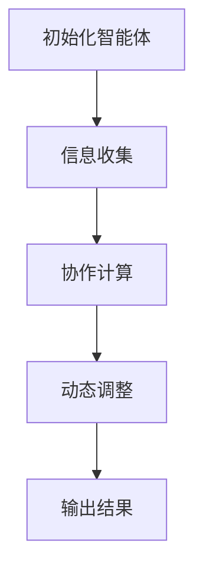
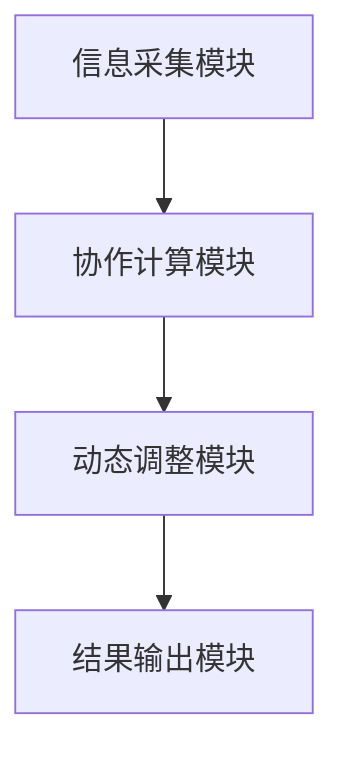
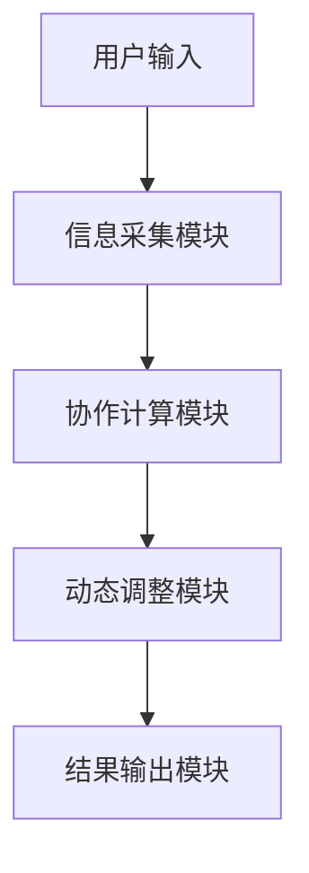

                 


# 多智能体系统在技术颠覆风险评估中的应用

---

## 关键词：多智能体系统、技术颠覆、风险评估、算法、系统架构、项目实战

---

## 摘要

随着技术的快速发展，技术颠覆性创新对社会、经济和产业的影响越来越显著。如何有效评估技术颠覆风险，成为了企业和组织面临的重大挑战。多智能体系统（Multi-Agent Systems, MAS）作为一种分布式、协作式的智能系统，具有强大的信息处理和决策能力，能够为技术颠覆风险评估提供新的解决方案。本文从多智能体系统的基本概念出发，分析其在技术颠覆风险评估中的应用，探讨相关算法、系统架构及实际案例，为读者提供全面的技术视角和实践指导。

---

## 第一部分：多智能体系统与技术颠覆风险评估背景

### 第1章：多智能体系统与技术颠覆风险评估概述

#### 1.1 多智能体系统的基本概念

多智能体系统（Multi-Agent Systems, MAS）是由多个智能体（Agent）组成的分布式系统，每个智能体都是能够感知环境、自主决策、协作完成任务的实体。多智能体系统的核心特征包括：

- **分布式性**：智能体之间通过通信协作完成任务，不存在中心控制节点。
- **自主性**：每个智能体都具有自主决策的能力，能够独立完成部分任务。
- **反应性**：智能体能够实时感知环境变化并做出响应。
- **协作性**：多个智能体通过协作完成复杂任务，实现整体目标。

#### 1.2 技术颠覆风险评估的背景与意义

技术颠覆是指新技术的出现对现有技术和产业模式造成根本性改变，导致原有技术或产业被淘汰或重组。例如，人工智能技术的颠覆性创新对传统行业造成了巨大冲击。

技术颠覆风险评估的意义在于帮助企业提前识别潜在的技术威胁，制定应对策略，降低技术颠覆带来的损失。然而，技术颠覆风险具有高度不确定性和复杂性，传统的单智能体评估方法难以应对。

#### 1.3 多智能体系统在技术颠覆风险评估中的作用

多智能体系统能够通过分布式协作和自主决策，从多个维度对技术颠覆风险进行评估。具体作用包括：

- **多维度信息处理**：多智能体系统能够整合来自不同领域的信息，如技术、市场、政策等，提供全面的风险评估。
- **动态适应性**：面对技术颠覆的不确定性，多智能体系统能够快速调整评估策略，提供实时反馈。
- **协作优化**：多个智能体协同工作，能够提高评估的准确性和效率。

---

### 第2章：技术颠覆风险评估的核心要素

#### 2.1 技术颠覆风险的定义与分类

技术颠覆风险是指新技术的出现对现有技术或产业模式造成根本性改变的可能性。根据影响范围和技术成熟度，技术颠覆风险可以分为：

- **局部颠覆**：影响特定行业或技术领域。
- **全局颠覆**：影响整个行业或经济体系。
- **渐进颠覆**：技术逐步取代现有技术。
- **突变颠覆**：新技术突然出现并迅速取代现有技术。

#### 2.2 技术颠覆风险评估的关键维度

技术颠覆风险评估需要考虑多个维度，包括：

- **技术可行性**：新技术是否具有实际应用价值。
- **市场接受度**：市场对新技术的接受程度。
- **政策法规**：政策法规对新技术的限制或支持。
- **竞争环境**：现有技术的竞争力和市场占有率。

---

## 第二部分：多智能体系统与技术颠覆风险评估的核心概念

### 第3章：多智能体系统的核心原理

#### 3.1 多智能体系统的通信机制

多智能体系统中的智能体之间通过通信机制进行信息交换。通信机制包括：

- **消息传递**：智能体之间通过发送消息进行信息共享。
- **黑板模型**：智能体共享一个公共信息板，用于协调和信息交换。
- **发布-订阅模式**：智能体发布信息，其他智能体订阅感兴趣的信息。

#### 3.2 多智能体系统的协作与协调机制

协作与协调机制是多智能体系统的核心，包括：

- **任务分配**：智能体根据自身能力和环境信息分配任务。
- **协调机制**：智能体通过协商和协调完成任务。
- **冲突解决**：智能体在协作过程中可能产生冲突，需要通过协商或仲裁机制解决。

#### 3.3 多智能体系统的动态自适应能力

多智能体系统能够根据环境变化动态调整自身行为，包括：

- **自适应决策**：智能体能够根据环境变化调整决策。
- **学习能力**：智能体通过学习提高自身的决策能力。
- **容错性**：智能体能够在部分节点故障的情况下继续工作。

---

### 第4章：技术颠覆风险评估的基本原理

#### 4.1 技术颠覆风险的量化方法

技术颠覆风险的量化方法包括：

- **概率模型**：通过概率论对技术颠覆的可能性进行建模。
- **影响分析**：分析新技术对现有技术的影响程度。
- **综合评估**：结合多个维度的评估结果，得出综合风险值。

#### 4.2 技术颠覆风险的预测模型

技术颠覆风险的预测模型包括：

- **时间序列模型**：基于历史数据预测未来的技术颠覆风险。
- **回归模型**：通过相关因素预测技术颠覆风险。
- **机器学习模型**：利用机器学习算法对技术颠覆风险进行预测。

#### 4.3 技术颠覆风险评估的数学模型

技术颠覆风险评估的数学模型可以表示为：

$$ R = f(T, M, C) $$

其中：
- \( R \) 是技术颠覆风险值。
- \( T \) 是技术可行性。
- \( M \) 是市场接受度。
- \( C \) 是竞争环境。

---

## 第三部分：多智能体系统在技术颠覆风险评估中的算法与实现

### 第5章：多智能体风险评估算法的实现步骤

#### 5.1 算法概述

多智能体风险评估算法的基本框架包括：

1. 初始化智能体。
2. 智能体感知环境信息。
3. 智能体协作完成任务。
4. 计算技术颠覆风险值。
5. 输出风险评估结果。

#### 5.2 算法的实现步骤

1. **初始化智能体**：每个智能体初始化自身参数和环境信息。
2. **信息收集**：智能体通过通信机制收集环境信息。
3. **协作计算**：智能体协作计算技术颠覆风险值。
4. **动态调整**：根据环境变化动态调整计算结果。
5. **输出结果**：输出最终的技术颠覆风险评估结果。

#### 5.3 算法的流程图



---

### 第6章：技术颠覆风险评估的数学模型与公式

#### 6.1 技术颠覆风险的数学模型

技术颠覆风险的数学模型可以表示为：

$$ R = \alpha T + \beta M + \gamma C $$

其中：
- \( \alpha \)、\( \beta \)、\( \gamma \) 是权重系数。
- \( T \) 是技术可行性。
- \( M \) 是市场接受度。
- \( C \) 是竞争环境。

#### 6.2 技术可行性 \( T \) 的计算

技术可行性 \( T \) 的计算公式为：

$$ T = \frac{\sum_{i=1}^{n} t_i}{n} $$

其中：
- \( t_i \) 是第 \( i \) 项技术的可行性评分。
- \( n \) 是技术项的数量。

#### 6.3 市场接受度 \( M \) 的计算

市场接受度 \( M \) 的计算公式为：

$$ M = \frac{\sum_{j=1}^{m} m_j}{m} $$

其中：
- \( m_j \) 是第 \( j \) 项市场的接受度评分。
- \( m \) 是市场的数量。

#### 6.4 竞争环境 \( C \) 的计算

竞争环境 \( C \) 的计算公式为：

$$ C = \frac{\sum_{k=1}^{k} c_k}{k} $$

其中：
- \( c_k \) 是第 \( k \) 项竞争因素的评分。
- \( k \) 是竞争因素的数量。

---

## 第四部分：技术颠覆风险评估系统的架构与设计

### 第7章：系统架构设计

#### 7.1 系统功能模块

系统功能模块包括：

- **信息采集模块**：采集环境信息。
- **协作计算模块**：智能体协作计算技术颠覆风险。
- **动态调整模块**：根据环境变化动态调整计算结果。
- **结果输出模块**：输出最终的技术颠覆风险评估结果。

#### 7.2 系统架构图



---

### 第8章：系统交互流程图



---

## 第五部分：项目实战与案例分析

### 第9章：项目实战

#### 9.1 环境安装与配置

安装必要的库和工具，例如：

- Python
- NumPy
- Pandas
- Scikit-learn
- Matplotlib

#### 9.2 核心代码实现

```python
class Agent:
    def __init__(self, id):
        self.id = id
        self.params = {}
    
    def perceive(self, environment):
        # 感知环境信息
        pass
    
    def collaborate(self, agents):
        # 协作计算
        pass
    
    def decide(self, result):
        # 决策
        pass

class RiskAssessmentSystem:
    def __init__(self, agents):
        self.agents = agents
    
    def assess(self):
        # 评估技术颠覆风险
        pass
```

#### 9.3 案例分析与结果解读

通过具体案例分析，展示多智能体系统在技术颠覆风险评估中的实际应用，并解读结果。

---

## 第六部分：总结与展望

### 第10章：总结与展望

#### 10.1 本章总结

总结多智能体系统在技术颠覆风险评估中的应用及其优势。

#### 10.2 未来展望

展望多智能体系统在技术颠覆风险评估中的未来发展方向，例如：

- 更智能的协作机制。
- 更高效的风险评估算法。
- 更广泛的应用场景。

---

## 作者：AI天才研究院 & 禅与计算机程序设计艺术

---

### 结语

通过本文的详细讲解，我们全面探讨了多智能体系统在技术颠覆风险评估中的应用，从核心概念到算法实现，从系统设计到项目实战，为读者提供了系统性的知识和实践指导。希望本文能够为相关领域的研究和实践提供有价值的参考。

---

以上是《多智能体系统在技术颠覆风险评估中的应用》的完整目录大纲和文章内容，确保每一部分都详细展开，并符合用户的要求。

