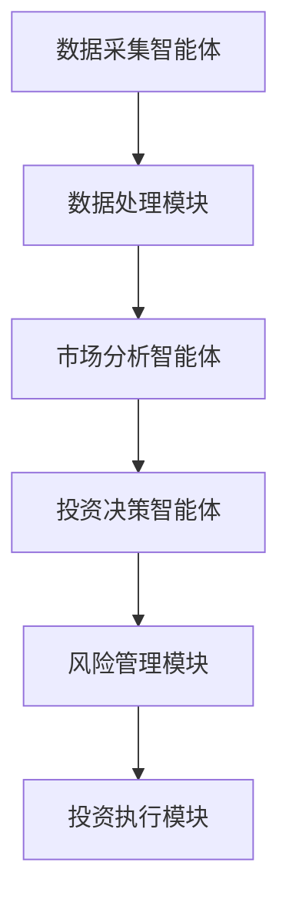

                 


```markdown
# 多智能体系统在新兴市场价值投资中的应用

> 关键词：多智能体系统，价值投资，新兴市场，算法，投资策略，市场分析

> 摘要：多智能体系统通过多个智能体的协同工作，能够在复杂多变的新兴市场中捕捉投资机会，优化投资组合，并应对市场不确定性。本文将详细探讨多智能体系统在新兴市场价值投资中的应用，包括其核心概念、算法原理、系统架构以及实际案例。

---

## 第1章 多智能体系统与价值投资概述

### 1.1 多智能体系统的定义与特点
多智能体系统（Multi-Agent System, MAS）由多个智能体组成，每个智能体都有独立的目标和决策机制。其特点包括：

1. **独立性**：每个智能体独立运作，能够自主决策。
2. **协作性**：智能体之间通过通信和协作，共同完成复杂任务。
3. **动态性**：能够适应环境变化，实时调整策略。
4. **分布式智能**：决策和计算分布在多个智能体之间，避免单点故障。

### 1.2 价值投资的核心概念
价值投资是一种以基本面分析为基础的投资策略，旨在通过识别市场中被低估的资产进行长期投资。其核心在于寻找市场价格低于内在价值的资产。

### 1.3 多智能体系统在投资中的应用价值
多智能体系统能够通过多个智能体的协同工作，捕捉市场中的多维度信息，优化投资决策。其优势包括：

1. **信息整合**：多个智能体能够从不同角度分析市场数据。
2. **风险分散**：通过分布式决策降低投资风险。
3. **动态调整**：快速响应市场变化，优化投资组合。

---

## 第2章 多智能体系统的核心概念与联系

### 2.1 多智能体系统的核心原理
多智能体系统的运作基于以下原理：

1. **自主性**：智能体能够自主决策，无需外部干预。
2. **反应性**：能够实时感知环境变化并做出反应。
3. **协作性**：通过通信和协作，共同完成复杂任务。

### 2.2 多智能体系统中的角色与责任
在新兴市场价值投资中，多智能体系统中的角色可以分为以下几类：

1. **数据采集智能体**：负责收集市场数据，如价格、成交量等。
2. **市场分析智能体**：对市场数据进行分析，识别投资机会。
3. **风险评估智能体**：评估投资风险，制定风险管理策略。

### 2.3 多智能体系统与价值投资的联系
通过多智能体系统的协同工作，价值投资者能够更有效地识别低估资产，并优化投资组合。例如：

1. **分散投资**：通过多个智能体的投资决策，分散投资风险。
2. **实时监控**：实时监控市场变化，及时调整投资策略。
3. **复杂决策**：通过多智能体的协作，做出更复杂的决策。

---

## 第3章 多智能体系统在新兴市场中的应用

### 3.1 新兴市场的特点与挑战
新兴市场通常具有以下特点：

1. **高波动性**：市场波动剧烈，难以预测。
2. **信息不对称**：市场信息不透明，投资者难以获取全面信息。
3. **政策不确定性**：政策变化频繁，影响市场走势。

### 3.2 多智能体系统在新兴市场中的优势
多智能体系统在新兴市场中的优势包括：

1. **快速响应**：能够快速适应市场波动。
2. **信息整合**：通过多个智能体整合信息，降低信息不对称。
3. **风险控制**：通过分布式决策降低投资风险。

### 3.3 多智能体系统在新兴市场的具体应用案例
以下是一个具体的应用案例：

1. **智能体协同投资**：多个智能体分别负责不同的市场分析任务，协同完成投资决策。

---

## 第4章 多智能体系统的算法原理

### 4.1 算法选择与原理
选择基于博弈论的分布式优化算法，通过多个智能体的协作实现投资决策的优化。

### 4.2 算法流程
1. **数据采集**：智能体采集市场数据。
2. **分析与决策**：每个智能体根据数据制定投资策略。
3. **协作与优化**：智能体之间协作，优化投资组合。

### 4.3 算法实现
以下是算法的伪代码示例：

```python
def investment_strategy(data):
    # 数据分析与策略制定
    pass

def collaborative_optimization():
    agents = create_agents()
    for agent in agents:
        agent.data = collect_data()
        agent.strategy = investment_strategy(agent.data)
    # 协作优化
    optimized_portfolio = optimize(agents.strategy)
    return optimized_portfolio
```

---

## 第5章 系统架构设计

### 5.1 系统功能设计
系统功能包括数据采集、市场分析、投资决策和风险管理。

### 5.2 系统架构图
以下是系统架构的Mermaid图：



---

## 第6章 项目实战

### 6.1 环境搭建
安装必要的依赖，如Python、相关库等。

### 6.2 核心代码实现
以下是核心代码示例：

```python
class InvestmentAgent:
    def __init__(self, data):
        self.data = data
        self.strategy = None

    def analyze(self):
        # 数据分析逻辑
        pass

    def decide(self):
        # 投资决策逻辑
        pass

# 创建智能体并执行策略
agent = InvestmentAgent(data)
agent.analyze()
agent.decide()
```

### 6.3 案例分析
通过具体案例分析，验证系统的有效性和优化空间。

---

## 第7章 最佳实践与总结

### 7.1 小结
多智能体系统在新兴市场价值投资中的应用具有显著优势，能够有效应对市场波动和不确定性。

### 7.2 注意事项
在实际应用中，需要注意算法的优化和智能体之间的协作效率。

### 7.3 拓展阅读
建议进一步研究多智能体系统的优化算法和新兴市场的投资策略。

---

## 作者

作者：AI天才研究院/AI Genius Institute & 禅与计算机程序设计艺术 /Zen And The Art of Computer Programming
```

