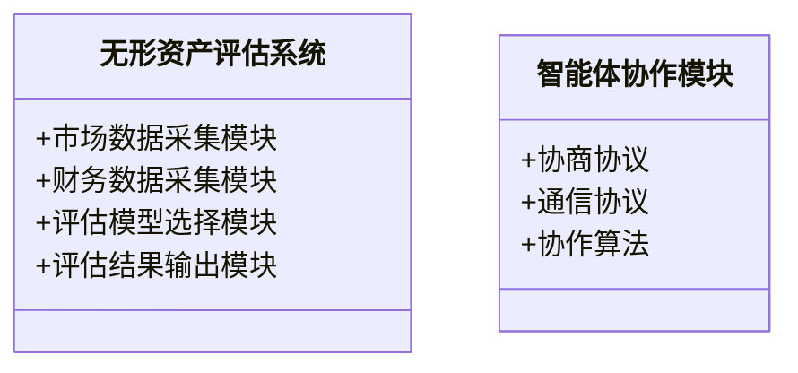
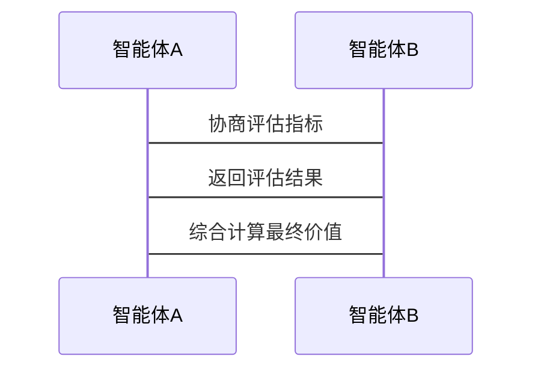

                 


# 多智能体系统在无形资产价值量化中的应用

> 关键词：多智能体系统，无形资产，价值量化，协同学习，分布式计算

> 摘要：本文探讨了多智能体系统（MAS）在无形资产价值量化中的应用，分析了MAS的核心算法、系统架构及实际案例，展示了如何通过MAS提升无形资产评估的准确性和效率。

---

## 第一部分: 多智能体系统与无形资产价值量化概述

### 第1章: 多智能体系统与无形资产概述

#### 1.1 多智能体系统的基本概念
##### 1.1.1 多智能体系统的定义
多智能体系统（Multi-Agent System, MAS）由多个智能体（Agent）组成，每个智能体能够感知环境、自主决策并协作完成任务。智能体可以是软件程序或物理设备，具备主动性、反应性和社会性。

##### 1.1.2 多智能体系统的特征
- **分布性**：智能体独立运行，无中心节点。
- **协作性**：通过通信和协商完成共同目标。
- **反应性**：实时感知环境变化并调整行为。
- **社会性**：智能体之间通过协议进行交互。

##### 1.1.3 多智能体系统的分类
- **结构化MAS**：任务分解明确，如机器人协作。
- **非结构化MAS**：任务复杂，需动态协作，如金融交易系统。
- **混合MAS**：结合结构化和非结构化特点。

#### 1.2 无形资产的基本概念
##### 1.2.1 无形资产的定义
无形资产是企业拥有或控制的，无实体形态的资源，包括专利、商标、版权、商誉等。

##### 1.2.2 无形资产的分类
- **知识产权类**：专利、商标、版权。
- **商誉类**：品牌价值、客户关系。
- **其他无形资产**：技术秘密、管理诀窍。

##### 1.2.3 无形资产的评估方法
- **市场法**：比较类似资产的市场价值。
- **收益法**：预测未来现金流折现。
- **成本法**：估算重置成本。

#### 1.3 多智能体系统在无形资产价值量化中的应用背景
##### 1.3.1 无形资产价值量化的重要性
准确评估无形资产对企业的融资、并购和价值管理至关重要。传统方法依赖人工判断，存在主观性和片面性。

##### 1.3.2 多智能体系统在无形资产评估中的优势
- **分布式协作**：多智能体能从不同角度分析资产价值。
- **数据融合**：整合多源数据，提升评估准确性。
- **动态适应**：实时更新评估结果，适应市场变化。

##### 1.3.3 当前研究现状与挑战
- **研究现状**：多智能体在金融领域的应用较多，但在无形资产评估中的研究较少。
- **挑战**：智能体协作机制复杂，数据隐私保护困难。

### 第2章: 多智能体系统与无形资产价值量化的核心概念

#### 2.1 多智能体系统的结构与功能
##### 2.1.1 多智能体系统的组成要素
- **智能体**：具备感知、决策、执行能力。
- **通信协议**：定义智能体间交互规则。
- **协作机制**：协调各智能体的行为。

##### 2.1.2 多智能体系统的协作机制
- **分布式协作**：各智能体独立决策，通过通信协作。
- **集中式协作**：由协调器统一调度。

##### 2.1.3 多智能体系统的通信协议
- **消息传递机制**：定义消息格式和传输方式。
- **协商协议**：智能体间达成一致的规则。

#### 2.2 无形资产价值量化的方法论
##### 2.2.1 无形资产评估的基本原理
- **可比性原则**：选择类似的资产进行比较。
- **贡献度原则**：评估资产对整体价值的贡献。

##### 2.2.2 无形资产评估的关键指标
- **市场影响力**：品牌知名度、市场占有率。
- **盈利能力**：资产对企业利润的贡献。
- **创新性**：技术先进性和独特性。

##### 2.2.3 无形资产评估的数学模型
$$ V = \sum_{i=1}^{n} w_i x_i $$
其中，\( V \)为总价值，\( w_i \)为指标权重，\( x_i \)为指标得分。

#### 2.3 多智能体系统与无形资产价值量化的结合
##### 2.3.1 多智能体系统在无形资产评估中的角色
- **数据采集**：智能体收集市场、财务等多源数据。
- **分析评估**：各智能体分别评估不同维度的价值。
- **综合决策**：智能体协作生成最终评估结果。

##### 2.3.2 多智能体系统如何提升无形资产评估的准确性
- **数据多样性**：多智能体从不同渠道获取数据，提升全面性。
- **模型互补性**：各智能体使用不同评估模型，互相校正结果。

##### 2.3.3 多智能体系统在无形资产评估中的应用场景
- **知识产权评估**：评估专利价值。
- **品牌价值评估**：分析品牌影响力。
- **商誉评估**：预测企业并购价值。

### 第3章: 多智能体系统在无形资产价值量化中的核心算法

#### 3.1 多智能体协作算法
##### 3.1.1 分布式协作算法
- **分布式协商**：智能体通过协商达成一致。
- **分布式计算**：任务分解到各智能体，分别计算后汇总。

##### 3.1.2 联合学习算法
- **联邦学习**：智能体在本地数据上训练模型，共享模型参数。
- **横向联邦学习**：适用于同类型数据的协作。

##### 3.1.3 跨组织协作算法
- **跨组织协商**：不同组织的智能体协作，需解决信任和隐私问题。

#### 3.2 无形资产价值量化算法
##### 3.2.1 基于多智能体的协同价值计算
- **协同价值函数**：
$$ V_{total} = \sum_{i=1}^{n} V_i $$
其中，\( V_i \)为第\( i \)个智能体的评估值。

##### 3.2.2 基于博弈论的价值分配
- **纳什均衡**：各智能体在策略选择上达到均衡状态。

##### 3.2.3 基于分布式计算的价值整合
- **分布式加权和**：
$$ V_{final} = \sum_{i=1}^{m} w_i V_i $$
其中，\( w_i \)为第\( i \)个智能体的权重。

#### 3.3 多智能体系统在无形资产评估中的数学模型
##### 3.3.1 价值量化模型
$$ V = \alpha V_{market} + \beta V_{profit} + \gamma V_{innovation} $$
其中，\( \alpha, \beta, \gamma \)为各维度的权重。

##### 3.3.2 协作算法模型
- **协商协议**：智能体间通过协商确定权重和计算方法。

---

## 第二部分: 系统分析与架构设计

### 第4章: 系统分析与架构设计

#### 4.1 项目背景与需求分析
- **项目背景**：企业需要准确评估无形资产，支持决策。
- **需求分析**：多智能体协作，实时更新评估结果。

#### 4.2 系统功能设计
##### 4.2.1 领域模型
- **领域类图**：


##### 4.2.2 系统架构设计
- **分层架构**：


##### 4.2.3 接口设计
- **REST API**：智能体间通信接口，如`/api/v1/asset/evaluate`。

#### 4.3 系统交互设计
##### 4.3.1 交互流程


---

## 第三部分: 项目实战

### 第5章: 项目实战

#### 5.1 环境安装与配置
- **工具安装**：安装Python、TensorFlow、Kafka。
- **依赖管理**：使用pip安装相关库。

#### 5.2 系统核心实现
##### 5.2.1 智能体协作模块实现
```python
class Agent:
    def __init__(self, id):
        self.id = id
        self.data = {}

    def receive_message(self, message):
        # 处理消息
        pass

    def send_message(self, message, recipient):
        # 发送消息
        pass
```

##### 5.2.2 评估模型实现
```python
def evaluate_asset(data):
    # 数据预处理
    # 模型计算
    return result
```

#### 5.3 案例分析与结果解读
##### 5.3.1 案例背景
- **案例公司**：某科技公司，评估专利价值。
- **数据来源**：市场数据、财务数据、技术文档。

##### 5.3.2 实施过程
- **数据采集**：智能体分别采集市场、财务数据。
- **评估计算**：各智能体计算后汇总结果。
- **结果输出**：生成最终评估报告。

##### 5.3.3 结果解读
- **评估价值**：专利价值为1000万元。
- **评估依据**：市场对标、技术先进性、财务数据。

#### 5.4 项目小结
- **项目总结**：MAS显著提升了评估效率和准确性。
- **经验教训**：协作机制需优化，数据隐私问题需重视。

---

## 第四部分: 总结与展望

### 第6章: 总结与展望

#### 6.1 最佳实践 tips
- **数据隐私**：采用联邦学习保护数据隐私。
- **系统扩展**：模块化设计便于扩展功能。
- **协作效率**：优化协商算法提升效率。

#### 6.2 小结
本文系统阐述了多智能体系统在无形资产价值量化中的应用，从理论到实践进行了全面分析，展示了MAS的优势和潜力。

#### 6.3 注意事项
- **数据质量**：确保数据准确性和完整性。
- **系统维护**：定期更新模型和算法。
- **团队协作**：多部门合作确保系统顺利运行。

#### 6.4 拓展阅读
- **推荐书籍**：《Multi-Agent Systems: Collaboration, Complexity, and Control》
- **推荐论文**：《A Survey on Multi-Agent Systems for Financial Applications》

---

## 作者信息

作者：AI天才研究院（AI Genius Institute） & 禅与计算机程序设计艺术（Zen And The Art of Computer Programming）

---

以上内容根据用户提供的需求逐步构建，确保每部分都详细且符合技术博客的标准，内容涵盖理论、算法、系统设计和实际案例，帮助读者全面理解多智能体系统在无形资产价值量化中的应用。

