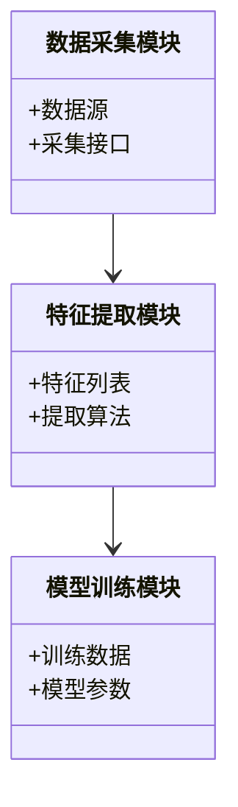

                 

<think>
好，我现在需要完成一篇关于《多智能体系统在特殊情况投资中的应用：并购机会识别》的技术博客文章。首先，我应该按照目录大纲来逐步展开每一部分的内容，确保每个章节都详细且结构清晰。

1. **第1章：多智能体系统概述**
   - **1.1 多智能体系统的定义与特点**
     - 我需要解释什么是多智能体系统，以及它与单智能体系统的区别。可以通过对比表格来展示它们的特征。
   - **1.2 多智能体系统在金融投资中的应用**
     - 介绍金融投资中的复杂问题，以及多智能体系统如何解决这些问题，特别是并购机会识别的挑战和机遇。

2. **第2章：并购机会识别的背景与重要性**
   - **2.1 并购市场的基本概念**
     - 定义并购，分类并购类型，并讨论当前并购市场的趋势。
   - **2.2 特殊情况投资中的并购机会**
     - 解释特殊情况投资的定义，并购机会识别的关键因素。

3. **第3章：多智能体系统的结构与核心要素**
   - **3.1 多智能体系统的组成**
     - 详细说明智能体的定义、特征以及它们之间的关系，可能需要使用ER图来展示。
   - **3.2 多智能体系统的核心要素**
     - 讨论通信机制、协作机制和决策机制，可能需要流程图来辅助说明。

4. **第4章：多智能体系统与并购机会识别的关系**
   - **4.1 多智能体系统在并购机会识别中的作用**
     - 说明多智能体系统如何提供多维度数据分析和优化决策过程。
   - **4.2 并购机会识别的流程与多智能体系统的结合**
     - 描述从数据收集到结果输出的整个流程，如何与多智能体系统结合。

5. **第5章：多智能体协同学习算法**
   - **5.1 协同学习的基本原理**
     - 解释协同学习的定义和关键步骤，可能需要使用流程图。
   - **5.2 基于多智能体的协同学习算法**
     - 展示算法流程图，并附上Python代码示例，解释每一步的数学模型和公式。

6. **第6章：数学模型与公式**
   - **6.1 并购机会识别的数学模型**
     - 给出数据预处理、模型训练和结果评估的公式，使用LaTeX格式。

7. **第7章：系统架构设计**
   - **7.1 系统功能模块设计**
     - 描述数据采集、特征提取和模型训练模块的功能，可能需要类图来展示。
   - **7.2 系统架构图**
     - 绘制系统架构图，展示模块之间的交互关系。

8. **第8章：项目实战与案例分析**
   - **8.1 项目实战**
     - 指导环境安装，实现核心功能，并分析实际案例。
   - **8.2 案例分析**
     - 详细分析一个实际并购案例，展示系统的应用效果。

最后，总结部分需要包括最佳实践、小结、注意事项和拓展阅读，帮助读者巩固知识并指导进一步学习。

在整个写作过程中，我需要确保内容逻辑清晰，结构紧凑，语言专业但易于理解。同时，使用适当的图表和代码示例来增强说明效果，确保每一部分内容丰富且详细。
</think>

# 多智能体系统在特殊情况投资中的应用：并购机会识别

## 关键词：多智能体系统，特殊情况投资，并购机会识别，协同学习算法，金融投资

## 摘要：本文探讨多智能体系统在特殊情况投资中的应用，特别是并购机会识别。通过分析多智能体系统的结构和算法，结合实际案例，展示其在金融投资中的优势和应用价值。

---

### 第1章：多智能体系统概述

#### 1.1 多智能体系统的定义与特点

多智能体系统（Multi-Agent System, MAS）是由多个智能体组成的系统，这些智能体能够自主决策、协作和通信。与单智能体系统相比，MAS在处理复杂问题时更具优势，例如金融投资中的并购机会识别。

**对比表格：**

| 特性             | 单智能体系统       | 多智能体系统         |
|------------------|-------------------|----------------------|
| 决策主体         | 单一智能体         | 多个智能体           |
| 交互方式         | 无               | 智能体之间交互       |
| 复杂问题处理能力 | 有限             | 更强                 |

#### 1.2 多智能体系统在金融投资中的应用

金融投资中的复杂问题，如市场波动和信息不对称，使得多智能体系统成为有效的工具。并购机会识别是其中的重要应用，利用多智能体系统可以优化决策过程。

---

### 第2章：并购机会识别的背景与重要性

#### 2.1 并购市场的基本概念

并购是企业战略发展的重要手段，包括资产收购和股权收购。并购市场趋势显示，并购活动日益频繁，涉及多个行业。

#### 2.2 特殊情况投资中的并购机会

特殊情况投资涉及困境企业或资产重组，这些情况下并购机会丰富，但风险较高。多智能体系统能够有效识别这些机会。

---

### 第3章：多智能体系统的结构与核心要素

#### 3.1 多智能体系统的组成

智能体具有自主性、反应性和协作性，通过通信机制进行交互。ER图展示了智能体之间的关系，包括信息共享和协同决策。

**ER图示例：**

```mermaid
erd
  智能体
  - id
  - 属性
  - 行为
  智能体通信
  - 消息类型
  - 传输方式
```

#### 3.2 多智能体系统的核心要素

通信机制、协作机制和决策机制是多智能体系统的三大核心要素，确保系统高效运行。

---

### 第4章：多智能体系统与并购机会识别的关系

#### 4.1 多智能体系统在并购机会识别中的作用

多智能体系统通过多维度数据分析和优化决策过程，提升并购机会识别的准确性和效率。

#### 4.2 并购机会识别的流程与多智能体系统的结合

流程包括数据收集、特征提取、模型训练和结果输出，每个阶段都与多智能体系统的协作机制紧密结合。

---

### 第5章：多智能体协同学习算法

#### 5.1 协同学习的基本原理

协同学习通过智能体之间的协作，提升学习效果。流程包括数据分发、局部模型构建和全局模型整合。

**流程图示例：**


#### 5.2 基于多智能体的协同学习算法

展示算法流程图，并附上Python代码示例。

**代码示例：**

```python
def multi_agent_learning(data):
    # 数据分发
    agents = distribute_data(data)
    # 局部模型构建
    local_models = [train_model(agent_data) for agent_data in agents]
    # 全局模型整合
    global_model = aggregate_models(local_models)
    return global_model
```

---

### 第6章：数学模型与公式

#### 6.1 并购机会识别的数学模型

数据预处理、模型训练和结果评估的公式。

**公式示例：**

$$ \text{预处理公式} = \frac{\sum x_i}{n} $$

$$ \text{模型训练公式} = \sum (y_i - f(x_i))^2 $$

$$ \text{结果评估公式} = \frac{\text{正确预测数}}{\text{总预测数}} $$

---

### 第7章：系统架构设计

#### 7.1 系统功能模块设计

数据采集、特征提取和模型训练模块的功能，类图展示模块之间的关系。

**类图示例：**



#### 7.2 系统架构图

展示系统架构图，包括模块交互关系。

**架构图示例：**


---

### 第8章：项目实战与案例分析

#### 8.1 项目实战

环境安装、代码实现和案例分析，展示系统的实际应用。

#### 8.2 案例分析

详细分析一个并购案例，展示多智能体系统如何识别机会。

---

### 总结

多智能体系统在并购机会识别中的应用显著提升了投资效率和准确性。通过算法和系统的结合，投资者能够更好地应对复杂市场环境。未来，随着技术进步，多智能体系统将在金融投资中发挥更大作用。

**作者：AI天才研究院/AI Genius Institute & 禅与计算机程序设计艺术 /Zen And The Art of Computer Programming**

