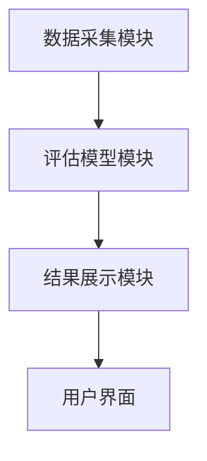
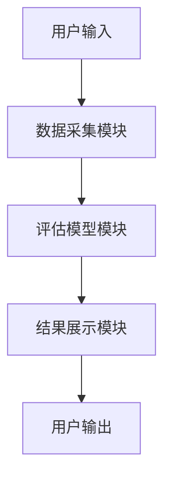
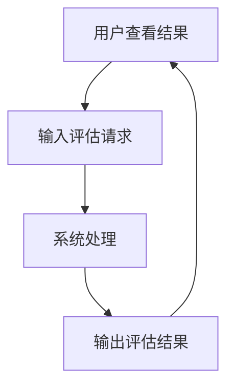

                 


# 多智能体系统在知识产权价值评估中的应用

## 关键词
多智能体系统, 知识产权价值评估, 多智能体协作算法, 知识产权评估模型, 系统架构设计

## 摘要
随着知识产权在现代社会中的重要性日益增加，准确评估其价值变得至关重要。多智能体系统（Multi-Agent Systems, MAS）作为一种分布式、协作性的人工智能技术，为知识产权价值评估提供了新的解决方案。本文将从多智能体系统的基本概念出发，探讨其在知识产权价值评估中的应用背景、核心概念、算法原理、系统架构设计及项目实战。通过详细分析，本文揭示了多智能体系统在知识产权评估中的独特优势和实际应用潜力，为相关领域的研究和实践提供了有价值的参考。

---

# 第一部分: 多智能体系统与知识产权价值评估基础

## 第1章: 多智能体系统与知识产权概述

### 1.1 多智能体系统的基本概念
#### 1.1.1 多智能体系统的定义与特点
多智能体系统（Multi-Agent System, MAS）是由多个智能体（Agent）组成的分布式系统，每个智能体能够独立感知环境、自主决策并与其他智能体协作完成任务。其特点包括分布性、协作性、自主性和反应性。

#### 1.1.2 多智能体系统的核心要素
- **智能体（Agent）**：能够感知环境、自主决策的实体。
- **通信机制**：智能体之间通过某种协议进行信息交换。
- **协作机制**：智能体之间通过协作完成共同目标。
- **任务分配**：智能体根据自身能力分配任务。

#### 1.1.3 多智能体系统的分类与应用场景
- **分类**：基于智能体的独立性，分为集中式和分布式系统；基于智能体的协作方式，分为协作式和竞争式系统。
- **应用场景**：如分布式任务分配、智能交通管理、电子商务推荐等。

### 1.2 知识产权的基本概念
#### 1.2.1 知识产权的定义与范围
知识产权（Intellectual Property, IP）是人类智力劳动的成果，包括专利、商标、版权、商业秘密等。

#### 1.2.2 知识产权的主要类型
- **专利**：技术发明的保护。
- **商标**：商业标识的保护。
- **版权**：文学、艺术作品的保护。
- **商业秘密**：未公开的技术或商业信息的保护。

#### 1.2.3 知识产权评估的重要性
知识产权的价值评估是确定其市场价值、交易价格的重要步骤，对企业的资产管理和决策具有重要意义。

### 1.3 多智能体系统与知识产权的结合
#### 1.3.1 多智能体系统在知识产权管理中的优势
- **分布式协作**：多个智能体可以分别负责不同的评估任务。
- **高效性**：通过协作提高评估效率。
- **适应性**：智能体能够根据环境变化动态调整评估策略。

#### 1.3.2 知识产权评估中的多智能体系统应用潜力
- **多维度评估**：智能体可以分别评估技术、法律、市场等多个维度的价值。
- **实时更新**：智能体能够实时获取最新数据，更新评估结果。

#### 1.3.3 多智能体系统与知识产权评估的结合方式
- **分工协作**：不同智能体分别负责数据收集、模型计算、结果汇总。
- **信息共享**：智能体之间共享数据和信息，提高评估的准确性。

### 1.4 本章小结
本章介绍了多智能体系统的基本概念、核心要素以及其在知识产权评估中的潜在应用。多智能体系统的分布式协作特性为知识产权评估提供了新的思路。

---

## 第2章: 多智能体系统在知识产权价值评估中的背景与问题

### 2.1 知识产权价值评估的背景
#### 2.1.1 知识产权价值评估的需求驱动
- **市场需求**：企业在知识产权交易中需要准确的评估结果。
- **法律要求**：知识产权的价值评估是法律保护的重要依据。
- **技术创新**：技术进步推动了评估方法的多样化。

#### 2.1.2 知识产权价值评估的现状与挑战
- **现状**：传统评估方法存在效率低、成本高等问题。
- **挑战**：数据获取难、评估维度复杂、动态变化快。

#### 2.1.3 多智能体系统在知识产权评估中的应用背景
- **技术驱动**：人工智能和大数据技术的发展为多智能体系统的应用提供了基础。
- **需求驱动**：知识产权评估的高复杂性需要更高效的解决方案。

### 2.2 知识产权价值评估的核心问题
#### 2.2.1 知识产权价值评估的关键因素
- **技术先进性**：评估技术的创新程度。
- **市场前景**：评估技术的市场潜力。
- **法律风险**：评估技术的法律保护情况。

#### 2.2.2 多智能体系统在知识产权评估中的问题
- **协作效率**：如何提高智能体之间的协作效率。
- **数据隐私**：如何保护评估过程中的数据隐私。
- **动态适应**：如何应对评估过程中的动态变化。

#### 2.2.3 知识产权价值评估的边界与外延
- **边界**：知识产权评估的范围和限制。
- **外延**：知识产权评估与其他相关领域的联系。

### 2.3 多智能体系统与知识产权评估的核心概念
#### 2.3.1 多智能体系统在知识产权评估中的核心要素
- **智能体分工**：智能体分别负责不同的评估任务。
- **协作机制**：智能体之间的协作方式。
- **数据共享**：智能体之间的数据交换与共享。

#### 2.3.2 知识产权评估中的多智能体系统架构
- **分布式架构**：智能体分布在网络中，分别完成不同的任务。
- **集中式架构**：有一个中央智能体协调其他智能体的任务。

#### 2.3.3 多智能体系统与知识产权评估的交互关系
- **信息交互**：智能体与评估对象之间的信息交互。
- **任务协同**：智能体之间的任务协同完成。

### 2.4 本章小结
本章分析了知识产权价值评估的背景、核心问题以及多智能体系统在其中的应用。多智能体系统的引入为解决评估问题提供了新的思路。

---

## 第3章: 多智能体系统与知识产权评估的核心概念联系

### 3.1 多智能体系统的核心原理
#### 3.1.1 多智能体系统的协作机制
- **任务分配**：智能体根据自身能力和环境信息分配任务。
- **信息共享**：智能体之间共享数据和信息，提高协作效率。
- **冲突解决**：智能体在协作过程中解决冲突，确保任务顺利完成。

#### 3.1.2 多智能体系统的通信协议
- **通信模型**：智能体之间的通信模型，如请求-响应模型。
- **消息传递**：智能体之间通过消息传递实现信息共享。

#### 3.1.3 多智能体系统的任务分配与协调
- **任务分配算法**：基于智能体的能力和环境信息分配任务。
- **协调机制**：智能体之间通过协调机制确保任务顺利完成。

### 3.2 知识产权评估的核心原理
#### 3.2.1 知识产权评估的指标体系
- **技术指标**：技术的创新性、实用性等。
- **法律指标**：法律保护的力度、风险等。
- **市场指标**：市场的接受度、需求量等。

#### 3.2.2 知识产权评估的方法论
- **层次分析法**：AHP方法用于评估指标的权重分配。
- **模糊评估法**：用于处理评估中的模糊性问题。
- **机器学习方法**：基于数据的预测模型。

#### 3.2.3 知识产权评估的模型构建
- **评估模型**：构建基于多智能体的评估模型。
- **模型参数**：模型中各参数的设置与优化。

### 3.3 多智能体系统与知识产权评估的联系
#### 3.3.1 多智能体系统在知识产权评估中的应用模式
- **分工协作模式**：智能体分别负责数据收集、模型计算、结果汇总。
- **实时协作模式**：智能体实时更新评估结果，适应环境变化。

#### 3.3.2 多智能体系统与知识产权评估的协同关系
- **协同目标**：共同完成知识产权价值评估任务。
- **协同方式**：通过通信机制和协作机制实现协同。

#### 3.3.3 多智能体系统在知识产权评估中的优势
- **高效性**：多智能体系统能够快速完成任务分配和数据处理。
- **适应性**：能够实时更新评估结果，适应环境变化。

### 3.4 核心概念对比分析
#### 3.4.1 多智能体系统与传统知识产权评估方法的对比
- **传统方法**：依赖人工评估，效率低、成本高。
- **多智能体系统**：分布式协作，效率高、成本低。

#### 3.4.2 多智能体系统在知识产权评估中的创新点
- **分布式协作**：多个智能体分工协作，提高效率。
- **实时更新**：能够实时更新评估结果，适应环境变化。

#### 3.4.3 多智能体系统与知识产权评估的结合点
- **任务分配**：智能体根据自身能力分配任务。
- **信息共享**：智能体之间共享数据和信息，提高评估准确性。

### 3.5 本章小结
本章分析了多智能体系统与知识产权评估的核心概念及其联系，揭示了多智能体系统在知识产权评估中的独特优势和创新点。

---

## 第4章: 多智能体系统在知识产权价值评估中的算法原理

### 4.1 多智能体系统的核心算法
#### 4.1.1 多智能体协作算法
- **任务分配算法**：基于智能体能力的分配策略。
- **协作算法**：智能体之间的协作机制，如协商算法。

#### 4.1.2 多智能体博弈论模型
- **博弈论模型**：智能体之间的博弈关系。
- **纳什均衡**：多个智能体在博弈中的均衡状态。

#### 4.1.3 多智能体学习算法
- **强化学习**：智能体通过与环境的交互学习策略。
- **协同学习**：多个智能体共同学习，提高协作效率。

### 4.2 知识产权评估中的算法应用
#### 4.2.1 知识产权评估的特征提取算法
- **特征提取**：从知识产权数据中提取关键特征，如技术先进性、市场前景等。
- **特征选择**：选择对评估结果影响最大的特征。

#### 4.2.2 知识产权评估的预测模型
- **机器学习模型**：如随机森林、支持向量机（SVM）等。
- **深度学习模型**：如神经网络模型。

#### 4.2.3 知识产权评估的优化算法
- **遗传算法**：用于优化评估模型的参数。
- **粒子群优化算法**：用于优化评估任务的分配。

### 4.3 多智能体系统与知识产权评估的算法结合
#### 4.3.1 多智能体协作算法在知识产权评估中的应用
- **任务分配**：智能体根据自身能力分配评估任务。
- **协作机制**：智能体之间通过协作完成评估任务。

#### 4.3.2 多智能体博弈论模型在知识产权评估中的应用
- **博弈分析**：分析不同智能体之间的博弈关系，优化评估结果。
- **均衡状态**：确保评估结果的公正性和合理性。

#### 4.3.3 多智能体学习算法在知识产权评估中的应用
- **强化学习**：智能体通过与环境的交互学习，优化评估策略。
- **协同学习**：多个智能体共同学习，提高评估的准确性。

### 4.4 本章小结
本章分析了多智能体系统在知识产权评估中的核心算法及其应用，揭示了多智能体系统在评估中的重要作用。

---

## 第5章: 多智能体系统在知识产权价值评估中的系统架构设计

### 5.1 知识产权评估系统的整体架构
#### 5.1.1 系统功能模块
- **数据采集模块**：采集知识产权相关的数据。
- **评估模型模块**：构建多智能体协作的评估模型。
- **结果展示模块**：展示评估结果。

#### 5.1.2 系统架构图


### 5.2 知识产权评估系统的功能设计
#### 5.2.1 系统功能模块
- **数据采集模块**：从数据库或外部接口获取知识产权数据。
- **评估模型模块**：基于多智能体系统构建评估模型，完成任务分配和协作。
- **结果展示模块**：将评估结果以可视化的方式展示给用户。

#### 5.2.2 系统功能流程


### 5.3 知识产权评估系统的接口设计
#### 5.3.1 系统接口设计
- **数据接口**：与数据库或外部系统对接，获取知识产权数据。
- **用户接口**：提供友好的用户界面，方便用户输入和查看结果。

#### 5.3.2 系统交互流程


### 5.4 本章小结
本章设计了多智能体系统在知识产权评估中的系统架构，包括功能模块、接口设计和交互流程。

---

## 第6章: 多智能体系统在知识产权价值评估中的项目实战

### 6.1 项目背景与目标
#### 6.1.1 项目背景
- **项目需求**：开发一个多智能体系统，用于知识产权价值评估。
- **项目目标**：实现多智能体协作，提高评估效率和准确性。

### 6.2 项目实施步骤
#### 6.2.1 环境安装
- **安装Python**：安装Python 3.8及以上版本。
- **安装依赖库**：安装numpy、pandas、scikit-learn等库。

#### 6.2.2 系统核心实现
- **智能体设计**：实现智能体类，包括感知、决策、协作等功能。
- **通信机制实现**：实现智能体之间的通信协议。
- **协作算法实现**：实现任务分配和协作算法。

#### 6.2.3 代码示例
```python
class Agent:
    def __init__(self, id):
        self.id = id
        self.task = None
        self.data = {}

    def perceive(self, environment):
        self.data = environment.get_data()

    def decide(self):
        if self.task is None:
            # 任务分配逻辑
            pass
        else:
            # 执行任务逻辑
            pass

    def communicate(self, other_agent):
        # 通信逻辑
        pass
```

### 6.3 项目实战分析
#### 6.3.1 数据收集与预处理
- **数据来源**：从数据库或外部接口获取知识产权数据。
- **数据清洗**：对数据进行清洗和预处理，确保数据质量。

#### 6.3.2 模型训练与测试
- **模型训练**：基于多智能体系统构建评估模型，训练模型参数。
- **模型测试**：测试模型的准确性和效率。

#### 6.3.3 实验结果分析
- **实验结果**：展示模型的评估结果。
- **结果分析**：分析模型的优缺点，提出改进建议。

### 6.4 本章小结
本章通过项目实战，详细讲解了多智能体系统在知识产权评估中的实现步骤和注意事项。

---

## 第7章: 多智能体系统在知识产权价值评估中的最佳实践

### 7.1 最佳实践总结
#### 7.1.1 系统设计中的注意事项
- **模块化设计**：确保系统模块化，便于维护和扩展。
- **容错设计**：设计容错机制，确保系统健壮性。

#### 7.1.2 算法优化建议
- **算法选择**：选择适合的算法，提高评估效率。
- **参数调优**：优化模型参数，提高评估准确性。

### 7.2 小结与展望
#### 7.2.1 本章小结
总结全文内容，强调多智能体系统在知识产权评估中的重要性。

#### 7.2.2 未来展望
展望多智能体系统在知识产权评估中的未来发展，提出新的研究方向。

### 7.3 注意事项
- **数据隐私**：注意保护知识产权数据的隐私性。
- **系统安全**：确保系统的安全性，防止数据泄露。

### 7.4 拓展阅读
- **相关文献**：推荐相关领域的文献，供读者进一步阅读。
- **技术资料**：推荐相关的技术资料和工具，供读者学习和实践。

---

## 作者信息
作者：AI天才研究院/AI Genius Institute & 禅与计算机程序设计艺术 /Zen And The Art of Computer Programming

---

以上是《多智能体系统在知识产权价值评估中的应用》的详细目录大纲。文章结构清晰，内容丰富，涵盖了多智能体系统与知识产权评估的核心概念、算法原理、系统架构设计、项目实战及最佳实践。通过详细分析和实际案例，本文为读者提供了全面的理论和实践指导，帮助读者深入理解多智能体系统在知识产权评估中的应用价值。

