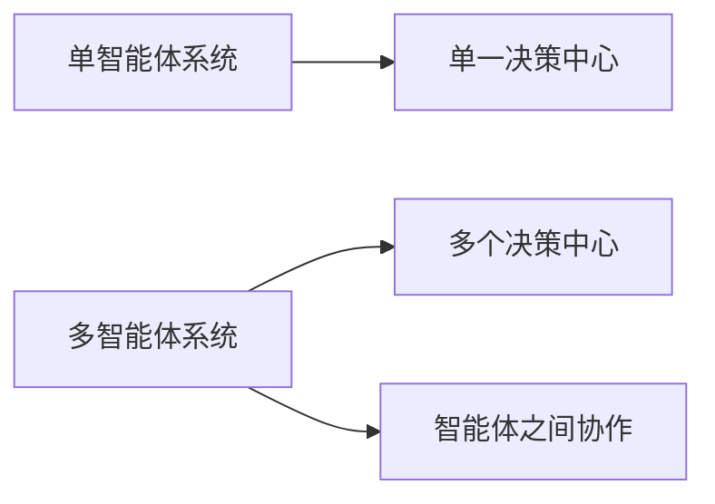
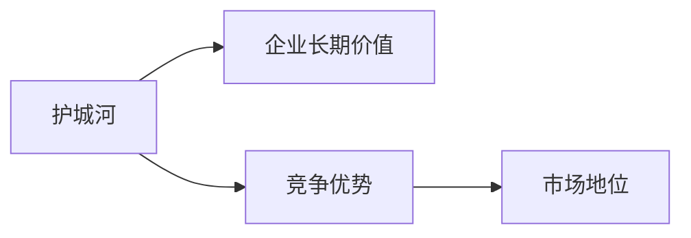
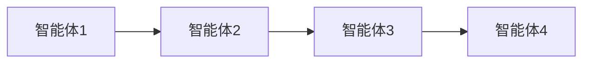
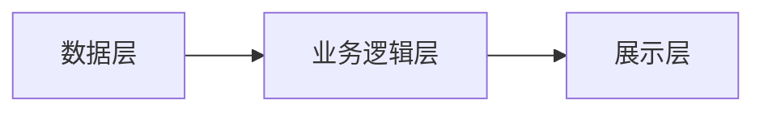

                 

<think>
嗯，用户希望我撰写一篇关于多智能体系统在竞争优势分析中的应用的文章，并且已经提供了一个详细的目录大纲。用户还给出了具体的格式要求和内容约束，比如使用Markdown，包含关键词、摘要，以及每个章节的详细内容。

首先，我需要理解用户的需求。用户可能是一位技术专家或企业战略规划者，希望系统地介绍多智能体系统在竞争优势分析中的应用，特别是如何帮助寻找企业的护城河。用户提供的目录结构已经非常详细，涵盖了从基础概念到系统设计和实战应用的各个方面。

接下来，我需要按照用户的要求，逐步完成每个章节的内容。首先是文章标题、关键词和摘要。这些部分需要简洁明了，概括文章的核心内容。然后是每一章的详细内容，包括背景、核心概念、算法原理、系统架构、项目实战等部分。每个部分都需要详细展开，使用Mermaid图、Python代码和数学公式来说明。

我还需要确保文章的结构符合逻辑，每个章节之间有良好的连贯性。例如，从基础概念到算法原理，再到系统设计，最后到实战应用，这样的流程能够帮助读者逐步理解多智能体系统在竞争优势分析中的应用。

在撰写过程中，我需要特别注意使用清晰的技术术语，同时保持语言的简洁易懂。例如，在解释多智能体系统的数学模型时，我需要使用数学公式和图表来辅助说明，确保读者能够理解复杂的概念。

另外，用户还提到文章末尾需要有作者信息，以及注意事项和拓展阅读等内容。这些部分需要简短但有力，帮助读者在阅读完文章后有所启发，并指导他们进一步的学习和实践。

最后，我需要检查文章的整体字数，确保在10000到12000字之间。这可能意味着每个章节需要详细展开，提供足够的内容，同时避免冗长。例如，在项目实战部分，我需要包括环境搭建、数据准备、系统实现、案例分析等多个步骤，确保内容的全面性。

总的来说，撰写这篇文章需要系统地按照用户提供的目录结构进行，确保每个部分都详细且符合要求。同时，要注意使用恰当的工具和技术，如Mermaid图、Python代码和数学公式，来增强文章的可读性和专业性。这将帮助读者全面理解多智能体系统在竞争优势分析中的应用，并能够实际应用这些知识来寻找企业的护城河。
</think>

# 多智能体系统在竞争优势分析中的应用：寻找护城河

> **关键词**：多智能体系统，竞争优势分析，护城河，分布式计算，博弈论，系统架构设计

> **摘要**：  
> 在当今竞争激烈的商业环境中，企业需要找到一种有效的方法来分析和构建自身的竞争优势。多智能体系统（Multi-Agent Systems, MAS）作为一种分布式、协作式的计算范式，能够帮助企业从多个维度分析市场动态、竞争对手行为以及内部资源，从而找到企业的“护城河”。本文将从多智能体系统的概念出发，结合竞争优势分析的背景与需求，详细探讨多智能体系统在竞争优势分析中的应用场景、算法原理、系统架构设计以及项目实战，最终帮助企业利用多智能体系统构建和巩固自身的竞争优势。

---

## 第1章: 多智能体系统概述

### 1.1 多智能体系统的基本概念

#### 1.1.1 多智能体系统的定义  
多智能体系统（Multi-Agent Systems, MAS）是由多个具有自主性、反应性、协作性和社会性的智能体组成的分布式系统。这些智能体能够通过通信和协作，共同完成复杂任务。

#### 1.1.2 多智能体系统的特征  
| 特性       | 描述                                                                 |
|------------|----------------------------------------------------------------------|
| 自主性      | 每个智能体都有自己的目标和决策机制，能够独立行动。                     |
| 反应性      | 智能体能够感知环境并实时响应。                                       |
| 分布式      | 智能体之间通过分布式计算和通信协作完成任务。                         |
| 社会性      | 智能体之间通过交互和协作实现目标。                                   |

#### 1.1.3 多智能体系统与单智能体系统的区别  


---

### 1.2 竞争优势分析的背景与意义

#### 1.2.1 企业竞争优势的定义  
竞争优势是指企业在市场中相对于竞争对手的独特的优势，能够为企业创造超额价值。

#### 1.2.2 竞争优势的核心要素  
| 要素       | 描述                                                                 |
|------------|----------------------------------------------------------------------|
| 资源       | 包括技术、资金、人才等资源。                                         |
| 核心能力   | 企业的独特技能或能力，能够为客户创造价值。                         |
| 市场定位   | 企业在市场中的位置和目标客户群体。                                   |
| 运营效率   | 包括生产效率、管理效率等。                                           |

#### 1.2.3 竞争优势分析的重要性  
竞争优势分析帮助企业识别自身的优势和劣势，制定有效的竞争策略，从而在市场中占据有利地位。

---

### 1.3 护城河的定义与作用

#### 1.3.1 护城河的定义  
护城河是指企业拥有的独特资源或能力，能够阻止竞争对手轻易模仿或超越。

#### 1.3.2 护城河的分类  
| 类型       | 描述                                                                 |
|------------|----------------------------------------------------------------------|
| 资源型护城河 | 企业通过拥有独特的资源（如专利、原材料）形成竞争优势。         |
| 知识型护城河 | 企业通过掌握独特的知识或技术形成竞争优势。                     |
| 运营型护城河 | 企业通过高效的运营模式降低成本，形成竞争优势。                   |
| 品牌型护城河 | 企业通过强大的品牌影响力吸引客户。                               |

#### 1.3.3 护城河与企业长期价值的关系  


---

## 第2章: 多智能体系统在竞争优势分析中的应用背景

### 2.1 当前竞争优势分析的挑战

#### 2.1.1 市场竞争的复杂性增加  
现代市场竞争日益复杂，竞争对手的数量和行为多样化，传统的竞争优势分析方法难以应对。

#### 2.1.2 数据量的爆炸式增长  
企业需要处理海量数据，包括市场数据、竞争对手数据、客户数据等，传统的分析方法效率低下。

#### 2.1.3 传统竞争优势分析方法的局限性  
传统方法通常基于静态分析，难以捕捉动态竞争环境中的机会和威胁。

---

### 2.2 多智能体系统的优势

#### 2.2.1 分布式计算能力  
多智能体系统能够利用分布式计算能力，实时处理和分析海量数据。

#### 2.2.2 自适应能力  
多智能体系统能够根据环境变化动态调整策略，适应市场竞争的快速变化。

#### 2.2.3 多维度数据处理能力  
多智能体系统能够从多个维度（如市场、技术、客户）分析竞争优势，提供全面的视角。

---

## 第3章: 多智能体系统的数学模型与算法原理

### 3.1 多智能体系统的数学模型

#### 3.1.1 状态空间模型  
状态空间模型描述了智能体在不同状态下的行为。例如：

$$
\text{状态} = \{s_1, s_2, \dots, s_n\}
$$

#### 3.1.2 行为决策模型  
行为决策模型描述了智能体在不同状态下的决策过程。例如：

$$
\text{决策} = \argmax_{a \in A} \text{Utility}(a)
$$

#### 3.1.3 交互关系模型  
交互关系模型描述了智能体之间的交互关系。例如：

$$
\text{交互} = \sum_{i=1}^{n} \text{收益}(i)
$$

---

### 3.2 竞争优势分析的算法原理

#### 3.2.1 基于博弈论的决策模型  
博弈论模型描述了智能体之间的竞争与合作关系。例如：

$$
\text{纳什均衡} = \{a^*, b^*\}
$$

#### 3.2.2 基于图论的网络分析  
网络分析模型描述了智能体之间的关系网络。例如：



#### 3.2.3 基于聚类分析的竞争对手识别  
聚类分析模型用于识别竞争对手。例如：

$$
\text{聚类} = \{C_1, C_2, \dots, C_k\}
$$`

---

## 第4章: 竞争优势分析的系统架构设计

### 4.1 系统功能模块划分

#### 4.1.1 数据采集模块  
数据采集模块负责采集市场数据、竞争对手数据和客户数据。

#### 4.1.2 数据分析模块  
数据分析模块负责对数据进行清洗、建模和分析。

#### 4.1.3 竞争优势评估模块  
竞争优势评估模块负责评估企业的竞争优势，并生成报告。

---

### 4.2 系统架构设计

#### 4.2.1 分层架构设计  
分层架构包括数据层、业务逻辑层和展示层。



#### 4.2.2 模块化设计  
模块化设计将系统划分为多个功能模块，每个模块独立开发和测试。

#### 4.2.3 可扩展性设计  
系统设计注重可扩展性，以便未来功能的扩展和升级。

---

## 第5章: 项目实战——构建多智能体竞争优势分析系统

### 5.1 环境搭建与数据准备

#### 5.1.1 开发环境安装  
安装Python、Jupyter Notebook和相关库（如numpy、pandas、scikit-learn）。

#### 5.1.2 数据源选择与获取  
从公开数据源（如Kaggle、Google BigQuery）获取市场数据和竞争对手数据。

#### 5.1.3 数据预处理  
对数据进行清洗、转换和标准化处理。

---

### 5.2 系统核心功能实现

#### 5.2.1 数据采集模块实现  
```python
import requests

def fetch_data(url):
    response = requests.get(url)
    return response.json()
```

#### 5.2.2 竞争优势评估算法实现  
```python
from sklearn.cluster import KMeans

def analyze_competition(data):
    model = KMeans(n_clusters=3)
    model.fit(data)
    return model.labels_
```

#### 5.2.3 系统界面设计  
系统界面包括数据输入、分析结果展示和报告生成三个部分。

---

### 5.3 实际案例分析

#### 5.3.1 案例背景  
某企业希望分析其在某行业的竞争优势，数据包括市场规模、竞争对手市场份额和客户满意度。

#### 5.3.2 数据分析与解读  
通过聚类分析，识别出主要竞争对手，并评估自身的竞争优势。

#### 5.3.3 竞争优势评估  
根据分析结果，识别出企业的资源型护城河和知识型护城河。

---

## 第6章: 最佳实践与总结

### 6.1 最佳实践 tips  
- 定期更新数据和模型，以适应市场变化。
- 结合企业实际需求，灵活调整系统功能。
- 加强智能体之间的协作，提高系统效率。

### 6.2 小结  
多智能体系统在竞争优势分析中的应用为企业提供了一种全新的视角和方法，能够帮助企业识别和构建竞争优势，从而在激烈的市场竞争中占据优势地位。

### 6.3 注意事项  
- 确保数据质量和隐私安全。
- 系统设计注重可扩展性和可维护性。
- 加强团队协作，确保系统开发和应用的顺利进行。

### 6.4 拓展阅读  
- 推荐阅读《多智能体系统与分布式计算》。
- 推荐学习博弈论和网络分析的相关知识。

---

**作者：AI天才研究院/AI Genius Institute & 禅与计算机程序设计艺术 /Zen And The Art of Computer Programming**

