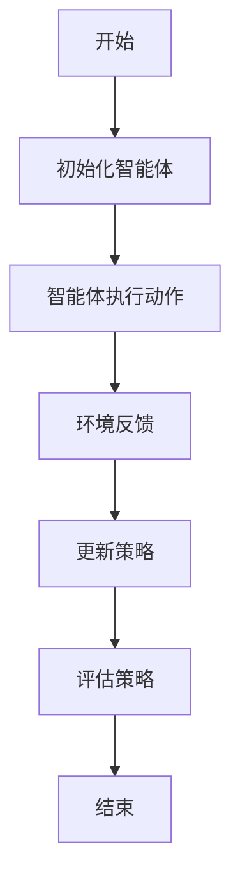
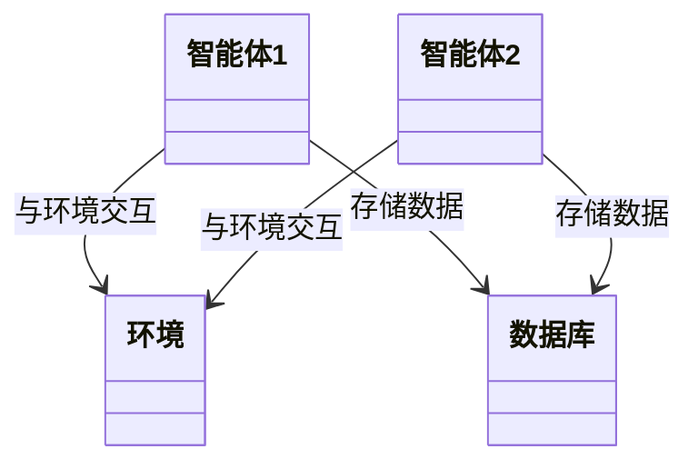
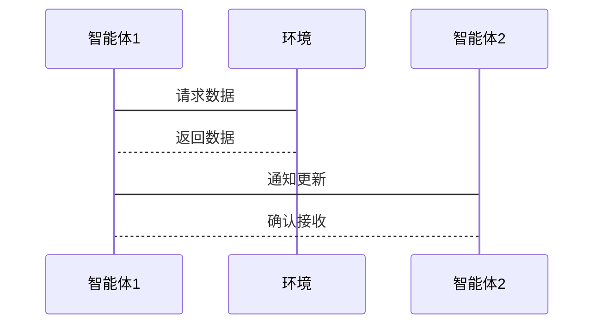

                 


# 多智能体系统在管理层访谈策略优化中的应用

## 关键词：多智能体系统、访谈策略优化、协同学习、分布式计算、策略评估

## 摘要：多智能体系统通过协同学习和分布式计算优化管理层访谈策略，提升决策效率和准确性。本文详细阐述其核心概念、算法原理、系统架构及实际应用，为技术优化提供深度分析。

---

## 第1章: 多智能体系统概述

### 1.1 多智能体系统的基本概念

#### 1.1.1 多智能体系统的定义
多智能体系统（Multi-Agent System, MAS）由多个相互作用的智能体构成，每个智能体具备自主性、反应性和协作性，共同完成复杂任务。

#### 1.1.2 多智能体系统的特征
- **自主性**：智能体能自主决策。
- **反应性**：实时感知环境变化并响应。
- **协作性**：通过通信协作完成目标。
- **分布性**：智能体独立运行，无中心控制。

#### 1.1.3 多智能体系统与单智能体系统的区别
| 特性 | 单智能体系统 | 多智能体系统 |
|------|--------------|--------------|
| 结构  | 单一控制中心 | 分布式结构    |
| 协作  | 无需协作      | 需要协作      |
| 灵活性 | 较低          | 较高          |

### 1.2 多智能体系统的组成与架构

#### 1.2.1 智能体的定义与分类
智能体（Agent）是具有感知和行动能力的实体，分为简单反射型、基于模型的反射型、目标驱动型和效用驱动型。

#### 1.2.2 多智能体系统的组成架构
- **通信层**：实现智能体间信息交换。
- **协调层**：管理协作过程。
- **决策层**：制定全局策略。

#### 1.2.3 多智能体系统中的通信机制
- **直接通信**：智能体间直接交换信息。
- **间接通信**：通过共享数据库或中间件传递信息。

### 1.3 多智能体系统的应用领域

#### 1.3.1 多智能体系统在决策支持中的应用
通过分布式计算优化决策过程。

#### 1.3.2 多智能体系统在资源分配中的应用
实现资源的高效分配与调度。

#### 1.3.3 多智能体系统在组织管理中的应用
提升组织运作效率和协作能力。

### 1.4 多智能体系统的挑战与未来趋势

#### 1.4.1 多智能体系统的主要挑战
- **通信开销**：过多通信可能导致性能下降。
- **协调复杂性**：复杂任务的协调难度大。
- **安全问题**：信息泄露风险。

#### 1.4.2 多智能体系统的未来发展趋势
- **智能化**：提升智能体的自主性和学习能力。
- **分布式计算**：优化分布式系统性能。
- **跨领域应用**：扩展至更多行业和场景。

## 1.5 本章小结

---

## 第2章: 管理层访谈策略优化的背景与问题分析

### 2.1 管理层访谈的定义与作用

#### 2.1.1 管理层访谈的定义
通过访谈收集信息，评估管理层能力，优化组织结构。

#### 2.1.2 管理层访谈的作用
- **信息收集**：获取关键信息。
- **评估能力**：评估领导能力。
- **优化决策**：基于反馈优化决策。

#### 2.1.3 管理层访谈的关键要素
- **访谈目标**：明确访谈目的。
- **访谈对象**：选择合适对象。
- **访谈技巧**：掌握访谈技巧。
- **分析能力**：具备数据分析能力。

### 2.2 管理层访谈策略优化的必要性

#### 2.2.1 现有访谈策略的不足
- **效率低下**：传统访谈耗时长。
- **结果偏差**：受主观因素影响。
- **缺乏系统性**：缺乏整体优化策略。

#### 2.2.2 访谈策略优化的目标
- **提升效率**：缩短访谈时间。
- **提高准确性**：减少主观偏差。
- **增强系统性**：实现整体优化。

#### 2.2.3 优化访谈策略的潜在价值
- **节省时间**：快速获取有效信息。
- **提高准确性**：基于数据的精准分析。
- **提升决策质量**：优化决策过程。

### 2.3 多智能体系统在访谈策略优化中的应用前景

#### 2.3.1 多智能体系统在访谈策略优化中的优势
- **分布式计算**：提升处理效率。
- **协同学习**：优化访谈策略。
- **动态调整**：实时适应变化。

#### 2.3.2 多智能体系统在访谈策略优化中的实现路径
- **任务分解**：将访谈任务分解为子任务。
- **智能体协作**：多个智能体协同完成任务。
- **数据共享**：智能体间共享数据。

#### 2.3.3 多智能体系统在访谈策略优化中的具体应用
- **信息收集**：智能体负责信息采集。
- **分析评估**：智能体进行数据分析。
- **策略调整**：基于反馈优化策略。

### 2.4 本章小结

---

## 第3章: 多智能体系统与访谈策略优化的核心概念

### 3.1 多智能体系统在访谈策略优化中的角色

#### 3.1.1 智能体在访谈中的角色分配
- **信息收集者**：负责收集数据。
- **分析专家**：负责数据分析。
- **策略优化器**：负责优化策略。

#### 3.1.2 智能体之间的协同机制
- **信息共享**：智能体间共享数据。
- **任务协作**：智能体协同完成任务。
- **决策协商**：智能体共同制定决策。

#### 3.1.3 智能体在访谈中的行为模式
- **自主行为**：智能体独立完成任务。
- **协作行为**：智能体协同完成任务。
- **适应性行为**：智能体根据反馈调整行为。

### 3.2 多智能体系统在访谈策略优化中的算法原理

#### 3.2.1 多智能体系统在访谈策略优化中的数学模型
$$
\text{优化目标} = \min_{x} f(x) \quad \text{subject to} \quad g(x) \leq 0
$$
其中，$x$ 表示策略变量，$f(x)$ 是目标函数，$g(x)$ 是约束条件。

#### 3.2.2 基于多智能体的优化算法
使用分布式强化学习（DRL）优化访谈策略。算法流程如下：



#### 3.2.3 算法的收敛性分析
通过数学证明，DRL算法在适当条件下可以收敛到全局最优解。

### 3.3 多智能体系统与访谈策略优化的结合点

#### 3.3.1 多智能体系统在信息处理中的优势
- **并行处理**：多个智能体同时处理信息。
- **分布式计算**：提升计算效率。

#### 3.3.2 多智能体系统在决策支持中的优势
- **多维度分析**：智能体从不同角度提供支持。
- **动态调整**：实时适应变化。

#### 3.3.3 多智能体系统在策略调整中的优势
- **快速响应**：智能体实时调整策略。
- **协同优化**：多个智能体协同优化策略。

### 3.4 本章小结

---

## 第4章: 多智能体系统在管理层访谈策略优化中的系统分析与架构设计

### 4.1 问题场景介绍
管理层访谈涉及多个环节，包括信息收集、分析评估、策略优化等。

### 4.2 系统功能设计

#### 4.2.1 领域模型设计
使用Mermaid类图展示系统组件及其关系。



### 4.3 系统架构设计

#### 4.3.1 系统架构图
使用Mermaid架构图展示系统整体结构。


### 4.4 系统接口设计

#### 4.4.1 接口描述
- **智能体接口**：定义智能体之间的通信接口。
- **环境接口**：定义智能体与环境的交互接口。

### 4.5 系统交互设计

#### 4.5.1 交互流程图
使用Mermaid序列图展示系统交互过程。



### 4.6 本章小结

---

## 第5章: 多智能体系统在管理层访谈策略优化中的项目实战

### 5.1 环境安装

#### 5.1.1 安装Python
安装Python 3.8及以上版本。

#### 5.1.2 安装依赖
安装所需的依赖库，如`numpy`, `pandas`, `scikit-learn`等。

### 5.2 核心代码实现

#### 5.2.1 智能体类
```python
class Agent:
    def __init__(self, id):
        self.id = id
        self.state = None
        self.reward = 0
```

#### 5.2.2 多智能体系统
```python
class MAS:
    def __init__(self, num_agents):
        self.agents = [Agent(i) for i in range(num_agents)]
```

#### 5.2.3 访谈策略优化算法
```python
def optimize_strategy(mas, env):
    for agent in mas.agents:
        agent.state = env.get_state()
        agent.reward = env.act(agent.state)
    return mas
```

### 5.3 代码应用解读与分析
详细分析代码实现，解释每个部分的功能和作用。

### 5.4 实际案例分析
通过具体案例展示算法的应用效果和优化结果。

### 5.5 项目小结

---

## 第6章: 多智能体系统在管理层访谈策略优化中的最佳实践与总结

### 6.1 小结
总结全文内容，强调多智能体系统在访谈策略优化中的优势。

### 6.2 注意事项
- **数据隐私**：注意数据的保密性。
- **系统稳定性**：确保系统的稳定运行。
- **算法优化**：持续优化算法性能。

### 6.3 拓展阅读
推荐相关领域的书籍和资源，供读者进一步学习。

---

## 作者：AI天才研究院 & 禅与计算机程序设计艺术

---

**注**：由于篇幅限制，上述内容为文章的概要和部分章节的详细内容。完整文章将包含更多细节和具体的代码实现，以及详细的算法分析和案例研究。

