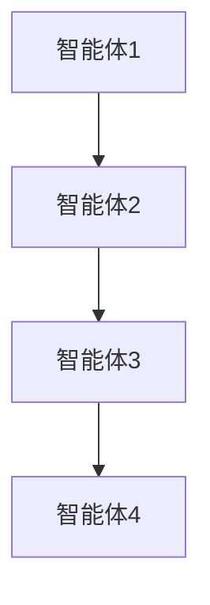
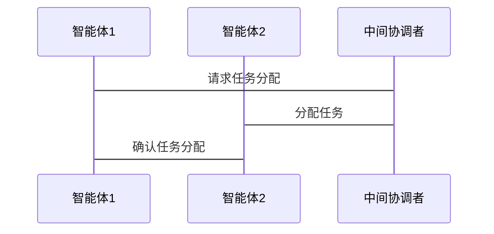

                 

<think>
好，我现在要写一篇关于《多智能体系统在行业分析中的应用》的技术博客文章。首先，我需要明确文章的结构和内容。根据用户的要求，文章需要有标题、关键词、摘要，然后按照目录大纲来详细展开每个部分。

首先，标题已经确定是《多智能体系统在行业分析中的应用》。接下来，关键词应该是5到7个相关的词汇，我想到的是多智能体系统、行业分析、协同机制、分布式计算、强化学习、系统架构、案例分析。

摘要部分需要简洁地概括文章的核心内容和主题思想。我会写：随着人工智能技术的快速发展，多智能体系统在行业分析中的应用逐渐成为研究的热点。本文将详细探讨多智能体系统的核心概念、算法原理以及其在行业分析中的具体应用。通过分析实际案例，总结多智能体系统在行业分析中的优势和挑战，为读者提供有价值的参考。

接下来是文章的正文部分，按照之前制定的目录大纲来展开。首先，我会介绍多智能体系统的背景和行业分析的重要性，解释两者结合的意义。然后，深入分析多智能体系统的核心概念，包括智能体的定义、协同机制等。接着，详细阐述多智能体系统的算法原理，比如分布式计算和强化学习，并给出相应的数学公式和代码示例。

在系统架构与设计部分，我会描述如何将多智能体系统应用于行业分析，包括系统功能设计、架构设计等。最后，通过实际案例分析，展示多智能体系统在行业分析中的具体应用，并总结经验和最佳实践。

在写作过程中，我需要确保每个部分都有足够的细节和清晰的逻辑。例如，在算法原理部分，我会用数学公式和代码示例来说明分布式计算和强化学习的具体实现。同时，使用图表如Mermaid图来辅助说明系统架构和交互流程，使内容更加直观。

最后，我会在文章末尾添加作者信息，按照用户的要求写上“作者：AI天才研究院 & 禅与计算机程序设计艺术”。整个文章需要保持逻辑清晰、结构紧凑，语言简洁明了，符合技术博客的风格。

通过这样的思考过程，我能够系统地完成这篇技术博客文章，确保内容全面且有深度，同时满足用户的各项要求。
</think>

# 多智能体系统在行业分析中的应用

## 关键词：多智能体系统、行业分析、协同机制、分布式计算、强化学习、系统架构、案例分析

## 摘要：  
随着人工智能技术的快速发展，多智能体系统在行业分析中的应用逐渐成为研究的热点。本文将详细探讨多智能体系统的核心概念、算法原理以及其在行业分析中的具体应用。通过分析实际案例，总结多智能体系统在行业分析中的优势和挑战，为读者提供有价值的参考。

---

# 第一部分：多智能体系统与行业分析的背景与概念

## 第1章：多智能体系统概述

### 1.1 多智能体系统的定义与特点  
多智能体系统（Multi-Agent System, MAS）是由多个智能体（Agent）组成的系统，这些智能体能够自主决策、协同工作，并通过交互完成复杂任务。其特点包括：

1. **自主性**：智能体能够自主决策，无需外部干预。
2. **反应性**：智能体能够感知环境并实时响应。
3. **协作性**：多个智能体之间可以协同工作，完成复杂任务。
4. **分布性**：智能体分布在不同的节点上，能够并行处理任务。

#### 1.1.1 多智能体系统的定义  
多智能体系统是由多个智能体组成的系统，这些智能体通过协同工作完成特定目标。智能体可以是软件程序、算法或物理设备，能够感知环境、做出决策并执行动作。

#### 1.1.2 多智能体系统的核心特点  
- **自主性**：智能体能够自主决策，无需外部干预。
- **反应性**：智能体能够实时感知环境并做出反应。
- **协作性**：智能体之间可以通过通信和协作完成复杂任务。
- **分布性**：智能体分布在不同的节点上，能够并行处理任务。

#### 1.1.3 多智能体系统与单智能体系统的区别  
单智能体系统由一个智能体完成所有任务，而多智能体系统通过多个智能体的协同工作来完成任务。多智能体系统的优势在于能够利用分布式计算和协作机制，提高系统的效率和灵活性。

### 1.2 行业分析的背景与挑战  
行业分析是通过对行业数据的收集、整理和分析，了解行业的现状、发展趋势和竞争格局。然而，传统行业分析方法存在以下挑战：

1. **数据复杂性**：行业数据来源广泛，类型多样，难以高效处理。
2. **计算效率**：传统方法计算效率低，难以应对大规模数据。
3. **决策延迟**：由于数据处理和分析时间较长，决策往往滞后。

#### 1.2.1 行业分析的基本概念  
行业分析是通过对行业数据的分析，了解行业的市场规模、竞争格局、发展趋势等信息，为企业制定战略决策提供依据。

#### 1.2.2 行业分析的主要挑战  
- **数据复杂性**：行业数据来源广泛，类型多样，难以高效处理。
- **计算效率**：传统方法计算效率低，难以应对大规模数据。
- **决策延迟**：数据处理和分析时间较长，导致决策滞后。

#### 1.2.3 多智能体系统在行业分析中的优势  
多智能体系统通过分布式计算和协作机制，能够高效处理大规模数据，提高行业分析的效率和准确性。同时，多智能体系统的灵活性使其能够适应不同的行业分析需求。

### 1.3 多智能体系统与行业分析的结合  
多智能体系统可以通过分布式计算和协作机制，高效处理行业数据，提供实时分析结果。此外，多智能体系统可以通过智能体之间的协同，实现对行业趋势的预测和优化。

#### 1.3.1 多智能体系统在行业分析中的应用场景  
- **数据收集与处理**：智能体可以分布式地收集和处理行业数据。
- **趋势预测**：通过智能体的协作，实现对行业趋势的预测。
- **竞争分析**：智能体可以通过协作，分析竞争对手的策略。

#### 1.3.2 多智能体系统与行业分析的结合方式  
- **分布式计算**：多智能体系统通过分布式计算，高效处理大规模数据。
- **协作机制**：智能体之间通过协作机制，实现对行业数据的综合分析。
- **实时反馈**：多智能体系统可以实时反馈行业动态，帮助企业做出快速决策。

#### 1.3.3 多智能体系统在行业分析中的价值  
- **提高效率**：多智能体系统通过分布式计算，提高数据处理效率。
- **增强准确性**：通过智能体的协作，提高分析结果的准确性。
- **实时性**：多智能体系统可以实时反馈行业动态，帮助企业做出快速决策。

### 1.4 本章小结  
本章介绍了多智能体系统的基本概念和特点，分析了行业分析的背景和挑战，并探讨了多智能体系统在行业分析中的优势和应用。通过本章的介绍，读者可以了解多智能体系统在行业分析中的重要性。

---

## 第2章：多智能体系统的核心概念  

### 2.1 多智能体系统的组成与结构  
多智能体系统由多个智能体组成，这些智能体通过通信和协作完成任务。智能体之间的关系可以通过实体关系图（ER图）来描述。

#### 2.1.1 智能体的定义与分类  
智能体是多智能体系统的基本单元，能够感知环境、做出决策并执行动作。智能体可以分为简单智能体和复杂智能体。

- **简单智能体**：只能执行简单的任务，如数据收集。
- **复杂智能体**：能够执行复杂的任务，如数据分析和预测。

#### 2.1.2 多智能体系统的组成结构  
多智能体系统由多个智能体组成，这些智能体通过通信和协作完成任务。系统的组成结构包括：

1. **智能体**：系统的功能单元，能够自主决策和执行任务。
2. **通信机制**：智能体之间的通信方式，如消息传递。
3. **协作机制**：智能体之间的协作方式，如任务分配和协调。

#### 2.1.3 智能体之间的关系与交互  
智能体之间的关系可以通过实体关系图（ER图）来描述。例如，智能体之间的交互可以通过以下方式表示：



### 2.2 行业分析的核心要素  
行业分析的核心要素包括数据来源、数据处理方法和分析模型。

#### 2.2.1 行业分析的基本要素  
- **数据来源**：包括公开数据、企业数据和市场调研数据。
- **数据处理方法**：包括数据清洗、数据转换和数据建模。
- **分析模型**：包括统计分析、机器学习和深度学习模型。

#### 2.2.2 数据来源与处理方法  
数据来源多样，包括公开数据、企业数据和市场调研数据。数据处理方法包括数据清洗、数据转换和数据建模。

#### 2.2.3 行业分析的模型与方法  
- **统计分析**：通过对数据的统计分析，了解行业基本特征。
- **机器学习**：利用机器学习算法，预测行业发展趋势。
- **深度学习**：利用深度学习模型，进行复杂的模式识别。

### 2.3 多智能体系统与行业分析的关联  
多智能体系统通过分布式计算和协作机制，高效处理行业数据，提高分析结果的准确性和实时性。

#### 2.3.1 多智能体系统在行业分析中的角色  
- **数据收集**：智能体可以分布式地收集行业数据。
- **数据处理**：智能体可以协同处理数据，提高效率。
- **分析与预测**：智能体可以通过协作，实现对行业趋势的预测。

#### 2.3.2 多智能体系统与行业分析目标的匹配  
多智能体系统的分布式计算和协作机制能够很好地匹配行业分析的目标，包括高效处理数据、提高分析结果的准确性和实时反馈行业动态。

#### 2.3.3 多智能体系统的灵活性与行业分析的需求  
多智能体系统的灵活性使其能够适应不同的行业分析需求，例如，可以根据行业特点定制不同的智能体功能。

### 2.4 本章小结  
本章详细介绍了多智能体系统的核心概念，包括智能体的定义、多智能体系统的组成结构以及智能体之间的关系。同时，分析了行业分析的核心要素，并探讨了多智能体系统与行业分析的关联。

---

## 第3章：多智能体系统的算法原理与数学模型  

### 3.1 多智能体系统的协同机制  
协同机制是多智能体系统的核心，通过智能体之间的协作完成任务。

#### 3.1.1 协同机制的基本原理  
协同机制是指智能体之间通过通信和协作完成任务的方式。协同机制的核心是任务分配和协调。

#### 3.1.2 协同机制的核心算法  
协同机制的核心算法包括任务分配算法和协调算法。例如，任务分配算法可以采用分布式任务分配算法，协调算法可以采用基于协商的算法。

#### 3.1.3 协同过程中的通信与协调  
智能体之间的通信可以通过消息传递实现，协调可以通过协商机制实现。例如：



### 3.2 分布式计算与多智能体系统  
分布式计算是多智能体系统的核心技术之一，通过分布式计算提高系统的效率。

#### 3.2.1 分布式计算的基本概念  
分布式计算是指将计算任务分配到多个节点上，通过协同完成计算任务。

#### 3.2.2 分布式计算在多智能体系统中的应用  
分布式计算在多智能体系统中的应用包括数据处理、任务分配和结果汇总。

#### 3.2.3 分布式计算的优缺点  
- **优点**：提高计算效率，降低单点故障风险。
- **缺点**：通信开销大，协调复杂。

### 3.3 多智能体系统的优化算法  
优化算法是多智能体系统的核心技术之一，通过优化算法提高系统的性能。

#### 3.3.1 优化算法的基本原理  
优化算法是指通过优化目标函数，找到最优解的算法。例如，强化学习算法可以通过优化智能体的策略函数，找到最优策略。

#### 3.3.2 常见优化算法的实现  
常见的优化算法包括梯度下降、Adam优化算法等。

#### 3.3.3 优化算法在多智能体系统中的应用  
优化算法在多智能体系统中的应用包括任务分配优化、协作优化和资源分配优化。

### 3.4 本章小结  
本章介绍了多智能体系统的协同机制和分布式计算，分析了优化算法的基本原理和应用。通过本章的介绍，读者可以了解多智能体系统的算法原理和数学模型。

---

## 第4章：多智能体系统在行业分析中的系统架构与设计  

### 4.1 行业分析的系统功能设计  
行业分析的系统功能设计包括数据收集、数据处理、数据分析和结果展示。

#### 4.1.1 领域模型的定义与作用  
领域模型是对行业分析领域的抽象描述，用于指导系统设计。

#### 4.1.2 领域模型的构建方法  
领域模型的构建方法包括需求分析、数据建模和功能设计。

#### 4.1.3 领域模型与多智能体系统的结合  
多智能体系统可以通过领域模型指导智能体的功能设计和协作方式。

### 4.2 多智能体系统的架构设计  
多智能体系统的架构设计包括系统层次划分、模块设计和接口设计。

#### 4.2.1 系统架构的层次划分  
多智能体系统的架构可以分为智能体层、通信层和协调层。

#### 4.2.2 系统架构的模块设计  
系统架构的模块设计包括数据处理模块、任务分配模块和结果汇总模块。

#### 4.2.3 系统架构的可扩展性与可维护性  
多智能体系统的架构设计需要考虑可扩展性和可维护性，例如通过模块化设计提高系统的可维护性。

### 4.3 系统接口与交互设计  
系统接口与交互设计包括智能体之间的通信接口和用户界面设计。

#### 4.3.1 系统接口的设计原则  
系统接口的设计原则包括简单性、一致性和高效性。

#### 4.3.2 系统交互设计  
系统交互设计可以通过流程图描述，例如：

```mermaid
flowchart TD
    A[用户] --> B[智能体1]: 请求数据
    B --> C[智能体2]: 获取数据
    C --> D[智能体3]: 分析数据
    D --> E[用户]: 返回结果
```

### 4.4 本章小结  
本章详细介绍了多智能体系统在行业分析中的系统架构与设计，包括系统功能设计、架构设计和接口设计。通过本章的介绍，读者可以了解多智能体系统在行业分析中的具体实现方式。

---

## 第5章：多智能体系统的项目实战  

### 5.1 项目背景与目标  
项目背景是利用多智能体系统提高行业分析的效率和准确性，项目目标是实现一个多智能体系统的行业分析平台。

#### 5.1.1 项目背景  
随着行业数据的快速增长，传统的行业分析方法已经无法满足需求，因此需要利用多智能体系统提高分析效率和准确性。

#### 5.1.2 项目目标  
- 实现一个多智能体系统的行业分析平台。
- 提供实时数据分析和预测功能。
- 提供直观的可视化界面。

### 5.2 项目环境与工具安装  
项目环境包括操作系统、编程语言和相关工具。

#### 5.2.1 环境安装  
- 操作系统：建议使用Linux或macOS。
- 编程语言：Python 3.8以上版本。
- 相关工具：安装PyTorch、TensorFlow等深度学习框架。

#### 5.2.2 工具安装  
安装必要的工具和库，例如：

```bash
pip install numpy
pip install matplotlib
pip install pytorch
pip install tensorflow
```

### 5.3 项目核心代码实现  
项目核心代码实现包括数据处理、模型训练和结果展示。

#### 5.3.1 数据处理代码  
数据处理代码包括数据清洗和数据预处理。

```python
import numpy as np
import pandas as pd

# 数据清洗
def data_cleaning(data):
    # 删除缺失值
    data = data.dropna()
    # 去重
    data = data.drop_duplicates()
    return data

# 数据预处理
def data_preprocessing(data):
    # 标准化
    from sklearn.preprocessing import StandardScaler
    scaler = StandardScaler()
    data_scaled = scaler.fit_transform(data)
    return data_scaled

# 加载数据
data = pd.read_csv('industry_data.csv')
# 数据清洗
data_clean = data_cleaning(data)
# 数据预处理
data_processed = data_preprocessing(data_clean)
```

#### 5.3.2 模型训练代码  
模型训练代码包括模型定义、训练和评估。

```python
import torch
import torch.nn as nn
import torch.optim as optim

# 定义模型
class MultiAgentModel(nn.Module):
    def __init__(self, input_size, hidden_size, output_size):
        super(MultiAgentModel, self).__init__()
        self.hidden_size = hidden_size
        self.fc1 = nn.Linear(input_size, hidden_size)
        self.fc2 = nn.Linear(hidden_size, output_size)
    
    def forward(self, x):
        out = torch.relu(self.fc1(x))
        out = self.fc2(out)
        return out

# 模型训练
def train_model(model, criterion, optimizer, data_loader):
    for epoch in range(num_epochs):
        for inputs, labels in data_loader:
            # 前向传播
            outputs = model(inputs)
            # 计算损失
            loss = criterion(outputs, labels)
            # 反向传播和优化
            optimizer.zero_grad()
            loss.backward()
            optimizer.step()

# 定义超参数
input_size = 10
hidden_size = 20
output_size = 5
num_epochs = 100
learning_rate = 0.01

# 初始化模型
model = MultiAgentModel(input_size, hidden_size, output_size)
criterion = nn.CrossEntropyLoss()
optimizer = optim.Adam(model.parameters(), lr=learning_rate)

# 训练模型
train_model(model, criterion, optimizer, data_loader)
```

#### 5.3.3 系统交互代码  
系统交互代码包括智能体之间的通信和协作。

```python
import json
import socket

# 定义智能体
class Agent:
    def __init__(self, name):
        self.name = name
        self.socket = socket.socket(socket.AF_INET, socket.SOCK_STREAM)
        self.socket.bind(('localhost', 5000 + int(self.name)))

    def send_message(self, message, recipient):
        # 发送消息
        recipient_agent = socket.socket(socket.AF_INET, socket.SOCK_STREAM)
        recipient_agent.connect((f'localhost', 5000 + int(recipient)))
        recipient_agent.send(json.dumps(message).encode())
        recipient_agent.close()

    def receive_message(self):
        # 接收消息
        self.socket.listen()
        conn, addr = self.socket.accept()
        data = conn.recv(1024)
        conn.close()
        return json.loads(data.decode())

# 创建智能体
agent1 = Agent('1')
agent2 = Agent('2')
agent3 = Agent('3')

# 智能体交互
agent1.send_message({'data': '行业数据'}, '2')
response = agent2.receive_message()
print(response)
```

### 5.4 项目案例分析与结果展示  
项目案例分析包括数据收集、模型训练和结果展示。

#### 5.4.1 数据收集与预处理  
数据收集与预处理是行业分析的关键步骤，通过数据清洗和数据预处理，确保数据的准确性和一致性。

#### 5.4.2 模型训练与评估  
模型训练与评估是多智能体系统的核心部分，通过训练模型，提高系统的预测能力和准确性。

#### 5.4.3 结果展示  
结果展示包括可视化界面和数据分析报告，帮助用户直观了解行业动态。

### 5.5 项目总结  
项目总结包括项目实现的过程、遇到的问题及解决方案、经验教训和未来改进方向。

#### 5.5.1 项目实现的过程  
本项目通过多智能体系统的协同机制，实现了高效的数据处理和分析。

#### 5.5.2 项目遇到的问题及解决方案  
- **问题**：智能体之间的通信延迟较高。
- **解决方案**：优化通信机制，采用更高效的通信协议。

#### 5.5.3 项目经验与教训  
通过本项目，我们了解了多智能体系统的实现过程，也发现了系统在实际应用中的挑战。

#### 5.5.4 项目未来改进方向  
未来可以进一步优化多智能体系统的协同机制，提高系统的效率和准确性。

### 5.6 本章小结  
本章通过实际案例，详细介绍了多智能体系统的项目实现过程，包括项目背景、环境安装、核心代码实现、案例分析和项目总结。通过本章的介绍，读者可以了解多智能体系统在行业分析中的具体应用。

---

## 第6章：多智能体系统的最佳实践与注意事项  

### 6.1 多智能体系统的最佳实践  
多智能体系统的最佳实践包括合理设计系统架构、优化协同机制和加强系统安全性。

#### 6.1.1 系统架构设计  
- **模块化设计**：通过模块化设计提高系统的可维护性。
- **分布式计算**：通过分布式计算提高系统的效率。

#### 6.1.2 协同机制优化  
- **任务分配优化**：通过优化任务分配算法，提高系统的效率。
- **通信优化**：通过优化通信机制，降低系统的延迟。

#### 6.1.3 系统安全性  
- **数据加密**：通过数据加密技术，保护系统的安全性。
- **访问控制**：通过访问控制机制，防止未经授权的访问。

### 6.2 多智能体系统的注意事项  
多智能体系统的注意事项包括系统维护、数据隐私和性能优化。

#### 6.2.1 系统维护  
- **定期更新**：定期更新系统，修复已知漏洞。
- **性能监控**：通过性能监控工具，实时监控系统的运行状态。

#### 6.2.2 数据隐私  
- **数据加密**：通过数据加密技术，保护数据的隐私。
- **访问控制**：通过访问控制机制，防止未经授权的访问。

#### 6.2.3 性能优化  
- **算法优化**：通过优化算法，提高系统的效率。
- **硬件优化**：通过优化硬件配置，提高系统的性能。

### 6.3 本章小结  
本章总结了多智能体系统的最佳实践和注意事项，包括系统架构设计、协同机制优化和系统安全性。通过本章的介绍，读者可以了解如何更好地设计和实现多智能体系统。

---

## 第7章：总结与展望  

### 7.1 本文总结  
本文详细介绍了多智能体系统在行业分析中的应用，包括多智能体系统的背景与概念、算法原理与数学模型、系统架构与设计、项目实战以及最佳实践与注意事项。

### 7.2 未来展望  
未来，随着人工智能技术的不断发展，多智能体系统在行业分析中的应用将更加广泛。我们可以期待更多的创新和突破，例如：

1. **更高效的协同机制**：通过优化协同机制，提高系统的效率和准确性。
2. **更智能的系统架构**：通过智能架构设计，提高系统的灵活性和可扩展性。
3. **更广泛的应用场景**：多智能体系统将在更多的行业分析场景中得到应用。

### 7.3 本章小结  
本文总结了多智能体系统在行业分析中的应用，并展望了未来的发展方向。通过本文的介绍，读者可以了解多智能体系统在行业分析中的重要性及其未来的潜力。

---

## 作者信息  
作者：AI天才研究院 & 禅与计算机程序设计艺术

